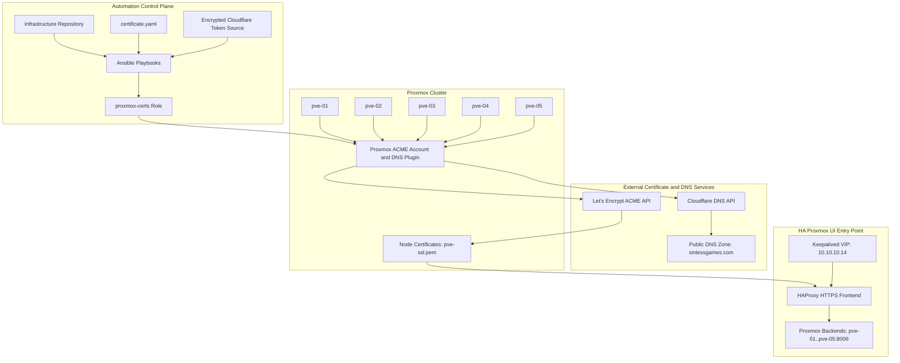
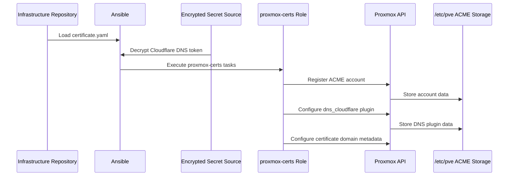
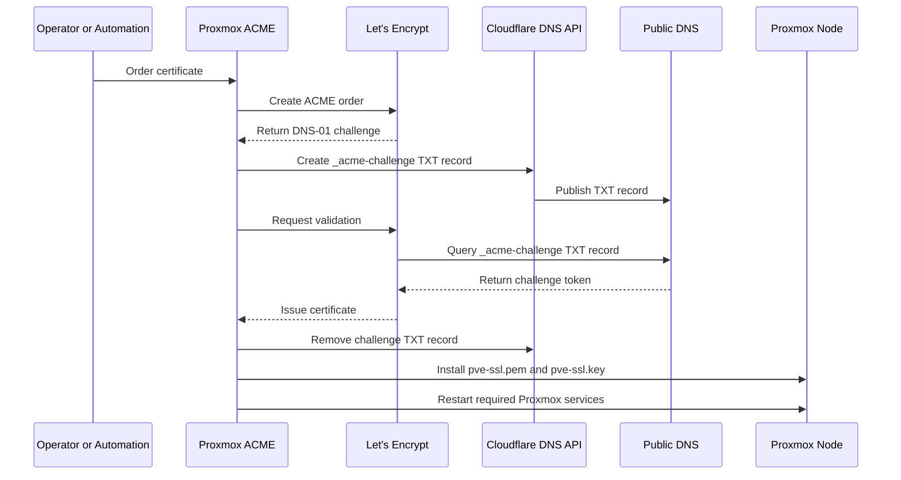
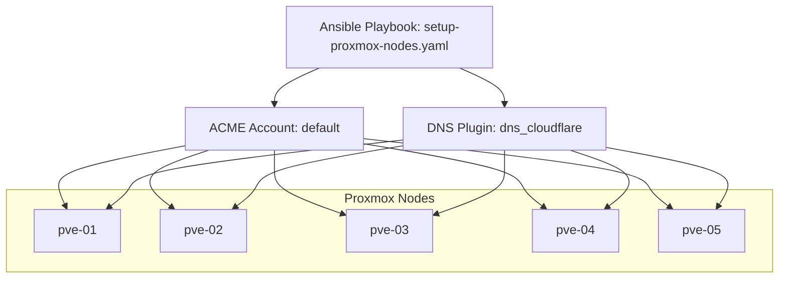
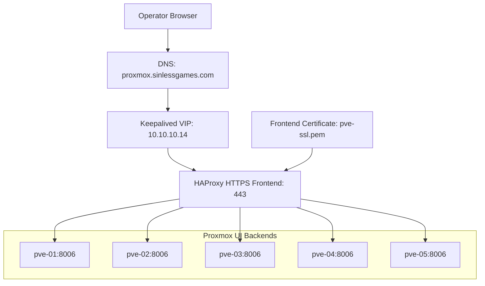
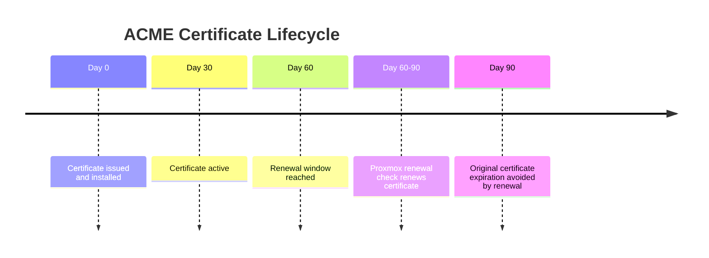
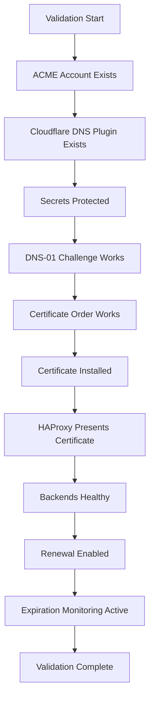

# ACME Certificate Management Architecture

**Document:** `Docs/Architecture/ACME-Architecture.md`  
**Owner:** SinLess Games LLC (Timothy “Andy” Andrew Pierce / sinless777)  
**Status:** ACCEPTED  
**Last Updated:** 2026-04-25  
**Scope:** Proxmox ACME certificate automation, Cloudflare DNS-01 validation, HAProxy frontend certificate usage, and renewal flow.

This document describes how ACME certificates are configured, requested, installed, renewed, and consumed by the Proxmox HA UI entry point.

---

## Purpose

The ACME certificate management architecture provides a repeatable certificate workflow for the Proxmox management UI.

The design supports:

- automated ACME account configuration
- DNS-01 validation through Cloudflare
- Cloudflare API token custody
- Proxmox ACME plugin configuration
- Proxmox node certificate issuance
- certificate renewal
- HAProxy frontend certificate usage
- load-balanced Proxmox UI access
- validation and rollback procedures

---

## Architecture Summary

The accepted certificate management model is:

| Area | Decision |
| --- | --- |
| Certificate authority | Let's Encrypt |
| Validation method | ACME DNS-01 |
| DNS provider | Cloudflare |
| Automation tool | Ansible |
| Proxmox certificate owner | Proxmox ACME subsystem |
| Proxmox nodes | `pve-01` through `pve-05` |
| HA frontend | HAProxy on the Proxmox dashboard VIP |
| HA VIP | `10.10.10.14` |
| Proxmox UI hostname | `proxmox.sinlessgames.com` |
| Local infrastructure domain | `local.sinlessgames.com` |
| Public DNS zone | `sinlessgames.com` |
| ACME plugin ID | `dns_cloudflare` |
| ACME account name | `default` |
| Renewal model | Proxmox-managed ACME renewal |
| Secret handling | Encrypted secret source; target architecture uses Vault-backed custody |

---

## High-Level System Architecture



---

## Component Responsibilities

| Component | Responsibility |
| --- | --- |
| Ansible | Applies ACME configuration to Proxmox nodes. |
| `certificate.yaml` | Stores non-secret ACME configuration. |
| Encrypted secret source | Stores the Cloudflare DNS API token. |
| `proxmox-certs` role | Registers ACME account, configures DNS plugin, and prepares renewal. |
| Proxmox ACME subsystem | Requests, stores, installs, and renews certificates. |
| Cloudflare DNS API | Creates and removes DNS-01 challenge records. |
| Let's Encrypt | Validates DNS challenges and issues certificates. |
| HAProxy | Serves the Proxmox UI over HTTPS on the HA VIP. |
| Keepalived | Provides the Proxmox UI virtual IP. |
| Proxmox nodes | Serve the Proxmox UI backend on port `8006`. |

---

## Required Hostnames and Endpoints

| Name | Purpose |
| --- | --- |
| `proxmox.sinlessgames.com` | Public or managed DNS name for the Proxmox HA UI endpoint. |
| `pve-01.local.sinlessgames.com` | Internal Proxmox node DNS name. |
| `pve-02.local.sinlessgames.com` | Internal Proxmox node DNS name. |
| `pve-03.local.sinlessgames.com` | Internal Proxmox node DNS name. |
| `pve-04.local.sinlessgames.com` | Internal Proxmox node DNS name. |
| `pve-05.local.sinlessgames.com` | Internal Proxmox node DNS name. |
| `10.10.10.14` | Keepalived VIP for the Proxmox HA UI. |

---

## Required Configuration

The non-secret ACME configuration is managed through Ansible variables.

Example:

```yaml
proxmox_acme_enabled: true
proxmox_acme_email: admin@sinlessgames.com
proxmox_acme_account_name: default
proxmox_acme_directory: https://acme-v02.api.letsencrypt.org/directory
proxmox_acme_dns_api: cloudflare
proxmox_acme_plugin_id: dns_cloudflare
proxmox_acme_domains:
  - proxmox.sinlessgames.com
```

The Cloudflare DNS credential must be stored outside normal plaintext repository files.

Accepted credential format for the Proxmox Cloudflare DNS plugin:

```text
CF_Token=<cloudflare-api-token>
```

The Cloudflare token must be scoped only to the DNS zones and actions required for ACME DNS-01 validation.

---

## Secret Handling Requirements

Secrets must not be committed to Git.

Sensitive ACME values include:

- Cloudflare API token
- ACME account private material
- TLS private keys
- HAProxy private key material
- webhook URLs
- automation credentials

The target secret custody model is Vault.

If Ansible Vault is used during transition, it must remain encrypted and access-controlled.

The Cloudflare token must not be printed in Ansible logs.

Ansible tasks that handle the token must use `no_log: true`.

---

## Ansible Configuration Flow



---

## Proxmox ACME Configuration Storage

Proxmox stores ACME configuration under `/etc/pve`.

Expected ACME account path:

```text
/etc/pve/acme/accounts/default/
```

Expected DNS plugin path:

```text
/etc/pve/acme/plugins/dns_cloudflare/
```

Expected node certificate path:

```text
/etc/pve/nodes/<node-name>/pve-ssl.pem
```

Expected private key path:

```text
/etc/pve/nodes/<node-name>/pve-ssl.key
```

The `/etc/pve` filesystem is cluster-shared by Proxmox.

ACME account and plugin configuration are visible cluster-wide after being configured.

---

## Proxmox UI Configuration Result

After Ansible applies the ACME configuration, the Proxmox UI should show:

### Datacenter ACME Accounts

| Field | Expected Value |
| --- | --- |
| Account Name | `default` |
| Email | `admin@sinlessgames.com` |
| Directory | Let's Encrypt ACME v2 directory |
| Status | Ready |

### Datacenter ACME Plugins

| Field | Expected Value |
| --- | --- |
| Plugin ID | `dns_cloudflare` |
| Type | DNS |
| API | Cloudflare |
| API Data | Cloudflare token from encrypted secret source |
| Status | Ready |

### Node Certificates

| Field | Expected Value |
| --- | --- |
| Node | `pve-01` through `pve-05` |
| Initial status | Self-signed until ACME certificate is ordered |
| ACME action | Order or renew certificate |
| Final issuer | Let's Encrypt |
| Installed certificate | `/etc/pve/nodes/<node>/pve-ssl.pem` |

---

## Certificate Request Flow



---

## DNS-01 Validation Flow

The ACME DNS-01 challenge uses a temporary TXT record.

Expected challenge record format:

```text
_acme-challenge.proxmox.sinlessgames.com
```

Validation flow:

1. Proxmox requests a certificate from Let's Encrypt.
2. Let's Encrypt returns a DNS-01 challenge.
3. Proxmox uses the `dns_cloudflare` plugin.
4. The Cloudflare API token creates the `_acme-challenge` TXT record.
5. Let's Encrypt validates the TXT record.
6. Let's Encrypt issues the certificate.
7. Proxmox removes the temporary TXT record.
8. Proxmox installs the new certificate.

---

## Multi-Node Configuration Model

The Proxmox cluster contains five nodes:

```text
pve-01
pve-02
pve-03
pve-04
pve-05
```

The ACME account and DNS plugin configuration are cluster-level Proxmox configuration.

The expected multi-node behavior is:

| Node | ACME Account | DNS Plugin | Certificate Ordering |
| --- | --- | --- | --- |
| `pve-01` | Uses `default` | Uses `dns_cloudflare` | Can order and renew |
| `pve-02` | Uses `default` | Uses `dns_cloudflare` | Can order and renew |
| `pve-03` | Uses `default` | Uses `dns_cloudflare` | Can order and renew |
| `pve-04` | Uses `default` | Uses `dns_cloudflare` | Can order and renew |
| `pve-05` | Uses `default` | Uses `dns_cloudflare` | Can order and renew |

---

## Multi-Node Flow



---

## HAProxy and Keepalived Integration

The Proxmox UI is accessed through the HA UI entry point.

Accepted HA UI endpoint:

```text
https://proxmox.sinlessgames.com
```

Accepted VIP:

```text
10.10.10.14
```

HAProxy listens on:

```text
443/tcp
```

Backend Proxmox UI servers listen on:

```text
8006/tcp
```

Backend nodes:

```text
pve-01:8006
pve-02:8006
pve-03:8006
pve-04:8006
pve-05:8006
```

---

## HA UI Traffic Flow



---

## HAProxy Certificate Behavior

HAProxy uses the frontend certificate from `pve-01`.

Accepted frontend certificate path:

```text
/etc/pve/nodes/pve-01/pve-ssl.pem
```

Accepted frontend private key path:

```text
/etc/pve/nodes/pve-01/pve-ssl.key
```

The HAProxy certificate bundle may need to combine the certificate and key depending on the HAProxy configuration.

Expected HAProxy behavior:

- accepts HTTPS traffic on `443/tcp`
- presents the certificate for `proxmox.sinlessgames.com`
- forwards traffic to Proxmox backends on `8006/tcp`
- performs backend health checks
- maintains session behavior according to HAProxy configuration
- reloads or restarts when the frontend certificate changes

---

## Backend Health Checks

HAProxy health checks use the Proxmox API version endpoint.

Expected health check path:

```text
/api2/json/version
```

Expected healthy behavior:

- `200` response when authenticated behavior allows it
- `401` response may still indicate the backend is alive
- backend TLS verification behavior must match the HAProxy configuration

Accepted load balancing behavior:

```text
round-robin
```

Accepted session behavior:

```text
cookie-based stickiness
```

---

## Certificate Lifecycle

Let's Encrypt certificates are short-lived and must be renewed automatically.

The expected lifecycle is:



Operational lifecycle:

1. Certificate is issued.
2. Certificate is installed on the Proxmox node.
3. Proxmox renewal checks run periodically.
4. Certificate becomes eligible for renewal before expiration.
5. Proxmox performs DNS-01 validation again.
6. Let's Encrypt issues a replacement certificate.
7. Proxmox installs the renewed certificate.
8. Proxmox services reload or restart as required.
9. HAProxy reloads or restarts if it depends on the updated certificate.

---

## Renewal Requirements

Required renewal behavior:

- renewal is automated through Proxmox ACME
- Cloudflare DNS-01 validation remains functional
- Cloudflare token remains valid
- renewal logs are retained
- certificate expiration is monitored
- HAProxy reload behavior is validated
- failed renewal alerts are routed to operators

Recommended renewal threshold:

```text
30 days before expiration
```

The certificate must not be allowed to reach expiration without an alert.

---

## Service Restart Requirements

When a Proxmox certificate is installed or renewed, the following services may require reload or restart:

```text
pveproxy
pvedaemon
```

When HAProxy uses the renewed certificate, HAProxy must also reload or restart:

```text
haproxy
```

Restarts must be controlled to avoid unnecessary management UI disruption.

---

## Ansible Playbook Usage

Accepted playbook pattern:

```bash
ansible-playbook Ansible/playbooks/setup-proxmox-nodes.yaml \
  --tags proxmox,certs \
  --ask-vault-pass
```

If HashiCorp Vault is the active secret source, the playbook must use the approved Vault lookup or secret delivery method instead of `--ask-vault-pass`.

The playbook must:

- load non-secret certificate variables
- load encrypted Cloudflare DNS token
- register the ACME account
- configure the DNS plugin
- configure domain metadata
- avoid printing secrets
- validate Proxmox API responses
- remain idempotent

---

## Expected File Locations

| Path | Purpose |
| --- | --- |
| `/etc/pve/acme/accounts/default/` | ACME account registration data. |
| `/etc/pve/acme/plugins/dns_cloudflare/` | Cloudflare DNS plugin configuration. |
| `/etc/pve/nodes/pve-01/pve-ssl.pem` | Proxmox node certificate for `pve-01`. |
| `/etc/pve/nodes/pve-01/pve-ssl.key` | Proxmox node private key for `pve-01`. |
| `/etc/pve/nodes/<node>/pve-ssl.pem` | Proxmox node certificate for each node. |
| `/etc/pve/nodes/<node>/pve-ssl.key` | Proxmox node private key for each node. |

---

## Security Requirements

### Cloudflare Token

The Cloudflare token must:

- be scoped to the required DNS zone
- support DNS record creation for ACME DNS-01 challenges
- support DNS record deletion for ACME cleanup
- not have global account permissions
- not be shared with unrelated automation
- be rotated if exposed
- be stored in the approved secret store

---

### Certificate and Key Material

TLS private keys must:

- remain on Proxmox-controlled storage
- not be committed to Git
- not be copied to operator workstations except during approved break-glass recovery
- not be included in screenshots or logs
- be protected by filesystem permissions
- be rotated if exposed

---

### Network Exposure

The Proxmox UI must not be directly exposed to the public internet unless explicitly approved by the external access ADRs.

Management access should use:

- internal network access
- WireGuard
- Cloudflare Access where explicitly approved
- trusted administrative routes

The Proxmox backend nodes should remain internal.

---

### Logging Safety

Automation logs must not expose:

- Cloudflare API token
- ACME account private material
- TLS private keys
- Proxmox API tokens
- session cookies
- administrator credentials

---

## Observability Requirements

Certificate management must be observable.

Required monitoring:

- certificate expiration date
- certificate issuer
- certificate subject
- certificate SANs
- Proxmox ACME account status
- Proxmox ACME plugin status
- HAProxy frontend certificate status
- HAProxy health check status
- Proxmox backend availability
- failed ACME orders
- failed DNS-01 challenges
- failed renewals
- Cloudflare API errors

Required alerts:

- certificate expires within 30 days
- certificate expires within 14 days
- certificate expires within 7 days
- ACME renewal failed
- Cloudflare DNS challenge failed
- HAProxy certificate reload failed
- Proxmox backend unhealthy
- Proxmox UI VIP unavailable

---

## Validation Commands

### Validate Proxmox UI Certificate

```bash
openssl s_client -connect proxmox.sinlessgames.com:443 \
  -servername proxmox.sinlessgames.com \
  </dev/null 2>/dev/null | openssl x509 -noout -issuer -subject -dates
```

### Validate Proxmox Backend Availability

```bash
curl -k https://pve-01.local.sinlessgames.com:8006/api2/json/version
curl -k https://pve-02.local.sinlessgames.com:8006/api2/json/version
curl -k https://pve-03.local.sinlessgames.com:8006/api2/json/version
curl -k https://pve-04.local.sinlessgames.com:8006/api2/json/version
curl -k https://pve-05.local.sinlessgames.com:8006/api2/json/version
```

### Validate HAProxy VIP

```bash
curl -k https://proxmox.sinlessgames.com/api2/json/version
```

### Validate DNS Resolution

```bash
dig proxmox.sinlessgames.com
dig pve-01.local.sinlessgames.com
dig pve-02.local.sinlessgames.com
dig pve-03.local.sinlessgames.com
dig pve-04.local.sinlessgames.com
dig pve-05.local.sinlessgames.com
```

### Validate ACME Challenge Record During an Active Order

```bash
dig TXT _acme-challenge.proxmox.sinlessgames.com
```

### Validate HAProxy Configuration

```bash
haproxy -c -f /etc/haproxy/haproxy.cfg
```

### Validate HAProxy Service

```bash
systemctl status haproxy
```

### Validate Proxmox Services

```bash
systemctl status pveproxy
systemctl status pvedaemon
```

---

## Validation Requirements

This architecture is valid when the following requirements are met:

- ACME account `default` exists in Proxmox
- DNS plugin `dns_cloudflare` exists in Proxmox
- Cloudflare token is stored outside plaintext Git
- Cloudflare token can create DNS-01 challenge records
- Cloudflare token can remove DNS-01 challenge records
- Proxmox can order a Let's Encrypt certificate
- Proxmox can install the issued certificate
- Proxmox UI certificate issuer is Let's Encrypt after ordering
- `proxmox.sinlessgames.com` resolves to the HA UI endpoint
- HAProxy presents the expected certificate
- HAProxy forwards to all healthy Proxmox backends
- backend health checks work
- renewal checks are enabled
- certificate expiration is monitored
- failed renewals alert operators
- automation logs do not expose secrets



---

## Rollback Plan

### If ACME Account Registration Fails

1. Verify Proxmox API access.
2. Verify ACME directory URL.
3. Verify email address format.
4. Verify Proxmox cluster health.
5. Re-run the Ansible role with certificate tags.
6. Review Proxmox task logs.
7. Keep existing self-signed certificate until ACME is fixed.

### If Cloudflare DNS Plugin Configuration Fails

1. Verify encrypted secret source can be decrypted.
2. Verify the Cloudflare token format is `CF_Token=<token>`.
3. Verify the token has required DNS permissions.
4. Verify the token is scoped to the correct zone.
5. Re-run Ansible with secret logging disabled.
6. Confirm the plugin appears in Datacenter ACME plugin configuration.

### If DNS-01 Validation Fails

1. Inspect the ACME order logs in Proxmox.
2. Verify Cloudflare API token permissions.
3. Verify the DNS zone is correct.
4. Verify `_acme-challenge` TXT record creation.
5. Verify DNS propagation.
6. Remove stale challenge records if required.
7. Re-order the certificate.

### If Certificate Installation Fails

1. Verify Proxmox ACME order status.
2. Verify certificate files under `/etc/pve/nodes/<node>/`.
3. Verify `pveproxy` status.
4. Verify `pvedaemon` status.
5. Restart Proxmox services if required.
6. Fall back to the previous certificate or self-signed certificate if required.

### If HAProxy Fails After Certificate Renewal

1. Validate HAProxy configuration.
2. Verify certificate and key path.
3. Verify certificate bundle format if HAProxy requires a combined file.
4. Restart or reload HAProxy.
5. Verify VIP access.
6. Verify backend health checks.
7. Roll back to the previous certificate backup if required.

### If Cloudflare Token Is Exposed

1. Revoke the exposed Cloudflare token.
2. Create a new least-privilege token.
3. Update the approved secret store.
4. Re-run Ansible to update Proxmox ACME plugin data.
5. Inspect logs and repository history for exposure.
6. Create an incident case if exposure was security-impacting.

---

## Operational Requirements

ACME certificate management requires:

- Proxmox ACME account configuration
- Cloudflare DNS plugin configuration
- protected Cloudflare API token
- DNS-01 validation
- Let's Encrypt certificate issuance
- Proxmox certificate installation
- Proxmox service reload or restart behavior
- HAProxy frontend certificate reload behavior
- certificate expiration monitoring
- renewal failure alerting
- backend health checks
- rollback procedure
- token rotation procedure
- validation commands
- documentation updates when domains, paths, or ownership change

---

## Related Architecture Decisions

| Area | ADR |
| --- | --- |
| Proxmox topology | [ADR-0002](./ADRs/ADR-0002.md) |
| Proxmox dashboard HA | [ADR-0004](./ADRs/ADR-0004.md) |
| Certificate management | [ADR-0010](./ADRs/ADR-0010.md) |
| Cloudflare Tunnel and Access | [ADR-0011](./ADRs/ADR-0011.md) |
| Vault secrets and PKI | [ADR-0012](./ADRs/ADR-0012.md) |
| Management overlay | [ADR-0019](./ADRs/ADR-0019.md) |
| Internal DNS | [ADR-0029](./ADRs/ADR-0029.md) |
| Infrastructure provisioning | [ADR-0030](./ADRs/ADR-0030.md) |

---

## Notes

This document describes the architecture and expected operating model.

Implementation details such as exact Ansible task names, variable file paths, HAProxy certificate bundle formatting, and Proxmox API payloads are maintained in the repository implementation files.

When implementation and documentation differ, update the implementation or this document so the architecture remains accurate.
