# ADR-0014 — Observability and Incident Response Platform

**ADR:** ADR-0014  
**Title:** Observability and IRM: Grafana Stack, OpenTelemetry, Istio Visibility, and DFIR-IRIS  
**Owner:** SinLess Games LLC (Timothy “Andy” Andrew Pierce / sinless777)  
**Status:** ACCEPTED  
**Date Accepted:** 2025-12-27  
**Last Updated:** 2026-04-25  
**Supersedes:** N/A  
**Superseded By:** N/A  

**Related:**

- [Docs/Architecture/DECISIONS.md](../DECISIONS.md)
- [ADR-0007 — GitOps Controller: Argo CD](./ADR-0007.md)
- [ADR-0008 — Progressive Delivery with Istio and Argo Rollouts](./ADR-0008.md)
- [ADR-0009 — Authentik OIDC](./ADR-0009.md)
- [ADR-0011 — Cloudflare Tunnel and Access](./ADR-0011.md)
- [ADR-0012 — Vault Secrets and PKI](./ADR-0012.md)
- [ADR-0013 — Backups and Disaster Recovery with PBS, Velero, and Garage](./ADR-0013.md)
- [ADR-0016 — Policy-as-Code Enforcement](./ADR-0016.md)

---

## Context

The platform requires production-grade observability and incident response
capabilities for infrastructure, Kubernetes, platform services, workloads,
security events, and progressive delivery.

The platform must observe and respond to events across:

- Proxmox infrastructure
- RKE2 Kubernetes clusters
- RKE2 control plane components
- Kubernetes worker nodes
- platform services
- application workloads
- Istio service mesh traffic
- Argo CD reconciliation
- Argo Rollouts canary deployments
- certificate automation
- DNS automation
- runtime security tooling
- incident response workflows

The production monitoring stack is organized under:

```text
Kubernetes/apps/prod/monitoring
Kubernetes/apps/prod/monitoring/config
Kubernetes/apps/prod/monitoring/DFIR-IRIS
Kubernetes/apps/prod/monitoring/grafana
Kubernetes/apps/prod/monitoring/grafana-alloy
Kubernetes/apps/prod/monitoring/grafana-beyla
Kubernetes/apps/prod/monitoring/kiali
Kubernetes/apps/prod/monitoring/kube-prometheus-stack
Kubernetes/apps/prod/monitoring/loki
Kubernetes/apps/prod/monitoring/mimir
Kubernetes/apps/prod/monitoring/namespace
Kubernetes/apps/prod/monitoring/opentelemetry-operator
Kubernetes/apps/prod/monitoring/pyroscope
Kubernetes/apps/prod/monitoring/tempo
```

The observability platform must provide:

- dashboards
- alerting
- metrics
- logs
- traces
- profiles
- eBPF-derived service telemetry
- OpenTelemetry pipelines
- service mesh topology
- incident case management
- security investigation workflow
- evidence collection
- runbook-driven operations

The platform is reconciled by Argo CD. Monitoring resources must be declared in
Git and applied through GitOps.

---

## Decision

Adopt a Grafana-centered observability platform with DFIR-IRIS as the incident
response management platform.

The accepted production components are:

| Component | Purpose |
| --- | --- |
| `namespace` | Owns the `monitoring` namespace and required labels |
| `config` | Owns shared dashboards, datasources, alert rules, contact points, and common configuration |
| `grafana` | Primary dashboard, exploration, correlation, and alerting UI |
| `kube-prometheus-stack` | Prometheus, Alertmanager, node exporter, kube-state-metrics, ServiceMonitors, PodMonitors, and Kubernetes alerting baseline |
| `mimir` | Long-term metrics backend |
| `loki` | Log aggregation backend |
| `tempo` | Distributed tracing backend |
| `pyroscope` | Continuous profiling backend |
| `grafana-alloy` | Standard telemetry collector and forwarder |
| `grafana-beyla` | eBPF auto-instrumentation for RED metrics and basic traces |
| `opentelemetry-operator` | OpenTelemetry Collector and instrumentation lifecycle management |
| `kiali` | Istio service mesh observability and topology |
| `DFIR-IRIS` | Incident response management, case handling, evidence tracking, and investigation workflow |

Grafana OnCall is not the selected incident response management platform.

DFIR-IRIS is the incident response management platform.

Garage is the accepted S3-compatible object storage backend for observability
components that require object storage.

---

## Responsibility Split

| Area | Primary Component |
| --- | --- |
| Dashboards | Grafana |
| Metrics scraping | kube-prometheus-stack, Prometheus, Alloy |
| Long-term metrics | Mimir |
| Logs | Loki |
| Traces | Tempo |
| Profiles | Pyroscope |
| Telemetry pipelines | Alloy |
| eBPF auto-instrumentation | Beyla |
| OpenTelemetry lifecycle | OpenTelemetry Operator |
| Service mesh visibility | Kiali |
| Alert evaluation | Prometheus and Grafana Alerting |
| Alert routing | Alertmanager and Grafana notification policies |
| Incident response management | DFIR-IRIS |
| Secrets | Vault and External Secrets |
| Object storage | Garage |
| GitOps reconciliation | Argo CD |
| Progressive delivery telemetry | Argo Rollouts, Istio, Prometheus, and Mimir |

---

## Scope

This ADR governs:

- the production observability component set
- the use of Grafana as the primary observability interface
- the use of Mimir, Loki, Tempo, and Pyroscope as telemetry backends
- the use of Alloy as the standard telemetry collector and forwarder
- the use of Beyla for eBPF auto-instrumentation
- the use of the OpenTelemetry Operator for OpenTelemetry-managed resources
- the use of Kiali for Istio service mesh observability
- the use of DFIR-IRIS for incident response management
- the use of Garage for S3-compatible observability storage
- the GitOps-managed deployment model for monitoring resources

This ADR does not define:

- every dashboard
- every alert rule
- every incident workflow
- every OpenTelemetry instrumentation rule
- every application-specific SLO
- every security incident runbook

Those items are implementation artifacts managed under the monitoring manifests
and operations documentation.

---

## Non-Goals

The accepted observability standard does not include:

- Grafana OnCall
- SaaS observability
- SaaS incident response management
- MinIO as the observability object store
- Faro as a required RUM component
- InfluxDB as a required Proxmox metrics backend
- globally enabled Beyla on all workloads
- globally enabled tracing on all workloads
- globally enabled Istio sidecar injection for all namespaces

---

## Architecture Overview

The observability platform is organized around Grafana as the primary operator
interface, Grafana stack backends as telemetry storage, Alloy and OpenTelemetry
as collection pipelines, Kiali as the Istio mesh visibility tool, and DFIR-IRIS
as the incident response management system.

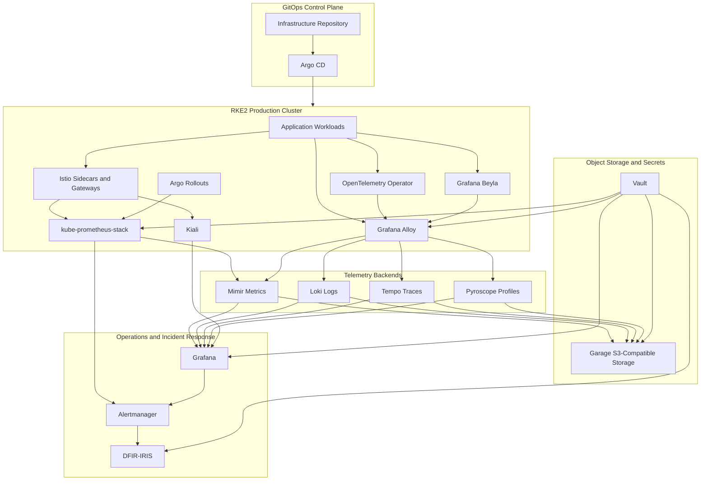

---

## Telemetry Flow

The standard telemetry flow is:

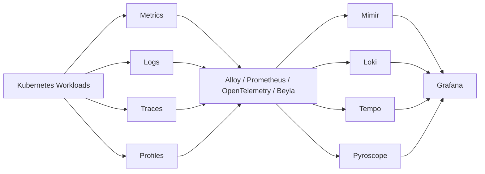

The service mesh telemetry flow is:

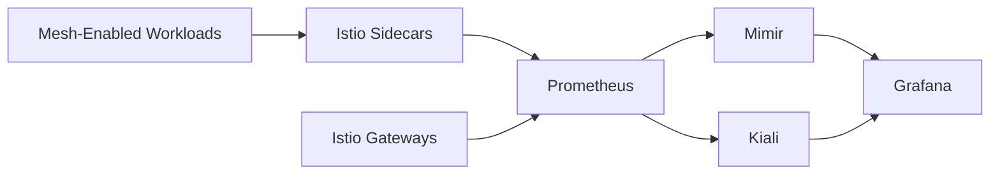

The progressive delivery telemetry flow is:

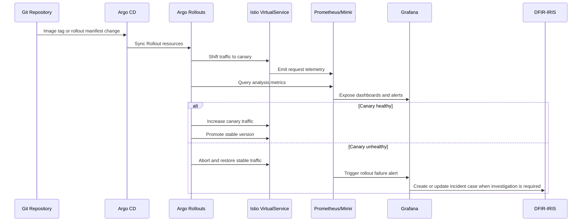

The incident response flow is:

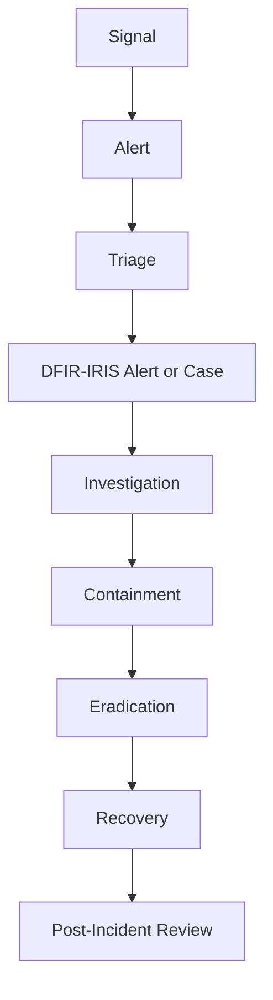

---

## Component Responsibilities

### Namespace

The `namespace` component owns the `monitoring` namespace.

It defines:

- namespace name
- required labels
- required annotations
- network policy baseline
- ownership metadata

The namespace name is:

```text
monitoring
```

---

### Config

The `config` component owns shared observability configuration.

It contains:

- Grafana datasources
- Grafana dashboard provisioning
- Grafana folder provisioning
- alert rule definitions
- contact point definitions
- notification policies
- common labels
- common annotations
- runbook links
- shared ConfigMaps
- ExternalSecret references

Secrets are stored in Vault and delivered through External Secrets.

---

### Grafana

Grafana is the primary UI for:

- dashboards
- metric exploration
- log exploration
- trace exploration
- profile exploration
- alerting configuration
- alert review
- service correlation
- operational triage

Grafana datasources include:

- Mimir
- Loki
- Tempo
- Pyroscope
- Prometheus

Grafana configuration is managed through Git.

Git-managed Grafana resources include:

- datasources
- dashboards
- folders
- alert rules
- contact points
- notification policies
- runbook links

---

### kube-prometheus-stack

The kube-prometheus-stack component provides the Kubernetes monitoring baseline.

It includes:

- Prometheus
- Alertmanager
- node exporter
- kube-state-metrics
- ServiceMonitor resources
- PodMonitor resources
- PrometheusRule resources
- Kubernetes baseline alerts

Prometheus is used for:

- local scraping
- local alert evaluation
- Argo Rollouts analysis queries
- metrics forwarding to Mimir

Mimir is the long-term metrics backend.

---

### Mimir

Mimir is the long-term metrics backend.

Mimir stores:

- infrastructure metrics
- Kubernetes metrics
- application metrics
- Istio metrics
- Argo CD metrics
- Argo Rollouts metrics
- security tool metrics

Mimir receives metrics from:

- Prometheus remote write
- Alloy remote write
- OpenTelemetry pipelines

Mimir uses Garage for object storage.

---

### Loki

Loki is the log aggregation backend.

Loki stores:

- Kubernetes pod logs
- platform service logs
- controller logs
- ingress logs
- gateway logs
- selected security logs
- application logs

Logs are collected through Alloy.

Required low-cardinality log labels are:

- `cluster`
- `environment`
- `namespace`
- `workload`
- `pod`
- `container`
- `app.kubernetes.io/name`
- `app.kubernetes.io/part-of`

The following values must not be used as Loki labels:

- request ID
- user ID
- full URL
- arbitrary error message
- unbounded tenant IDs
- session IDs
- trace IDs

Loki uses Garage for object storage.

---

### Tempo

Tempo is the distributed tracing backend.

Tempo stores traces from:

- OpenTelemetry SDKs
- OpenTelemetry Collector resources
- Alloy OTLP pipelines
- selected Istio telemetry integrations
- Beyla-instrumented workloads

Tempo integrates with Grafana for:

- trace lookup
- trace-to-logs
- trace-to-metrics
- service dependency analysis

Tempo uses Garage for object storage.

---

### Pyroscope

Pyroscope is the continuous profiling backend.

Pyroscope stores:

- CPU profiles
- memory profiles
- runtime profiles supported by instrumented applications

Pyroscope is enabled for selected production services that require performance
investigation or regression detection.

Pyroscope uses Garage for object storage.

---

### Grafana Alloy

Alloy is the standard telemetry collector and forwarder.

Alloy runs as:

- a DaemonSet for node-level collection
- a Deployment for cluster-level telemetry receiving
- an OTLP gateway for OpenTelemetry traffic

Alloy is responsible for:

- scraping metrics
- forwarding metrics
- collecting logs
- receiving OTLP telemetry
- forwarding traces
- forwarding profiles
- enriching telemetry with Kubernetes metadata
- routing telemetry to Grafana backends

No additional telemetry collector is introduced unless it is required by a
specific component and documented in implementation manifests.

---

### Grafana Beyla

Beyla provides eBPF-based auto-instrumentation.

Beyla captures:

- RED metrics
- HTTP service metrics
- gRPC service metrics
- basic service traces

Beyla is enabled only for namespaces and workloads declared in Git.

Beyla does not replace explicit OpenTelemetry instrumentation for critical
business logic. Application-level instrumentation remains required for
business-specific traces and custom metrics.

---

### OpenTelemetry Operator

The OpenTelemetry Operator manages OpenTelemetry resources.

It manages:

- OpenTelemetryCollector resources
- Instrumentation resources
- auto-instrumentation configuration
- OTLP receivers
- telemetry gateways
- workload instrumentation patterns

OpenTelemetry resources are declared in Git and reconciled by Argo CD.

---

### Kiali

Kiali is the Istio service mesh observability interface.

Kiali provides:

- mesh topology
- service graph views
- traffic health
- route validation
- Istio configuration visibility
- workload-level mesh troubleshooting

Kiali integrates with:

- Istio
- Prometheus or Mimir-backed metrics
- Grafana
- Tempo

Grafana remains the primary observability UI. Kiali is the specialized mesh
visibility tool.

---

### DFIR-IRIS

DFIR-IRIS is the incident response management platform.

DFIR-IRIS is responsible for:

- security incident cases
- investigation notes
- evidence tracking
- observables
- indicators of compromise
- case tasks
- timelines
- reports
- collaboration during investigations

DFIR-IRIS receives incidents and alerts from:

- Grafana Alerting
- Alertmanager
- Wazuh
- Falco
- manual analyst creation
- webhook automation

DFIR-IRIS is the case-management and investigation system. Alert routing is
handled by Prometheus Alertmanager, Grafana Alerting contact points, notification
policies, and webhook integrations.

---

## Object Storage Strategy

Garage is the S3-compatible object storage backend for observability components
that require object storage.

Garage buckets used by monitoring are:

```text
mimir-prod
loki-prod
tempo-prod
pyroscope-prod
observability-archives-prod
```

Each observability component uses a dedicated Garage access key.

Required access keys are:

```text
mimir-prod-writer
loki-prod-writer
tempo-prod-writer
pyroscope-prod-writer
```

Garage credentials are stored in Vault and delivered through External Secrets.

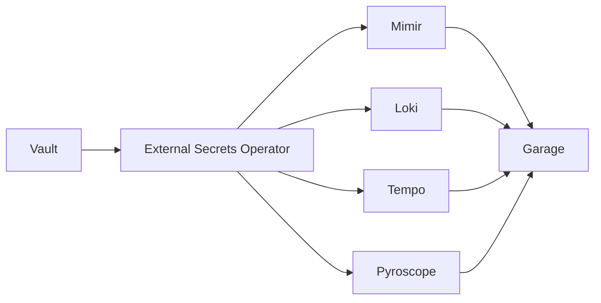

---

## Alerting Model

The standard alerting model is:

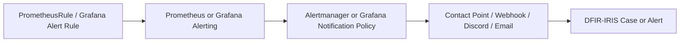

Baseline alert categories are:

- Kubernetes node health
- Kubernetes control plane health
- pod crash loops
- deployment unavailable
- persistent volume capacity
- certificate expiration
- DNS automation failures
- Argo CD application degraded
- Argo CD application out of sync
- Argo Rollouts degraded
- canary analysis failure
- Istio gateway errors
- Istio mTLS policy issues
- Loki ingestion failure
- Mimir ingestion failure
- Tempo ingestion failure
- Pyroscope ingestion failure
- Garage capacity or availability issues
- Vault sealed or unhealthy
- DFIR-IRIS unhealthy
- Wazuh findings
- Falco runtime findings

Production alerts must include:

- severity
- owner
- runbook URL
- summary
- impact statement
- routing metadata

---

## Incident Response Model

DFIR-IRIS is used when an event becomes an incident, investigation, or evidence
collection workflow.

The incident response flow is:

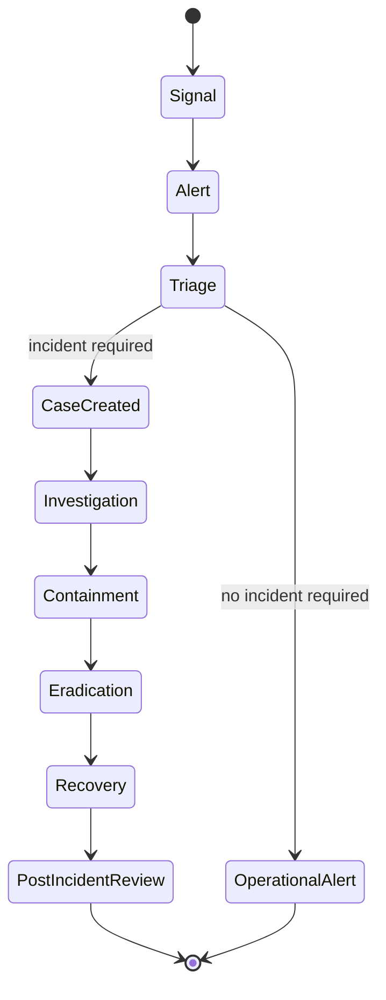

The following events create or update DFIR-IRIS cases:

- confirmed compromise indicator
- repeated authentication anomaly
- malware finding
- suspicious lateral movement
- critical Wazuh alert
- critical Falco runtime finding
- production service outage with security impact
- certificate compromise
- identity compromise
- suspicious privilege escalation
- unauthorized production access

The following events remain normal operational alerts unless triage escalates
them:

- single pod restart
- temporary CPU spike
- expected rollout pause
- short non-production outage
- benign development environment failure

---

## Dashboard and Evidence-as-Code

Dashboards, alerts, and runbooks are managed as code.

Git-managed observability artifacts include:

- Grafana dashboard JSON
- Grafana datasource definitions
- Grafana folders
- Grafana alert rules
- PrometheusRule resources
- ServiceMonitor resources
- PodMonitor resources
- runbook links
- notification policies
- DFIR-IRIS integration configuration

Compliance and review evidence includes:

- Grafana alert history
- Alertmanager notification history
- Argo CD sync history
- Argo Rollouts AnalysisRun results
- Kiali mesh health records
- DFIR-IRIS case reports
- incident timelines
- post-incident reviews
- backup and restore drill reports

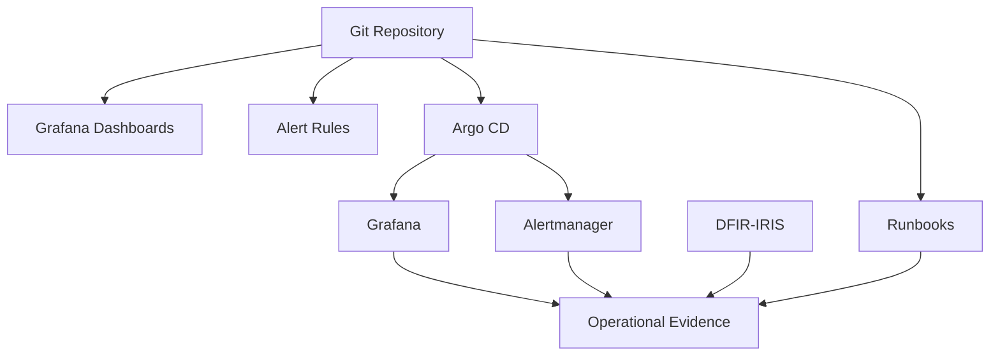

---

## Security and Compliance Requirements

### Access Control

Access is controlled through approved identity patterns.

Required access controls:

- Authentik OIDC for Grafana
- Authentik OIDC or supported SSO for DFIR-IRIS
- least-privilege roles
- read-only dashboard access for general users
- restricted Grafana admin access
- restricted incident case access
- restricted datasource editing
- restricted contact point editing

---

### Secret Handling

Secrets must not be committed to Git.

Sensitive values include:

- Grafana admin credentials
- datasource credentials
- Garage access keys
- webhook URLs
- Alertmanager receiver secrets
- DFIR-IRIS API keys
- OIDC client secrets
- SMTP credentials
- Discord webhook URLs
- object storage credentials

Secrets are stored in Vault and delivered through External Secrets.

---

### Telemetry Data Protection

Telemetry must be protected from unnecessary sensitive-data exposure.

Required controls:

- log redaction
- token scrubbing
- no secrets in logs
- limited collection of high-risk log sources
- restricted access to sensitive dashboards
- retention limits
- namespace-based access controls
- no unnecessary PII collection
- no full request body logging by default

---

### Network Security

Monitoring components must not be exposed directly to the public internet.

External access must use approved ingress controls:

- Cloudflare Access
- Istio Gateway
- Authentik authentication
- NetworkPolicies
- TLS

Backend services remain internal-only.

Internal-only backend services include:

- Mimir
- Loki
- Tempo
- Pyroscope
- Prometheus
- Alertmanager
- Garage

---

## Implementation Requirements

### GitOps Deployment

Monitoring is deployed through Argo CD from:

```text
Kubernetes/apps/prod/monitoring
```

Required deployment order:

| Wave | Components |
| --- | --- |
| `-10` | `namespace` |
| `-5` | `config`, ExternalSecret references |
| `0` | `kube-prometheus-stack` |
| `1` | `mimir`, `loki`, `tempo`, `pyroscope` |
| `2` | `grafana-alloy`, `opentelemetry-operator` |
| `3` | `grafana-beyla` |
| `4` | `grafana`, `kiali` |
| `5` | `DFIR-IRIS` |

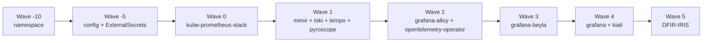

---

### Kubernetes Naming

The filesystem path is:

```text
Kubernetes/apps/prod/monitoring/DFIR-IRIS
```

Kubernetes resource names must use lowercase DNS-compatible names.

Required Kubernetes naming pattern:

```text
dfir-iris
dfir-iris-web
dfir-iris-worker
dfir-iris-postgresql
dfir-iris-redis
```

---

### Environment Labels

Telemetry must include consistent labels.

Required labels are:

```text
cluster
environment
namespace
workload
app.kubernetes.io/name
app.kubernetes.io/part-of
app.kubernetes.io/component
```

The production environment label is:

```text
environment=prod
```

---

### Correlation Requirements

Grafana must support correlation across:

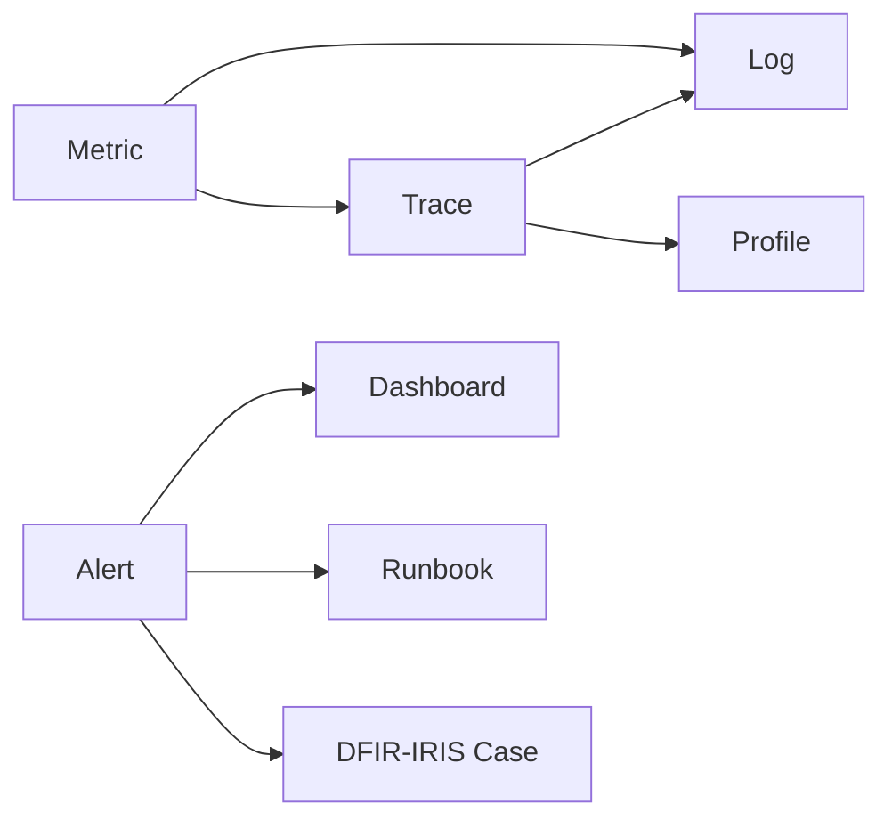

Workloads must propagate trace IDs when instrumented.

Application logs must include trace IDs when application frameworks support it.

---

### Progressive Delivery Requirements

Argo Rollouts canaries require reliable metrics.

Required canary metrics are:

- HTTP 5xx count
- request success rate
- p95 latency
- pod readiness
- restart count

Canary metrics must be queryable from Prometheus or Mimir.

Production canaries must not rely only on pod readiness.

---

### Proxmox Observability

Proxmox metrics are collected through a Prometheus-compatible exporter and
stored in Mimir.

Grafana must provide Proxmox dashboards for:

- node availability
- CPU usage
- memory usage
- storage usage
- VM health
- backup job status

InfluxDB is not required for Proxmox observability under this ADR.

---

## Validation Requirements

This ADR is valid when the following requirements are met:

- the `monitoring` namespace is created by Argo CD
- kube-prometheus-stack is healthy
- Grafana is reachable through the approved access path
- Prometheus scrapes Kubernetes targets
- metrics are visible in Grafana
- Mimir receives long-term metrics
- Loki receives pod logs
- Tempo receives traces
- Pyroscope receives profiles from selected services
- Alloy collects and forwards telemetry
- Beyla produces RED metrics for declared workloads
- OpenTelemetry Operator manages collector resources
- Kiali displays Istio service mesh topology
- DFIR-IRIS is reachable through the approved access path
- alerts route to the intended receivers
- incident-grade alerts create or update DFIR-IRIS cases
- Garage-backed storage is writable and readable by Mimir
- Garage-backed storage is writable and readable by Loki
- Garage-backed storage is writable and readable by Tempo
- Garage-backed storage is writable and readable by Pyroscope
- dashboards are managed as code
- alerts are managed as code
- Argo CD reports monitoring applications as healthy

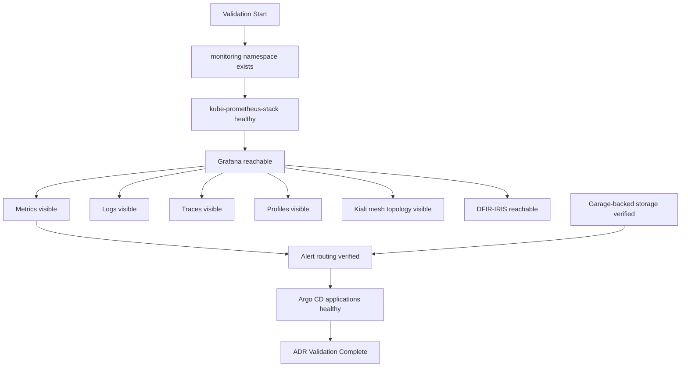

---

## Rollback Plan

If the observability stack is unstable, reduce scope in this order:

1. disable Beyla
2. disable optional OpenTelemetry auto-instrumentation
3. reduce profile ingestion
4. reduce trace ingestion
5. reduce log ingestion volume
6. keep kube-prometheus-stack and Grafana running
7. keep critical alerting active

If Grafana is unstable:

1. verify datasource health
2. verify database or persistence health
3. roll back the Grafana Helm values
4. restore dashboard provisioning from Git
5. use Prometheus, Loki, Tempo, or Pyroscope directly during recovery

If Mimir is unstable:

1. keep local Prometheus scraping active
2. disable or reduce remote write
3. inspect Garage object storage access
4. restore the last known-good Mimir configuration

If Loki is unstable:

1. reduce log volume
2. remove invalid or high-cardinality labels
3. inspect Garage object storage access
4. restore the last known-good Loki configuration

If Tempo is unstable:

1. reduce trace sampling
2. disable non-critical trace sources
3. inspect Garage object storage access
4. restore the last known-good Tempo configuration

If Pyroscope is unstable:

1. disable profile ingestion for non-critical workloads
2. verify Garage object storage access
3. restore the last known-good Pyroscope configuration

If DFIR-IRIS is unstable:

1. keep alerting active through Grafana and Alertmanager
2. route critical alerts to backup notification channels
3. restore DFIR-IRIS from backup
4. reconcile incident records after recovery

A permanent redesign requires:

- a superseding ADR
- migration plan
- rollback plan
- updated implementation documentation
- updated runbooks

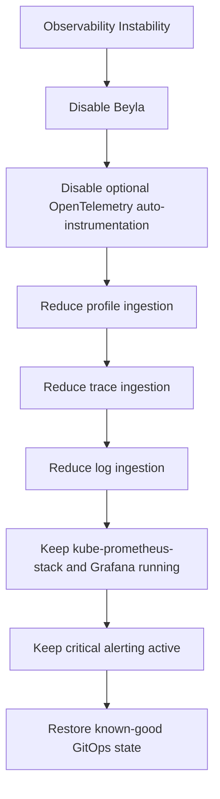

---

## Operational Requirements

Production observability components must have:

- resource requests
- resource limits
- persistent storage when stateful
- backups when stateful
- dashboards
- alerts
- runbooks
- owner labels
- upgrade procedure
- rollback procedure

Critical alert routes must be tested.

Critical incident workflows must be tested.

Telemetry storage must have capacity alerts.
