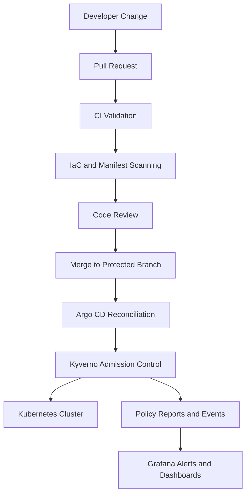
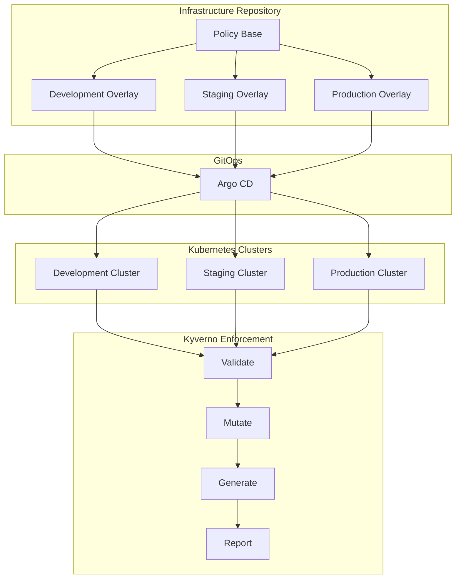
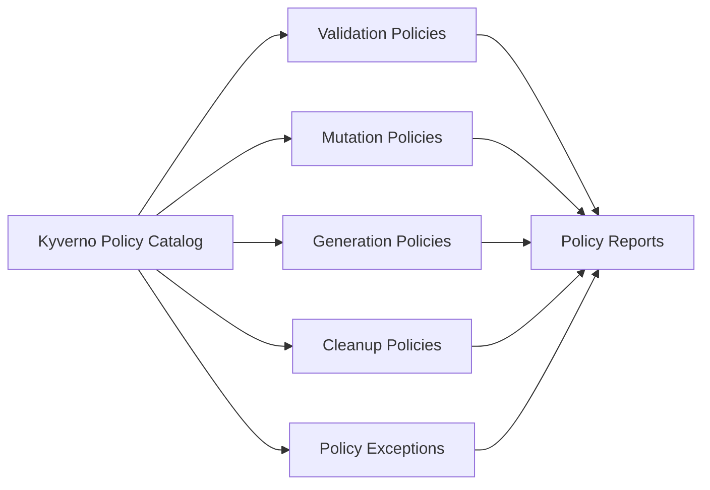
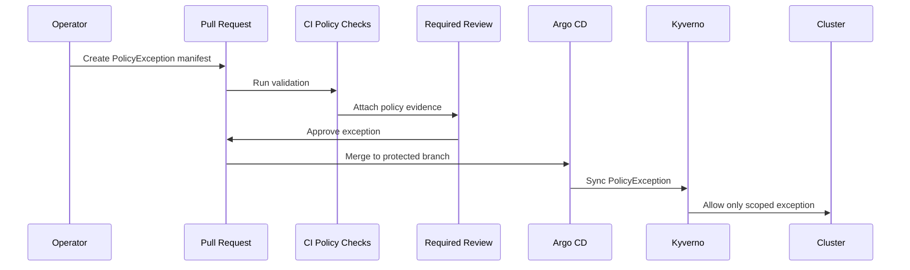
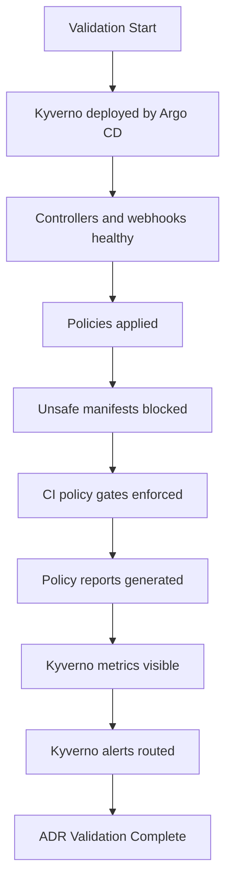

# ADR-0016 — Policy-as-Code Enforcement with Kyverno

**ADR:** ADR-0016  
**Title:** Policy-as-Code Enforcement with Kyverno, CI Gates, and IaC Scanning  
**Owner:** SinLess Games LLC (Timothy “Andy” Andrew Pierce / sinless777)  
**Status:** ACCEPTED  
**Date Accepted:** 2026-04-25  
**Last Updated:** 2026-04-25  
**Supersedes:** N/A  
**Superseded By:** N/A  

**Related:**

- [Docs/Architecture/DECISIONS.md](../DECISIONS.md)
- [ADR-0001 — Monorepo Source of Truth](./ADR-0001.md)
- [ADR-0007 — GitOps Controller: Argo CD](./ADR-0007.md)
- [ADR-0008 — Progressive Delivery with Istio and Argo Rollouts](./ADR-0008.md)
- [ADR-0012 — Vault Secrets and PKI](./ADR-0012.md)
- [ADR-0014 — Observability and Incident Response Platform](./ADR-0014.md)

---

## Context

The platform targets a high-assurance security posture for Kubernetes,
infrastructure automation, GitOps workflows, and production operations.

Security controls must be enforced consistently across:

- Kubernetes workloads
- Kubernetes namespaces
- Kubernetes RBAC
- Kubernetes networking resources
- GitOps-managed manifests
- Terraform infrastructure changes
- Ansible-managed host configuration
- CI pipelines
- production promotion workflows

Manual review alone is not sufficient for the platform security model.

Without policy-as-code enforcement, the platform can drift into unsafe states.

Failure modes include:

- privileged workloads deployed accidentally
- containers running as root
- missing resource requests and limits
- workloads without readiness probes
- workloads without liveness probes where required
- host networking enabled without approval
- host PID or host IPC enabled without approval
- unsafe hostPath mounts
- broad RBAC permissions
- missing NetworkPolicies
- plaintext secrets committed to Git
- container images using mutable tags
- Terraform resources created without required ownership labels
- Terraform resources created with overly broad network access
- CI passing without security evidence
- production changes promoted without policy validation

The platform requires layered enforcement:

- pre-merge validation in CI
- in-cluster admission control
- GitOps reconciliation
- audit evidence
- explicit exception handling
- environment-specific enforcement levels

Production must block unsafe changes.

Staging must mirror production enforcement.

Development may allow faster iteration, but it must still enforce the platform
baseline.

---

## Decision

Adopt **Kyverno** as the Kubernetes policy-as-code admission controller for all
Kubernetes clusters.

Kyverno is the accepted Kubernetes policy engine.

OPA Gatekeeper is not selected as a standard admission controller for this
platform.

Policy enforcement is layered across:

| Layer | Enforcement |
| --- | --- |
| Kubernetes admission | Kyverno policies |
| GitOps reconciliation | Argo CD applies policy resources and protected workloads |
| CI validation | YAML, Helm, Kustomize, Terraform, and security checks |
| IaC scanning | TFLint, Checkov, and Trivy |
| Secret handling | Vault and External Secrets |
| Runtime evidence | Kyverno reports, Kubernetes events, CI artifacts, and observability alerts |

Kyverno policies are declared in Git and reconciled by Argo CD.

Policy changes follow the same promotion model as the rest of the platform:

```text
dev → staging → prod
```

---

## Policy Enforcement Flow



---

## Scope

This ADR governs:

- Kyverno as the Kubernetes admission policy engine
- Kubernetes baseline security policies
- environment-specific policy enforcement levels
- policy delivery through GitOps
- CI policy gates
- IaC scanning requirements
- policy exception requirements
- policy evidence requirements

This ADR does not define:

- every Kyverno policy manifest
- every Terraform rule
- every CI workflow implementation detail
- every security incident response procedure
- every application-specific exception

Those items are implementation artifacts managed in the repository.

---

## Non-Goals

The accepted policy-as-code standard does not include:

- OPA Gatekeeper as the primary admission controller
- manual-only security review
- CI-only policy enforcement
- production policy bypass without an approved exception
- plaintext secrets in Git
- mutable production image tags
- unrestricted privileged workloads
- unrestricted host access
- unrestricted production RBAC

---

## Accepted Tooling

| Area | Tool |
| --- | --- |
| Kubernetes admission control | Kyverno |
| GitOps reconciliation | Argo CD |
| Kubernetes manifest validation | kubeconform, kubeval, kubectl dry-run, Helm template, Kustomize build |
| Terraform linting | TFLint |
| Terraform and IaC security scanning | Checkov |
| Container and IaC scanning | Trivy |
| Secret management | Vault and External Secrets |
| Observability | Grafana, Prometheus, Mimir, Loki, Kyverno reports |
| CI execution | GitHub Actions |

---

## Alternatives Considered

### A1) OPA Gatekeeper

**Pros:**

- highly expressive policy language
- common enterprise adoption
- strong constraint model

**Cons:**

- Rego adds additional complexity
- mutation workflows are less ergonomic for this platform
- Kyverno better matches the Kubernetes-native YAML workflow used by the repository

OPA Gatekeeper is rejected as the standard admission controller.

---

### A2) CI-Only Policy Enforcement

**Pros:**

- no additional in-cluster admission controller
- simpler initial cluster footprint
- fast feedback before merge

**Cons:**

- manual cluster changes can bypass CI
- drift can enter through emergency operations
- runtime enforcement is weak
- evidence is incomplete without admission records

CI-only enforcement is rejected.

CI remains required, but it does not replace admission control.

---

### A3) Manual Reviews Only

**Pros:**

- low tool overhead
- flexible human judgment

**Cons:**

- inconsistent enforcement
- weak audit evidence
- high reviewer burden
- unsafe patterns can be missed
- does not scale across environments

Manual-only enforcement is rejected.

---

### A4) Pod Security Admission Only

**Pros:**

- built into Kubernetes
- useful baseline security control
- low operational overhead

**Cons:**

- limited policy coverage
- does not enforce platform-specific labels, probes, image rules, or network requirements
- does not cover custom policy workflows

Pod Security Admission is not sufficient as the sole policy engine.

Kyverno is the accepted policy engine.

---

## Rationale

Kyverno is selected because it aligns with the platform’s Kubernetes-native and
GitOps-driven operating model.

### Kubernetes-Native Policy Authoring

Kyverno policies are Kubernetes resources.

This matches the repository model because policies can be:

- written as YAML
- reviewed in pull requests
- synced through Argo CD
- promoted across environments
- observed in Kubernetes policy reports

---

### Admission-Time Enforcement

Kyverno enforces policy at admission time.

This blocks unsafe resources before they enter the cluster.

Admission-time enforcement is required for production workloads.

---

### Validation, Mutation, and Generation

Kyverno supports the policy patterns required by the platform.

Required policy capabilities include:

- validating unsafe resources
- mutating required labels and metadata where approved
- generating supporting resources where approved
- producing policy reports
- enforcing exceptions through declared resources

---

### GitOps Compatibility

Kyverno policies are stored in Git and reconciled by Argo CD.

This provides:

- auditability
- repeatability
- reviewable policy changes
- controlled promotion
- environment-specific policy overlays

---

### Compliance Evidence

Kyverno produces policy reports and admission events that can be used as
evidence.

Evidence sources include:

- pull request checks
- CI security reports
- Kyverno PolicyReports
- Kubernetes events
- Argo CD sync history
- Grafana dashboards and alerts

---

## Policy Architecture



---

## Repository Requirements

Policy-as-code resources are stored in the repository.

Required policy layout:

```text
Policy/
  Kubernetes/
    kyverno/
      base/
      dev/
      staging/
      prod/
  Terraform/
    tflint/
    checkov/
    trivy/
  CI/
    github-actions/
```

Kyverno resources are deployed to Kubernetes through Argo CD.

Production Kyverno policy manifests are applied from:

```text
Policy/Kubernetes/kyverno/prod/
```

Shared baseline policies are applied from:

```text
Policy/Kubernetes/kyverno/base/
```

---

## Kubernetes Policy Requirements

### Required Baseline Policies

The baseline Kyverno catalog enforces:

- required namespace labels
- required workload labels
- required ownership labels
- disallow privileged containers
- disallow privilege escalation
- require non-root containers
- restrict Linux capabilities
- restrict hostPath volumes
- restrict host networking
- restrict host PID
- restrict host IPC
- require resource requests
- require resource limits
- require readiness probes for services
- require liveness probes for long-running services
- disallow mutable image tags in production
- require image registry allowlists
- require NetworkPolicies for sensitive namespaces
- block plaintext Kubernetes Secrets in GitOps-managed application paths
- require Argo CD ownership labels for GitOps-managed resources
- require standard annotations for production workloads
- require PodDisruptionBudgets for highly available production services
- require safe rollout patterns for production workloads

---

### Required Production Policies

Production enforces the strict policy set.

Production policies block:

- privileged pods
- root containers without an approved exception
- missing resource requests
- missing resource limits
- missing readiness probes for service workloads
- mutable image tags
- unknown image registries
- unsafe hostPath mounts
- unsafe host namespace access
- broad production RBAC
- missing required labels
- missing NetworkPolicies in sensitive namespaces
- workloads without declared ownership
- workloads without rollback metadata

---

### Required Staging Policies

Staging mirrors production enforcement.

Staging exists to validate production policy behavior before promotion.

A workload that cannot pass staging policy cannot be promoted to production.

---

### Required Development Policies

Development enforces the platform baseline.

Development blocks:

- privileged pods
- unsafe host access
- plaintext secrets in GitOps-managed paths
- unknown image registries
- broad cluster-admin style RBAC
- missing ownership labels

Development records policy violations for non-critical controls.

Non-critical development controls include:

- missing liveness probe
- missing readiness probe
- missing resource limit on non-production test workloads
- missing PodDisruptionBudget
- non-standard rollout annotation

---

## Environment Enforcement Matrix

| Control | Development | Staging | Production |
| --- | --- | --- | --- |
| Privileged containers | Block | Block | Block |
| Privilege escalation | Block | Block | Block |
| Root containers | Block unless approved | Block unless approved | Block unless approved |
| Host networking | Block unless approved | Block unless approved | Block unless approved |
| Host PID / host IPC | Block unless approved | Block unless approved | Block unless approved |
| hostPath volumes | Block unless approved | Block unless approved | Block unless approved |
| Resource requests | Report | Block | Block |
| Resource limits | Report | Block | Block |
| Readiness probes | Report | Block | Block |
| Liveness probes | Report | Block | Block |
| Mutable image tags | Block | Block | Block |
| Unknown registries | Block | Block | Block |
| Required labels | Block | Block | Block |
| Sensitive namespace NetworkPolicy | Block | Block | Block |
| Broad RBAC | Block | Block | Block |
| Plaintext secrets in Git | Block | Block | Block |
| Production rollout metadata | Not applicable | Block | Block |

---

## Kyverno Policy Types

Kyverno policies are grouped by function.



### Validation Policies

Validation policies block resources that violate platform rules.

Validation policies are used for:

- pod security controls
- image tag controls
- image registry controls
- resource request controls
- resource limit controls
- probe controls
- RBAC controls
- namespace controls
- NetworkPolicy controls

---

### Mutation Policies

Mutation policies add required metadata where the platform has approved default
values.

Mutation policies are used for:

- standard labels
- standard annotations
- default safe security context values
- ownership metadata where it is derived from namespace or application context

Mutation policies do not hide missing application ownership.

Application ownership must still be declared explicitly for production services.

---

### Generation Policies

Generation policies create required supporting resources.

Generation policies are used for:

- default namespace NetworkPolicies
- baseline ResourceQuotas
- baseline LimitRanges
- required ConfigMaps for policy metadata
- standard namespace guardrails

Generated resources remain GitOps-compatible and must not conflict with Argo CD
ownership.

---

### Cleanup Policies

Cleanup policies remove resources that are explicitly declared unsafe or expired.

Cleanup policies are used for:

- expired temporary exceptions
- expired temporary debug resources
- expired test namespaces
- stale policy report resources where configured

---

### Policy Exceptions

Policy exceptions are declared resources.

Exceptions must include:

- exception name
- affected namespace
- affected resource
- affected policy
- owner
- business justification
- approval reference
- expiration date

Expired exceptions are invalid.

Production exceptions require approval before merge.

---

## Exception Workflow



---

## IaC Policy Requirements

Terraform and infrastructure code are validated in CI.

Required IaC controls include:

- Terraform formatting
- Terraform validation
- TFLint rules
- Checkov scans
- Trivy IaC scans
- required ownership labels
- required environment labels
- encryption-at-rest checks where supported
- least-privilege network rules
- no public administrative access
- no hardcoded secrets
- no broad wildcard IAM-style permissions where applicable
- evidence artifact publishing

Terraform plan output for production changes is stored as a CI artifact.

---

## CI Gate Requirements

CI is required for pull requests that affect:

- Kubernetes manifests
- Helm values
- Kustomize overlays
- Kyverno policies
- Terraform code
- Ansible playbooks
- GitHub Actions workflows
- Dockerfiles
- application deployment configuration

Required CI gates include:

- YAML validation
- Kubernetes schema validation
- Kustomize build validation
- Helm lint validation
- Helm template rendering
- Kyverno policy validation
- Kyverno policy test execution
- Terraform formatting
- Terraform validation
- TFLint
- Checkov
- Trivy
- secret scanning
- container image scanning where images are built
- documentation link validation for related ADRs and runbooks

Pull requests cannot merge when required policy checks fail.

---

## Secret Handling Requirements

Secrets must not be committed to Git.

Policy enforcement blocks:

- plaintext Kubernetes Secret manifests in application paths
- hardcoded access keys
- hardcoded tokens
- hardcoded passwords
- hardcoded private keys
- hardcoded webhook URLs
- unencrypted secret material

Approved secret delivery patterns are:

- Vault
- External Secrets Operator
- Vault CSI where explicitly implemented

ExternalSecret resources may be committed to Git.

Secret values are stored in Vault.

---

## Security and Compliance Requirements

Policy-as-code enforces the following security requirements:

- least privilege
- workload isolation
- namespace ownership
- image source control
- immutable production image references
- baseline pod security
- network segmentation
- secret handling controls
- environment separation
- production change control
- audit evidence
- drift detection
- restore-safe configuration

Required evidence artifacts are:

- CI validation results
- Kyverno policy reports
- Kyverno admission events
- Argo CD sync history
- pull request reviews
- Terraform plan artifacts
- Trivy reports
- Checkov reports
- TFLint reports
- policy exception records
- production promotion records

---

## Observability Requirements

Policy enforcement must be observable.

Required observability signals include:

- Kyverno controller health
- Kyverno admission webhook latency
- Kyverno admission webhook errors
- failed policy evaluations
- blocked admission requests
- policy report counts
- exception usage
- expired exceptions
- background scan failures
- policy controller restarts

Grafana dashboards must display:

- Kyverno health
- policy violations by namespace
- policy violations by policy
- policy violations by severity
- policy exception usage
- admission denial trends

Alerts must exist for:

- Kyverno unavailable
- Kyverno webhook failures
- policy report generation failure
- production policy violation spike
- expired exception still in use
- failed background scans

---

## Implementation Requirements

### GitOps Deployment

Kyverno is deployed through Argo CD.

Kyverno policies are deployed through Argo CD.

Required deployment order:

| Wave | Resource |
| --- | --- |
| `-10` | Kyverno namespace |
| `-5` | Kyverno controller installation |
| `0` | baseline policies |
| `1` | environment policies |
| `2` | policy exceptions |
| `3` | policy reports and observability resources |

---

### Namespace

Kyverno runs in the namespace:

```text
kyverno
```

---

### Required Labels

Kyverno resources must include:

```text
app.kubernetes.io/name=kyverno
app.kubernetes.io/part-of=policy-as-code
app.kubernetes.io/component=admission-control
security.sinlessgames.io/control-plane=policy
```

Policy resources must include:

```text
app.kubernetes.io/part-of=policy-as-code
security.sinlessgames.io/policy-engine=kyverno
security.sinlessgames.io/policy-scope=<baseline|dev|staging|prod>
```

---

### Policy Naming

Policy names must be lowercase and descriptive.

Required naming format:

```text
<scope>-<control>-<resource>
```

Examples:

```text
baseline-require-labels-workloads
baseline-disallow-privileged-pods
prod-require-resource-limits
prod-disallow-latest-images
```

---

### Policy Severity

Policies must define severity.

Accepted severity values are:

```text
low
medium
high
critical
```

Production-blocking policies use:

```text
high
critical
```

---

### Policy Failure Actions

Production policies use:

```text
Enforce
```

Staging policies use:

```text
Enforce
```

Development policies use:

```text
Enforce
```

Development non-critical controls use:

```text
Audit
```

---

## Validation Requirements

This ADR is valid when the following requirements are met:

- Kyverno is deployed by Argo CD
- Kyverno controllers are healthy
- Kyverno admission webhooks are available
- baseline policies are applied
- development policies are applied
- staging policies are applied
- production policies are applied
- privileged pod creation is blocked
- privilege escalation is blocked
- unsafe host namespace access is blocked
- unsafe hostPath usage is blocked
- mutable production image tags are blocked
- production workloads without required labels are blocked
- production workloads without resource requests are blocked
- production workloads without resource limits are blocked
- production service workloads without readiness probes are blocked
- production long-running workloads without required liveness probes are blocked
- sensitive namespaces without NetworkPolicies are blocked
- plaintext secrets in GitOps-managed application paths are blocked in CI
- broad RBAC changes are blocked
- policy exceptions require owner, approval reference, justification, and expiration
- expired policy exceptions are rejected or removed
- CI fails when Kyverno policy tests fail
- CI fails when Terraform validation fails
- CI fails when IaC security scanning fails
- policy reports are visible in the cluster
- Kyverno metrics are visible in Grafana
- Kyverno alerts route to the configured receivers



---

## Rollback Plan

If a Kyverno policy blocks valid production operations:

1. identify the policy and affected resource
2. confirm the denial reason
3. create a scoped PolicyException with owner, approval reference, justification, and expiration
4. merge the exception through the protected branch process
5. allow Argo CD to reconcile the exception
6. complete the required operation
7. remove the exception before or at expiration

If Kyverno causes cluster admission instability:

1. stop new production deployments
2. inspect Kyverno controller health
3. inspect Kyverno webhook configuration
4. inspect API server admission errors
5. roll back the last Kyverno policy change through Git
6. restore the last known-good Kyverno controller configuration
7. verify admission for known-good workloads
8. resume normal GitOps reconciliation

If Kyverno itself is unavailable:

1. verify the Kyverno namespace
2. verify controller pod health
3. verify webhook service endpoints
4. verify TLS certificates for admission webhooks
5. restore Kyverno from the last known-good GitOps state
6. verify policy reports and admission behavior

A permanent removal or replacement of Kyverno requires:

- a superseding ADR
- migration plan
- rollback plan
- updated implementation documentation
- updated validation evidence

---

## Operational Requirements

Kyverno production operation requires:

- resource requests
- resource limits
- high availability controller deployment
- health checks
- metrics scraping
- Grafana dashboard
- alert rules
- runbook
- backup of policy manifests through Git
- protected production policy branch controls
- required approval for production policy changes
- required approval for production exceptions

Policy exceptions must be reviewed before expiration.

Expired exceptions must be removed.

Policy reports must be retained according to the platform evidence retention
policy.