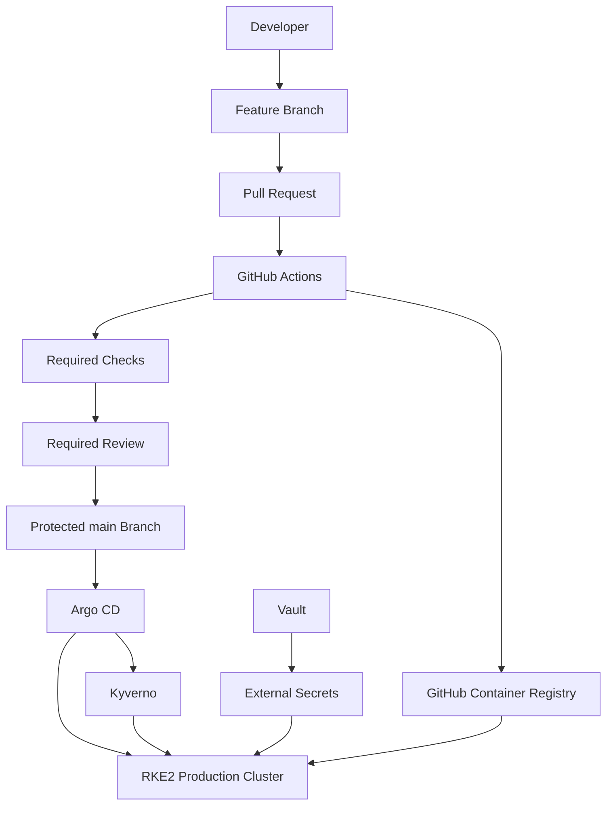
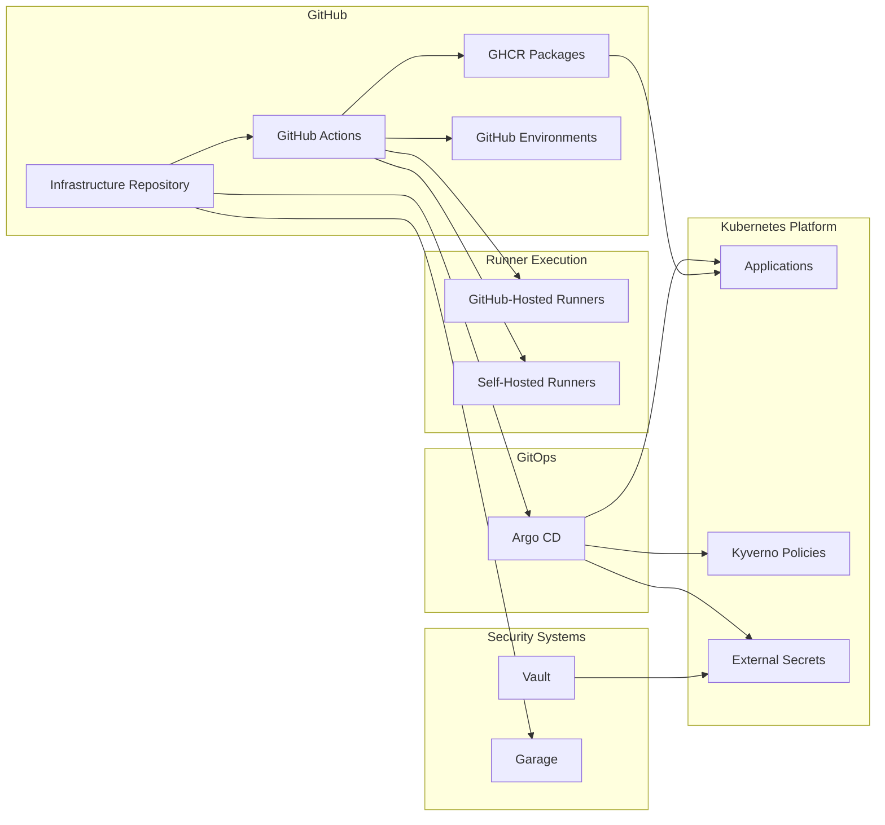
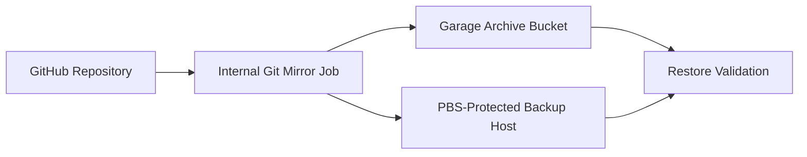
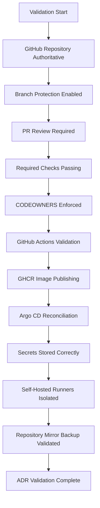

# ADR-0017 — GitHub Source Control, CI/CD, and Registry Operating Model

**ADR:** ADR-0017  
**Title:** GitHub Source Control, GitHub Actions CI/CD, GHCR Registry, and GitOps Integration  
**Owner:** SinLess Games LLC (Timothy “Andy” Andrew Pierce / sinless777)  
**Status:** ACCEPTED  
**Date Accepted:** 2026-04-25  
**Last Updated:** 2026-04-25  
**Supersedes:** N/A  
**Superseded By:** N/A  

**Related:**

- [Docs/Architecture/DECISIONS.md](../DECISIONS.md)
- [ADR-0001 — Monorepo Source of Truth](./ADR-0001.md)
- [ADR-0003 — Network Segmentation and Planes](./ADR-0003.md)
- [ADR-0007 — GitOps Controller: Argo CD](./ADR-0007.md)
- [ADR-0010 — cert-manager, Cloudflare DNS-01, and Vault](./ADR-0010.md)
- [ADR-0011 — Cloudflare Tunnel and Access](./ADR-0011.md)
- [ADR-0012 — Vault Secrets and PKI](./ADR-0012.md)
- [ADR-0013 — Backups and Disaster Recovery with PBS, Velero, and Garage](./ADR-0013.md)
- [ADR-0014 — Observability and Incident Response Platform](./ADR-0014.md)
- [ADR-0016 — Policy-as-Code Enforcement with Kyverno](./ADR-0016.md)

---

## Context

The platform requires a source control, CI/CD, registry, and GitOps integration
model that supports:

- auditable infrastructure changes
- pull-request based review
- GitOps reconciliation
- CI validation gates
- artifact publishing
- container image publishing
- self-hosted runner execution for infrastructure workflows
- secure secret handling
- production branch protection
- disaster recovery for critical repository data

The Infrastructure repository is hosted in GitHub.

GitHub is the authoritative source control platform for the Infrastructure
monorepo.

The platform uses Argo CD for GitOps reconciliation. Argo CD reconciles cluster
state from the GitHub-hosted Infrastructure repository.

The platform uses GitHub Actions for CI/CD automation.

The platform uses GitHub Container Registry for container image publishing.

GitLab is not part of the accepted source control, CI/CD, registry, or GitOps
operating model.

---

## Decision

Adopt **GitHub** as the authoritative source control, CI/CD, and registry
platform for the Infrastructure repository.

The accepted platform model is:

| Area | Accepted Platform |
| --- | --- |
| Source control | GitHub |
| Primary repository | `Sinless777/Infrastructure` |
| CI/CD automation | GitHub Actions |
| Container registry | GitHub Container Registry |
| GitOps reconciliation source | GitHub repository |
| GitOps controller | Argo CD |
| Production image source | GHCR |
| Secret source of truth | Vault |
| Runtime secret delivery | External Secrets |
| Policy enforcement | Kyverno and CI gates |
| Repository backup target | Internal Git mirror and Garage-backed backup workflow |

GitHub is the source of truth for:

- infrastructure code
- Kubernetes manifests
- Helm values
- Kustomize overlays
- Argo CD applications
- documentation
- CI workflow definitions
- policy-as-code manifests
- deployment metadata
- container image source definitions

Argo CD pulls desired state from GitHub.

GitHub Actions validates and builds changes before they are merged or deployed.

GHCR stores built container images used by the platform.

---

## Platform Flow



---

## Scope

This ADR governs:

- GitHub as the authoritative source control platform
- GitHub Actions as the CI/CD automation platform
- GHCR as the container image registry
- GitHub repository access controls
- GitHub branch protection requirements
- GitHub Actions security requirements
- self-hosted runner operating requirements
- GitHub-to-Argo CD integration
- repository backup requirements
- GitHub-related evidence requirements

This ADR does not define:

- every GitHub Actions workflow
- every reusable workflow
- every runner scale setting
- every image build workflow
- every Argo CD Application manifest
- every repository in the GitHub organization
- every GitHub App permission

Those items are implementation artifacts managed in the repository.

---

## Non-Goals

The accepted operating model does not include:

- GitLab as a source control platform
- GitLab CI
- GitLab Runner
- GitLab Container Registry
- a self-hosted Git forge as the authoritative source of truth
- direct manual production deployment outside GitHub and Argo CD
- plaintext CI secrets in Git
- unprotected production branches
- mutable production deployment image references

---

## Architecture Overview



---

## Responsibility Split

| Area | Responsibility |
| --- | --- |
| GitHub repository | Source of truth for code, manifests, workflows, docs, and policies |
| GitHub Actions | CI validation, builds, scans, image publishing, docs builds, automation |
| GHCR | OCI image registry for platform-built containers |
| Argo CD | Reconciles Kubernetes desired state from GitHub |
| Vault | Stores long-lived infrastructure secrets |
| External Secrets | Delivers runtime secrets into Kubernetes |
| Kyverno | Enforces Kubernetes admission policies |
| GitHub branch protection | Enforces review and status check gates |
| GitHub Environments | Controls environment-specific workflow approvals and secrets |
| Self-hosted runners | Execute trusted internal automation requiring local network or cluster access |
| Garage | Stores internal repository mirrors and backup artifacts where configured |

---

## Accepted Tooling

| Area | Tool |
| --- | --- |
| Source control | GitHub |
| CI/CD | GitHub Actions |
| Container registry | GitHub Container Registry |
| GitOps controller | Argo CD |
| Kubernetes policy | Kyverno |
| Secret manager | Vault |
| Kubernetes secret delivery | External Secrets Operator |
| Repository backup storage | Garage-backed internal backup workflow |
| Container scanning | Trivy |
| IaC scanning | Checkov and Trivy |
| Terraform linting | TFLint |
| Documentation build | MkDocs |
| Dependency updates | Renovate |

---

## Alternatives Considered

### A1) Self-Hosted GitLab

**Pros:**

- integrated source control, CI, registry, and project management
- strong self-hosted autonomy
- mature CI runner ecosystem

**Cons:**

- adds a large stateful service to operate
- requires dedicated backup, upgrade, and capacity management
- duplicates GitHub functionality already in use
- increases operational burden
- conflicts with the accepted GitHub-centered workflow

Self-hosted GitLab is rejected.

---

### A2) Gitea or Forgejo

**Pros:**

- lighter self-hosted Git forge
- lower operational overhead than GitLab
- useful for internal mirrors

**Cons:**

- does not match the accepted GitHub workflow
- would require additional CI and registry decisions
- duplicates the authoritative GitHub repository
- adds another source control surface to secure and back up

Gitea and Forgejo are not selected as authoritative source control platforms.

---

### A3) Local Git Server

**Pros:**

- minimal service footprint
- full local control
- simple mirroring target

**Cons:**

- weak collaboration workflow
- weak pull-request and review ergonomics
- weak CI/CD integration
- weak audit and governance features compared to GitHub

A local Git server is not selected as the authoritative source of truth.

---

### A4) GitHub Source Control with External CI

Examples:

- Jenkins
- Woodpecker CI
- Drone CI
- Buildkite

**Pros:**

- greater CI runtime control
- possible local-only execution

**Cons:**

- adds another automation platform
- duplicates GitHub Actions workflows
- increases integration and secret-management complexity
- weakens the single-platform audit trail

External CI is not selected as the standard CI/CD platform.

---

## Rationale

GitHub is selected because it is already the authoritative remote for the
Infrastructure repository and provides the required source control, CI/CD,
registry, and review controls.

### Source of Truth Alignment

The platform already treats the Infrastructure repository as the source of truth.

Using GitHub directly keeps the workflow clear:

```text
pull request → validation → review → merge → Argo CD reconciliation
```

This avoids duplicating the source of truth across multiple Git platforms.

---

### GitOps Integration

Argo CD can reconcile directly from the GitHub repository.

This keeps the GitOps control path simple:

```text
GitHub repository → Argo CD → Kubernetes cluster
```

Repository state remains reviewable, versioned, and auditable.

---

### CI/CD Integration

GitHub Actions provides the required CI/CD automation surface for:

- Markdown and documentation validation
- Docker builds
- OCI image publishing
- Kubernetes manifest validation
- Helm validation
- Kustomize validation
- Terraform validation
- Ansible validation
- policy-as-code validation
- dependency automation
- release automation

---

### Container Registry Integration

GHCR provides the accepted OCI image registry for platform-built images.

The registry is integrated with GitHub Actions and repository permissions.

Production workloads consume immutable image references from GHCR.

---

### Auditability

GitHub provides an audit-friendly workflow through:

- pull requests
- review approvals
- required checks
- signed commits and tags
- branch protection
- protected environments
- workflow logs
- release history
- package history

These records support operational and compliance evidence.

---

### Operational Simplicity

Using GitHub avoids operating a large self-hosted source control platform.

The platform still retains internal control over:

- self-hosted runners
- Vault-managed secrets
- GitOps reconciliation
- image deployment policy
- backup mirrors
- production admission controls

---

## Repository Requirements

The authoritative repository is:

```text
https://github.com/Sinless777/Infrastructure
```

The canonical repository name is:

```text
Sinless777/Infrastructure
```

The protected production branch is:

```text
main
```

The repository contains:

- Ansible automation
- Terraform code
- Kubernetes manifests
- Helm values
- Argo CD applications
- policy-as-code resources
- GitHub Actions workflows
- documentation
- scripts
- container build definitions

---

## Branch Protection Requirements

The `main` branch is protected.

Required controls for `main`:

- pull requests required before merge
- required status checks
- required review approval
- stale reviews dismissed after new commits
- force pushes disabled
- branch deletion disabled
- linear history enforced where supported
- administrator bypass disabled for normal operations
- conversation resolution required
- signed commits required where supported
- required checks must pass before merge

Production-impacting changes require review before merge.

Production-impacting paths include:

```text
.github/workflows/
Ansible/
Docs/
Kubernetes/apps/prod/
Kubernetes/clusters/prod/
Kubernetes/platform/
Policy/
Terraform/
mkdocs.yml
```

---

## GitHub Actions Requirements

GitHub Actions is the accepted CI/CD platform.

Required workflow controls:

- minimal `GITHUB_TOKEN` permissions
- explicit workflow permissions
- pinned third-party actions
- no plaintext secrets in workflow files
- no secret exposure to untrusted pull requests
- concurrency controls for deployment workflows
- environment protection for production workflows
- artifact retention configured per workflow class
- logs retained according to platform evidence requirements
- security scans required before image publication
- validation required before GitOps-impacting merges

Required CI gates include:

- YAML validation
- Markdown linting
- MkDocs strict build
- Dockerfile linting
- container image scanning
- Kubernetes schema validation
- Kustomize build validation
- Helm linting
- Helm template rendering
- Kyverno policy validation
- Kyverno policy tests
- Terraform formatting
- Terraform validation
- TFLint
- Checkov
- Trivy
- Ansible syntax checks
- secret scanning

---

## Runner Operating Model

GitHub Actions workflows run on two runner classes.

| Runner Class | Use |
| --- | --- |
| GitHub-hosted runners | Low-risk public validation jobs |
| Self-hosted runners | Infrastructure, cluster, internal-network, and production-impacting jobs |

Self-hosted runners are required for workflows that need:

- access to private infrastructure
- access to internal Kubernetes APIs
- access to internal DNS
- access to private registries
- access to internal artifact endpoints
- access to Vault-mediated automation
- controlled network placement

Self-hosted runners must be:

- ephemeral
- isolated by namespace or runner group
- least-privilege
- network-restricted
- non-root unless explicitly required
- monitored
- patched
- labeled by trust level
- separated between production and non-production workflows

Runner credentials are treated as sensitive.

Runner registration tokens and automation credentials are stored in Vault or
GitHub environment secrets according to their lifecycle and scope.

---

## Environment Controls

GitHub Environments are used for environment-specific workflow controls.

Required environments:

```text
dev
staging
prod
```

Production environment requirements:

- protected environment approval
- restricted secret access
- restricted deployment workflows
- required reviewers
- deployment history retained
- manual approval for production-impacting automation
- no automatic secret exposure to pull requests

---

## Container Registry Requirements

GHCR is the accepted container image registry.

Images are published under the GitHub owner namespace.

Production images must use immutable references.

Accepted production image references:

- semantic version tags
- date/version tags
- commit SHA tags
- image digests

Rejected production image references:

```text
latest
main
dev
snapshot
nightly
```

Production Kubernetes manifests must not deploy mutable tags.

Kyverno enforces production image tag restrictions.

Container images must be scanned before production use.

---

## GitOps Integration Requirements

Argo CD reconciles from the GitHub repository.

The GitOps source is:

```text
https://github.com/Sinless777/Infrastructure.git
```

Argo CD credentials for GitHub access are stored in Vault and delivered through
External Secrets.

Argo CD access to GitHub is read-only unless a specific automation requires
write access.

Argo CD applications must reference explicit repository paths.

Production GitOps paths include:

```text
Kubernetes/clusters/prod/
Kubernetes/apps/prod/
Kubernetes/platform/
```

Production cluster state changes are merged to `main` through pull requests.

---

## Secrets Requirements

Secrets must not be committed to GitHub.

Sensitive values include:

- GitHub tokens
- GitHub App private keys
- runner registration tokens
- deployment keys
- cloud provider credentials
- Vault tokens
- kubeconfigs
- registry credentials
- webhook URLs
- SSH private keys
- API keys
- passwords
- certificates and private keys

Accepted secret storage locations:

- Vault for infrastructure and runtime secrets
- GitHub Actions secrets for workflow-scoped CI secrets
- GitHub Environment secrets for environment-scoped CI secrets
- External Secrets for Kubernetes runtime delivery

GitHub Actions secrets are used only for CI/CD execution.

Vault remains the source of truth for infrastructure secrets.

---

## Repository Backup and Disaster Recovery Requirements

GitHub is an external service and must not be the only copy of critical source
history.

The Infrastructure repository must be backed up through an internal mirror.

Required repository backup controls:

- scheduled mirror clone
- full branch and tag mirror
- backup to internal storage
- Garage-backed archive storage
- restore validation
- access-controlled backup location
- audit record of backup job status

The backup workflow must preserve:

- Git branches
- Git tags
- commit history
- release metadata where exported
- workflow files
- documentation
- policy files
- Kubernetes manifests
- Terraform code
- Ansible code

Repository backup credentials are stored in Vault.



---

## Security and Compliance Requirements

### Identity and Access

GitHub access must follow least privilege.

Required controls:

- MFA required for privileged accounts
- organization owner access restricted
- repository admin access restricted
- production environment access restricted
- CODEOWNERS enforced for production paths
- inactive access removed
- machine users and tokens documented
- fine-grained tokens used where supported
- GitHub App permissions scoped to required access only

---

### Change Control

Production changes require:

- pull request
- CI validation
- required review
- protected branch merge
- Argo CD reconciliation
- observable rollout state
- rollback path

Production-impacting pull requests must include operational context.

---

### Audit Evidence

Required evidence includes:

- pull request history
- review approvals
- CI logs
- status check results
- workflow artifacts
- image scan reports
- GHCR package history
- Argo CD sync history
- Kyverno admission results
- deployment history
- repository backup results

---

### Supply Chain Security

Required controls:

- pinned third-party GitHub Actions
- container image scanning
- dependency update automation
- secret scanning
- no mutable production image tags
- no unreviewed production workflow changes
- no broad default workflow permissions
- no untrusted scripts with production secrets

---

## Implementation Requirements

### Repository Configuration

The repository must define:

- branch protection for `main`
- required CI checks
- CODEOWNERS
- issue and pull request templates
- Renovate configuration
- security scanning workflows
- documentation build workflows
- container build workflows
- GitOps validation workflows

---

### CODEOWNERS

Production-impacting paths require CODEOWNERS review.

Required protected paths:

```text
.github/
Ansible/
Kubernetes/apps/prod/
Kubernetes/clusters/prod/
Kubernetes/platform/
Policy/
Terraform/
Docs/Architecture/ADRs/
```

---

### Workflow Permissions

Workflows use least privilege.

Default permissions are read-only.

Write permissions are granted only per workflow job when required.

Required baseline:

```yaml
permissions:
  contents: read
```

Workflows that publish images may receive:

```yaml
permissions:
  contents: read
  packages: write
```

Workflows that update repository content require explicit review and scoped
permissions.

---

### Artifact Retention

CI artifacts are retained according to workflow class.

Required artifact classes:

| Artifact | Purpose |
| --- | --- |
| Terraform plans | Infrastructure change evidence |
| Trivy reports | Security scan evidence |
| Checkov reports | IaC scan evidence |
| Helm render output | Kubernetes deployment evidence |
| Kustomize build output | Kubernetes deployment evidence |
| MkDocs build output | Documentation validation evidence |
| Container digests | Image provenance evidence |

---

### Release and Image Tagging

Container images are tagged with immutable identifiers.

Required image tags include:

- commit SHA
- semantic version when released
- build date where used by the workflow

Production deployment manifests reference immutable tags or digests.

---

### GitHub to Argo CD Credentials

Argo CD uses a read-only GitHub credential.

Accepted credential forms:

- read-only deploy key
- GitHub App installation credential
- fine-grained token with read-only repository access

Credentials are stored in Vault and delivered through External Secrets.

---

## Validation Requirements

This ADR is valid when the following requirements are met:

- GitHub repository is the authoritative source of truth
- `main` branch protection is enabled
- pull requests are required for production-impacting changes
- required CI checks block unsafe merges
- CODEOWNERS protects production paths
- GitHub Actions validates documentation
- GitHub Actions validates Kubernetes manifests
- GitHub Actions validates Terraform changes
- GitHub Actions validates Kyverno policies
- GitHub Actions scans container images
- GHCR stores platform-built images
- production manifests do not use mutable image tags
- Argo CD reconciles from GitHub
- Argo CD GitHub credentials are read-only
- GitHub secrets are not committed to the repository
- Vault stores infrastructure secrets
- self-hosted runners are isolated and least-privilege
- repository mirror backups complete successfully
- repository restore validation completes successfully
- CI artifacts are retained for evidence
- production workflow approvals are enforced



---

## Rollback Plan

If GitHub Actions workflows fail incorrectly:

1. identify the failing workflow
2. inspect the workflow logs
3. revert the workflow change if it blocks valid production work
4. merge the correction through the protected branch process
5. rerun required checks
6. verify branch protection is intact

If a self-hosted runner is compromised or unstable:

1. disable the affected runner
2. revoke the runner registration token
3. rotate exposed credentials
4. inspect workflow logs
5. remove the runner workload
6. redeploy a clean runner
7. verify workflow isolation before re-enabling production jobs

If GHCR image publishing fails:

1. keep the last known-good production image deployed
2. inspect GitHub Actions package permissions
3. inspect registry authentication
4. rerun the image build workflow
5. verify the image digest
6. update the deployment through pull request if needed

If GitHub is unavailable:

1. pause non-critical production changes
2. keep running workloads stable
3. use existing Argo CD synced state
4. use internal repository mirror for read-only recovery
5. restore Git operations from the internal mirror when required
6. reconcile back to GitHub after service recovery

If Argo CD loses GitHub access:

1. verify GitHub availability
2. verify Argo CD repository credentials
3. verify Vault-delivered Git credentials
4. restore the last known-good repository credential
5. refresh Argo CD applications
6. verify applications return to healthy sync status

A permanent migration away from GitHub requires:

- a superseding ADR
- migration plan
- rollback plan
- repository migration procedure
- CI/CD migration procedure
- registry migration procedure
- GitOps credential migration procedure
- validation evidence

---

## Operational Requirements

GitHub production operation requires:

- protected `main` branch
- required pull requests
- required CI checks
- required CODEOWNERS review
- least-privilege workflow permissions
- protected production environments
- self-hosted runner isolation
- GHCR image scanning
- immutable production image references
- repository backup mirror
- repository restore validation
- documented credential ownership
- Vault-managed infrastructure secrets
- Argo CD read-only GitHub access
- audit evidence retention
