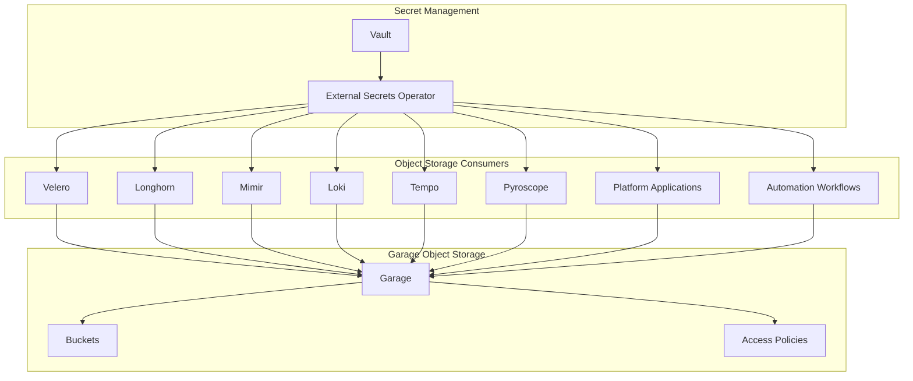
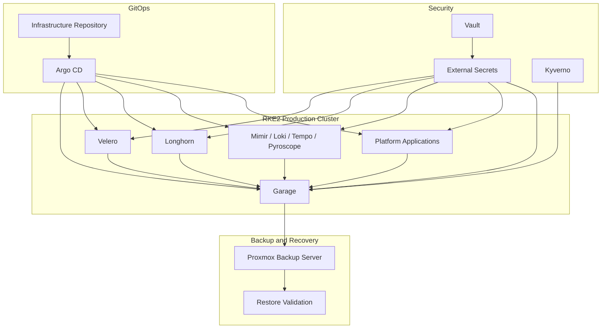
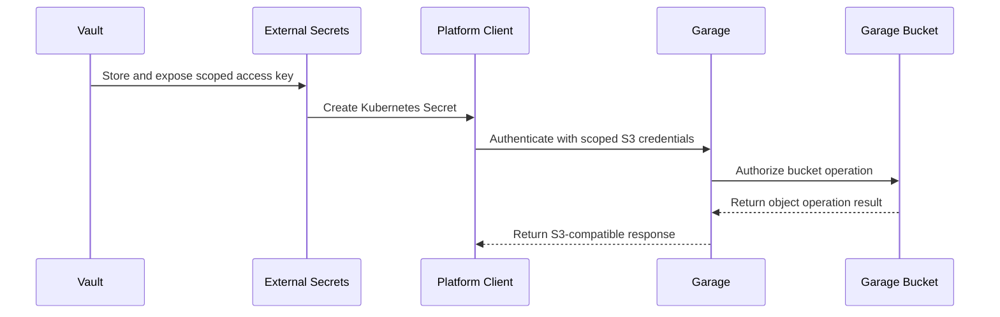
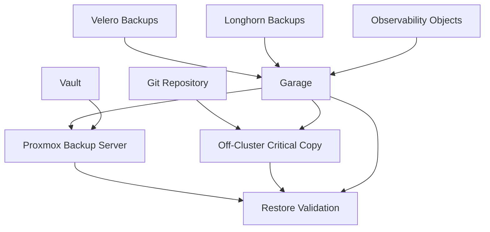
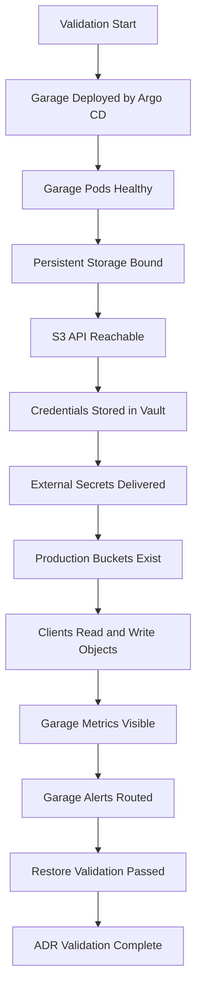

# ADR-0018 — Garage Object Storage Placement and Operating Model

**ADR:** ADR-0018  
**Title:** Garage Placement and Operating Model for Local S3-Compatible Platform Object Storage  
**Owner:** SinLess Games LLC (Timothy “Andy” Andrew Pierce / sinless777)  
**Status:** ACCEPTED  
**Date Accepted:** 2026-04-25  
**Last Updated:** 2026-04-25  
**Supersedes:** N/A  
**Superseded By:** N/A  

**Related:**

- [Docs/Architecture/DECISIONS.md](../DECISIONS.md)
- [ADR-0001 — Monorepo Source of Truth](./ADR-0001.md)
- [ADR-0002 — Proxmox Cluster Topology](./ADR-0002.md)
- [ADR-0005 — Storage Model](./ADR-0005.md)
- [ADR-0007 — GitOps Controller: Argo CD](./ADR-0007.md)
- [ADR-0012 — Vault Secrets and PKI](./ADR-0012.md)
- [ADR-0013 — Backups and Disaster Recovery with PBS, Velero, and Garage](./ADR-0013.md)
- [ADR-0014 — Observability and Incident Response Platform](./ADR-0014.md)
- [ADR-0016 — Policy-as-Code Enforcement with Kyverno](./ADR-0016.md)
- [ADR-0017 — GitHub Source Control, CI/CD, and Registry Operating Model](./ADR-0017.md)

---

## Context

The platform requires a local S3-compatible object storage service for platform
backups, observability backends, application data, and internal automation.

Object storage is required by:

- Velero Kubernetes backups
- Longhorn backup targets
- Mimir metrics storage
- Loki log storage
- Tempo trace storage
- Pyroscope profile storage
- platform application buckets
- internal automation workflows
- backup archives
- documentation or artifact publishing workflows where applicable

The platform has a local-first operating posture.

Object storage must support:

- S3-compatible client access
- local infrastructure ownership
- environment separation
- service-specific access keys
- least-privilege bucket policies
- Vault-managed credentials
- GitOps-managed configuration
- backup and restore validation
- monitoring and alerting
- disaster recovery procedures

The platform uses **Garage** as the accepted self-hosted S3-compatible object
storage system.

MinIO is not the selected platform object storage system.

---

## Decision

Adopt **Garage** as the platform’s primary local S3-compatible object storage
service.

Garage is the accepted object storage backend for:

- Velero backup objects
- Longhorn backup objects
- Mimir object storage
- Loki object storage
- Tempo object storage
- Pyroscope object storage
- platform application buckets
- backup archives
- internal S3-compatible automation workflows

Garage credentials are stored in Vault and delivered to Kubernetes workloads
through External Secrets.

Garage is managed declaratively through GitOps where it runs in Kubernetes.

Garage is treated as Tier-1 platform infrastructure because backup,
observability, and application workflows depend on it.

---

## Platform Object Storage Flow



---

## Scope

This ADR governs:

- Garage as the local S3-compatible object storage platform
- Garage as the object storage backend for backups and observability
- Garage bucket naming standards
- Garage access key standards
- Garage credential custody through Vault
- Garage deployment and access requirements
- Garage backup and disaster recovery requirements
- Garage monitoring and validation requirements

This ADR does not define:

- every Garage manifest
- every bucket policy document
- every application-specific bucket
- every object lifecycle rule
- every offsite replication target
- every client-specific configuration value

Those items are implementation artifacts managed in the repository and
operations documentation.

---

## Non-Goals

The accepted object storage standard does not include:

- MinIO as the primary platform object store
- Ceph RGW as the primary platform object store
- cloud-only object storage as the primary platform object store
- NFS or SMB as a replacement for S3-compatible object storage
- public unauthenticated object storage access
- plaintext object storage credentials in Git
- shared credentials across unrelated services
- one bucket shared by all environments
- one access key shared by all platform components

---

## Responsibility Split

| Area | Responsibility |
| --- | --- |
| Object storage API | Garage |
| Backup object storage | Garage |
| Observability object storage | Garage |
| Bucket credentials | Vault |
| Runtime credential delivery | External Secrets |
| GitOps reconciliation | Argo CD |
| Backup and recovery | PBS, Velero, Garage restore procedures |
| Policy enforcement | Kyverno and CI gates |
| Monitoring | Grafana, Prometheus, Mimir, Loki |
| Access control | Garage access keys, bucket policies, NetworkPolicies, ingress controls |

---

## Accepted Tooling

| Area | Tool |
| --- | --- |
| Object storage | Garage |
| GitOps reconciliation | Argo CD |
| Secret storage | Vault |
| Kubernetes secret delivery | External Secrets Operator |
| Kubernetes admission policy | Kyverno |
| Kubernetes backup client | Velero |
| Volume backup client | Longhorn backup workflow |
| Metrics and alerts | Prometheus, Mimir, Grafana |
| Logs | Loki |
| Infrastructure backup | Proxmox Backup Server |

---

## Alternatives Considered

### A1) MinIO

**Pros:**

- mature S3-compatible object storage
- common Kubernetes and backup integration pattern
- widely known operational model

**Cons:**

- not the selected platform object store
- duplicates Garage functionality
- increases operational sprawl
- creates separate bucket, credential, monitoring, and recovery standards
- conflicts with the accepted Garage-backed backup and observability model

MinIO is rejected as the platform object storage standard.

---

### A2) Ceph RGW

**Pros:**

- S3-compatible object storage
- integrates with Ceph environments
- can provide a unified distributed storage platform

**Cons:**

- increases Ceph operational complexity
- couples object storage failure modes to the Ceph storage fabric
- conflicts with the platform’s accepted Garage object storage direction
- increases troubleshooting blast radius

Ceph RGW is rejected as the platform object storage standard.

---

### A3) Cloud Object Storage Only

Examples:

- Cloudflare R2
- AWS S3
- Backblaze B2
- Wasabi

**Pros:**

- offsite durability
- provider-managed availability
- useful for site-loss protection

**Cons:**

- external dependency
- recurring cost
- restore speed depends on WAN availability
- credentials and provider access become recovery dependencies
- does not satisfy the local-first platform requirement

Cloud-only object storage is rejected as the primary platform object store.

Cloud object storage may be used as an offsite replication target under a
separate implementation decision.

---

### A4) NFS or SMB for Object-Like Storage

**Pros:**

- simple to operate
- familiar filesystem semantics
- easy local mounting

**Cons:**

- not S3-compatible
- does not satisfy Velero S3 backend requirements
- does not satisfy Mimir, Loki, Tempo, or Pyroscope object storage patterns
- does not provide object storage access-key and bucket-policy semantics

NFS and SMB are rejected as replacements for S3-compatible platform object
storage.

---

### A5) No Local Object Storage

**Pros:**

- fewer local services
- reduced local operational footprint

**Cons:**

- breaks local-first backup strategy
- forces cloud dependency for Velero and observability backends
- reduces platform autonomy
- complicates recovery during WAN or provider outages

No local object storage is rejected.

---

## Rationale

Garage is selected because it satisfies the platform requirement for a
self-hosted S3-compatible object storage service.

### Local-First S3-Compatible Storage

Garage provides a local S3-compatible API target for platform systems that
expect S3 semantics.

This allows the platform to keep backup and observability object storage under
local infrastructure control.

---

### Unified Object Storage Standard

Garage provides one standard object storage platform for:

- backup workflows
- observability backends
- platform application buckets
- automation artifacts
- internal archival workflows

Using one object storage platform reduces operational sprawl.

---

### GitOps and Vault Alignment

Garage configuration, bucket declarations, and consuming workloads are managed
through GitOps where applicable.

Garage credentials are stored in Vault.

External Secrets delivers runtime credentials into Kubernetes.

This aligns object storage operations with the rest of the platform security
model.

---

### Environment Separation

Garage supports the platform’s required environment separation model.

Separate buckets and credentials are used for:

- development
- staging
- production
- observability
- backups
- application data

---

### Disaster Recovery Alignment

Garage integrates into the platform backup and disaster recovery model.

Garage is used by backup systems, and Garage itself is protected through
infrastructure backups, documented recovery procedures, and restore validation.

---

## Architecture Overview



---

## Deployment Model

Garage is deployed as a production platform service.

The accepted Kubernetes implementation path is:

```text
Kubernetes/apps/prod/sinless-games/garage
```

Garage Kubernetes resource names use lowercase DNS-compatible names.

Required naming pattern:

```text
garage
garage-api
garage-web
garage-rpc
garage-metrics
```

Garage must run with persistent storage.

Garage must expose internal service endpoints for S3-compatible clients.

Garage admin and RPC endpoints must remain internal.

Garage must not expose administrative access directly to the public internet.

---

## Placement Requirements

Garage placement must satisfy the platform storage and failure-domain model.

Garage storage replicas must not depend on a single Kubernetes node, Proxmox
host, or disk.

Garage workloads must use node placement rules that prevent all Garage replicas
from landing on the same failure domain.

Required placement controls:

- node affinity or topology spread constraints
- anti-affinity between Garage replicas
- persistent storage bound to intended nodes or storage classes
- explicit resource requests
- explicit resource limits
- PodDisruptionBudget
- documented storage paths or persistent volume claims

Garage storage nodes must be included in infrastructure backup coverage.

---

## Network Requirements

Garage exposes internal service endpoints for platform consumers.

Required endpoint classes:

| Endpoint | Exposure |
| --- | --- |
| S3 API | Internal platform access |
| metrics | Internal monitoring access |
| RPC / cluster communication | Internal Garage nodes only |
| admin interface | Restricted internal access only |

Garage must not be exposed directly to the public internet.

External access, when explicitly required, must use:

- Cloudflare Access
- Istio Gateway
- TLS
- authenticated access
- restricted authorization
- scoped credentials

NetworkPolicies must restrict Garage traffic to approved namespaces and clients.

---

## Bucket Strategy

Garage buckets are separated by environment and purpose.

Required production buckets are:

```text
velero-prod
longhorn-prod
mimir-prod
loki-prod
tempo-prod
pyroscope-prod
observability-archives-prod
app-backups-prod
```

Required non-production buckets are:

```text
velero-dev
velero-staging
longhorn-dev
longhorn-staging
app-backups-dev
app-backups-staging
```

Application-specific buckets use this format:

```text
<application>-<purpose>-<environment>
```

Examples:

```text
docs-artifacts-prod
garage-test-prod
```

One bucket must not be shared by unrelated platform components.

Production and non-production data must not share the same bucket.

---

## Credential Strategy

Garage access keys are separated by service and environment.

Required production access keys are:

```text
velero-prod-writer
longhorn-prod-writer
mimir-prod-writer
loki-prod-writer
tempo-prod-writer
pyroscope-prod-writer
app-backups-prod-writer
```

Access keys must be scoped to the minimum bucket permissions required by the
consumer.

Read-only access and write access must use separate credentials.

Administrative credentials must not be used by workloads.

Credential values are stored in Vault.

Credentials are delivered to Kubernetes through External Secrets.

Credential rotation must not require committing secret values to Git.

---

## Object Storage Access Flow



---

## Storage and Durability Requirements

Garage must use persistent storage.

Garage object data must not depend on ephemeral pod storage.

Garage metadata and object data must survive pod restarts and node reboots.

Garage storage must be monitored for:

- used capacity
- free capacity
- growth rate
- node health
- request errors
- replication health
- unavailable storage paths

Garage must be backed up or recoverable through documented infrastructure
recovery procedures.

Garage must not be the only copy of critical backup data.

---

## Backup and Disaster Recovery Requirements

Garage participates in two roles:

1. storage target for backups
2. system that must itself be recoverable

This creates a circular dependency that must be controlled.

Garage is not considered protected until Garage recovery has been tested.

Required Garage recovery controls:

- PBS coverage for Garage-hosting nodes or VMs where applicable
- GitOps-managed Garage manifests
- Vault-managed Garage credentials
- documented Garage restore procedure
- Garage bucket inventory procedure
- Velero restore validation from Garage
- object read/write validation after restore
- off-cluster copy for critical backup objects

Garage must not be the only location for:

- Vault recovery material
- Garage administrative credentials
- Git repository mirrors
- PBS recovery credentials
- critical production backup records

---

## Backup Dependency Flow



---

## Security and Compliance Requirements

### Access Control

Garage access follows least privilege.

Required controls:

- one access key per service and environment
- no shared production credentials
- no workload use of Garage administrative credentials
- read-only and write credentials separated
- production and non-production credentials separated
- credential ownership documented
- credentials stored in Vault
- credentials delivered by External Secrets

---

### Encryption

Garage access must use TLS for S3 clients.

Storage-layer encryption is provided by the underlying storage layer where
configured.

Sensitive object data must be encrypted before upload when application-level
encryption is required by the workload.

---

### Auditability

Garage operations must produce auditable evidence.

Required evidence includes:

- bucket creation history
- access key creation history
- access key rotation history
- object storage availability checks
- failed access attempts where captured
- backup write validation
- restore validation
- capacity alert history

---

### Data Classification

Buckets that may contain sensitive data must be identified.

Sensitive-data buckets require:

- restricted access keys
- restricted network access
- shorter access credential lifetime
- documented retention
- restore validation
- audit evidence

---

### Secret Handling

Garage secrets must not be committed to Git.

Sensitive values include:

- root token
- admin token
- access key IDs
- secret access keys
- webhook URLs
- TLS private keys
- replication credentials
- backup credentials

Approved secret delivery patterns are:

- Vault
- External Secrets Operator
- Vault CSI where explicitly implemented

---

## Policy Requirements

Kyverno enforces Garage workload safety requirements.

Required policy controls:

- Garage pods must run as non-root where the image supports it
- privilege escalation must be disabled
- Linux capabilities must be restricted
- resource requests are required
- resource limits are required
- persistent storage is required
- required labels are required
- hostPath usage is blocked unless explicitly approved
- Garage administrative secrets are not exposed to application namespaces
- Garage services do not use public LoadBalancer exposure
- Garage admin endpoints remain internal
- production credentials are not mounted in non-production namespaces

---

## Observability Requirements

Garage must be monitored through the platform observability stack.

Required metrics and alerts:

- Garage service availability
- S3 API availability
- request rate
- request error rate
- 4xx count
- 5xx count
- latency
- disk usage
- disk growth rate
- node health
- replication health
- failed authentication
- bucket capacity
- unavailable storage path
- failed backup write
- stale backup object checks

Grafana dashboards must display:

- Garage health
- request volume
- error counts
- latency
- storage capacity
- bucket usage
- client usage by service
- backup object freshness

---

## Implementation Requirements

### GitOps Deployment

Garage is managed by Argo CD.

Garage manifests are stored under:

```text
Kubernetes/apps/prod/sinless-games/garage
```

Required deployment order:

| Wave | Resource |
| --- | --- |
| `-10` | namespace and required labels |
| `-5` | ExternalSecret references |
| `0` | Garage configuration |
| `1` | Garage persistent storage |
| `2` | Garage workload resources |
| `3` | Garage services |
| `4` | Garage NetworkPolicies |
| `5` | Garage ServiceMonitor and alerts |

---

### Kubernetes Labels

Garage resources must include:

```text
app.kubernetes.io/name=garage
app.kubernetes.io/part-of=platform-object-storage
app.kubernetes.io/component=object-storage
app.kubernetes.io/managed-by=argocd
storage.sinlessgames.io/backend=garage
```

---

### Environment Labels

Garage telemetry and resources must include:

```text
environment=prod
cluster=rke2-prod
```

---

### S3 Client Configuration

Garage S3 clients must use path-style addressing unless the implementation
explicitly configures virtual-hosted bucket addressing.

Required baseline client settings:

```text
provider=aws
region=garage
s3ForcePathStyle=true
```

Internal endpoint pattern:

```text
http://garage-api.<namespace>.svc.cluster.local:3900
```

TLS endpoint pattern:

```text
https://garage.<internal-domain>
```

---

### Velero Configuration

Velero uses a dedicated Garage bucket.

Production bucket:

```text
velero-prod
```

Production credential:

```text
velero-prod-writer
```

Required Velero S3 settings:

```text
provider=aws
region=garage
s3ForcePathStyle=true
```

---

### Longhorn Configuration

Longhorn uses a dedicated Garage bucket.

Production bucket:

```text
longhorn-prod
```

Production credential:

```text
longhorn-prod-writer
```

Longhorn backup configuration must not share the Velero access key.

---

### Observability Backend Configuration

Observability backends use dedicated Garage buckets.

Required mapping:

| Backend | Bucket | Credential |
| --- | --- | --- |
| Mimir | `mimir-prod` | `mimir-prod-writer` |
| Loki | `loki-prod` | `loki-prod-writer` |
| Tempo | `tempo-prod` | `tempo-prod-writer` |
| Pyroscope | `pyroscope-prod` | `pyroscope-prod-writer` |

---

## Validation Requirements

This ADR is valid when the following requirements are met:

- Garage is deployed by Argo CD
- Garage pods are healthy
- Garage persistent storage is bound
- Garage S3 API is reachable internally
- Garage administrative access is restricted
- Garage credentials are stored in Vault
- External Secrets delivers Garage credentials
- production buckets exist
- production access keys are scoped by service
- Velero writes to `velero-prod`
- Velero reads from `velero-prod`
- Longhorn writes to `longhorn-prod`
- Longhorn reads from `longhorn-prod`
- Mimir writes to `mimir-prod`
- Loki writes to `loki-prod`
- Tempo writes to `tempo-prod`
- Pyroscope writes to `pyroscope-prod`
- Garage metrics are visible in Grafana
- Garage alerts route to the configured receivers
- Garage bucket capacity is visible
- Garage restore procedure is documented
- Garage object read/write validation passes
- Garage-backed backup restore validation passes
- Argo CD reports Garage resources as healthy



---

## Rollback Plan

If Garage is unstable:

1. stop onboarding new consumers
2. verify Garage pod health
3. verify persistent volume health
4. verify internal DNS resolution
5. verify S3 API availability
6. verify Vault-delivered credentials
7. restore the last known-good Garage configuration through GitOps
8. validate bucket read/write operations
9. validate backup client operations

If Garage data becomes unavailable:

1. stop destructive operations
2. preserve current Garage volumes
3. inspect Garage cluster health
4. inspect node and disk health
5. restore Garage-hosting infrastructure from PBS where required
6. restore Garage manifests from Git
7. restore credentials from Vault
8. validate bucket listings
9. validate object reads
10. validate backup restore workflows

If Velero cannot write to Garage:

1. verify the `velero-prod` bucket
2. verify the `velero-prod-writer` credential
3. verify External Secrets delivery
4. verify Velero backup storage location status
5. perform a test backup
6. perform a test restore

If observability backends cannot write to Garage:

1. identify the affected backend
2. verify the backend-specific bucket
3. verify the backend-specific credential
4. verify object storage endpoint configuration
5. verify backend logs
6. restore the last known-good backend configuration

A permanent migration away from Garage requires:

- a superseding ADR
- migration plan
- rollback plan
- bucket migration procedure
- credential migration procedure
- backup validation evidence
- updated implementation documentation
- updated runbooks

---

## Operational Requirements

Garage production operation requires:

- persistent storage
- resource requests
- resource limits
- PodDisruptionBudget
- anti-affinity or topology spread constraints
- NetworkPolicies
- internal-only admin endpoints
- Vault-managed credentials
- service-specific access keys
- environment-specific buckets
- TLS for client access
- monitoring dashboards
- alert rules
- backup procedures
- restore procedures
- restore validation
- capacity planning
- credential rotation
- GitOps-managed manifests
- Argo CD health reporting
- Kyverno policy enforcement
