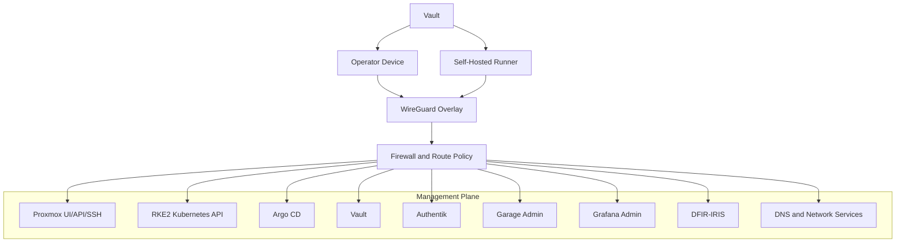
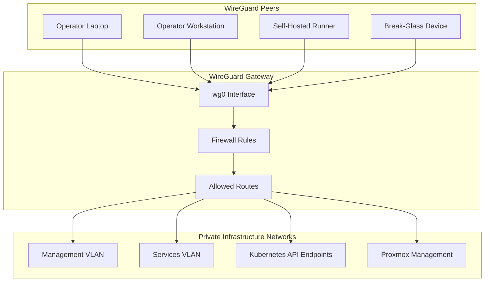
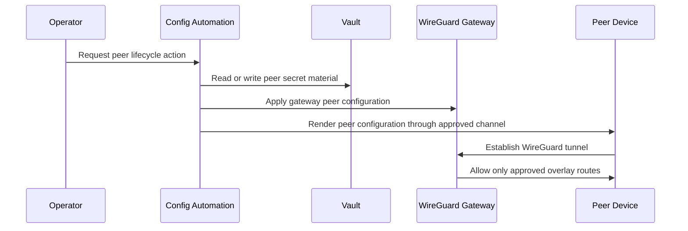
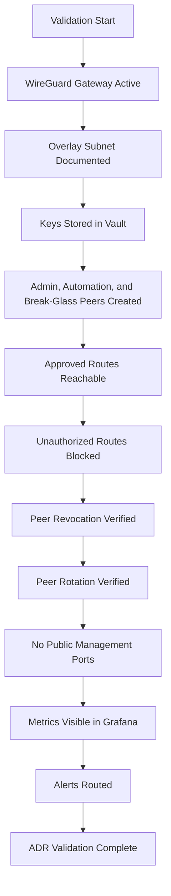

# ADR-0019 — Management Overlay with WireGuard

**ADR:** ADR-0019  
**Title:** Management Overlay: WireGuard for Admin and Automation Plane Connectivity  
**Owner:** SinLess Games LLC (Timothy “Andy” Andrew Pierce / sinless777)  
**Status:** ACCEPTED  
**Date Accepted:** 2025-12-27  
**Last Updated:** 2026-04-25  
**Supersedes:** N/A  
**Superseded By:** N/A  

**Related:**

- [Docs/Architecture/DECISIONS.md](../DECISIONS.md)
- [ADR-0001 — Monorepo Source of Truth](./ADR-0001.md)
- [ADR-0003 — Network Segmentation and Planes](./ADR-0003.md)
- [ADR-0004 — Proxmox UI HA VIP and HAProxy](./ADR-0004.md)
- [ADR-0007 — GitOps Controller: Argo CD](./ADR-0007.md)
- [ADR-0009 — Authentik OIDC](./ADR-0009.md)
- [ADR-0011 — Cloudflare Tunnel and Access](./ADR-0011.md)
- [ADR-0012 — Vault Secrets and PKI](./ADR-0012.md)
- [ADR-0013 — Backups and Disaster Recovery with PBS, Velero, and Garage](./ADR-0013.md)
- [ADR-0014 — Observability and Incident Response Platform](./ADR-0014.md)
- [ADR-0016 — Policy-as-Code Enforcement with Kyverno](./ADR-0016.md)
- [ADR-0017 — GitHub Source Control, CI/CD, and Registry Operating Model](./ADR-0017.md)
- [ADR-0018 — Garage Object Storage Placement and Operating Model](./ADR-0018.md)

---

## Context

The platform requires a secure management access method for administrative and
automation workflows.

Management access must support:

- operator access from trusted devices
- automation access from approved runners and orchestrators
- emergency access to infrastructure services
- private access to management endpoints
- stable access during WAN or edge changes
- clear separation between management traffic and workload traffic
- credential custody through Vault
- auditable access patterns

Management endpoints include:

- Proxmox UI
- Proxmox API
- Proxmox SSH
- HAProxy management endpoints for the Proxmox VIP
- RKE2 Kubernetes API access
- Argo CD administrative access
- Vault administrative access
- Authentik administrative access
- Garage administrative access
- Grafana administrative access
- DFIR-IRIS administrative access
- DNS and network service administration endpoints
- automation endpoints required by GitHub Actions self-hosted runners

The platform uses VLAN-based network segmentation.

Cloudflare Tunnel and Cloudflare Access are used for selected externally
reachable web services. Cloudflare Access does not replace the management
overlay.

Management services must not expose administrative ports directly to the public
internet.

A private encrypted overlay is required for the management and automation plane.

---

## Decision

Adopt **WireGuard** as the platform management overlay network.

WireGuard is the accepted management overlay for:

- operator administrative access
- approved automation access
- controlled access to management plane services
- private access to infrastructure control surfaces
- emergency access when public ingress or Cloudflare routing is unavailable

WireGuard peer keys and peer configuration secrets are stored in Vault.

WireGuard peer configuration is rendered through approved automation.

Management endpoints are reachable through:

- internal VLAN networks
- WireGuard overlay routes
- Cloudflare Access only for explicitly published web services

No management ports are exposed directly to the public internet.

---

## Management Access Flow



---

## Scope

This ADR governs:

- WireGuard as the management overlay
- administrative access paths
- automation access paths
- peer credential custody
- overlay routing requirements
- firewall requirements
- monitoring requirements
- validation requirements
- rollback requirements

This ADR does not define:

- every WireGuard peer
- every firewall rule
- every route table entry
- every operator device profile
- every CI runner profile
- every break-glass credential
- every management service runbook

Those items are implementation artifacts managed in network, security, and
operations documentation.

---

## Non-Goals

The accepted management overlay standard does not include:

- public exposure of management ports
- public exposure of Proxmox management services
- public exposure of Kubernetes API servers
- Cloudflare Access as the only management access method
- Tailscale as the platform management overlay
- OpenVPN as the platform management overlay
- IPSec as the platform management overlay
- shared WireGuard peer keys
- unmanaged WireGuard peer configuration
- broad overlay routes into workload networks
- unrestricted access from CI runners into production networks

---

## Responsibility Split

| Area | Responsibility |
| --- | --- |
| Management overlay | WireGuard |
| Peer secret custody | Vault |
| Peer configuration rendering | Approved automation |
| External web access | Cloudflare Tunnel and Cloudflare Access |
| Identity for web applications | Authentik |
| Local network segmentation | VLANs and firewall rules |
| Kubernetes access control | Kubernetes RBAC |
| GitOps management | Argo CD |
| Runner automation | GitHub Actions self-hosted runners |
| Observability | Grafana, Prometheus, Mimir, Loki |
| Policy enforcement | Kyverno and CI gates |

---

## Accepted Tooling

| Area | Tool |
| --- | --- |
| Overlay VPN | WireGuard |
| Secret storage | Vault |
| Runtime secret delivery | External Secrets where used by Kubernetes workloads |
| GitOps reconciliation | Argo CD |
| External application access | Cloudflare Tunnel and Cloudflare Access |
| Identity provider | Authentik |
| CI/CD automation | GitHub Actions |
| Internal object storage | Garage |
| Observability | Grafana stack |
| Incident response | DFIR-IRIS |

---

## Alternatives Considered

### A1) OpenVPN

**Pros:**

- mature VPN technology
- widely supported
- familiar operational model

**Cons:**

- heavier configuration model
- more operational complexity
- less ergonomic for lightweight automation workflows
- not the selected platform overlay standard

OpenVPN is rejected as the platform management overlay.

---

### A2) IPSec

**Pros:**

- mature standard
- widely implemented
- useful for network-to-network tunnels

**Cons:**

- higher configuration complexity
- less ergonomic for per-device operator access
- more difficult peer lifecycle management
- not the selected platform overlay standard

IPSec is rejected as the platform management overlay.

---

### A3) Tailscale

**Pros:**

- convenient device onboarding
- strong user experience
- useful identity-aware mesh model

**Cons:**

- introduces an external control plane
- conflicts with the platform’s self-managed management overlay requirement
- creates a dependency outside the local infrastructure boundary
- not the selected high-assurance management overlay

Tailscale is rejected as the platform management overlay.

---

### A4) Cloudflare Access Only

**Pros:**

- strong identity-aware access for web applications
- integrates with externally published services
- supports policy-based access

**Cons:**

- does not cover all management protocols
- does not replace private routing to infrastructure endpoints
- does not provide complete automation-plane connectivity
- creates dependency on tunnel and Cloudflare policy availability
- cannot be the only management path for infrastructure recovery

Cloudflare Access remains accepted for selected external web services, but it is
rejected as the only management access method.

---

### A5) Internal VLAN Access Only

**Pros:**

- simple when physically on the LAN
- no overlay dependency
- clear local network model

**Cons:**

- does not support remote operator access
- does not support approved off-network automation access
- does not provide a consistent management path during location changes
- requires local network presence for recovery

Internal VLAN access remains valid, but it does not replace WireGuard.

---

## Rationale

WireGuard is selected because it provides a simple, private, encrypted management
overlay that fits the platform operating model.

### Clear Management Plane

WireGuard creates a dedicated overlay for administrative and automation traffic.

Management traffic is separated from:

- public ingress traffic
- application workload traffic
- user-facing service traffic
- general LAN traffic
- Kubernetes pod and service networks

---

### Reduced Public Attack Surface

Management services remain private.

No direct public exposure is permitted for:

- Proxmox management ports
- Kubernetes API servers
- Vault administrative ports
- Garage administrative ports
- internal database ports
- node SSH
- internal-only platform APIs

---

### Automation Compatibility

WireGuard supports automation workflows that require private network access.

Approved self-hosted runners can use WireGuard to reach:

- Kubernetes APIs
- internal DNS
- private service endpoints
- infrastructure automation targets
- management APIs

Automation access is scoped by peer routes and firewall rules.

---

### Vault-Based Credential Custody

WireGuard private keys and peer configuration material are sensitive.

Vault stores:

- peer private keys
- peer public keys
- preshared keys where used
- allowed IP assignments
- endpoint data
- rendered configuration material where required
- peer lifecycle metadata

---

### Recovery Independence

WireGuard provides a management access path that does not depend on public
application ingress.

This is required for recovery when:

- Cloudflare Tunnel is degraded
- Cloudflare Access policy is misconfigured
- ingress gateways are degraded
- DNS automation is degraded
- service mesh ingress is degraded
- public routes are intentionally disabled

---

## Overlay Architecture

The accepted initial topology is hub-and-spoke.



The WireGuard gateway is the controlled ingress point into the management plane.

Peer-to-peer mesh access is not part of the accepted baseline.

---

## Access Model

WireGuard peers are assigned explicit access profiles.

Required peer classes are:

| Peer Class | Purpose |
| --- | --- |
| `admin-device` | Operator access to approved management endpoints |
| `automation-runner` | CI/CD and orchestration access to approved automation endpoints |
| `break-glass` | Emergency access to critical recovery endpoints |
| `service-peer` | Approved service-to-service management connectivity |

Peer access is controlled by:

- WireGuard allowed IPs
- firewall rules
- route policy
- Kubernetes RBAC
- service authentication
- Vault credentials
- application-level authorization

A WireGuard connection alone does not grant administrative authorization.

---

## Route Policy

WireGuard routes are restricted to management and approved service endpoints.

Allowed route classes:

- management VLAN routes
- selected services VLAN routes
- selected Kubernetes API endpoint routes
- selected DNS resolver routes
- selected GitOps and automation endpoints

Disallowed route classes:

- broad pod CIDR access by default
- broad service CIDR access by default
- unrestricted workload namespace access
- unrestricted production database access
- unrestricted storage backend access
- unrestricted east/west application traffic

Routing into Kubernetes pod or service networks requires explicit approval and
documented implementation.

---

## Network Access Matrix

| Destination | Admin Device | Automation Runner | Break-Glass Peer |
| --- | --- | --- | --- |
| Proxmox UI/API | Allowed | Restricted | Allowed |
| Proxmox SSH | Allowed | Restricted | Allowed |
| RKE2 Kubernetes API | Allowed | Allowed for approved jobs | Allowed |
| Argo CD | Allowed | Allowed for approved jobs | Allowed |
| Vault UI/API | Allowed | Restricted to approved workflows | Allowed |
| Authentik Admin | Allowed | Denied by default | Allowed |
| Garage Admin | Allowed | Denied by default | Allowed |
| Grafana Admin | Allowed | Denied by default | Allowed |
| DFIR-IRIS | Allowed | Webhook/API only | Allowed |
| Production databases | Denied by default | Denied by default | Restricted |
| Workload pod CIDRs | Denied by default | Denied by default | Denied by default |
| Workload service CIDRs | Denied by default | Denied by default | Denied by default |

---

## Security Requirements

### Public Exposure

The following services must not expose management ports directly to the public
internet:

- Proxmox
- RKE2 API servers
- Vault
- Authentik admin endpoints
- Garage admin endpoints
- Grafana admin endpoints
- DFIR-IRIS admin endpoints
- node SSH
- internal database endpoints
- internal storage endpoints

---

### Peer Identity

Each WireGuard peer has a unique key pair.

Shared peer keys are prohibited.

Peer records must include:

- peer name
- peer class
- owner
- public key
- assigned overlay address
- allowed routes
- creation date
- rotation date
- expiration date where applicable
- approval reference

---

### Credential Custody

WireGuard private keys and preshared keys are stored in Vault.

Peer configuration material must not be committed to Git.

Sensitive values include:

- private keys
- preshared keys
- rendered peer configs
- endpoint secrets
- automation credentials
- break-glass access material

---

### Least Privilege Routing

Peers receive only the routes required for their role.

Admin devices do not receive unrestricted access to all internal networks.

Automation runners do not receive broad production management access.

Break-glass peers are restricted, documented, and reviewed.

---

### Firewall Enforcement

Firewall rules enforce overlay access.

Required firewall controls:

- allow WireGuard UDP listener only from approved source patterns where practical
- restrict peer traffic by source overlay address
- restrict peer traffic by destination subnet
- restrict peer traffic by destination port
- block default lateral movement
- log denied management traffic where feasible
- block workload network access unless explicitly approved

---

### Key Rotation and Revocation

WireGuard peer keys are rotated on a defined schedule.

Peer access is revoked immediately when:

- a device is lost
- a device is decommissioned
- an operator no longer requires access
- an automation runner is replaced
- credential exposure is suspected
- access scope changes materially

Revocation requires:

- removing peer configuration from the gateway
- removing or disabling the peer record
- removing associated Vault material where applicable
- verifying access is blocked

---

## Secret Management Flow



---

## Automation Access Requirements

Approved GitHub Actions self-hosted runners may use WireGuard for private
automation access.

Automation access is limited to approved workflows.

Runner overlay access must be:

- ephemeral where supported
- scoped to required routes
- scoped to required ports
- separated between production and non-production
- isolated from untrusted pull request code
- protected from secret exfiltration
- logged through workflow and system logs

Automation workflows that use WireGuard must not expose WireGuard configuration
to pull requests from untrusted branches.

---

## Cloudflare Access Relationship

Cloudflare Access and WireGuard serve different roles.

| Capability | Cloudflare Access | WireGuard |
| --- | --- | --- |
| Public web application access | Yes | No |
| Browser-based identity policy | Yes | No |
| Private management routing | No | Yes |
| SSH/API management access | Limited | Yes |
| Recovery access during ingress failure | No | Yes |
| Automation network access | Limited | Yes |
| External identity-aware edge access | Yes | No |

Cloudflare Access is used for explicitly published web applications.

WireGuard is used for private management and automation routing.

---

## Observability Requirements

WireGuard health must be observable.

Required metrics and signals:

- peer handshake recency
- peer endpoint changes
- peer traffic counters
- gateway availability
- WireGuard interface status
- route availability
- packet drops
- firewall denies
- gateway CPU usage
- gateway memory usage
- gateway network throughput

Grafana dashboards must display:

- gateway health
- active peers
- stale peers
- peer traffic volume
- handshake age
- denied management traffic
- route health

Alerts must exist for:

- gateway unavailable
- management plane unreachable
- stale handshake for critical peers
- unexpected peer traffic spike
- WireGuard service down
- route failure to Proxmox management
- route failure to Kubernetes API
- route failure to Vault
- firewall deny spike from overlay sources

---

## Implementation Requirements

### Overlay Network

WireGuard uses a dedicated overlay subnet.

The overlay subnet must not overlap with:

- management VLAN
- services VLAN
- production VLAN
- DMZ VLAN
- Kubernetes pod CIDRs
- Kubernetes service CIDRs
- Docker networks
- Proxmox bridge networks

The overlay address plan is documented in network architecture documentation.

---

### Gateway Configuration

WireGuard gateway configuration must include:

- dedicated `wg0` interface
- explicit listen port
- explicit peer list
- explicit allowed IPs per peer
- firewall policy
- route policy
- persistent service configuration
- monitoring integration
- configuration backup through Git or Vault-backed automation

Private keys are not stored in Git.

---

### Peer Profiles

Required peer profiles are:

```text
admin-device
automation-runner
break-glass
service-peer
```

Each peer profile defines:

- allowed routes
- allowed destination ports
- credential lifetime
- owner requirement
- approval requirement
- logging requirement

---

### Vault Storage

WireGuard secrets are stored under a dedicated Vault path.

Required secret classes:

```text
wireguard/gateway
wireguard/peers/admin
wireguard/peers/automation
wireguard/peers/break-glass
wireguard/peers/service
```

Each peer secret record includes:

- private key
- public key
- preshared key where used
- assigned overlay IP
- allowed routes
- owner
- peer class
- rotation metadata

---

### Firewall Rules

Firewall rules must enforce the management overlay boundary.

Required controls:

- allow overlay ingress only through the WireGuard listener
- restrict overlay sources by peer IP
- restrict overlay destinations by approved service
- block direct overlay-to-workload lateral movement
- block public access to management services
- log denied traffic where feasible

---

### DNS

WireGuard peers use approved internal DNS resolvers.

DNS access over the overlay is restricted to approved resolvers.

Internal management names must resolve consistently over the overlay.

---

### Kubernetes Access

Kubernetes API access over WireGuard requires Kubernetes authentication and
authorization.

WireGuard network access does not bypass:

- kubeconfig authentication
- Kubernetes RBAC
- Argo CD RBAC
- Vault authentication
- application authentication

---

## Validation Requirements

This ADR is valid when the following requirements are met:

- WireGuard gateway is deployed and active
- WireGuard overlay subnet is documented
- overlay subnet does not overlap with existing networks
- Vault stores gateway key material
- Vault stores peer key material
- admin peer can connect to the overlay
- automation peer can connect to the overlay
- break-glass peer can connect to the overlay
- admin peer can reach Proxmox UI/API through approved routes
- admin peer can reach RKE2 Kubernetes API through approved routes
- admin peer can reach Vault through approved routes
- automation peer can reach only approved automation endpoints
- workload pod CIDRs are not broadly routed by default
- workload service CIDRs are not broadly routed by default
- revoked peer cannot connect
- rotated peer key works after rotation
- firewall blocks unauthorized overlay traffic
- management ports are not exposed publicly
- WireGuard metrics are visible in Grafana
- WireGuard alerts route to configured receivers
- break-glass local console procedure exists



---

## Rollback Plan

If WireGuard gateway configuration blocks valid access:

1. use local network access or out-of-band console access
2. inspect the WireGuard gateway service
3. inspect the `wg0` interface
4. inspect peer configuration
5. inspect firewall rules
6. restore the last known-good gateway configuration
7. verify admin peer connectivity
8. verify automation peer connectivity
9. verify unauthorized routes remain blocked

If a peer key is compromised:

1. remove the peer from the WireGuard gateway
2. revoke or delete peer secrets in Vault
3. rotate any credentials exposed through the peer
4. inspect gateway logs
5. inspect workflow logs if the peer is an automation runner
6. create a new peer only after scope and ownership are revalidated
7. verify the old peer cannot connect

If WireGuard is unavailable:

1. stop non-critical remote administration
2. use local network-only management access
3. use out-of-band console access for recovery
4. inspect the gateway host
5. inspect firewall and routing state
6. restore the WireGuard service
7. verify management routes
8. verify monitoring and alerts

If automation access over WireGuard fails:

1. disable affected automation jobs
2. verify runner network placement
3. verify runner peer configuration
4. verify Vault secret retrieval
5. verify allowed routes
6. verify destination service availability
7. rerun the automation workflow after connectivity is restored

A permanent migration away from WireGuard requires:

- a superseding ADR
- migration plan
- rollback plan
- peer migration procedure
- credential migration procedure
- route migration procedure
- validation evidence
- updated implementation documentation
- updated runbooks

---

## Operational Requirements

WireGuard production operation requires:

- dedicated overlay subnet
- documented peer inventory
- one key pair per peer
- Vault-managed key custody
- approved peer profiles
- firewall-enforced route boundaries
- no public management port exposure
- monitoring dashboards
- alert rules
- peer rotation procedure
- peer revocation procedure
- break-glass local console procedure
- periodic access review
- Git-managed non-secret configuration
- Vault-managed secret configuration
- documented management route policy
- tested admin access
- tested automation access
- tested break-glass access
