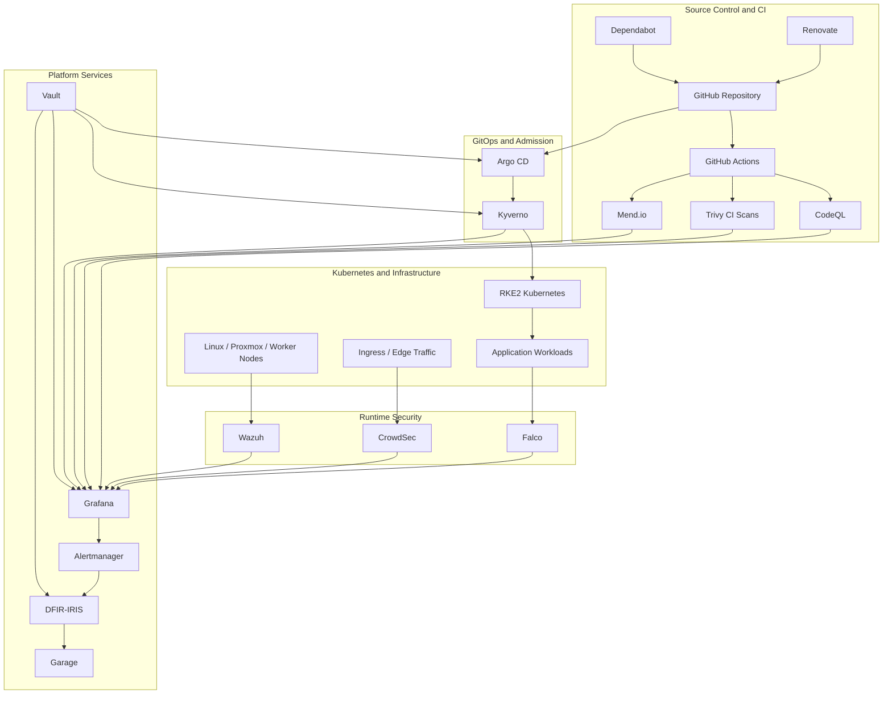
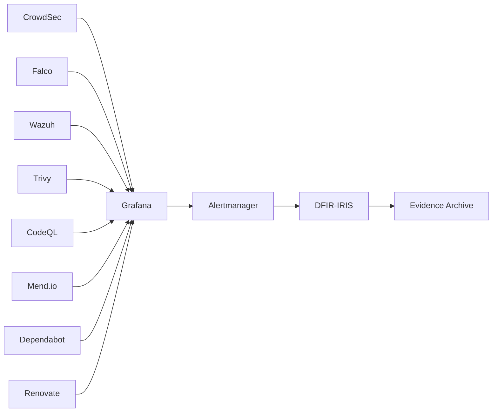
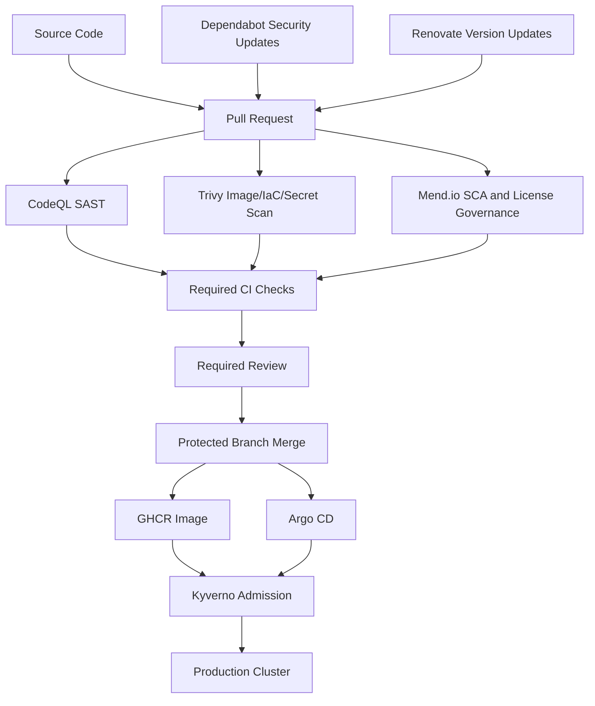
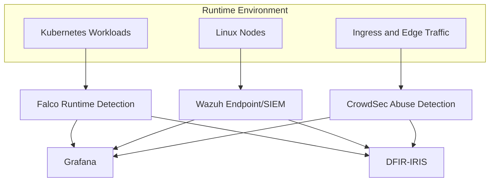
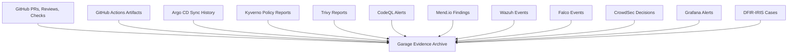
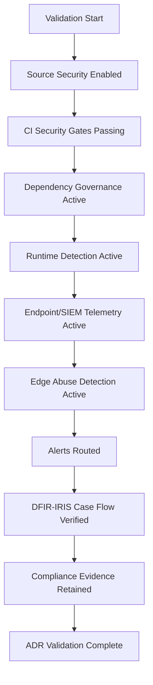

# ADR-0020 — Security and Compliance Operating Model

**ADR:** ADR-0020  
**Title:** Security and Compliance Operating Model with Runtime Detection, Supply Chain Security, Vulnerability Management, and Compliance Evidence  
**Owner:** SinLess Games LLC (Timothy “Andy” Andrew Pierce / sinless777)  
**Status:** ACCEPTED  
**Date Accepted:** 2026-04-25  
**Last Updated:** 2026-04-25  
**Supersedes:** N/A  
**Superseded By:** N/A  

**Related:**

- [Docs/Architecture/DECISIONS.md](../DECISIONS.md)
- [ADR-0001 — Monorepo Source of Truth](./ADR-0001.md)
- [ADR-0003 — Network Segmentation and Planes](./ADR-0003.md)
- [ADR-0007 — GitOps Controller: Argo CD](./ADR-0007.md)
- [ADR-0008 — Progressive Delivery with Istio and Argo Rollouts](./ADR-0008.md)
- [ADR-0009 — Authentik OIDC](./ADR-0009.md)
- [ADR-0011 — Cloudflare Tunnel and Access](./ADR-0011.md)
- [ADR-0012 — Vault Secrets and PKI](./ADR-0012.md)
- [ADR-0014 — Observability and Incident Response Platform](./ADR-0014.md)
- [ADR-0016 — Policy-as-Code Enforcement with Kyverno](./ADR-0016.md)
- [ADR-0017 — GitHub Source Control, CI/CD, and Registry Operating Model](./ADR-0017.md)
- [ADR-0018 — Garage Object Storage Placement and Operating Model](./ADR-0018.md)
- [ADR-0019 — Management Overlay with WireGuard](./ADR-0019.md)

---

## Context

The platform requires a security and compliance operating model that protects
the infrastructure, Kubernetes platform, software supply chain, runtime
workloads, endpoints, logs, and operational evidence.

Security controls must cover:

- source code
- dependencies
- container images
- Kubernetes manifests
- infrastructure as code
- runtime workload behavior
- host and endpoint activity
- ingress and edge abuse
- identity and access
- secrets
- audit events
- incident response
- compliance evidence

The platform uses GitHub as the source control and CI/CD system, Argo CD as the
GitOps controller, Kyverno as the Kubernetes admission policy engine, Vault as
the secret source of truth, and DFIR-IRIS as the incident response management
system.

The accepted security tooling is:

- CrowdSec
- Falco
- Trivy
- Wazuh
- Dependabot
- Renovate
- Mend.io
- CodeQL

The accepted compliance alignment targets are:

- HIPAA
- GDPR
- SOC 2
- SOC 3
- PCI DSS
- NIST SP 800-53
- AICPA Trust Services Criteria
- 50 U.S. Code § 3341

This ADR establishes the required security and compliance operating model.

---

## Decision

Adopt a layered security and compliance operating model using the following
tool responsibilities:

| Tool | Accepted Role |
| --- | --- |
| CrowdSec | Edge, ingress, and abuse detection with remediation decisions |
| Falco | Kubernetes and Linux runtime threat detection |
| Trivy | Vulnerability, misconfiguration, IaC, secret, image, and Kubernetes scanning |
| Wazuh | Endpoint security, SIEM/XDR, file integrity monitoring, log analysis, and compliance evidence |
| Dependabot | GitHub-native vulnerable dependency alerts and security update pull requests |
| Renovate | Scheduled dependency, lockfile, container image, Helm chart, and infrastructure update pull requests |
| Mend.io | Software composition analysis, open source risk, license risk, and application security governance |
| CodeQL | Static application security testing and semantic code scanning |

The security model is enforced through:

- GitHub branch protection
- GitHub Actions security gates
- CodeQL code scanning
- Dependabot alerts and security updates
- Renovate dependency update automation
- Mend.io application and dependency governance
- Trivy scanning
- Kyverno admission policies
- Falco runtime alerts
- Wazuh endpoint and SIEM/XDR telemetry
- CrowdSec behavior-based detection and remediation
- Grafana dashboards and alerts
- DFIR-IRIS incident response cases
- Vault-managed secrets
- Garage-backed evidence and archive workflows where applicable

Compliance evidence is generated from CI, GitOps, admission control, runtime
detection, endpoint telemetry, observability, and incident response systems.

---

## Security Architecture



---

## Scope

This ADR governs:

- security tooling selection
- supply chain security responsibilities
- runtime security responsibilities
- endpoint and SIEM/XDR responsibilities
- vulnerability management responsibilities
- dependency management responsibilities
- compliance evidence responsibilities
- security alert routing
- incident case creation
- security control mapping
- validation requirements
- operational requirements

This ADR does not define:

- every tool manifest
- every detection rule
- every SIEM parser
- every CrowdSec collection
- every Falco rule
- every Wazuh rule
- every Trivy scan command
- every CodeQL query pack
- every Mend.io policy
- every compliance procedure
- every legal obligation
- every audit engagement

Those items are implementation artifacts managed in Git, security
configuration, compliance documentation, and operations runbooks.

---

## Non-Goals

This ADR does not claim:

- HIPAA certification
- GDPR compliance certification
- SOC 2 attestation
- SOC 3 attestation
- PCI DSS attestation
- NIST authorization
- classified system authorization
- eligibility determination under 50 U.S. Code § 3341
- legal sufficiency for regulated data processing
- audit readiness without independent review
- security coverage from tooling alone

Security and compliance require implemented controls, evidence retention,
operational discipline, and formal review when a framework is in scope.

---

## Accepted Security Tooling

### CrowdSec

CrowdSec is used for behavior-based detection and remediation at edge, ingress,
and exposed service boundaries.

CrowdSec responsibilities include:

- detecting malicious IP behavior
- detecting abuse patterns
- detecting brute force patterns
- detecting web attack patterns
- applying remediation decisions through approved bouncers
- contributing security signals into observability
- forwarding incident-grade events into alerting and DFIR-IRIS workflows

CrowdSec must not block internal management traffic without an explicit allow
policy for approved management sources.

---

### Falco

Falco is used for runtime threat detection across Kubernetes and Linux runtime
events.

Falco responsibilities include:

- detecting suspicious container behavior
- detecting suspicious host behavior
- detecting shell execution in containers
- detecting unexpected file access
- detecting privilege escalation attempts
- detecting suspicious Kubernetes activity
- detecting unexpected network tools
- forwarding runtime events to observability and incident workflows

Falco alerts are routed to Grafana, Alertmanager, Wazuh, or DFIR-IRIS according
to severity.

---

### Trivy

Trivy is used for vulnerability and misconfiguration scanning.

Trivy responsibilities include:

- container image vulnerability scanning
- filesystem scanning
- Git repository scanning
- Infrastructure as Code scanning
- Kubernetes manifest scanning
- secret scanning
- SBOM generation where required
- CI security evidence generation

Trivy scans run before production-impacting changes are merged.

Production image promotion requires successful Trivy scan results or an approved
exception.

---

### Wazuh

Wazuh is used as the platform SIEM/XDR and endpoint security system.

Wazuh responsibilities include:

- endpoint telemetry
- host log collection
- file integrity monitoring
- rootkit and malware indicators where supported
- security event correlation
- compliance evidence collection
- vulnerability detection where configured
- alert forwarding to Grafana and DFIR-IRIS
- host-level security monitoring for Proxmox, Kubernetes nodes, and platform VMs

Wazuh agents are deployed to approved hosts and Kubernetes nodes.

---

### Dependabot

Dependabot is used for GitHub-native dependency vulnerability alerts and
security update pull requests.

Dependabot responsibilities include:

- vulnerable dependency alerts
- security update pull requests
- dependency graph integration
- security visibility in GitHub
- evidence for vulnerable dependency remediation

Dependabot security pull requests must pass CI before merge.

---

### Renovate

Renovate is used for scheduled dependency and platform update automation.

Renovate responsibilities include:

- dependency update pull requests
- lockfile update pull requests
- container image tag update pull requests
- GitHub Actions update pull requests
- Terraform provider update pull requests
- Helm chart update pull requests
- Kubernetes dependency update pull requests
- grouped update policies
- dependency dashboard tracking

Renovate changes must pass CI and required review before merge.

---

### Mend.io

Mend.io is used for software composition analysis, open source governance, and
application security risk management.

Mend.io responsibilities include:

- open source dependency risk analysis
- vulnerability prioritization
- license risk detection
- dependency governance
- policy-based application security findings
- remediation workflow evidence

Mend.io findings that impact production are tracked through pull requests,
issues, or DFIR-IRIS cases depending on severity.

---

### CodeQL

CodeQL is used for static application security testing and semantic code
analysis.

CodeQL responsibilities include:

- code scanning
- vulnerability detection
- semantic analysis of supported languages
- pull request security feedback
- security evidence generation
- integration with GitHub security alerts

CodeQL scans run on protected branches and pull requests that affect supported
source code.

---

## Compliance Alignment Targets

The platform aligns security controls and evidence to the following frameworks.

| Framework | Platform Alignment |
| --- | --- |
| HIPAA | Administrative, physical, and technical safeguards for systems that handle regulated health data |
| GDPR | Personal data protection, access control, minimization, retention, auditability, and incident response |
| SOC 2 | Trust Services Criteria control evidence for security, availability, confidentiality, processing integrity, and privacy as scoped |
| SOC 3 | Public-facing summary report readiness based on SOC 2-style control evidence |
| PCI DSS | Technical and operational controls for cardholder-data environments when payment data is in scope |
| NIST SP 800-53 | Security and privacy control catalog alignment for control families and evidence |
| AICPA Trust Services Criteria | Security, availability, processing integrity, confidentiality, and privacy control alignment |
| 50 U.S. Code § 3341 | Personnel access, eligibility, adjudication, and continuous vetting alignment when cleared-access workflows are in scope |

---

## Compliance Boundary

Compliance applies only to systems, environments, data, and workflows that are
declared in scope.

Required compliance scoping fields are:

- environment
- system name
- data classification
- data owner
- control owner
- applicable framework
- applicable control family
- evidence source
- retention requirement
- incident response requirement

Systems that process regulated data must be explicitly classified before
production use.

---

## Control Domains

The platform security model is organized into the following control domains.

| Control Domain | Primary Tools |
| --- | --- |
| Identity and access management | Authentik, Vault, GitHub, Kubernetes RBAC |
| Secret management | Vault, External Secrets, Kyverno |
| Source control governance | GitHub, CODEOWNERS, branch protection |
| CI/CD security | GitHub Actions, Trivy, CodeQL, Mend.io |
| Dependency management | Dependabot, Renovate, Mend.io |
| Vulnerability management | Trivy, Wazuh, Mend.io, Dependabot |
| Container image security | Trivy, GHCR, Kyverno |
| Admission control | Kyverno |
| Runtime threat detection | Falco |
| Endpoint and host security | Wazuh |
| Edge abuse detection | CrowdSec |
| Observability | Grafana, Prometheus, Mimir, Loki |
| Incident response | DFIR-IRIS |
| Evidence retention | GitHub, Grafana, Wazuh, DFIR-IRIS, Garage |
| Backup and recovery | PBS, Velero, Garage |

---

## Security Event Flow



---

## Supply Chain Security Flow



---

## Runtime Security Flow



---

## Compliance Evidence Flow



---

## Security Control Mapping

| Control Requirement | Implemented By | Evidence Source |
| --- | --- | --- |
| Branch protection | GitHub | Repository settings, PR history |
| Required reviews | GitHub CODEOWNERS | Pull request approvals |
| Static code analysis | CodeQL | Code scanning alerts |
| Dependency security alerts | Dependabot | Dependabot alerts and PRs |
| Dependency update automation | Renovate | Renovate PRs and dashboard |
| Open source risk management | Mend.io | SCA reports and findings |
| Container image scanning | Trivy | CI artifacts and scan reports |
| IaC scanning | Trivy, Checkov where configured | CI artifacts |
| Admission policy enforcement | Kyverno | PolicyReports and admission events |
| Runtime threat detection | Falco | Falco alerts and events |
| Endpoint and host monitoring | Wazuh | Wazuh alerts and logs |
| Edge abuse detection | CrowdSec | Decisions, alerts, bouncer actions |
| Secret custody | Vault | Vault audit logs |
| Runtime secret delivery | External Secrets | ExternalSecret status and Kubernetes events |
| Incident management | DFIR-IRIS | Cases, timelines, reports |
| Alerting | Grafana, Alertmanager | Alert history and notifications |
| Evidence archive | Garage | Object inventory and retention records |
| GitOps reconciliation | Argo CD | Sync history and application health |

---

## Compliance Framework Mapping

| Framework | Required Evidence Classes |
| --- | --- |
| HIPAA | access control evidence, audit logs, integrity controls, transmission security, incident records, backup records |
| GDPR | data classification, access control, deletion/retention evidence, incident records, processor records, audit logs |
| SOC 2 | security controls, availability evidence, change management, incident response, logical access, monitoring evidence |
| SOC 3 | public-report support derived from SOC 2-style control evidence |
| PCI DSS | cardholder-data scoping, network segmentation, vulnerability scans, access control, logging, file integrity, incident response |
| NIST SP 800-53 | control family mappings, implementation statements, assessment evidence, continuous monitoring records |
| AICPA TSC | security, availability, processing integrity, confidentiality, and privacy control evidence |
| 50 U.S. Code § 3341 | access eligibility process evidence, access review evidence, continuous vetting alignment records where applicable |

---

## Policy Requirements

### Source Control Requirements

GitHub repositories must enforce:

- protected `main` branch
- required pull requests
- required CI checks
- CODEOWNERS review for production paths
- signed commits where supported
- no force pushes to protected branches
- no direct production-impacting commits
- secret scanning
- CodeQL code scanning
- dependency scanning and update automation

---

### CI/CD Requirements

GitHub Actions workflows must enforce:

- least-privilege workflow permissions
- pinned third-party actions
- no plaintext secrets
- no secrets exposed to untrusted pull requests
- CodeQL scanning
- Trivy scanning
- Mend.io checks where configured
- dependency update validation
- Kubernetes manifest validation
- Terraform validation
- policy validation
- artifact retention for evidence

---

### Dependency Requirements

Dependency management must use:

- Dependabot for security alerts and security updates
- Renovate for scheduled dependency and version update automation
- Mend.io for software composition analysis, open source governance, and license risk

Production dependency updates require:

- CI passing
- review approval
- vulnerability status recorded where security-impacting
- rollback path for breaking changes

---

### Container Image Requirements

Container images must be scanned before production use.

Required controls:

- Trivy image scan
- no critical vulnerabilities without approved exception
- no high vulnerabilities without approved exception or remediation plan
- no mutable tags in production
- no untrusted registries
- image provenance retained through CI artifacts
- image digest recorded where used

---

### Runtime Security Requirements

Runtime security must include:

- Falco for Kubernetes and Linux runtime detection
- Wazuh for endpoint, host, and SIEM/XDR telemetry
- CrowdSec for ingress and abuse detection
- alerts routed through Grafana and Alertmanager
- incident-grade events routed to DFIR-IRIS
- runtime event retention according to evidence policy

---

### Compliance Evidence Requirements

Compliance evidence must include:

- pull request history
- CI status checks
- CI artifacts
- CodeQL scan results
- Dependabot alert history
- Renovate PR history
- Mend.io reports
- Trivy scan reports
- Kyverno PolicyReports
- Argo CD sync history
- Wazuh alert history
- Falco event history
- CrowdSec decision history
- Grafana alert history
- DFIR-IRIS case records
- backup and restore records
- access review records
- exception records

---

## Exception Requirements

Security and compliance exceptions are controlled.

Every exception must include:

- exception ID
- affected system
- affected control
- affected framework where applicable
- business justification
- risk owner
- approval reference
- expiration date
- compensating control
- evidence location

Production exceptions require review before merge.

Expired exceptions are invalid.

Exceptions are tracked as evidence.

---

## Data Classification Requirements

Systems and workloads must be classified before regulated data is processed.

Accepted data classifications are:

```text
public
internal
confidential
restricted
regulated
```

Regulated data includes:

- health data in HIPAA scope
- personal data in GDPR scope
- cardholder data in PCI DSS scope
- audit-sensitive security data
- classified-access process records where applicable

Regulated data requires explicit system scoping, access control, retention,
backup, logging, and incident response handling.

---

## Incident Response Requirements

Security events become DFIR-IRIS cases when they meet incident criteria.

Incident-grade events include:

- confirmed compromise indicator
- active exploitation
- malware detection
- credential exposure
- suspicious privilege escalation
- unauthorized production access
- critical runtime detection
- critical Wazuh alert
- critical Falco alert
- critical CrowdSec edge abuse event
- confirmed vulnerable dependency in production path
- confirmed regulated data exposure
- compliance-impacting outage or control failure

DFIR-IRIS cases must include:

- severity
- owner
- affected systems
- timeline
- evidence
- containment actions
- eradication actions
- recovery actions
- post-incident review
- linked alerts
- linked pull requests where remediation is code-based

---

## Implementation Requirements

### Repository Paths

Security and compliance implementation artifacts are stored under:

```text
.github/
Policy/
Kubernetes/apps/prod/security/
Kubernetes/apps/prod/monitoring/
Docs/Architecture/ADRs/
Docs/Resources/
```

---

### GitHub Security Configuration

GitHub must enable:

- CodeQL
- Dependabot alerts
- Dependabot security updates
- dependency graph
- secret scanning where available
- branch protection
- required status checks
- CODEOWNERS for production paths

---

### Runtime Security Deployment

Runtime security components are deployed through GitOps.

Required production components:

```text
crowdsec
falco
wazuh
```

Security components must include:

- namespace labels
- resource requests
- resource limits
- NetworkPolicies
- ServiceMonitors where applicable
- alert rules
- dashboards
- owner labels
- runbooks

---

### Vulnerability Management

Vulnerability findings are triaged by severity.

Required severity handling:

| Severity | Required Action |
| --- | --- |
| Critical | Block production promotion unless approved exception exists |
| High | Block production promotion unless approved exception exists |
| Medium | Track and remediate through normal workflow |
| Low | Track through normal workflow |
| Informational | Retain as evidence where relevant |

Production exceptions for critical and high findings require explicit approval.

---

### Compliance Evidence Storage

Evidence is retained in systems appropriate to the source.

| Evidence Type | Storage |
| --- | --- |
| Pull requests | GitHub |
| CI artifacts | GitHub Actions artifacts |
| Long-term evidence exports | Garage |
| Security cases | DFIR-IRIS |
| Runtime alerts | Grafana, Wazuh, Loki |
| Admission reports | Kyverno PolicyReports |
| GitOps history | Argo CD |
| Backup evidence | PBS, Velero, Garage |

---

## Validation Requirements

This ADR is valid when the following requirements are met:

- CodeQL scans run on supported source code
- Dependabot alerts are enabled
- Dependabot security updates are enabled
- Renovate creates dependency update pull requests
- Mend.io reports dependency and license risk
- Trivy scans container images in CI
- Trivy scans IaC and manifests in CI
- Kyverno blocks unsafe Kubernetes resources
- Falco reports runtime detections
- Wazuh collects endpoint and host security telemetry
- CrowdSec detects and remediates approved edge abuse scenarios
- Grafana displays security dashboards
- Alertmanager routes security alerts
- DFIR-IRIS receives incident-grade events
- Vault stores security integration credentials
- External Secrets delivers runtime credentials where required
- Garage stores exported evidence where configured
- production-impacting security findings block promotion unless an approved exception exists
- compliance evidence sources are documented
- security exceptions include owner, approval, justification, expiration, and compensating control
- regulated systems have explicit data classification
- regulated systems have access control, logging, backup, and incident response evidence



---

## Rollback Plan

If a security tool causes production instability:

1. identify the affected tool
2. disable only the failing integration or policy path
3. keep remaining security controls active
4. preserve evidence of the failure
5. restore the last known-good configuration through GitOps
6. verify alerts and telemetry after rollback
7. create a DFIR-IRIS case if the instability affects security coverage

If CI security gates block valid production work:

1. identify the failing check
2. inspect the finding
3. confirm whether the finding is valid
4. fix the control failure or create an approved exception
5. rerun CI
6. merge only after required checks pass

If runtime detection creates excessive false positives:

1. identify the rule or scenario
2. preserve sample events
3. tune the rule through Git
4. validate the tuned rule in non-production
5. promote the tuned rule through GitOps
6. verify incident-grade detections remain active

If Wazuh, Falco, CrowdSec, Trivy, CodeQL, Mend.io, Dependabot, or Renovate is
removed permanently, the platform requires:

- a superseding ADR
- migration plan
- compensating control
- evidence migration plan
- rollback plan
- updated validation evidence
- updated operational documentation

---

## Operational Requirements

Security and compliance operation requires:

- security tool ownership
- compliance control ownership
- documented data classification
- CI security gates
- runtime detection
- endpoint security monitoring
- edge abuse detection
- dependency update automation
- vulnerability triage
- incident response workflow
- evidence retention
- exception tracking
- alert routing
- dashboards
- runbooks
- backup and restore evidence
- access reviews
- quarterly security control validation
- production promotion blocking for unresolved critical and high findings