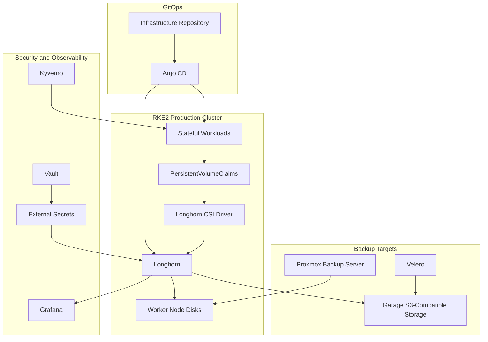
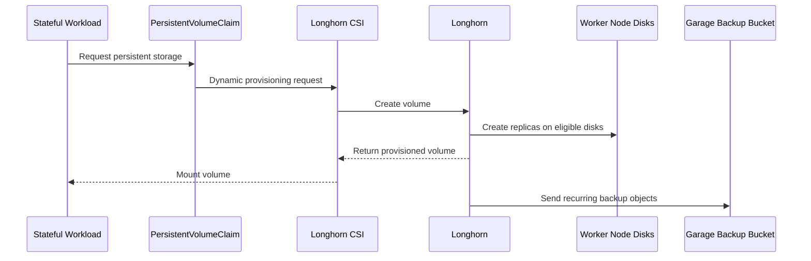
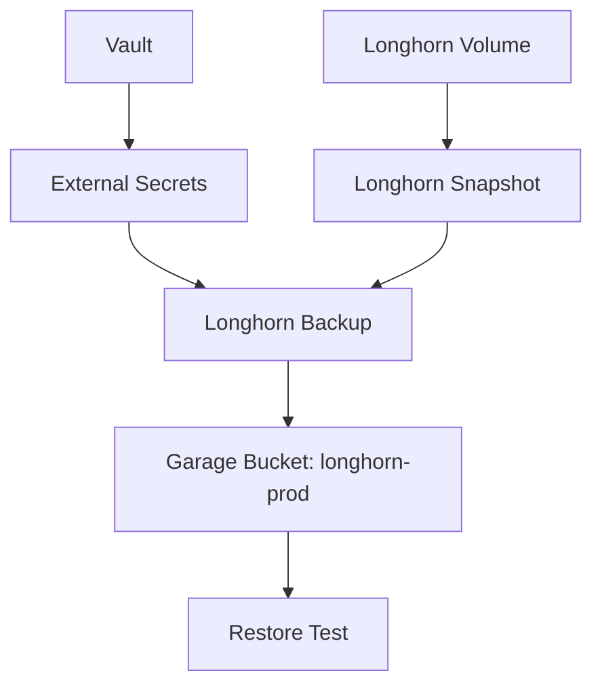
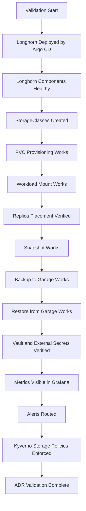

# ADR-0021 — Kubernetes Persistent Storage with Longhorn

**ADR:** ADR-0021  
**Title:** Kubernetes Persistent Storage with Longhorn  
**Owner:** SinLess Games LLC (Timothy “Andy” Andrew Pierce / sinless777)  
**Status:** ACCEPTED  
**Date Accepted:** 2026-04-25  
**Last Updated:** 2026-04-25  
**Supersedes:** N/A  
**Superseded By:** N/A  

**Related:**

- [Docs/Architecture/DECISIONS.md](../DECISIONS.md)
- [ADR-0001 — Monorepo Source of Truth](./ADR-0001.md)
- [ADR-0002 — Proxmox Cluster Topology](./ADR-0002.md)
- [ADR-0005 — Storage Model](./ADR-0005.md)
- [ADR-0006 — Kubernetes Distribution Choice: RKE2](./ADR-0006.md)
- [ADR-0007 — GitOps Controller: Argo CD](./ADR-0007.md)
- [ADR-0013 — Backups and Disaster Recovery with PBS, Velero, and Garage](./ADR-0013.md)
- [ADR-0014 — Observability and Incident Response Platform](./ADR-0014.md)
- [ADR-0016 — Policy-as-Code Enforcement with Kyverno](./ADR-0016.md)
- [ADR-0018 — Garage Object Storage Placement and Operating Model](./ADR-0018.md)
- [ADR-0020 — Security and Compliance Operating Model](./ADR-0020.md)

---

## Context

The RKE2 Kubernetes platform requires persistent storage for stateful workloads.

The platform must support:

- persistent volumes for Kubernetes workloads
- replicated storage across worker nodes
- workload migration between nodes
- volume snapshots
- backup integration
- restore validation
- GitOps-managed storage configuration
- monitoring and alerting
- operational recovery after node or disk failure

The platform does not use Ceph as the Kubernetes persistent storage backend.

Ceph is denied as the Kubernetes storage model in ADR-0005.

The platform requires a Kubernetes-native storage system that can use local disks
across worker nodes while remaining operationally manageable in a homelab and
small production environment.

The platform uses Garage for S3-compatible object storage. Garage is used for
backup targets and object storage workloads. Garage is not the Kubernetes block
storage layer.

The platform uses Proxmox Backup Server for VM and CT backups. PBS protects the
infrastructure layer. PBS does not replace Kubernetes-native persistent volume
management.

The platform uses Velero for Kubernetes backups. Velero complements Longhorn
backup and restore workflows but does not replace the storage backend.

---

## Decision

Adopt **Longhorn** as the Kubernetes persistent storage backend for RKE2.

Longhorn is the accepted default storage platform for Kubernetes persistent
volumes.

Longhorn provides:

- Kubernetes-native persistent volumes
- replicated block storage
- CSI integration
- volume snapshots
- recurring backups
- volume restore workflows
- node and disk scheduling
- storage observability
- operational UI and metrics
- integration with S3-compatible backup targets

Garage is the accepted S3-compatible backend for Longhorn backups.

Longhorn is deployed through Argo CD.

Longhorn configuration is declared in Git.

Longhorn is treated as Tier-1 platform infrastructure because stateful workloads
depend on it.

---

## Storage Architecture



---

## Scope

This ADR governs:

- Longhorn as the Kubernetes persistent storage backend
- Longhorn deployment through GitOps
- Longhorn storage classes
- Longhorn node and disk usage
- Longhorn backup target integration with Garage
- persistent volume backup and restore requirements
- Longhorn observability requirements
- Longhorn operational requirements
- Longhorn validation requirements
- Longhorn rollback requirements

This ADR does not define:

- every Longhorn Helm value
- every workload PVC
- every storage class parameter
- every backup schedule
- every workload-specific restore runbook
- every disk UUID or mount path
- every node-level disk replacement procedure

Those items are implementation artifacts managed in Kubernetes manifests,
inventory, storage documentation, and operational runbooks.

---

## Non-Goals

The accepted Kubernetes persistent storage standard does not include:

- Ceph as the Kubernetes storage backend
- Ceph RBD as the default Kubernetes block storage layer
- CephFS as the default Kubernetes shared filesystem layer
- NFS as the default Kubernetes persistent storage backend
- hostPath as a production storage strategy
- local-path storage for production stateful workloads
- object storage as a replacement for persistent block volumes
- manual PV creation for normal workloads
- unreplicated production volumes by default
- shared storage credentials across workloads

---

## Responsibility Split

| Area | Responsibility |
| --- | --- |
| Kubernetes block storage | Longhorn |
| CSI provisioning | Longhorn CSI |
| Storage orchestration | Longhorn manager and engine components |
| Backup object target | Garage |
| Kubernetes resource backup | Velero |
| Infrastructure VM backup | Proxmox Backup Server |
| Secret custody | Vault |
| Runtime secret delivery | External Secrets |
| GitOps reconciliation | Argo CD |
| Policy enforcement | Kyverno |
| Monitoring and alerting | Grafana, Prometheus, Mimir, Loki |
| Workload ownership | Application manifests and namespace owners |

---

## Accepted Tooling

| Area | Tool |
| --- | --- |
| Kubernetes distribution | RKE2 |
| Persistent storage | Longhorn |
| CSI driver | Longhorn CSI |
| GitOps controller | Argo CD |
| Object storage backup target | Garage |
| Kubernetes backup tool | Velero |
| Infrastructure backup tool | Proxmox Backup Server |
| Secret storage | Vault |
| Runtime secret delivery | External Secrets Operator |
| Policy enforcement | Kyverno |
| Observability | Grafana stack |

---

## Alternatives Considered

### A1) Ceph RBD and CephFS

**Pros:**

- mature distributed storage system
- strong storage feature set
- common in larger infrastructure environments
- supports block and filesystem storage models

**Cons:**

- higher operational complexity
- larger troubleshooting surface
- stronger dependency on storage network design
- harder to operate safely in the target environment
- conflicts with the denied Ceph Kubernetes storage decision

Ceph is rejected as the Kubernetes persistent storage backend.

---

### A2) NFS

**Pros:**

- simple to understand
- easy to expose to multiple nodes
- useful for some shared filesystem workloads

**Cons:**

- single-server failure mode unless separately made highly available
- weaker fit for general Kubernetes block storage
- weaker snapshot and restore model
- can become a performance bottleneck
- does not provide the accepted Kubernetes storage platform model

NFS is rejected as the default Kubernetes persistent storage backend.

---

### A3) Kubernetes local-path Storage

**Pros:**

- simple
- lightweight
- useful for development and temporary workloads

**Cons:**

- node-local failure domain
- poor workload mobility
- no production-grade replication
- unsafe for critical stateful workloads
- unsuitable as the production storage standard

Local-path storage is rejected for production stateful workloads.

---

### A4) hostPath Volumes

**Pros:**

- direct access to node paths
- simple for node-level agents
- useful for specific infrastructure components

**Cons:**

- unsafe as an application storage pattern
- bypasses normal dynamic provisioning
- ties workloads to nodes
- increases security risk
- difficult to back up and restore consistently

hostPath is rejected as a production application storage strategy.

hostPath remains allowed only for approved infrastructure agents that require
node-level access.

---

### A5) Cloud Block Storage

Examples:

- AWS EBS
- GCP Persistent Disk
- Azure Disk

**Pros:**

- managed storage
- strong cloud-provider integration
- useful in cloud-hosted Kubernetes environments

**Cons:**

- not local-first
- creates cloud dependency
- not available as the default storage backend for the local RKE2 cluster
- conflicts with the self-hosted infrastructure model

Cloud block storage is rejected for the local production RKE2 cluster.

---

## Rationale

Longhorn is selected because it provides Kubernetes-native persistent storage
with an operational model that fits the platform.

### Kubernetes-Native Storage

Longhorn integrates with Kubernetes through CSI.

This allows workloads to request storage through standard Kubernetes
PersistentVolumeClaims.

---

### Operational Fit

Longhorn is easier to operate in this environment than a full Ceph storage
fabric for Kubernetes.

The platform requires a manageable storage system that supports:

- node-local disks
- replicated volumes
- snapshots
- backups
- restore testing
- Kubernetes-native operations
- GitOps-managed configuration

---

### Local-First Infrastructure

Longhorn uses local infrastructure storage.

This supports the platform goal of using local compute and storage instead of
depending on cloud block storage.

---

### Backup Integration

Longhorn supports recurring backups to an S3-compatible target.

Garage is the accepted S3-compatible object storage system for Longhorn backup
objects.

This aligns storage backups with the platform object storage decision.

---

### Workload Mobility

Replicated Longhorn volumes allow stateful workloads to survive common node
maintenance and node failure scenarios when replica placement and workload
scheduling are configured correctly.

---

## Deployment Model

Longhorn is deployed into Kubernetes through Argo CD.

Required namespace:

```text
longhorn-system
```

Required GitOps path:

```text
Kubernetes/apps/prod/storage/longhorn
```

Longhorn resources must be managed declaratively.

Longhorn secrets are stored in Vault and delivered through External Secrets.

Longhorn backup target credentials must not be committed to Git.

---

## Storage Flow



---

## Storage Class Requirements

The platform requires explicit Longhorn storage classes.

Required storage classes are:

| StorageClass | Purpose |
| --- | --- |
| `longhorn-replicated` | Default replicated production storage |
| `longhorn-retain` | Production data requiring manual deletion control |
| `longhorn-fast` | Latency-sensitive workloads using approved fast disks |
| `longhorn-backup` | Workloads requiring recurring backup policy defaults |

The default production storage class is:

```text
longhorn-replicated
```

Production workloads must not rely on the cluster default storage class unless
the default is explicitly set to an approved Longhorn storage class.

---

## Replica Requirements

Production Longhorn volumes use replicated storage.

Required production defaults:

| Workload Class | Replica Count |
| --- | --- |
| Critical production data | 3 |
| Standard production data | 2 |
| Non-production data | 1 or 2 |
| Temporary data | 1 |

Critical production data includes:

- databases
- observability backend state where local disk state exists
- application state
- queue data
- configuration stores
- incident response state
- authentication system state

Replica placement must avoid placing all replicas on the same node.

---

## Node and Disk Requirements

Longhorn storage disks must be explicitly prepared and documented.

Each Longhorn storage node must define:

- node name
- Proxmox host
- disk path
- disk purpose
- storage class intent
- capacity
- failure domain
- backup coverage
- monitoring status

Longhorn must not use unmanaged or accidental mount paths.

Longhorn disks must be mounted persistently.

Longhorn disk paths must survive node reboot.

Longhorn disk capacity must be monitored.

---

## Failure Domain Requirements

Longhorn placement must account for node and Proxmox host failure domains.

Required placement controls:

- replica anti-affinity across Kubernetes nodes
- topology-aware workload scheduling where possible
- PodDisruptionBudgets for critical stateful workloads
- workload anti-affinity for replicated applications
- node labels for storage-capable nodes
- node labels for fast-storage-capable nodes
- alerts when replica placement is degraded

Longhorn volumes must not be considered highly available when all replicas are
on one failure domain.

---

## Workload Scheduling Requirements

Stateful workloads using Longhorn must define scheduling controls.

Required workload controls:

- resource requests
- resource limits where appropriate
- readiness probes
- liveness probes where appropriate
- PodDisruptionBudget for critical services
- anti-affinity for replicated workloads
- backup labels
- owner labels
- restore runbook link where applicable

Production workloads must not use Longhorn volumes without ownership labels.

---

## Backup Strategy

Longhorn backups use Garage as the S3-compatible backup target.

Required production bucket:

```text
longhorn-prod
```

Required production credential:

```text
longhorn-prod-writer
```

Required baseline client settings:

```text
provider=aws
region=garage
s3ForcePathStyle=true
```

Longhorn backup credentials are stored in Vault.

External Secrets delivers Longhorn backup credentials into the cluster.

Longhorn backups must not share the Velero access key.

---

## Backup Flow



---

## Snapshot Requirements

Longhorn snapshots are used for short-term rollback.

Snapshots are not a replacement for backups.

Snapshot requirements:

- snapshots must have retention limits
- snapshots must be monitored for capacity growth
- snapshots must not be the only recovery path
- critical data requires backups in addition to snapshots
- restore validation must include backup restore, not only snapshot rollback

---

## Velero Relationship

Velero and Longhorn serve different purposes.

| Area | Longhorn | Velero |
| --- | --- | --- |
| Persistent volume provisioning | Yes | No |
| Volume snapshots | Yes | No, consumes snapshot capabilities where configured |
| Volume backups | Yes | May coordinate or restore depending on configuration |
| Kubernetes resource backups | No | Yes |
| Namespace restore | No | Yes |
| Cluster migration support | Limited to volumes | Yes |
| Backup target | Garage | Garage |

Velero backs up Kubernetes resources.

Longhorn backs up Longhorn volumes.

Both are required.

---

## Proxmox Backup Server Relationship

PBS protects the infrastructure layer.

PBS backs up:

- Kubernetes node VMs where configured
- storage node VMs where applicable
- platform service VMs
- Longhorn-hosting infrastructure where applicable

PBS does not replace Longhorn backups.

Longhorn backup and restore validation remains required.

---

## Security Requirements

### Access Control

Longhorn administrative access is restricted.

Required controls:

- admin UI access restricted to approved operators
- no public exposure of the Longhorn UI
- access through internal network, WireGuard, or approved authenticated ingress
- Kubernetes RBAC for Longhorn administration
- least-privilege service accounts
- no shared backup credentials with other systems

---

### Secret Handling

Longhorn secrets must not be committed to Git.

Sensitive values include:

- Garage access key ID
- Garage secret access key
- backup target credentials
- webhook URLs
- admin credentials
- TLS private keys

Secrets are stored in Vault and delivered through External Secrets.

---

### Network Security

Longhorn internal services remain internal-only.

NetworkPolicies must restrict Longhorn access to approved namespaces and
components.

The Longhorn UI must not be exposed directly to the public internet.

Backup traffic to Garage must use approved internal endpoints.

---

### Policy Enforcement

Kyverno enforces workload and storage safety controls.

Required policy controls:

- production PVCs must use approved storage classes
- production workloads must not use hostPath for application data
- production workloads must not use local-path storage
- production workloads must include ownership labels
- critical production workloads must include backup labels
- stateful production workloads must define resource requests
- stateful production workloads must define readiness probes
- sensitive namespaces must include NetworkPolicies

---

## Observability Requirements

Longhorn must be monitored through the platform observability stack.

Required metrics and alerts:

- Longhorn manager availability
- Longhorn CSI availability
- volume health
- degraded volume count
- faulted volume count
- replica scheduling failures
- disk pressure
- disk unavailable
- storage capacity
- snapshot growth
- backup success
- backup failure
- stale backups
- restore failure
- node storage health
- recurring job failures

Grafana dashboards must display:

- total Longhorn capacity
- used Longhorn capacity
- free Longhorn capacity
- volume health
- replica health
- node disk usage
- backup status
- snapshot status
- degraded volumes
- faulted volumes

---

## Implementation Requirements

### GitOps Deployment

Longhorn is deployed through Argo CD.

Required deployment order:

| Wave | Resource |
| --- | --- |
| `-10` | `longhorn-system` namespace |
| `-5` | ExternalSecret references |
| `0` | Longhorn Helm chart or manifests |
| `1` | Longhorn settings |
| `2` | Longhorn storage classes |
| `3` | Recurring job definitions |
| `4` | ServiceMonitor and alert rules |
| `5` | workload PVC adoption |

---

### Kubernetes Labels

Longhorn resources must include:

```text
app.kubernetes.io/name=longhorn
app.kubernetes.io/part-of=platform-storage
app.kubernetes.io/component=persistent-storage
app.kubernetes.io/managed-by=argocd
storage.sinlessgames.io/backend=longhorn
```

Storage classes must include:

```text
storage.sinlessgames.io/backend=longhorn
storage.sinlessgames.io/tier=<standard|fast|backup|retain>
```

---

### Node Labels

Storage-capable Kubernetes nodes must be labeled.

Required labels:

```text
storage.sinlessgames.io/longhorn=true
```

Fast-storage-capable nodes use:

```text
storage.sinlessgames.io/fast=true
```

Nodes that must not schedule Longhorn replicas use:

```text
storage.sinlessgames.io/longhorn=false
```

---

### Backup Labels

Workloads requiring Longhorn backups must include:

```text
backup.sinlessgames.io/enabled=true
backup.sinlessgames.io/system=longhorn
```

Critical workloads must include:

```text
backup.sinlessgames.io/criticality=critical
```

---

## Validation Requirements

This ADR is valid when the following requirements are met:

- Longhorn is deployed by Argo CD
- `longhorn-system` namespace exists
- Longhorn manager pods are healthy
- Longhorn CSI components are healthy
- Longhorn storage classes exist
- default production storage class is an approved Longhorn storage class
- Longhorn can dynamically provision a PVC
- a workload can mount a Longhorn PVC
- a workload can restart and remount the same volume
- volume replicas are scheduled across approved storage nodes
- replica placement does not place all replicas on one failure domain
- Longhorn snapshots work
- Longhorn backups write to Garage
- Longhorn backups read from Garage
- Longhorn restore from Garage succeeds
- Longhorn backup credentials are stored in Vault
- External Secrets delivers Longhorn backup credentials
- Longhorn metrics are visible in Grafana
- Longhorn alerts route to configured receivers
- degraded volume alerts fire
- backup failure alerts fire
- production workloads do not use local-path storage
- production workloads do not use hostPath for application data
- Argo CD reports Longhorn resources as healthy



---

## Rollback Plan

If Longhorn deployment fails:

1. stop onboarding new stateful workloads
2. inspect Longhorn namespace and controller health
3. inspect CSI pods
4. inspect storage class definitions
5. inspect node disk configuration
6. restore the last known-good Longhorn configuration through GitOps
7. verify PVC provisioning
8. verify volume mount behavior
9. verify backup target connectivity

If a Longhorn volume becomes degraded:

1. identify the affected volume
2. identify missing or failed replicas
3. inspect node and disk health
4. repair or rebuild the replica
5. verify workload health
6. verify backup freshness
7. preserve incident evidence when production data is affected

If a Longhorn volume becomes faulted:

1. stop writes from affected workloads if required
2. preserve current volume state
3. identify the last valid snapshot or backup
4. restore from Longhorn backup where required
5. validate application consistency
6. document the recovery event
7. create a DFIR-IRIS or operations incident case when production impact occurs

If Garage backup target access fails:

1. verify Garage API availability
2. verify the `longhorn-prod` bucket
3. verify the `longhorn-prod-writer` credential
4. verify External Secrets delivery
5. verify Longhorn backup target settings
6. perform a test backup
7. perform a test restore

If Longhorn causes unacceptable platform instability:

1. freeze new production PVC creation
2. keep existing stable workloads running
3. restore Longhorn to the last known-good configuration
4. validate existing volume health
5. validate backup availability
6. continue production operation only after validation requirements pass

A permanent migration away from Longhorn requires:

- a superseding ADR
- migration plan
- rollback plan
- workload volume migration procedure
- backup migration procedure
- restore validation evidence
- updated implementation documentation
- updated runbooks

---

## Operational Requirements

Longhorn production operation requires:

- GitOps-managed deployment
- approved storage classes
- explicit node and disk inventory
- persistent disk mount configuration
- replica placement across failure domains
- resource requests
- resource limits
- PodDisruptionBudgets where applicable
- Vault-managed backup credentials
- Garage-backed recurring backups
- snapshot retention controls
- backup retention controls
- restore procedures
- restore validation
- Grafana dashboards
- alert rules
- capacity planning
- degraded-volume response procedure
- disk replacement procedure
- node maintenance procedure
- workload migration procedure
- Kyverno storage policy enforcement
- Argo CD health reporting