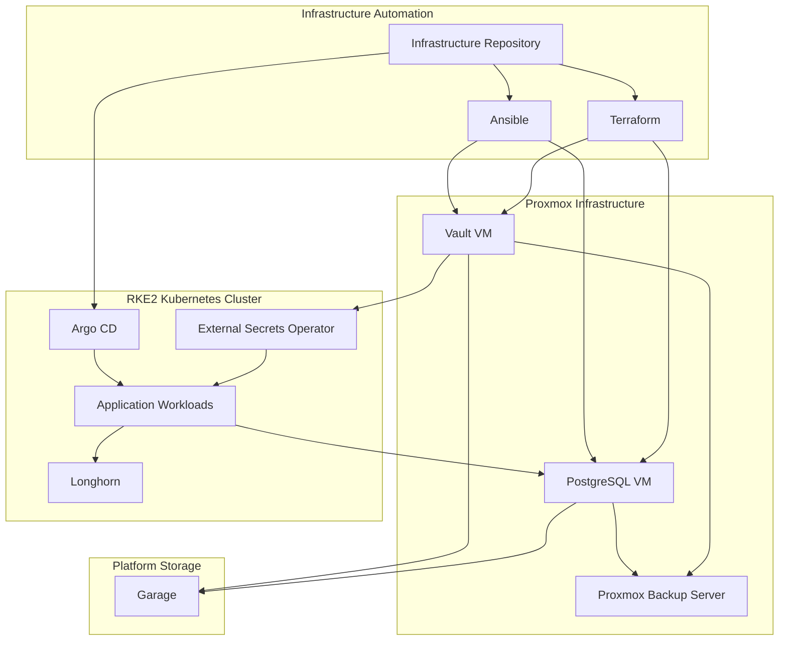
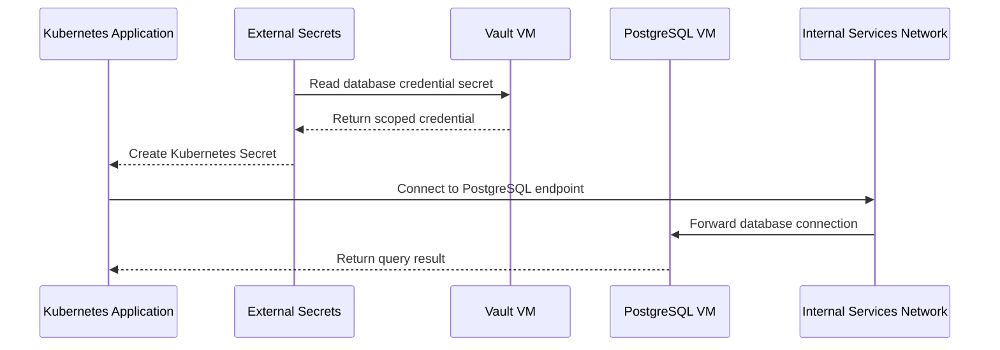
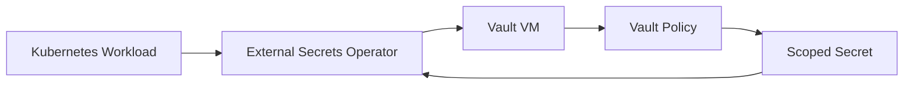
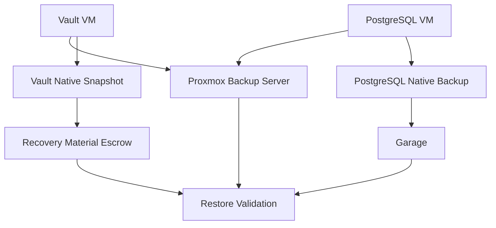
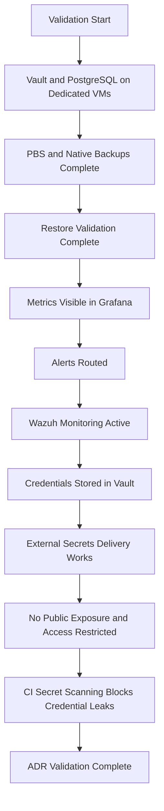

# ADR-0022 — Database and Stateful Platform Service Placement

**ADR:** ADR-0022  
**Title:** Database and Stateful Platform Service Placement and Operating Model  
**Owner:** SinLess Games LLC (Timothy “Andy” Andrew Pierce / sinless777)  
**Status:** ACCEPTED  
**Date Accepted:** 2026-04-25  
**Last Updated:** 2026-04-25  
**Supersedes:** N/A  
**Superseded By:** N/A  

**Related:**

- [Docs/Architecture/DECISIONS.md](../DECISIONS.md)
- [ADR-0001 — Monorepo Source of Truth](./ADR-0001.md)
- [ADR-0002 — Proxmox Cluster Topology](./ADR-0002.md)
- [ADR-0003 — Network Segmentation and Planes](./ADR-0003.md)
- [ADR-0006 — Kubernetes Distribution Choice: RKE2](./ADR-0006.md)
- [ADR-0007 — GitOps Controller: Argo CD](./ADR-0007.md)
- [ADR-0012 — Vault Secrets and PKI](./ADR-0012.md)
- [ADR-0013 — Backups and Disaster Recovery with PBS, Velero, and Garage](./ADR-0013.md)
- [ADR-0014 — Observability and Incident Response Platform](./ADR-0014.md)
- [ADR-0016 — Policy-as-Code Enforcement with Kyverno](./ADR-0016.md)
- [ADR-0018 — Garage Object Storage Placement and Operating Model](./ADR-0018.md)
- [ADR-0021 — Kubernetes Persistent Storage with Longhorn](./ADR-0021.md)

---

## Context

The platform requires persistent state for infrastructure services,
applications, identity systems, observability systems, automation workflows, and
security tooling.

Stateful systems require stricter operational controls than stateless
Kubernetes workloads.

The platform must define where stateful services run so that backup, recovery,
monitoring, access control, and lifecycle operations are predictable.

The platform uses:

- Proxmox for virtual machine hosting
- RKE2 for Kubernetes workloads
- Longhorn for Kubernetes persistent volumes
- Garage for S3-compatible object storage
- Proxmox Backup Server for VM and CT backups
- Velero for Kubernetes resource backups
- Vault for secret custody and PKI
- PostgreSQL for relational database workloads

The platform decision is that **Vault and PostgreSQL run on virtual machines**.

Vault and PostgreSQL are treated as Tier-0 and Tier-1 stateful platform services
because other services depend on their availability, integrity, and recovery
paths.

---

## Decision

Run **Vault** and **PostgreSQL** on dedicated Proxmox virtual machines.

Vault is not deployed as a Kubernetes workload.

PostgreSQL is not deployed as a Kubernetes workload for the platform database
layer.

Kubernetes applications connect to PostgreSQL over the internal services network
using controlled credentials from Vault and External Secrets.

Kubernetes applications connect to Vault using approved authentication methods
and network paths.

The platform uses the following placement model:

| Service Class | Placement | Storage Protection | Backup System |
| --- | --- | --- | --- |
| Vault | Proxmox VM | VM disk storage with controlled placement | PBS + Vault-native snapshots |
| PostgreSQL | Proxmox VM | VM disk storage with controlled placement | PBS + PostgreSQL-native backups |
| Kubernetes application state | Kubernetes | Longhorn persistent volumes | Longhorn backups + Velero |
| Object storage | Kubernetes or VM according to Garage implementation | Garage storage volumes | PBS + Garage recovery workflow |
| Ephemeral application workloads | Kubernetes | None or temporary volumes | Redeploy from GitOps |

Vault and PostgreSQL VM configuration is managed with Terraform and Ansible.

Kubernetes consumers are managed with Argo CD.

Secrets are stored in Vault and delivered into Kubernetes through External
Secrets.

---

## Placement Architecture



---

## Scope

This ADR governs:

- Vault placement on Proxmox VMs
- PostgreSQL placement on Proxmox VMs
- the boundary between VM-hosted stateful platform services and Kubernetes workloads
- database access from Kubernetes workloads
- backup requirements for VM-hosted stateful services
- monitoring requirements for VM-hosted stateful services
- security requirements for Vault and PostgreSQL
- validation requirements for the placement model
- rollback requirements for the placement model

This ADR does not define:

- every PostgreSQL database
- every PostgreSQL schema
- every PostgreSQL user
- every Vault policy
- every Vault auth method
- every VM CPU and memory size
- every disk layout
- every PostgreSQL tuning value
- every application database migration procedure
- every restore command

Those items are implementation artifacts managed in Terraform, Ansible,
Kubernetes manifests, Vault policy definitions, database runbooks, and
operations documentation.

---

## Non-Goals

The accepted database placement standard does not include:

- Vault running inside Kubernetes
- platform PostgreSQL running inside Kubernetes
- PostgreSQL managed by a Kubernetes operator for the platform database layer
- application teams manually creating production databases outside the approved process
- direct public access to PostgreSQL
- direct public access to Vault administrative endpoints
- plaintext database credentials in Git
- shared PostgreSQL credentials across unrelated applications
- unbacked production databases
- unmonitored production databases
- untested database restore procedures

---

## Responsibility Split

| Area | Responsibility |
| --- | --- |
| Vault runtime | Dedicated Proxmox VM |
| PostgreSQL runtime | Dedicated Proxmox VM |
| VM provisioning | Terraform |
| VM configuration | Ansible |
| Kubernetes workload deployment | Argo CD |
| Kubernetes persistent volumes | Longhorn |
| Kubernetes resource backup | Velero |
| VM backup | Proxmox Backup Server |
| Vault secret custody | Vault |
| Kubernetes secret delivery | External Secrets |
| PostgreSQL backup | PostgreSQL-native backups + PBS |
| Vault backup | Vault-native snapshots + PBS |
| Object backup target | Garage |
| Monitoring | Grafana, Prometheus, Mimir, Loki, Wazuh |
| Policy enforcement | Kyverno and CI gates |

---

## Accepted Tooling

| Area | Tool |
| --- | --- |
| Hypervisor | Proxmox |
| VM provisioning | Terraform |
| VM configuration | Ansible |
| Secret management | Vault |
| Relational database | PostgreSQL |
| VM backup | Proxmox Backup Server |
| Kubernetes backup | Velero |
| Object storage | Garage |
| Kubernetes storage | Longhorn |
| GitOps | Argo CD |
| Runtime secrets | External Secrets Operator |
| Monitoring | Grafana stack |
| Endpoint security | Wazuh |

---

## Alternatives Considered

### A1) Run Vault in Kubernetes

**Pros:**

- Kubernetes-native deployment model
- GitOps-managed manifests
- service discovery inside the cluster
- easier integration with Kubernetes workloads

**Cons:**

- creates dependency on Kubernetes availability for secret recovery
- complicates cluster disaster recovery
- risks circular dependency between Kubernetes, Vault, and External Secrets
- increases blast radius during Kubernetes control plane incidents
- places a Tier-0 security service inside the platform it protects

Vault in Kubernetes is rejected.

Vault runs on dedicated Proxmox VMs.

---

### A2) Run PostgreSQL in Kubernetes

**Pros:**

- Kubernetes-native deployment model
- GitOps-managed manifests
- integration with Longhorn persistent volumes
- possible operator-based lifecycle management

**Cons:**

- increases dependence on Kubernetes storage stability
- complicates database recovery during cluster incidents
- couples platform database availability to Kubernetes availability
- increases operational complexity for critical relational data
- makes cluster rebuilds depend on in-cluster database recovery

PostgreSQL in Kubernetes is rejected for the platform database layer.

PostgreSQL runs on dedicated Proxmox VMs.

---

### A3) Use SQLite or Embedded Databases for Platform Services

**Pros:**

- simple deployment
- low operational overhead
- useful for small single-node applications

**Cons:**

- weak fit for multi-service production use
- limited concurrency for platform workloads
- weaker backup and migration model
- inconsistent operational behavior across services

Embedded databases are rejected for shared platform database services.

---

### A4) Use Cloud-Hosted Databases

**Pros:**

- managed backups
- managed patching
- managed high availability
- reduced local operations

**Cons:**

- external dependency
- recurring cost
- WAN dependency
- data residency concerns
- conflicts with local-first infrastructure model

Cloud-hosted databases are rejected for the local production platform database
layer.

---

### A5) Run One Database per Kubernetes Application

**Pros:**

- strong application isolation
- independent lifecycle per application
- clear ownership

**Cons:**

- operational sprawl
- many backup workflows
- many credentials
- harder capacity planning
- harder monitoring standardization

Per-application database instances are not the default platform model.

Application databases are created on the VM-hosted PostgreSQL platform unless a
separate ADR approves a different model.

---

## Rationale

Vault and PostgreSQL are placed on VMs because they are foundational stateful
services with strict recovery requirements.

### Reduced Circular Dependencies

Vault is required by Kubernetes workloads, External Secrets, Argo CD
integrations, database credentials, object storage credentials, and automation.

Placing Vault outside Kubernetes prevents Kubernetes recovery from depending on
an unavailable in-cluster Vault.

---

### Stable Database Operations

PostgreSQL is a core relational database service.

Running PostgreSQL on a VM gives the platform:

- predictable disk placement
- direct VM backup through PBS
- database-native backup control
- clear recovery procedures
- reduced dependence on Kubernetes storage during cluster failure
- operational separation between application compute and database state

---

### Clear Failure Boundaries

VM-hosted Vault and PostgreSQL separate critical control-plane state from
Kubernetes application state.

A Kubernetes incident must not automatically imply loss of Vault or PostgreSQL.

A PostgreSQL incident must not require Kubernetes control plane recovery before
database recovery can begin.

---

### Backup Alignment

Vault and PostgreSQL use both infrastructure-level and application-native
backups.

PBS provides VM-level recovery.

Vault snapshots provide Vault logical recovery.

PostgreSQL-native backups provide database-level recovery.

Garage stores backup artifacts where applicable.

---

### Security Boundary

Vault and PostgreSQL require restricted access, explicit firewall controls, and
least-privilege credentials.

VM placement supports a clear management and services network boundary.

Kubernetes workloads access these services through controlled internal routes
and Vault-managed credentials.

---

## Database Access Model

Kubernetes workloads access PostgreSQL through internal service networking.



PostgreSQL credentials are:

- scoped per application
- stored in Vault
- delivered through External Secrets
- rotated through approved procedures
- not committed to Git

Applications must not use shared database superuser credentials.

---

## Vault Access Model

Kubernetes workloads access Vault through approved authentication methods.



Vault access is controlled by:

- Vault policies
- Kubernetes authentication where configured
- AppRole where configured
- network policy
- firewall policy
- audit logging
- least privilege

Vault administrative access is restricted to approved operators.

---

## VM Placement Requirements

Vault and PostgreSQL run on dedicated VMs.

Required VM classes:

| Service | VM Class | Criticality |
| --- | --- | --- |
| Vault | security-control-plane | Tier-0 |
| PostgreSQL | platform-database | Tier-1 |

VM placement must account for:

- Proxmox host failure domains
- storage performance
- backup coverage
- management access
- network segmentation
- monitoring access
- recovery priority

Vault and PostgreSQL VMs must not be treated as disposable nodes.

---

## Network Requirements

Vault and PostgreSQL are internal-only services.

Required access controls:

- no direct public exposure
- no public database port exposure
- no public Vault administrative exposure
- access through internal VLANs
- administrative access through WireGuard or local management network
- firewall-restricted service ports
- Kubernetes workload access only from approved namespaces and service accounts
- logging of denied access where available

PostgreSQL listens only on approved internal interfaces.

Vault listens only on approved internal interfaces and approved ingress paths.

---

## PostgreSQL Requirements

PostgreSQL is the platform relational database service.

PostgreSQL requirements:

- dedicated VM runtime
- persistent VM disk storage
- PBS VM backup coverage
- PostgreSQL-native backup coverage
- monitored disk usage
- monitored connection count
- monitored replication status when replication is configured
- monitored query latency
- monitored backup freshness
- restricted superuser access
- per-application database users
- per-application databases or schemas
- TLS for database connections where configured
- firewall-restricted access
- documented restore procedure
- restore validation

PostgreSQL production credentials are stored in Vault.

---

## Vault Requirements

Vault is the platform secret management and PKI service.

Vault requirements:

- dedicated VM runtime
- persistent VM disk storage
- PBS VM backup coverage
- Vault-native snapshot coverage
- sealed and unsealed state monitoring
- audit logging enabled
- restricted administrative access
- recovery keys protected
- unseal material protected
- root token access restricted
- policy definitions managed as code where practical
- auth methods documented
- secret engines documented
- PKI material protected
- restore procedure documented
- restore validation

Vault recovery material must not be stored only in Garage.

---

## Backup Requirements

Vault and PostgreSQL require layered backups.

| System | Required Backup Layers |
| --- | --- |
| Vault | PBS VM backup, Vault-native snapshot, recovery material escrow |
| PostgreSQL | PBS VM backup, PostgreSQL-native logical or physical backup |
| Kubernetes workloads | Velero, Longhorn backups |
| Backup objects | Garage, off-cluster critical copy where required |

Backup artifacts must include:

- backup timestamp
- system name
- backup type
- retention class
- restore procedure reference
- validation status

Backup credentials are stored in Vault.

PostgreSQL backup artifacts may be written to Garage.

Vault recovery material must also exist outside Garage to avoid circular
dependency.

---

## Backup Flow



---

## Security Requirements

### Access Control

Vault and PostgreSQL administrative access is restricted.

Required controls:

- operator access through WireGuard or local management network
- no public administrative exposure
- named administrator accounts
- no shared admin credentials
- least privilege database roles
- least privilege Vault policies
- per-application database credentials
- per-service Vault policies
- audited administrative access

---

### Secret Handling

Secrets must not be committed to Git.

Sensitive values include:

- PostgreSQL superuser password
- PostgreSQL application passwords
- PostgreSQL replication credentials
- PostgreSQL backup credentials
- Vault root token
- Vault unseal keys
- Vault recovery keys
- Vault AppRole secret IDs
- Vault tokens
- Vault PKI private keys
- backup encryption keys
- webhook URLs

Secrets are stored in Vault or approved break-glass custody.

Vault recovery material must be stored with stronger controls than normal
application secrets.

---

### Network Security

Vault and PostgreSQL traffic is restricted by firewall and network policy.

Required controls:

- PostgreSQL port exposed only to approved internal clients
- Vault port exposed only to approved internal clients
- administrative access restricted
- denied connection attempts logged where available
- Kubernetes namespaces restricted by network policy where applicable
- no direct public inbound access
- no broad allow from all pod CIDRs unless explicitly approved

---

### Database Credential Controls

PostgreSQL credentials are scoped.

Required controls:

- one credential set per application or service
- no shared production application database user
- no application use of superuser credentials
- no default passwords
- credential rotation procedure
- disabled or removed unused credentials
- least-privilege grants
- TLS where configured

---

## Observability Requirements

Vault and PostgreSQL are monitored through the platform observability stack.

### Vault Metrics and Alerts

Required Vault alerts:

- Vault sealed
- Vault unavailable
- Vault leadership change where clustered
- audit log failure
- high token creation failure rate
- high secret read failure rate
- certificate expiration
- snapshot failure
- storage backend error
- abnormal authentication failure spike

Required Vault dashboards:

- service health
- sealed status
- request rate
- error rate
- auth failures
- token activity
- PKI certificate status
- snapshot status
- audit status

---

### PostgreSQL Metrics and Alerts

Required PostgreSQL alerts:

- PostgreSQL unavailable
- high connection usage
- disk pressure
- replication lag where replication exists
- backup failure
- stale backup
- high query latency
- lock contention
- transaction wraparound risk
- authentication failure spike
- database restart

Required PostgreSQL dashboards:

- service health
- connections
- query latency
- transactions
- locks
- database size
- disk usage
- backup status
- replication status where applicable

---

## Policy Requirements

Kyverno enforces Kubernetes-side controls for workloads that consume Vault and
PostgreSQL.

Required controls:

- applications must not include plaintext database credentials
- applications must use ExternalSecret references for database credentials
- applications must include ownership labels
- applications must include runbook labels when production database access exists
- production applications must include resource requests
- production applications must include readiness probes
- NetworkPolicies must restrict access to database-consuming workloads
- production deployments must not mount broad secret sets

CI enforces repository-side controls.

Required CI controls:

- secret scanning
- YAML validation
- ExternalSecret validation
- Kubernetes manifest validation
- policy validation
- Terraform validation for VM changes
- Ansible syntax validation for VM configuration

---

## Implementation Requirements

### Provisioning

Vault and PostgreSQL VMs are provisioned with Terraform.

Required Terraform outputs include:

- VM name
- VM ID
- IP address
- DNS name
- Proxmox host
- CPU
- memory
- disk layout
- backup inclusion
- network placement

---

### Configuration

Vault and PostgreSQL VMs are configured with Ansible.

Required Ansible responsibilities:

- package installation
- service configuration
- firewall configuration
- user configuration
- TLS configuration where applicable
- backup job configuration
- monitoring agent configuration
- Wazuh agent configuration
- log forwarding configuration
- hardening baseline

---

### DNS Naming

Required DNS names:

```text
vault.local.sinlessgamesllc.com
postgres.local.sinlessgamesllc.com
```

Service aliases may be created for application-specific database endpoints.

---

### Kubernetes Integration

Kubernetes applications receive database credentials through External Secrets.

Required Kubernetes resources:

- ExternalSecret for database credentials
- SecretStore or ClusterSecretStore as approved
- NetworkPolicy allowing only required egress
- application deployment references to generated secrets
- owner labels
- backup labels for stateful consumers
- runbook annotation for production database users

---

### PostgreSQL Database Provisioning

Production databases are provisioned through approved automation.

Each database record must include:

- database name
- owning application
- owning namespace
- owner
- environment
- backup requirement
- retention requirement
- credential name
- access scope
- restore requirement

---

### Vault Policy Management

Vault policies are managed as code where practical.

Each policy record must include:

- policy name
- owning service
- access path
- allowed capabilities
- environment
- owner
- review requirement

---

## Validation Requirements

This ADR is valid when the following requirements are met:

- Vault runs on a dedicated Proxmox VM
- PostgreSQL runs on a dedicated Proxmox VM
- Vault is not deployed as a Kubernetes workload
- PostgreSQL platform database is not deployed as a Kubernetes workload
- Vault VM is backed up by PBS
- PostgreSQL VM is backed up by PBS
- Vault native snapshot completes successfully
- PostgreSQL native backup completes successfully
- Vault restore validation completes successfully
- PostgreSQL restore validation completes successfully
- Vault metrics are visible in Grafana
- PostgreSQL metrics are visible in Grafana
- Vault alerts route to configured receivers
- PostgreSQL alerts route to configured receivers
- Wazuh monitors the Vault VM
- Wazuh monitors the PostgreSQL VM
- Kubernetes applications use External Secrets for database credentials
- PostgreSQL credentials are stored in Vault
- Vault administrative access is restricted
- PostgreSQL administrative access is restricted
- PostgreSQL is not publicly exposed
- Vault administrative endpoints are not publicly exposed
- database access is restricted to approved clients
- secret scanning blocks committed database credentials
- Argo CD reports consuming Kubernetes applications as healthy



---

## Rollback Plan

If Vault VM deployment fails:

1. stop onboarding new secret consumers
2. inspect the Vault VM
3. inspect Vault service status
4. inspect storage and seal state
5. restore the last known-good Vault VM state from PBS if required
6. restore Vault snapshot if logical recovery is required
7. verify audit logging
8. verify External Secrets can read required paths
9. verify application secret delivery

If PostgreSQL VM deployment fails:

1. stop onboarding new database consumers
2. inspect the PostgreSQL VM
3. inspect PostgreSQL service status
4. inspect disk health
5. restore the last known-good VM state from PBS if required
6. restore PostgreSQL-native backup if logical recovery is required
7. verify database connectivity
8. verify application credentials
9. verify application health

If Kubernetes applications cannot reach PostgreSQL:

1. verify PostgreSQL service health
2. verify DNS resolution
3. verify firewall rules
4. verify network routing
5. verify Kubernetes NetworkPolicies
6. verify External Secrets delivery
7. verify database credentials
8. verify application configuration

If Kubernetes applications cannot reach Vault:

1. verify Vault service health
2. verify Vault seal status
3. verify DNS resolution
4. verify firewall rules
5. verify authentication method health
6. verify External Secrets status
7. verify Vault policy access
8. verify application secret refresh

If PostgreSQL must be migrated away from VMs, the platform requires:

- a superseding ADR
- migration plan
- rollback plan
- data migration procedure
- credential migration procedure
- application cutover procedure
- backup validation evidence
- restore validation evidence
- updated implementation documentation
- updated runbooks

If Vault must be migrated away from VMs, the platform requires:

- a superseding ADR
- migration plan
- rollback plan
- seal and unseal migration procedure
- policy migration procedure
- secret engine migration procedure
- PKI migration procedure
- backup validation evidence
- restore validation evidence
- updated implementation documentation
- updated runbooks

---

## Operational Requirements

Vault VM production operation requires:

- dedicated VM
- PBS backup
- Vault-native snapshot
- recovery material custody
- restricted administrative access
- audit logging
- monitoring dashboards
- alert rules
- Wazuh agent
- firewall rules
- DNS record
- restore procedure
- restore validation
- unseal procedure
- credential rotation procedure
- policy review procedure

PostgreSQL VM production operation requires:

- dedicated VM
- PBS backup
- PostgreSQL-native backup
- restricted administrative access
- monitoring dashboards
- alert rules
- Wazuh agent
- firewall rules
- DNS record
- restore procedure
- restore validation
- credential rotation procedure
- database provisioning procedure
- database migration procedure
- capacity planning
- query performance monitoring

Kubernetes database consumers require:

- ExternalSecret-managed credentials
- least-privilege database user
- NetworkPolicy
- owner labels
- runbook annotation
- resource requests
- readiness probes
- documented restore dependency