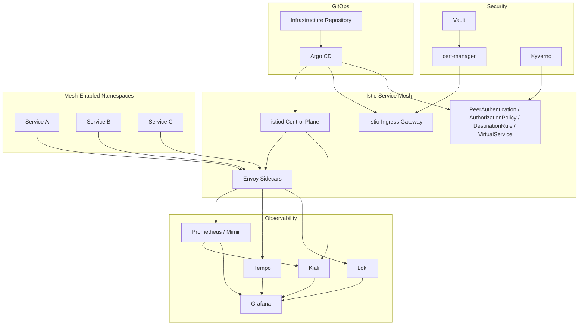
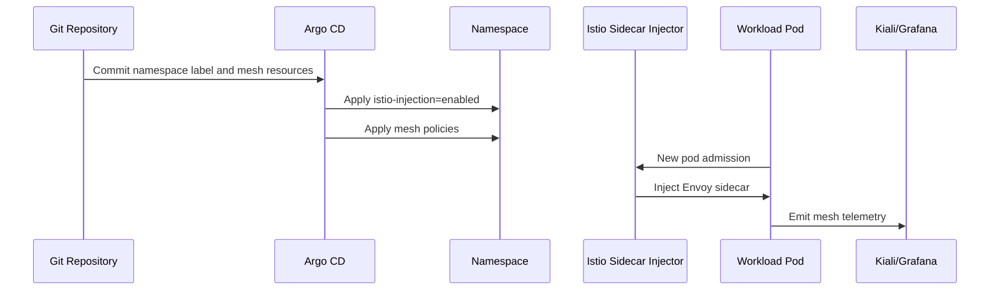
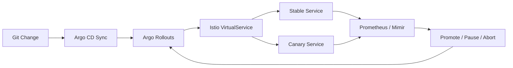
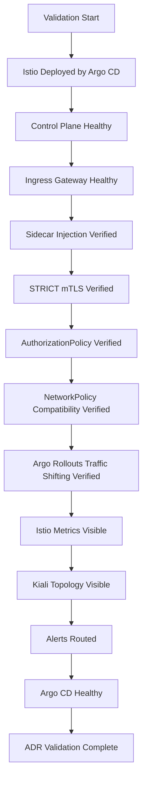

# ADR-0023 — Istio Service Mesh Operating Model

**ADR:** ADR-0023  
**Title:** Istio Service Mesh Operating Model for Zero-Trust Service Networking  
**Owner:** SinLess Games LLC (Timothy “Andy” Andrew Pierce / sinless777)  
**Status:** ACCEPTED  
**Date Accepted:** 2026-04-25  
**Last Updated:** 2026-04-25  
**Supersedes:** N/A  
**Superseded By:** N/A  

**Related:**

- [Docs/Architecture/DECISIONS.md](../DECISIONS.md)
- [ADR-0001 — Monorepo Source of Truth](./ADR-0001.md)
- [ADR-0003 — Network Segmentation and Planes](./ADR-0003.md)
- [ADR-0006 — Kubernetes Distribution Choice: RKE2](./ADR-0006.md)
- [ADR-0007 — GitOps Controller: Argo CD](./ADR-0007.md)
- [ADR-0008 — Progressive Delivery with Istio and Argo Rollouts](./ADR-0008.md)
- [ADR-0009 — Authentik OIDC](./ADR-0009.md)
- [ADR-0010 — Certificate Management with cert-manager and Cloudflare DNS-01](./ADR-0010.md)
- [ADR-0011 — Cloudflare Tunnel and Access](./ADR-0011.md)
- [ADR-0012 — Vault Secrets and PKI](./ADR-0012.md)
- [ADR-0014 — Observability and Incident Response Platform](./ADR-0014.md)
- [ADR-0016 — Policy-as-Code Enforcement with Kyverno](./ADR-0016.md)
- [ADR-0019 — Management Overlay with WireGuard](./ADR-0019.md)
- [ADR-0020 — Security and Compliance Operating Model](./ADR-0020.md)

---

## Context

The Kubernetes platform requires a service networking model that supports
zero-trust internal traffic, controlled ingress, service-to-service identity,
traffic policy, telemetry, and progressive delivery.

The platform requires:

- service-to-service mutual TLS
- workload identity
- traffic policy enforcement
- controlled ingress gateway behavior
- internal service authorization
- progressive delivery traffic shifting
- mesh telemetry for observability
- service topology visibility
- namespace-scoped adoption
- GitOps-managed configuration
- policy-as-code enforcement

The platform uses RKE2 as the Kubernetes distribution and Argo CD as the GitOps
controller.

The platform uses Argo Rollouts for progressive delivery.

The platform uses Kiali and Grafana for service mesh visibility.

The platform uses cert-manager, Cloudflare DNS-01, Vault, and Cloudflare Tunnel
for certificate, DNS, secret, and external access workflows.

A Kubernetes-native service mesh is required for east/west service security and
traffic management.

---

## Decision

Adopt **Istio** as the platform service mesh.

Istio is the accepted service mesh for:

- service-to-service mutual TLS
- service identity
- east/west traffic security
- ingress gateway integration
- internal authorization policy
- traffic routing
- traffic splitting
- canary and progressive delivery support
- mesh telemetry
- service topology visibility through Kiali
- metrics and tracing integration with the Grafana stack

The accepted initial mesh mode is **sidecar-based Istio**.

Ambient mesh is not the accepted production mesh mode for this platform.

Mesh adoption is explicit and namespace-scoped.

Namespaces are not globally injected by default.

Argo CD reconciles Istio installation, gateway resources, mesh policy resources,
and workload mesh configuration from Git.

---

## Service Mesh Architecture



---

## Scope

This ADR governs:

- Istio as the platform service mesh
- sidecar-based mesh mode
- namespace adoption model
- mutual TLS requirements
- authorization policy requirements
- ingress gateway mesh requirements
- east/west traffic policy
- mesh telemetry requirements
- Kiali integration
- Argo Rollouts integration
- GitOps management of mesh resources
- operational and validation requirements

This ADR does not define:

- every VirtualService
- every Gateway
- every AuthorizationPolicy
- every DestinationRule
- every workload-specific traffic rule
- every external DNS record
- every public hostname
- every certificate
- every ingress route
- every application-specific mTLS exception

Those items are implementation artifacts managed in Kubernetes manifests,
application overlays, and routing documentation.

---

## Non-Goals

The accepted service mesh model does not include:

- Linkerd as the platform service mesh
- Consul Connect as the platform service mesh
- Cilium service mesh as the platform service mesh
- NGINX-only ingress traffic management as a service mesh replacement
- global automatic sidecar injection for every namespace
- ambient mesh as the accepted production mesh mode
- plaintext east/west traffic for mesh-enabled production workloads
- unmanaged manual Istio configuration
- public exposure of Istio administrative components
- workload bypass of mesh authorization policy in sensitive namespaces

---

## Responsibility Split

| Area | Responsibility |
| --- | --- |
| Service mesh control plane | Istio |
| Service mesh data plane | Envoy sidecars |
| GitOps reconciliation | Argo CD |
| Progressive delivery traffic shifting | Argo Rollouts and Istio |
| Ingress gateway | Istio Gateway |
| Certificate issuance | cert-manager |
| DNS automation | ExternalDNS where used |
| Secret custody | Vault |
| Mesh visualization | Kiali |
| Metrics and dashboards | Prometheus, Mimir, Grafana |
| Traces | Tempo |
| Logs | Loki |
| Admission policy | Kyverno |
| External access policy | Cloudflare Tunnel and Cloudflare Access |

---

## Accepted Tooling

| Area | Tool |
| --- | --- |
| Service mesh | Istio |
| Mesh data plane | Envoy sidecars |
| GitOps controller | Argo CD |
| Progressive delivery | Argo Rollouts |
| Mesh topology UI | Kiali |
| Metrics | Prometheus and Mimir |
| Logs | Loki |
| Traces | Tempo |
| Dashboards | Grafana |
| Certificates | cert-manager |
| Secret management | Vault |
| Admission policy | Kyverno |
| External access | Cloudflare Tunnel and Cloudflare Access |

---

## Alternatives Considered

### A1) No Service Mesh

**Pros:**

- simpler cluster networking
- fewer control-plane components
- lower sidecar resource overhead

**Cons:**

- no standard service-to-service mTLS
- weaker east/west zero-trust model
- weaker traffic policy model
- weaker progressive delivery traffic control
- weaker service topology visibility
- more application-specific security burden

No service mesh is rejected.

---

### A2) Linkerd

**Pros:**

- simple operational model
- lightweight service mesh
- strong mTLS defaults

**Cons:**

- less aligned with the platform’s Istio Gateway and traffic-management model
- less aligned with the selected Argo Rollouts Istio integration
- different policy and routing model than the accepted platform direction

Linkerd is rejected as the platform service mesh.

---

### A3) Consul Connect

**Pros:**

- service mesh and service discovery features
- strong multi-platform service networking model

**Cons:**

- introduces a separate service networking ecosystem
- does not align with the Kubernetes-native Istio direction
- increases operational complexity for the current platform

Consul Connect is rejected as the platform service mesh.

---

### A4) Cilium Service Mesh

**Pros:**

- strong eBPF networking model
- integrates with Cilium CNI
- promising service mesh capabilities

**Cons:**

- not the selected service mesh operating model
- less aligned with existing Istio Gateway, Kiali, and Argo Rollouts traffic patterns
- would merge CNI and mesh concerns more tightly than this platform requires

Cilium service mesh is rejected as the platform service mesh.

---

### A5) Ingress-Only Traffic Management

**Pros:**

- simpler than a full mesh
- useful for north/south traffic control
- fewer sidecar-related concerns

**Cons:**

- does not protect east/west traffic
- does not provide consistent service identity
- does not provide internal service authorization
- does not support internal-only service canary traffic in the same way

Ingress-only traffic management is rejected as a service mesh replacement.

---

### A6) Istio Ambient Mesh

**Pros:**

- reduces sidecar management
- can simplify some mesh adoption patterns
- provides a different operational model for mesh data plane

**Cons:**

- not the accepted production mesh mode for this platform
- current platform design uses sidecar-based traffic control
- current progressive delivery model is built around sidecar-compatible Istio routing
- current observability and troubleshooting model assumes sidecar-based Envoy behavior

Ambient mesh is rejected as the accepted production mesh mode.

---

## Rationale

Istio is selected because it provides the service identity, traffic management,
mTLS, authorization policy, gateway, telemetry, and progressive delivery
features required by the platform.

### Zero-Trust East/West Traffic

Istio provides service-to-service identity and mutual TLS for mesh-enabled
workloads.

This supports the platform zero-trust posture by making internal service traffic
authenticated and encrypted.

---

### Traffic Policy and Progressive Delivery

Istio provides VirtualService, DestinationRule, and Gateway resources used by
Argo Rollouts.

This allows the platform to shift traffic during canary deployments without
manual `kubectl` traffic changes.

---

### Mesh Observability

Istio emits service traffic telemetry that is consumed by Prometheus, Mimir,
Grafana, and Kiali.

This gives operators visibility into:

- request volume
- error counts
- latency
- service dependencies
- traffic flow
- route behavior
- mesh health

---

### GitOps Compatibility

Istio resources are Kubernetes resources.

They can be:

- stored in Git
- validated in CI
- reconciled by Argo CD
- governed by Kyverno
- promoted through environments
- audited through pull requests

---

### Controlled Adoption

Namespace-scoped sidecar injection allows the platform to adopt the mesh
deliberately.

This prevents global sidecar injection from breaking workloads that have not
been prepared for mesh operation.

---

## Namespace Adoption Model

Mesh adoption is namespace-scoped.

Namespaces join the mesh only when labeled for injection.

Accepted injection label:

```text
istio-injection=enabled
```

Production namespaces must not be mesh-injected until their workloads meet the
mesh readiness requirements in this ADR.

Namespaces without the injection label do not receive sidecars.

The `istio-system` namespace contains Istio control plane and gateway resources.

Application namespaces contain workload-specific mesh resources.

---

## Namespace Adoption Flow



---

## mTLS Requirements

Mesh-enabled production workloads use Istio mutual TLS.

Production mesh namespaces require `PeerAuthentication` resources.

Default production posture:

```text
mTLS mode: STRICT
```

Permissive mTLS is allowed only during controlled migration and must not be the
steady-state for production mesh namespaces.

Plaintext service-to-service traffic is not accepted for production
mesh-enabled workloads.

mTLS requirements:

- STRICT mTLS for production mesh namespaces
- no long-term PERMISSIVE mode in production
- workload exceptions declared explicitly
- mesh policy stored in Git
- mesh policy reconciled by Argo CD
- mTLS status visible in Kiali or Grafana

---

## Authorization Policy Requirements

Production mesh namespaces require explicit authorization policy.

Sensitive namespaces require default-deny authorization.

Authorization policies must define:

- allowed source namespaces
- allowed source principals where required
- allowed destination workloads
- allowed ports
- allowed HTTP methods where applicable
- allowed paths where applicable

Broad allow-all authorization policies are not accepted for sensitive production
namespaces.

Application-to-application access is declared through Git.

---

## Traffic Routing Requirements

Istio traffic routing is managed through GitOps and Argo Rollouts.

Traffic routing resources include:

- Gateway
- VirtualService
- DestinationRule
- ServiceEntry where required
- AuthorizationPolicy
- PeerAuthentication

Application traffic splitting for canaries is controlled by Argo Rollouts.

Argo CD must not fight Argo Rollouts-managed traffic weights.

Applications using Argo Rollouts with Istio must configure Argo CD ignore
differences for Rollouts-managed fields.

---

## Progressive Delivery Integration

Istio is the traffic management layer for Argo Rollouts canaries.



Argo Rollouts controls the canary progression.

Istio controls the live traffic weights.

Prometheus or Mimir provides analysis metrics.

Grafana displays rollout and mesh health.

Kiali displays service mesh topology and traffic flow.

---

## Ingress Gateway Requirements

Istio Gateway resources terminate or route approved ingress traffic according to
the ingress architecture.

Ingress gateway requirements:

- gateway resources are declared in Git
- gateway certificates are issued through cert-manager or approved TLS workflow
- public hostnames are explicitly declared
- internal hostnames are explicitly declared
- gateway workloads are monitored
- gateway error rates are alerted
- gateway traffic is visible in Grafana
- gateway topology is visible in Kiali
- gateway ports are limited to approved ports
- no unmanaged public gateway exposure

The detailed ingress, DNS, and TLS routing model is governed by ADR-0024.

---

## Egress Requirements

Egress traffic from mesh-enabled workloads is controlled.

Required egress controls:

- no unmanaged broad egress from sensitive namespaces
- external services declared through approved manifests where required
- external API access documented through workload configuration
- egress to Vault, Garage, PostgreSQL, and observability backends restricted to approved workloads
- DNS egress restricted through approved DNS paths
- NetworkPolicies remain active alongside Istio policy

Istio authorization policy does not replace Kubernetes NetworkPolicy.

Both are required where applicable.

---

## NetworkPolicy Relationship

Istio and Kubernetes NetworkPolicy enforce different layers.

| Control | Kubernetes NetworkPolicy | Istio Policy |
| --- | --- | --- |
| L3/L4 namespace traffic control | Yes | Limited |
| Workload identity authorization | No | Yes |
| HTTP method/path authorization | No | Yes |
| mTLS enforcement | No | Yes |
| Pod-level network segmentation | Yes | No |
| Service-to-service identity | No | Yes |

NetworkPolicy remains required for namespace segmentation.

Istio AuthorizationPolicy remains required for service identity and L7 policy.

---

## Security Requirements

### Control Plane Security

Istio control plane access is restricted.

Required controls:

- `istio-system` namespace access restricted
- Istio admin actions limited to approved operators
- Istio configuration managed through Git
- Istio resources validated in CI
- no public exposure of control plane services
- no direct manual changes except break-glass operations
- Argo CD reconciliation restores declared state

---

### Data Plane Security

Envoy sidecars are part of the workload security boundary.

Required controls:

- sidecars injected only in declared namespaces
- mesh-enabled production workloads use mTLS
- sidecar resource requests defined
- sidecar resource limits defined where required
- workloads do not bypass mesh policy through direct unmanaged routes
- pod security context remains compliant with Kyverno policies

---

### Certificate and Identity Security

Istio workload identity is used for service-to-service authentication.

Required controls:

- workload identity tied to Kubernetes service accounts
- production service accounts are explicit
- broad default service account usage is rejected for sensitive workloads
- service account tokens are not mounted unless required
- authorization policies reference approved identities where applicable

---

### Secret Handling

Istio secrets must not be committed to Git.

Sensitive values include:

- private keys
- CA material
- gateway TLS private keys
- webhook credentials
- external service credentials
- admin tokens

Secrets are stored in Vault and delivered through approved secret workflows.

---

## Observability Requirements

Istio telemetry is part of the platform observability baseline.

Required metrics:

- request count
- 4xx count
- 5xx count
- request duration
- p95 latency
- p99 latency
- request throughput
- gateway request count
- gateway error count
- mTLS status
- sidecar injection status
- control plane health
- config push errors
- rejected or invalid config
- Envoy sidecar restarts

Required dashboards:

- mesh overview
- namespace traffic
- service traffic
- workload traffic
- gateway traffic
- error counts
- latency
- mTLS status
- Argo Rollouts canary traffic
- control plane health

Required alerts:

- Istio control plane unavailable
- ingress gateway unavailable
- high gateway 5xx count
- high service 5xx count
- elevated p95 latency
- failed config push
- invalid Istio configuration
- sidecar injection failure
- mTLS policy violation
- canary analysis failure
- Kiali unavailable

Kiali is required for mesh topology and mesh troubleshooting.

Grafana remains the primary observability UI.

---

## GitOps Requirements

Istio installation and mesh policy are managed through Argo CD.

Required GitOps-managed resources:

- Istio control plane resources
- Istio gateway resources
- namespace injection labels
- PeerAuthentication resources
- AuthorizationPolicy resources
- DestinationRule resources
- VirtualService resources
- ServiceEntry resources where required
- Telemetry resources where used
- Kiali configuration
- ServiceMonitor resources
- PrometheusRule resources

Manual mesh changes are not accepted as normal operations.

Break-glass changes must be reconciled back to Git.

---

## Repository Layout Requirements

Istio platform resources are stored under:

```text
Kubernetes/apps/prod/istio-system/
```

Mesh policy resources are stored under:

```text
Kubernetes/apps/prod/istio-system/mesh-policies/
```

Application-specific mesh resources are stored with the application manifests.

Example application path:

```text
Kubernetes/apps/prod/sinless-games/<app>/
```

Application-specific mesh resources include:

- VirtualService
- DestinationRule
- AuthorizationPolicy
- PeerAuthentication where scoped to the workload
- Argo Rollouts traffic routing configuration

---

## Implementation Requirements

### Deployment Order

Istio is deployed through Argo CD.

Required deployment order:

| Wave | Resource |
| --- | --- |
| `-10` | `istio-system` namespace |
| `-5` | CRDs and base resources |
| `0` | Istio control plane |
| `1` | ingress gateway |
| `2` | mesh-wide policies |
| `3` | Kiali integration resources |
| `4` | namespace injection labels |
| `5` | application mesh resources |
| `6` | Argo Rollouts-integrated traffic resources |

---

### Required Labels

Istio resources must include:

```text
app.kubernetes.io/part-of=service-mesh
app.kubernetes.io/managed-by=argocd
security.sinlessgames.io/mesh=istio
```

Mesh-enabled namespaces must include:

```text
istio-injection=enabled
security.sinlessgames.io/mesh=istio
```

Production mesh workloads must include:

```text
app.kubernetes.io/name=<app-name>
app.kubernetes.io/part-of=<system-name>
app.kubernetes.io/component=<component-name>
environment=prod
```

---

### Required Production Policies

Production mesh namespaces require:

- PeerAuthentication
- AuthorizationPolicy
- NetworkPolicy
- service account ownership
- resource requests
- readiness probes
- ServiceMonitor where applicable
- alerts for workload errors
- Grafana dashboard coverage
- Kiali visibility

---

### Sidecar Resource Requirements

Mesh-enabled production workloads must account for sidecar resources.

Workload manifests must define resource requests and limits that account for:

- application container resources
- Envoy sidecar resources
- init container resources where injected
- expected traffic volume
- expected telemetry volume

---

### Application Readiness Requirements

Workloads must be mesh-ready before production injection.

Required mesh-readiness controls:

- readiness probes work with sidecar injection
- liveness probes work with sidecar injection
- startup probes are used for slow-starting workloads
- service ports are named correctly
- HTTP services use HTTP-compatible port names where applicable
- gRPC services use gRPC-compatible port names where applicable
- metrics remain scrapeable
- application logs remain visible
- NetworkPolicy allows required mesh traffic
- AuthorizationPolicy allows required service calls

---

## Validation Requirements

This ADR is valid when the following requirements are met:

- Istio is deployed through Argo CD
- `istio-system` namespace exists
- Istio control plane is healthy
- Istio ingress gateway is healthy
- namespace sidecar injection works only for labeled namespaces
- unlabeled namespaces do not receive sidecars
- mesh-enabled workloads receive sidecars
- STRICT mTLS works for production mesh namespaces
- AuthorizationPolicy blocks unauthorized service access
- AuthorizationPolicy allows declared service access
- NetworkPolicies remain enforced alongside Istio
- Argo Rollouts can shift traffic through Istio VirtualServices
- canary traffic weights are visible during rollout
- Prometheus or Mimir receives Istio metrics
- Grafana displays Istio dashboards
- Kiali displays service mesh topology
- Tempo receives traces from instrumented workloads where configured
- gateway 4xx and 5xx counts are visible
- service 4xx and 5xx counts are visible
- sidecar injection failure alerts route to configured receivers
- Istio control plane alerts route to configured receivers
- mTLS policy violation alerts route to configured receivers
- Argo CD reports Istio applications as healthy
- Kyverno enforces required labels and workload safety controls



---

## Rollback Plan

If Istio control plane deployment fails:

1. stop onboarding new mesh namespaces
2. inspect `istio-system` resources
3. inspect Istio CRDs
4. inspect `istiod` logs
5. restore the last known-good Istio configuration through GitOps
6. verify sidecar injection
7. verify mesh traffic between test workloads
8. verify Kiali and Grafana visibility

If sidecar injection breaks a workload:

1. stop rollout of the affected workload
2. remove the namespace injection label or pod injection annotation through Git
3. restart the affected workload without sidecar injection
4. inspect readiness and liveness probe behavior
5. inspect NetworkPolicy and AuthorizationPolicy
6. correct the workload mesh configuration
7. re-enable sidecar injection through Git
8. verify workload health

If mTLS breaks service communication:

1. identify the source and destination workloads
2. inspect PeerAuthentication
3. inspect DestinationRule
4. inspect AuthorizationPolicy
5. inspect service account identity
6. restore the last known-good mesh policy
7. verify traffic with test requests
8. confirm mTLS status in Kiali or Grafana

If AuthorizationPolicy blocks valid traffic:

1. identify the denied request
2. identify the source principal
3. identify the destination workload
4. inspect policy match conditions
5. update the AuthorizationPolicy through Git
6. allow Argo CD to reconcile the change
7. verify allowed traffic
8. verify unauthorized traffic remains blocked

If Istio ingress gateway fails:

1. verify gateway pod health
2. verify gateway service endpoints
3. verify Gateway resources
4. verify VirtualService resources
5. verify certificate status
6. verify DNS routing
7. restore the last known-good gateway configuration
8. verify public and internal route behavior

If Istio causes unacceptable production instability:

1. stop onboarding new workloads into the mesh
2. remove sidecar injection from affected namespaces through Git
3. restart affected workloads without sidecars
4. keep ingress and non-mesh routing stable
5. preserve logs and telemetry
6. restore the last known-good mesh configuration
7. validate mesh behavior in non-production before production reuse

A permanent migration away from Istio requires:

- a superseding ADR
- migration plan
- rollback plan
- traffic policy migration procedure
- gateway migration procedure
- mTLS replacement procedure
- observability migration procedure
- validation evidence
- updated implementation documentation
- updated runbooks

---

## Operational Requirements

Istio production operation requires:

- GitOps-managed installation
- explicit namespace adoption
- sidecar-based mesh mode
- STRICT mTLS for production mesh namespaces
- AuthorizationPolicy for production mesh namespaces
- NetworkPolicy retained alongside Istio policy
- Kiali deployment
- Grafana dashboards
- Prometheus or Mimir metrics
- Tempo integration where tracing is enabled
- alert rules
- owner labels
- resource requests
- resource limits
- control plane monitoring
- gateway monitoring
- sidecar injection monitoring
- canary traffic monitoring
- Argo Rollouts integration
- rollback procedures
- validated non-mesh fallback path for critical workloads
