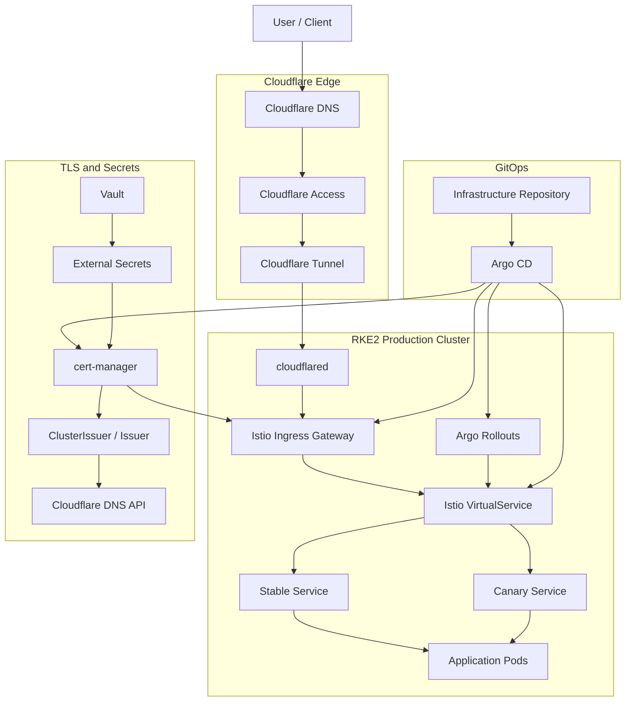
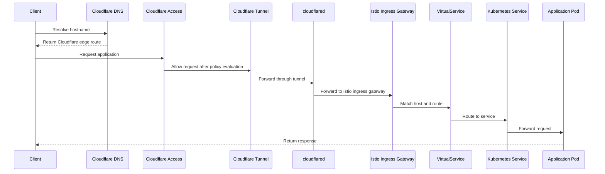
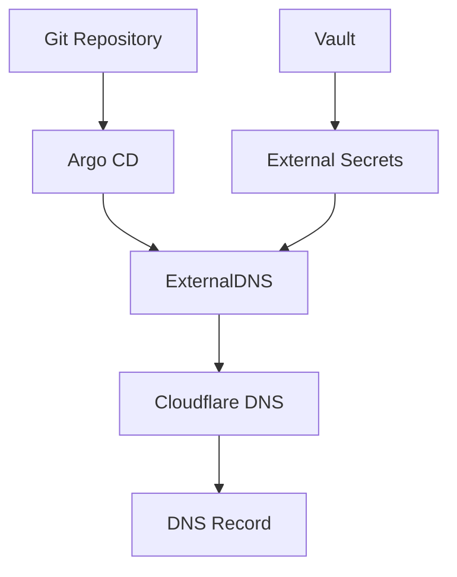
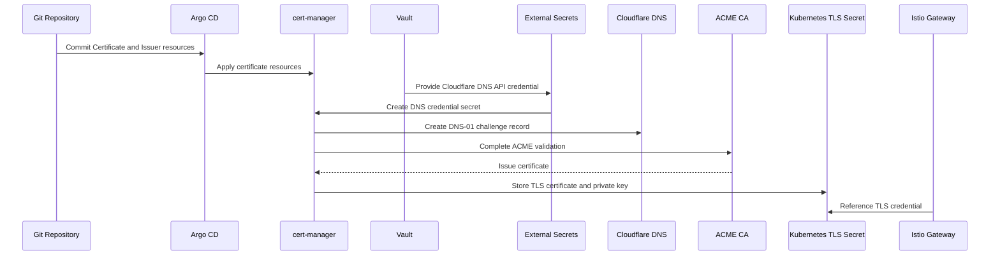
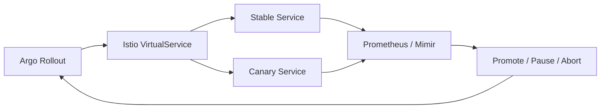
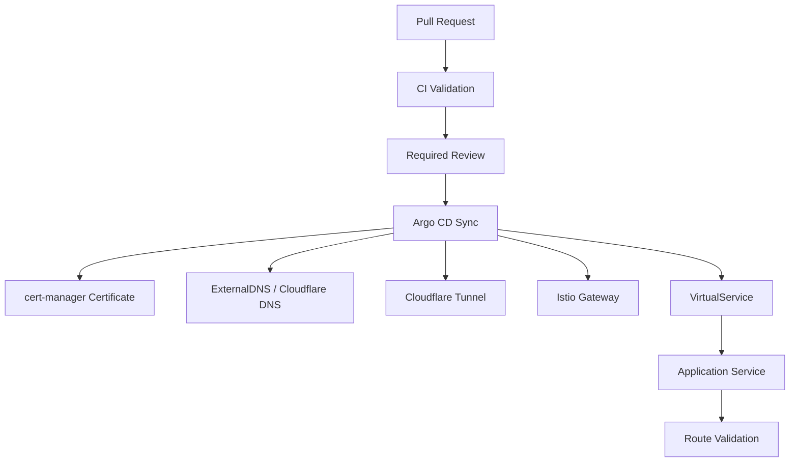
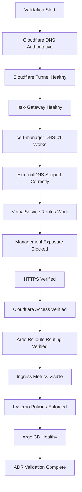

# ADR-0024 — Ingress, Gateway, DNS, and TLS Routing Model

**ADR:** ADR-0024  
**Title:** Ingress, Gateway, DNS, and TLS Routing Model with Cloudflare, Istio, cert-manager, ExternalDNS, and Vault  
**Owner:** SinLess Games LLC (Timothy “Andy” Andrew Pierce / sinless777)  
**Status:** ACCEPTED  
**Date Accepted:** 2026-04-25  
**Last Updated:** 2026-04-25  
**Supersedes:** N/A  
**Superseded By:** N/A  

**Related:**

- [Docs/Architecture/DECISIONS.md](../DECISIONS.md)
- [ADR-0001 — Monorepo Source of Truth](./ADR-0001.md)
- [ADR-0003 — Network Segmentation and Planes](./ADR-0003.md)
- [ADR-0006 — Kubernetes Distribution Choice: RKE2](./ADR-0006.md)
- [ADR-0007 — GitOps Controller: Argo CD](./ADR-0007.md)
- [ADR-0008 — Progressive Delivery with Istio and Argo Rollouts](./ADR-0008.md)
- [ADR-0009 — Identity and SSO: Authentik as Central OIDC Provider](./ADR-0009.md)
- [ADR-0010 — Certificate Management with cert-manager and Cloudflare DNS-01](./ADR-0010.md)
- [ADR-0011 — Cloudflare Tunnel and Access](./ADR-0011.md)
- [ADR-0012 — Vault Secrets and PKI](./ADR-0012.md)
- [ADR-0014 — Observability and Incident Response Platform](./ADR-0014.md)
- [ADR-0016 — Policy-as-Code Enforcement with Kyverno](./ADR-0016.md)
- [ADR-0018 — Garage Object Storage Placement and Operating Model](./ADR-0018.md)
- [ADR-0019 — Management Overlay with WireGuard](./ADR-0019.md)
- [ADR-0020 — Security and Compliance Operating Model](./ADR-0020.md)
- [ADR-0023 — Istio Service Mesh Operating Model](./ADR-0023.md)

---

## Context

The platform requires a standard routing model for external access, internal
service access, DNS automation, TLS certificate issuance, and Kubernetes ingress
traffic.

The platform uses:

- Cloudflare DNS
- Cloudflare Tunnel
- Cloudflare Access
- cert-manager
- Cloudflare DNS-01 validation
- Vault for secret custody
- ExternalDNS for approved DNS automation
- Istio Gateway and VirtualService resources
- Argo CD for GitOps reconciliation
- Authentik for identity-aware application access
- WireGuard for private management access

The platform must support multiple domains.

Accepted external domains include:

```text
sinlessgames.com
helixaibot.com
```

Accepted local/internal domain usage includes:

```text
local.sinlessgames.com
```

External application access must not require direct inbound public exposure to
the Kubernetes cluster or management networks.

Management access is not handled by public ingress.

Management access is handled by internal networks, WireGuard, and approved
identity-aware access paths.

The platform requires a clear separation between:

- public application ingress
- internal application routing
- management access
- DNS automation
- TLS certificate issuance
- service mesh routing
- progressive delivery traffic shifting

---

## Decision

Adopt a routing model based on **Cloudflare at the edge**, **Cloudflare Tunnel
for external connectivity**, **Istio Gateway for Kubernetes ingress**, and
**cert-manager with Cloudflare DNS-01 for TLS certificates**.

The accepted model is:

| Area | Accepted Component |
| --- | --- |
| Public DNS provider | Cloudflare |
| Public ingress path | Cloudflare Tunnel |
| Public access policy | Cloudflare Access where required |
| Kubernetes ingress gateway | Istio Gateway |
| Kubernetes application routing | Istio VirtualService |
| TLS certificate automation | cert-manager |
| ACME DNS validation | Cloudflare DNS-01 |
| Secret custody | Vault |
| Runtime secret delivery | External Secrets |
| DNS automation | ExternalDNS for approved records |
| Service mesh traffic policy | Istio |
| Progressive delivery traffic shifting | Argo Rollouts with Istio |
| GitOps reconciliation | Argo CD |
| Private management access | WireGuard |

No Kubernetes management ports are exposed directly to the public internet.

No Proxmox, Vault admin, Garage admin, PostgreSQL, Kubernetes API, node SSH, or
internal database management endpoints are exposed through public ingress.

---

## Routing Architecture



---

## Scope

This ADR governs:

- public DNS routing
- internal DNS routing boundaries
- Cloudflare Tunnel usage
- Cloudflare Access usage
- Istio Gateway usage
- Istio VirtualService usage
- TLS certificate issuance
- ExternalDNS ownership boundaries
- Vault custody for DNS and TLS credentials
- application hostname onboarding
- routing validation requirements
- rollback requirements
- operational requirements

This ADR does not define:

- every hostname
- every DNS record
- every Cloudflare Access policy
- every VirtualService
- every Gateway
- every Certificate resource
- every application-specific route
- every internal DNS zone record
- every firewall rule

Those items are implementation artifacts managed in Kubernetes manifests,
Cloudflare configuration, DNS documentation, and operations runbooks.

---

## Non-Goals

The accepted ingress and routing model does not include:

- public exposure of Kubernetes API servers
- public exposure of Proxmox management
- public exposure of Vault admin endpoints
- public exposure of Garage admin endpoints
- public exposure of PostgreSQL
- public exposure of node SSH
- direct public LoadBalancer exposure for application services
- unmanaged Kubernetes Ingress resources as the default routing model
- NGINX Ingress as the platform ingress standard
- Traefik as the platform ingress standard
- manual certificate renewal
- plaintext HTTP public application endpoints
- application-owned Cloudflare API tokens
- shared unrestricted DNS automation credentials
- wildcard public routing without explicit GitOps ownership

---

## Responsibility Split

| Area | Responsibility |
| --- | --- |
| Public authoritative DNS | Cloudflare |
| Public edge policy | Cloudflare Access |
| Public-to-cluster connectivity | Cloudflare Tunnel |
| Tunnel connector | cloudflared |
| Kubernetes ingress gateway | Istio Gateway |
| Application routing | Istio VirtualService |
| Canary traffic shifting | Argo Rollouts and Istio |
| TLS certificate issuance | cert-manager |
| ACME DNS validation | Cloudflare DNS-01 |
| DNS record automation | ExternalDNS |
| Secret custody | Vault |
| Runtime secret delivery | External Secrets |
| GitOps reconciliation | Argo CD |
| Internal management access | WireGuard |
| Observability | Grafana, Prometheus, Mimir, Loki, Kiali |
| Policy enforcement | Kyverno and CI gates |

---

## Accepted Tooling

| Area | Tool |
| --- | --- |
| DNS provider | Cloudflare |
| External access | Cloudflare Tunnel |
| Identity-aware edge access | Cloudflare Access |
| Kubernetes gateway | Istio Gateway |
| Service routing | Istio VirtualService |
| Progressive delivery routing | Argo Rollouts |
| Certificate automation | cert-manager |
| ACME validation | Cloudflare DNS-01 |
| DNS automation | ExternalDNS |
| Secret manager | Vault |
| Runtime secret delivery | External Secrets Operator |
| GitOps controller | Argo CD |
| Service mesh observability | Kiali |
| Dashboards and alerts | Grafana stack |
| Admission policy | Kyverno |

---

## Alternatives Considered

### A1) Direct Public LoadBalancer Ingress

**Pros:**

- simple external routing model
- common Kubernetes pattern
- fewer edge components

**Cons:**

- exposes the cluster edge directly to the public internet
- increases firewall and inbound routing exposure
- conflicts with the no-direct-public-management posture
- weakens the Cloudflare-first external access model

Direct public LoadBalancer ingress is rejected.

---

### A2) NGINX Ingress Controller

**Pros:**

- common Kubernetes ingress controller
- broad ecosystem support
- simple HTTP routing model

**Cons:**

- does not provide the accepted Istio service mesh traffic model
- duplicates ingress responsibilities already assigned to Istio Gateway
- weaker alignment with Argo Rollouts Istio traffic shifting
- increases routing-plane sprawl

NGINX Ingress is rejected as the platform ingress standard.

---

### A3) Traefik

**Pros:**

- lightweight ingress controller
- simple routing configuration
- common homelab deployment model

**Cons:**

- not the accepted Kubernetes gateway for this platform
- duplicates Istio Gateway responsibilities
- weaker alignment with the selected service mesh and progressive delivery model

Traefik is rejected as the platform ingress standard.

---

### A4) Cloudflare Tunnel Directly to Each Service

**Pros:**

- simple for a small number of services
- avoids a shared Kubernetes gateway hop
- easy to expose individual services

**Cons:**

- creates inconsistent service routing
- bypasses standardized Istio Gateway policy
- weakens GitOps ownership of application ingress
- creates per-service tunnel sprawl
- complicates observability and route management

Direct per-service tunnel routing is rejected as the default model.

Cloudflare Tunnel routes to the Istio ingress gateway unless an explicit
implementation exception exists.

---

### A5) Manual DNS and Manual Certificates

**Pros:**

- no automation dependency
- useful for emergency recovery

**Cons:**

- error-prone
- weak auditability
- slow rotation
- poor GitOps alignment
- high operational toil

Manual DNS and manual certificates are rejected as normal operations.

Manual changes are allowed only as break-glass actions and must be reconciled
back to Git and documented configuration.

---

### A6) Public DNS Only with No Internal DNS Model

**Pros:**

- simpler naming model
- fewer DNS zones

**Cons:**

- exposes internal naming requirements to public DNS
- weak internal service separation
- poor management-plane clarity
- conflicts with private service and WireGuard access patterns

Public-only DNS is rejected.

Internal DNS remains required.

---

## Rationale

This routing model is selected because it provides secure external access,
GitOps-managed Kubernetes routing, automated certificate issuance, and clear
separation between public application access and private management access.

### Cloudflare Edge Protection

Cloudflare provides the public DNS and edge access control layer.

Cloudflare Tunnel removes the need for direct inbound public exposure into the
cluster.

Cloudflare Access provides identity-aware policy for selected web applications.

---

### Istio Gateway Standardization

Istio Gateway provides the standard Kubernetes ingress point.

VirtualService resources provide application-level routing.

This aligns ingress routing with the selected Istio service mesh and Argo
Rollouts progressive delivery model.

---

### Automated TLS

cert-manager provides automated certificate lifecycle management.

Cloudflare DNS-01 allows certificates to be issued without exposing HTTP
challenge endpoints.

Vault protects Cloudflare API credentials and other certificate-related secret
material.

---

### GitOps Ownership

Gateway, VirtualService, Certificate, ExternalDNS, and application routing
resources are declared in Git and reconciled by Argo CD.

Routing changes are reviewed through pull requests.

This creates change control and auditability for public and internal routes.

---

### Management Plane Separation

Public ingress is for user-facing applications.

WireGuard and internal VLANs are for management access.

This prevents accidental exposure of sensitive administrative interfaces through
application ingress.

---

## Public Routing Model

The standard public route is:

```text
Client
  → Cloudflare DNS
  → Cloudflare Access when required
  → Cloudflare Tunnel
  → cloudflared in Kubernetes
  → Istio ingress gateway
  → Istio VirtualService
  → Kubernetes Service
  → Application workload
```



---

## Internal Routing Model

Internal services use internal DNS names and internal network paths.

Accepted internal route classes:

- Kubernetes service DNS
- internal DNS records under approved local zones
- WireGuard-routed management names
- internal service names for platform services
- ClusterIP services for in-cluster-only access

Internal-only services must not use public hostnames unless explicitly required.

Internal-only services must not be exposed through Cloudflare Tunnel.

---

## Domain Model

Accepted public domains:

```text
sinlessgames.com
helixaibot.com
```

Accepted local/internal domain:

```text
local.sinlessgames.com
```

Public application hostnames use public domains.

Internal management hostnames use the local/internal domain.

Application routes must declare hostname ownership in Git.

---

## Hostname Classification

| Hostname Class | Example | Exposure |
| --- | --- | --- |
| Public application | `docs.sinlessgames.com` | Cloudflare Tunnel to Istio Gateway |
| Public identity-protected application | `grafana.sinlessgames.com` | Cloudflare Access + application auth |
| Internal service | `postgres.local.sinlessgames.com` | Internal DNS and WireGuard only |
| Management endpoint | `proxmox.local.sinlessgames.com` | Internal DNS and WireGuard only |
| Kubernetes service | `service.namespace.svc.cluster.local` | Cluster internal only |

---

## DNS Requirements

Cloudflare is the authoritative DNS provider for public domains.

ExternalDNS may manage approved public DNS records.

ExternalDNS must be scoped by:

- domain filter
- zone filter
- namespace ownership
- TXT registry ownership
- least-privilege Cloudflare API token
- GitOps-managed configuration

ExternalDNS must not manage unrelated zones.

ExternalDNS must not manage local/internal DNS zones unless explicitly approved
by implementation.

Cloudflare API tokens are stored in Vault.

ExternalDNS receives credentials through External Secrets.

---

## DNS Ownership Flow



---

## TLS Requirements

Public application routes require TLS.

cert-manager is the accepted certificate automation controller.

Cloudflare DNS-01 is the accepted ACME validation method.

Certificate private keys are stored as Kubernetes TLS secrets where required by
Istio Gateway resources.

Certificate-related credentials are stored in Vault and delivered through
External Secrets.

Public HTTP must redirect to HTTPS at the edge or gateway layer.

Wildcard certificates are allowed for approved public domains.

Accepted wildcard certificate examples:

```text
*.sinlessgames.com
*.helixaibot.com
```

Gateway TLS secrets must be namespace-scoped to the gateway implementation.

TLS private keys must not be committed to Git.

---

## Certificate Issuance Flow



---

## Istio Gateway Requirements

The standard shared edge gateway is hosted in `istio-system`.

Accepted gateway name:

```text
shared-edge
```

Accepted gateway namespace:

```text
istio-system
```

Accepted gateway host coverage includes:

```text
*.sinlessgames.com
*.helixaibot.com
```

Gateway resources must be declared in Git.

Gateway TLS mode for public HTTPS routes is:

```text
SIMPLE
```

Gateway TLS credentials are provided by cert-manager-managed Kubernetes TLS
secrets.

Gateway resources must not include unmanaged hostnames.

Gateway resources must not expose management services.

---

## VirtualService Requirements

Every public application route must use an Istio VirtualService.

VirtualService resources must define:

- explicit hostname
- explicit gateway reference
- explicit route destination
- explicit service port
- route name where required by Argo Rollouts
- owner labels
- environment labels
- application labels

VirtualServices used by Argo Rollouts must define route names compatible with
the Rollout traffic routing configuration.

VirtualService route weights controlled by Argo Rollouts must be ignored by Argo
CD using application-specific ignore-difference rules.

---

## Progressive Delivery Routing

Progressive delivery uses Argo Rollouts and Istio.



Argo Rollouts controls traffic weights.

Istio applies live traffic routing.

Argo CD applies the desired resource definitions but does not override active
Rollouts-managed traffic weights.

---

## Cloudflare Access Requirements

Cloudflare Access is used for identity-aware protection of selected public web
applications.

Cloudflare Access is required for:

- administrative web applications exposed publicly
- observability dashboards exposed publicly
- incident response applications exposed publicly
- internal tools exposed through public hostnames
- non-public user applications that need external browser access

Cloudflare Access does not replace application authentication.

Cloudflare Access does not replace WireGuard for management access.

---

## Management Access Boundary

Management services must use private access paths.

Required private access paths:

- WireGuard
- local management VLAN
- internal DNS
- approved authenticated internal ingress where implemented

Services prohibited from public ingress:

- Proxmox UI
- Proxmox API
- Proxmox SSH
- Kubernetes API
- Vault administrative endpoints
- PostgreSQL
- Garage administrative endpoints
- node SSH
- internal database consoles
- storage administration endpoints

---

## Network Security Requirements

Ingress components must be restricted.

Required controls:

- Cloudflare Tunnel as the public ingress path
- no public LoadBalancer services for normal applications
- Istio ingress gateway exposed only through approved tunnel or internal routing
- NetworkPolicies for ingress components
- no direct public access to backend services
- no public access to management services
- TLS required for public routes
- Cloudflare API tokens scoped to required zones and permissions
- ExternalDNS token scoped to DNS record management only
- cert-manager DNS token scoped to DNS-01 challenge requirements only

---

## Secret Handling Requirements

Secrets must not be committed to Git.

Sensitive values include:

- Cloudflare API tokens
- cert-manager DNS credentials
- ExternalDNS credentials
- Cloudflare Tunnel tokens
- TLS private keys
- webhook URLs
- Gateway private keys
- application routing credentials
- Authentik client secrets
- service API keys

Accepted secret storage and delivery:

- Vault for secret custody
- External Secrets for Kubernetes delivery
- Kubernetes TLS secrets generated by cert-manager

---

## Policy Requirements

Kyverno enforces ingress and routing safety.

Required policy controls:

- public routes require approved domain suffix
- Gateway resources require owner labels
- VirtualService resources require owner labels
- public VirtualServices require approved gateway reference
- public routes must not target management services
- public services must not use direct LoadBalancer exposure unless approved
- TLS secrets must not be committed to Git
- ExternalDNS records must use approved domain filters
- cert-manager issuers must use approved secret references
- production routes require environment labels
- production routes require runbook annotations

---

## Observability Requirements

Ingress and routing must be observable.

Required metrics and alerts:

- Cloudflare Tunnel availability
- cloudflared pod health
- Istio ingress gateway availability
- gateway request count
- gateway 4xx count
- gateway 5xx count
- gateway p95 latency
- gateway p99 latency
- VirtualService route behavior
- Argo Rollouts traffic weight behavior
- cert-manager certificate expiration
- cert-manager renewal failure
- ExternalDNS sync failure
- Cloudflare DNS update failure
- TLS handshake errors
- unauthorized access attempts
- Cloudflare Access policy denials where available

Grafana dashboards must display:

- public route health
- ingress gateway health
- Cloudflare Tunnel health
- certificate status
- DNS automation status
- application route error counts
- application route latency
- canary traffic split status

Kiali must display mesh route topology for mesh-enabled applications.

---

## Implementation Requirements

### GitOps Deployment

Ingress, gateway, DNS, and TLS resources are managed through Argo CD.

Required resource classes:

- Cloudflare Tunnel deployment or configuration references
- Istio Gateway
- Istio VirtualService
- cert-manager ClusterIssuer or Issuer
- cert-manager Certificate
- ExternalDNS deployment and configuration
- ExternalSecret resources
- ServiceMonitor resources
- PrometheusRule resources
- NetworkPolicy resources

---

### Repository Paths

Platform ingress resources are stored under:

```text
Kubernetes/apps/prod/networking/
Kubernetes/apps/prod/istio-system/
Kubernetes/apps/prod/cert-manager/
Kubernetes/apps/prod/external-dns/
```

Application-specific routing resources are stored with the application.

Example:

```text
Kubernetes/apps/prod/sinless-games/docs/
```

---

### Deployment Order

Required deployment order:

| Wave | Resource |
| --- | --- |
| `-10` | namespaces |
| `-5` | ExternalSecret references |
| `0` | cert-manager and issuers |
| `1` | ExternalDNS |
| `2` | Cloudflare Tunnel connector |
| `3` | Istio ingress gateway |
| `4` | shared Gateway resources |
| `5` | application Certificates |
| `6` | application VirtualServices |
| `7` | Argo Rollouts traffic routing resources |
| `8` | ServiceMonitor and alert rules |

---

### Required Labels

Ingress and routing resources must include:

```text
app.kubernetes.io/managed-by=argocd
networking.sinlessgames.io/routing-model=cloudflare-tunnel-istio
security.sinlessgames.io/exposure=<public|internal|management>
environment=prod
```

Public application routes must include:

```text
networking.sinlessgames.io/public-hostname=<hostname>
networking.sinlessgames.io/gateway=shared-edge
```

Management services must include:

```text
security.sinlessgames.io/exposure=management
```

---

### Approved Public Hostnames

Public hostnames must end in one of the accepted public domains:

```text
.sinlessgames.com
.helixaibot.com
```

Internal hostnames must use the accepted internal domain:

```text
.local.sinlessgames.com
```

---

### Required Gateway Reference

Public application VirtualServices use:

```text
istio-system/shared-edge
```

---

### Required TLS Secret Naming

Wildcard certificate secret names follow this format:

```text
wildcard-<domain-with-dashes>
```

Accepted examples:

```text
wildcard-sinlessgames-com
wildcard-helixaibot-com
```

Application-specific certificate secrets follow this format:

```text
tls-<application>-<environment>
```

---

## Application Route Onboarding Requirements

A new public application route requires:

- approved hostname
- VirtualService
- Gateway reference
- Kubernetes Service
- TLS certificate reference
- owner labels
- environment labels
- runbook annotation
- dashboard or alert coverage
- Cloudflare Access policy when required
- NetworkPolicy
- Kyverno validation
- Argo CD sync health

Application route onboarding flow:



---

## Validation Requirements

This ADR is valid when the following requirements are met:

- Cloudflare is authoritative for accepted public domains
- Cloudflare Tunnel provides the public ingress path
- no direct public LoadBalancer is required for standard application ingress
- `cloudflared` is healthy
- Istio ingress gateway is healthy
- `shared-edge` Gateway exists in `istio-system`
- accepted public domains are present on the shared Gateway
- cert-manager issues certificates with Cloudflare DNS-01
- TLS certificates renew successfully
- TLS secrets are created by cert-manager
- ExternalDNS manages only approved DNS records
- ExternalDNS uses Vault-delivered credentials
- cert-manager uses Vault-delivered credentials
- public application routes use VirtualService resources
- management services are not exposed through public ingress
- public routes use HTTPS
- HTTP redirects to HTTPS where applicable
- Cloudflare Access protects administrative public web applications
- Argo Rollouts can shift traffic through Istio routes
- Argo CD does not fight Rollouts-managed traffic weights
- ingress gateway metrics are visible in Grafana
- certificate status is visible in Grafana
- DNS automation status is visible in Grafana
- Kiali displays mesh route topology
- Kyverno blocks unsafe public route definitions
- Argo CD reports routing applications as healthy



---

## Rollback Plan

If Cloudflare Tunnel fails:

1. verify Cloudflare service status
2. verify tunnel status
3. verify `cloudflared` pod health
4. verify tunnel credentials from Vault and External Secrets
5. restore the last known-good tunnel configuration
6. validate public application routes
7. keep management access on WireGuard and internal networks

If Istio ingress gateway fails:

1. verify gateway pod health
2. verify gateway service endpoints
3. verify Gateway resources
4. verify VirtualService resources
5. verify certificates and TLS secrets
6. restore the last known-good gateway configuration through GitOps
7. validate public and internal routes

If cert-manager fails to issue or renew certificates:

1. inspect Certificate status
2. inspect CertificateRequest status
3. inspect Challenge status
4. verify Cloudflare DNS API credential delivery
5. verify Cloudflare DNS zone permissions
6. restore the last known-good issuer configuration
7. re-trigger certificate issuance
8. validate TLS on affected hostnames

If ExternalDNS creates an invalid DNS record:

1. stop ExternalDNS reconciliation if required
2. inspect ExternalDNS logs
3. verify domain and zone filters
4. correct the Git-managed source resource
5. remove invalid DNS record if required
6. restore ExternalDNS reconciliation
7. validate hostname resolution

If a public route exposes a management service:

1. disable the affected route immediately
2. remove or block the VirtualService or Gateway host
3. verify Cloudflare route is no longer reachable
4. inspect Git history and Argo CD sync history
5. rotate exposed credentials if required
6. create a DFIR-IRIS case when exposure is security-impacting
7. add or correct Kyverno policy to block recurrence

If Argo Rollouts traffic routing fails:

1. abort the affected rollout
2. restore stable traffic
3. inspect VirtualService weights
4. inspect Argo CD ignore-difference configuration
5. inspect Istio routing behavior
6. restore the last known-good rollout and route configuration

A permanent migration away from this routing model requires:

- a superseding ADR
- migration plan
- rollback plan
- DNS migration procedure
- certificate migration procedure
- ingress migration procedure
- validation evidence
- updated implementation documentation
- updated runbooks

---

## Operational Requirements

Ingress, gateway, DNS, and TLS production operation requires:

- Cloudflare DNS ownership
- Cloudflare Tunnel health monitoring
- Cloudflare Access policy for administrative public web applications
- Istio ingress gateway
- shared Gateway resources
- VirtualService resources for public application routes
- cert-manager certificate automation
- Cloudflare DNS-01 validation
- ExternalDNS scoping
- Vault-managed Cloudflare credentials
- External Secrets delivery
- TLS for public routes
- no direct public management exposure
- no direct public database exposure
- no direct public Kubernetes API exposure
- NetworkPolicies
- Kyverno route safety policies
- Grafana dashboards
- alert rules
- Kiali mesh route visibility
- Argo CD health reporting
- rollback procedures
- documented hostname ownership
- documented route ownership
- documented certificate ownership