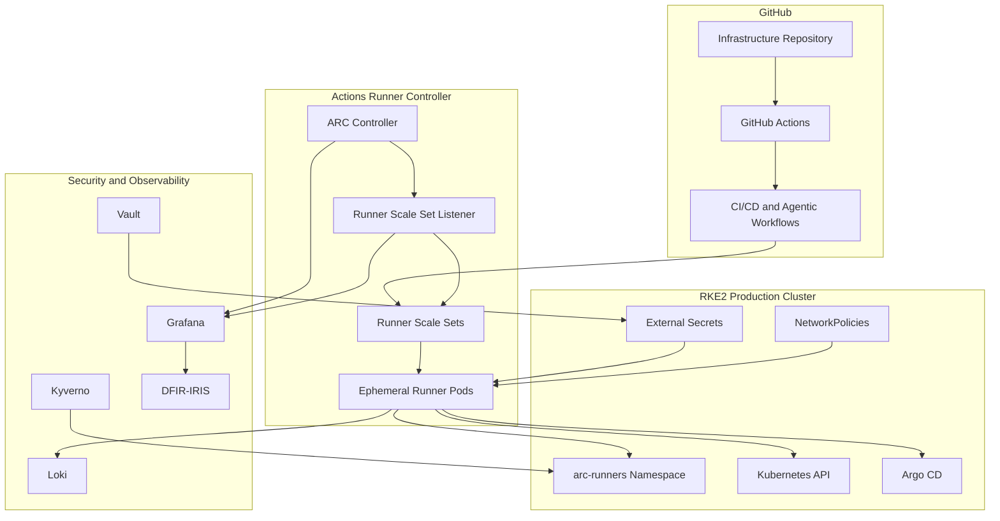
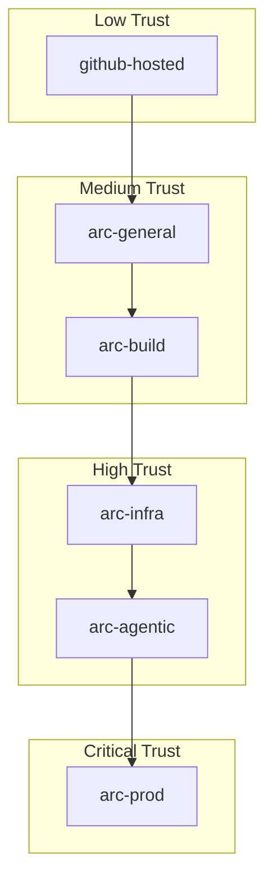
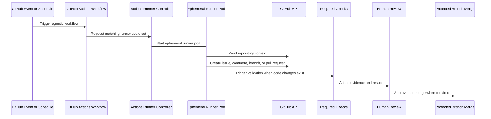
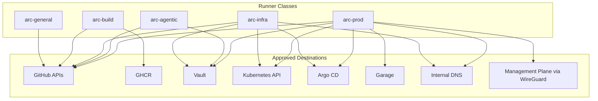
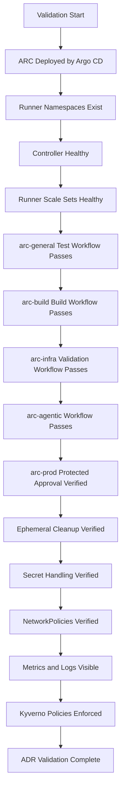

# ADR-0025 — GitHub Actions Runner Controller and Agentic Workflow Operating Model

**ADR:** ADR-0025  
**Title:** GitHub Actions Runner Controller and Agentic Workflow Operating Model  
**Owner:** SinLess Games LLC (Timothy “Andy” Andrew Pierce / sinless777)  
**Status:** ACCEPTED  
**Date Accepted:** 2026-04-25  
**Last Updated:** 2026-04-25  
**Supersedes:** N/A  
**Superseded By:** N/A  

**Related:**

- [Docs/Architecture/DECISIONS.md](../DECISIONS.md)
- [ADR-0001 — Monorepo Source of Truth](./ADR-0001.md)
- [ADR-0006 — Kubernetes Distribution Choice: RKE2](./ADR-0006.md)
- [ADR-0007 — GitOps Controller: Argo CD](./ADR-0007.md)
- [ADR-0012 — Vault Secrets and PKI](./ADR-0012.md)
- [ADR-0014 — Observability and Incident Response Platform](./ADR-0014.md)
- [ADR-0016 — Policy-as-Code Enforcement with Kyverno](./ADR-0016.md)
- [ADR-0017 — GitHub Source Control, CI/CD, and Registry Operating Model](./ADR-0017.md)
- [ADR-0019 — Management Overlay with WireGuard](./ADR-0019.md)
- [ADR-0020 — Security and Compliance Operating Model](./ADR-0020.md)
- [ADR-0024 — Ingress, Gateway, DNS, and TLS Routing Model](./ADR-0024.md)

---

## Context

The platform uses GitHub Actions for CI/CD automation.

Some workflows can run safely on GitHub-hosted runners. Other workflows require
private infrastructure access, internal DNS, Kubernetes API access, Vault-backed
automation, cluster validation, repository orchestration, or controlled network
placement.

The platform also uses agentic workflows to automate repository and operations
tasks.

Agentic workflows include:

- repository announcement workflows
- Renovate management workflows
- ChatOps workflows
- documentation drift workflows
- failed-run triage workflows
- issue triage workflows
- operations orchestration workflows
- pull request risk review workflows
- routing management workflows
- safe autofix workflows
- security management workflows

These workflows require a secure execution model.

The runner platform must support:

- ephemeral execution
- autoscaling
- GitHub Actions integration
- private network access where approved
- Kubernetes-native operation
- clear runner trust boundaries
- separation between trusted and untrusted workloads
- least-privilege credentials
- Vault-managed secrets
- GitOps-managed runner configuration
- policy enforcement
- observability and audit evidence

The platform uses GitHub as the source control and CI/CD platform.

The platform uses Argo CD for GitOps reconciliation.

The platform uses Actions Runner Controller as the Kubernetes-native runner
management system.

---

## Decision

Adopt **Actions Runner Controller** as the self-hosted GitHub Actions runner
platform for Kubernetes-hosted runner execution.

Actions Runner Controller is the accepted controller for:

- self-hosted GitHub Actions runner scale sets
- Kubernetes-hosted runner pods
- autoscaled CI runner capacity
- ephemeral runner execution
- trusted internal automation workflows
- agentic repository workflows
- infrastructure validation workflows
- deployment-adjacent automation workflows

GitHub-hosted runners remain accepted for low-risk public validation jobs that
do not require internal infrastructure access.

Self-hosted ARC runners are required for workflows that need:

- internal Kubernetes API access
- private DNS access
- private service access
- internal registry or artifact access
- Vault-mediated automation
- WireGuard-routed management access
- GitOps validation against internal cluster resources
- infrastructure orchestration
- agentic repository automation requiring controlled credentials

Runner definitions, namespaces, RBAC, secrets, NetworkPolicies, and monitoring
are declared in Git and reconciled by Argo CD.

Runner credentials are stored in Vault and delivered through External Secrets.

---

## Runner Architecture



---

## Scope

This ADR governs:

- Actions Runner Controller as the self-hosted runner platform
- GitHub-hosted versus self-hosted runner boundaries
- runner scale set classes
- ephemeral runner execution
- agentic workflow execution requirements
- runner network access requirements
- runner secret handling requirements
- runner observability requirements
- runner security requirements
- GitOps management of ARC resources
- validation requirements
- rollback requirements
- operational requirements

This ADR does not define:

- every GitHub Actions workflow
- every reusable workflow
- every runner container image
- every runner scale value
- every workflow permission block
- every GitHub App permission
- every agentic workflow prompt or policy
- every automation script executed by workflows

Those items are implementation artifacts managed in `.github/workflows/`,
agentic workflow definitions, Kubernetes manifests, Vault policies, and
operations documentation.

---

## Non-Goals

The accepted runner operating model does not include:

- GitLab Runner
- Jenkins agents
- static long-lived VM runners as the default runner model
- shared privileged runners for unrelated trust zones
- unrestricted production access from all runners
- secrets exposed to untrusted pull requests
- runner pods with broad cluster-admin permissions
- shared runner credentials across environments
- production deployment from unreviewed workflow changes
- manual runner registration as normal operations
- persistent runner workspaces for normal jobs

---

## Responsibility Split

| Area | Responsibility |
| --- | --- |
| Source control and workflow orchestration | GitHub |
| CI/CD execution platform | GitHub Actions |
| Self-hosted runner orchestration | Actions Runner Controller |
| Runner execution unit | Ephemeral Kubernetes runner pods |
| Runner configuration reconciliation | Argo CD |
| Runner secret custody | Vault |
| Runner secret delivery | External Secrets |
| Runner network control | NetworkPolicies and firewall rules |
| Runner admission policy | Kyverno |
| Runner logs | Loki |
| Runner metrics and alerts | Grafana, Prometheus, Mimir |
| Incident workflow | DFIR-IRIS |
| Agentic workflow definitions | Repository-managed workflow definitions |
| Production approvals | GitHub branch protection and environments |

---

## Accepted Tooling

| Area | Tool |
| --- | --- |
| Source control | GitHub |
| Workflow engine | GitHub Actions |
| Self-hosted runner controller | Actions Runner Controller |
| Runner platform | RKE2 Kubernetes |
| GitOps reconciliation | Argo CD |
| Secret manager | Vault |
| Runtime secret delivery | External Secrets Operator |
| Admission policy | Kyverno |
| Observability | Grafana stack |
| Log storage | Loki |
| Incident response | DFIR-IRIS |
| Dependency automation | Renovate and Dependabot |
| Security scanning | CodeQL, Trivy, Mend.io |
| Management overlay | WireGuard |

---

## Alternatives Considered

### A1) GitHub-Hosted Runners Only

**Pros:**

- no runner infrastructure to operate
- simple CI setup
- clear GitHub-managed lifecycle
- good fit for public validation tasks

**Cons:**

- no private network access
- limited control over execution environment
- weaker fit for infrastructure automation
- cannot safely reach internal Kubernetes APIs
- cannot access internal-only services without exposing them
- does not satisfy local automation requirements

GitHub-hosted runners remain accepted for low-risk validation jobs.

GitHub-hosted runners are rejected as the only runner model.

---

### A2) Static VM-Based Self-Hosted Runners

**Pros:**

- simple to understand
- direct network placement
- easy local debugging
- useful for specialized hardware workflows

**Cons:**

- long-lived workspace risk
- harder autoscaling
- higher credential persistence risk
- harder isolation between jobs
- higher maintenance burden
- inconsistent cleanup after failed jobs

Static VM runners are rejected as the default runner model.

Static VM runners require a separate implementation exception.

---

### A3) Jenkins

**Pros:**

- mature CI platform
- flexible pipeline model
- strong plugin ecosystem

**Cons:**

- duplicates GitHub Actions
- adds another CI control plane
- increases operational burden
- weakens GitHub-native audit flow
- requires separate credential and plugin security management

Jenkins is rejected as the platform CI/CD runner model.

---

### A4) GitLab Runner

**Pros:**

- mature runner platform
- strong CI features
- common self-hosted pattern

**Cons:**

- platform uses GitHub, not GitLab
- duplicates GitHub Actions
- conflicts with ADR-0017
- adds unnecessary CI/CD surface area

GitLab Runner is rejected.

---

### A5) Manual Automation from Operator Workstations

**Pros:**

- immediate control
- useful during break-glass recovery
- low platform dependency

**Cons:**

- weak auditability
- inconsistent execution environment
- high drift risk
- poor repeatability
- does not scale for routine operations

Manual workstation automation is rejected as normal operations.

It remains available only for break-glass recovery.

---

## Rationale

Actions Runner Controller is selected because it provides Kubernetes-native,
autoscaled, ephemeral GitHub Actions runners while preserving the GitHub Actions
workflow model.

### GitHub-Native Automation

The platform already uses GitHub for source control, pull requests, Actions,
GHCR, branch protection, and evidence.

ARC preserves the GitHub-native automation model while allowing selected jobs to
run inside controlled infrastructure.

---

### Ephemeral Runner Execution

Ephemeral runner pods reduce persistence risk.

Each job receives a clean runner execution environment.

This reduces risk from:

- stale workspaces
- leftover credentials
- cross-job contamination
- persistent local state
- unintentional toolchain drift

---

### Kubernetes-Native Scaling

ARC runner scale sets allow runner capacity to scale based on GitHub Actions job
demand.

Runner capacity is declared in Kubernetes and reconciled by Argo CD.

---

### Controlled Private Network Access

Self-hosted runners can be placed in a restricted Kubernetes namespace with
explicit NetworkPolicies.

This allows approved workflows to reach private infrastructure without exposing
private systems publicly.

---

### Agentic Workflow Safety

Agentic workflows can modify issues, pull requests, labels, documentation,
workflows, manifests, and repository metadata.

They require strict permissions, controlled execution, review gates, and
observable outcomes.

ARC gives these workflows an isolated runtime inside the platform boundary.

---

## Runner Classes

The platform defines explicit runner classes.

| Runner Class | Purpose | Trust Level |
| --- | --- | --- |
| `github-hosted` | Low-risk public validation jobs | Low |
| `arc-general` | Normal repository CI tasks | Medium |
| `arc-build` | Container builds and image publishing | Medium |
| `arc-infra` | Terraform, Ansible, Kubernetes validation, internal checks | High |
| `arc-agentic` | Agentic repository and operations workflows | High |
| `arc-prod` | Production-impacting automation requiring protected approvals | Critical |

Runner classes are implemented as separate runner scale sets.

Workflows select runner scale sets through `runs-on`.

---

## Runner Scale Set Requirements

Each runner scale set must have:

- clear name
- clear purpose
- namespace placement
- GitHub repository or organization scope
- maximum runner count
- minimum runner count
- resource requests
- resource limits
- NetworkPolicy
- service account
- RBAC scope
- secret scope
- allowed workflow class
- observability labels
- owner labels

Runner scale set names are part of the workflow API because workflows reference
them with `runs-on`.

Accepted production runner scale set names are:

```text
arc-general
arc-build
arc-infra
arc-agentic
arc-prod
```

---

## Runner Trust Boundary



Higher-trust runner classes have stricter controls.

Jobs must not use a higher-trust runner class unless the workflow requires it.

---

## Agentic Workflow Model

Agentic workflows are repository-managed automation workflows that perform
higher-level operational or repository tasks.

Accepted agentic workflow classes include:

| Agentic Workflow | Purpose |
| --- | --- |
| `daily-repo-announcement` | Produces scheduled repository activity summaries |
| `renovate-manager` | Reviews and coordinates Renovate update flow |
| `repo-chatops` | Handles approved repository ChatOps actions |
| `repo-docs-drift` | Detects documentation drift and documentation gaps |
| `repo-failed-run-triage` | Reviews failed workflow runs and proposes remediation |
| `repo-issue-triage` | Classifies, labels, and routes issues |
| `repo-ops-orchestrator` | Coordinates approved repository operations workflows |
| `repo-pr-risk-review` | Reviews pull request risk and impact |
| `repo-routing-manager` | Routes issues, PRs, and operational tasks |
| `repo-safe-autofix` | Creates limited-scope corrective changes |
| `repo-security-manager` | Coordinates security findings and remediation tasks |

Agentic workflows run on the `arc-agentic` or `arc-prod` runner class according
to impact.

Agentic workflows that can affect production require protected environment
approval.

---

## Agentic Workflow Execution Flow



Agentic workflows must not directly bypass review for production-impacting
changes.

---

## Workflow Routing Requirements

Workflows must use the lowest-trust runner that satisfies the job requirements.

Accepted routing rules:

| Workflow Type | Runner |
| --- | --- |
| Markdown lint | `github-hosted` or `arc-general` |
| MkDocs build | `github-hosted` or `arc-general` |
| Unit tests | `github-hosted` or `arc-general` |
| Container build | `arc-build` |
| Image scan | `arc-build` |
| Terraform validate | `arc-infra` |
| Terraform plan requiring internal providers | `arc-infra` |
| Ansible syntax check | `arc-general` or `arc-infra` |
| Kubernetes manifest validation | `arc-general` or `arc-infra` |
| Argo CD validation requiring cluster access | `arc-infra` |
| Agentic issue triage | `arc-agentic` |
| Agentic pull request risk review | `arc-agentic` |
| Agentic safe autofix | `arc-agentic` |
| Production-impacting automation | `arc-prod` |

---

## GitHub Permissions Requirements

Workflow permissions must be least privilege.

Default workflow permission baseline:

```yaml
permissions:
  contents: read
```

Workflows receive write permissions only when required.

Agentic workflows that write repository content require explicit permissions.

Accepted permission examples:

```yaml
permissions:
  contents: write
  pull-requests: write
  issues: write
```

Production-impacting workflows must use GitHub protected environments.

Workflows must not use broad repository permissions when narrower permissions
are sufficient.

---

## Secret Handling Requirements

Secrets must not be committed to Git.

Runner-sensitive values include:

- GitHub App private keys
- GitHub tokens
- runner registration credentials
- Vault tokens
- kubeconfigs
- Argo CD credentials
- Cloudflare tokens
- GHCR credentials
- SSH private keys
- webhook URLs
- API keys
- WireGuard peer material

Secrets are stored in Vault or GitHub environment secrets according to scope.

Vault is the source of truth for infrastructure secrets.

GitHub environment secrets are limited to CI/CD execution scope.

External Secrets delivers Kubernetes runtime secrets.

---

## Runner Network Requirements

Runner network access is restricted by runner class.



Runner namespaces must use NetworkPolicies.

Untrusted pull request workflows must not receive access to internal
infrastructure credentials.

---

## Production Environment Requirements

Production-impacting workflows require GitHub protected environments.

Production workflow requirements:

- required reviewers
- restricted secrets
- restricted runner class
- required CI checks
- no execution from untrusted forks
- no production secrets exposed to pull request code
- workflow logs retained as evidence
- deployment or change record retained
- rollback path documented in the pull request

Production workflows run only on `arc-prod`.

---

## Container Build Requirements

Container builds run on `arc-build`.

Container build workflows require:

- pinned base images where practical
- reproducible build inputs
- Trivy image scanning
- GHCR publish permissions only for build jobs
- immutable image tags
- image digest output
- no production deployment with mutable tags
- artifact retention for scan output
- build logs retained according to evidence policy

---

## Infrastructure Workflow Requirements

Infrastructure workflows run on `arc-infra` or `arc-prod`.

Infrastructure workflows include:

- Terraform validation
- Terraform plan
- Ansible validation
- Kubernetes manifest validation
- Helm validation
- Kustomize validation
- Kyverno policy tests
- Argo CD application validation
- cluster connectivity checks
- documentation deployment validation

Infrastructure workflows that require cluster access must use scoped credentials.

---

## ARC GitOps Requirements

Actions Runner Controller is deployed through Argo CD.

ARC resources are declared in Git.

Required ARC resources include:

- controller namespace
- runner namespace
- controller Helm release or manifests
- runner scale set definitions
- ExternalSecret resources
- ServiceAccount resources
- RBAC resources
- NetworkPolicy resources
- ServiceMonitor resources
- PrometheusRule resources

Manual runner registration is not accepted as normal operations.

---

## Repository Layout Requirements

ARC platform resources are stored under:

```text
Kubernetes/apps/prod/actions-runner-controller/
```

Runner scale set resources are stored under:

```text
Kubernetes/apps/prod/actions-runner-controller/runner-scale-sets/
```

Agentic workflow definitions are stored under:

```text
Docs/Resources/Agentic Workflows/
```

GitHub Actions workflows are stored under:

```text
.github/workflows/
```

---

## Namespace Requirements

ARC uses separate namespaces for controller and runner execution.

Required namespaces:

```text
arc-system
arc-runners
```

The controller runs in:

```text
arc-system
```

Runner pods run in:

```text
arc-runners
```

Production-impacting runner pods may use a separate namespace:

```text
arc-prod-runners
```

---

## Kubernetes Security Requirements

Runner pods must comply with Kubernetes security controls.

Required controls:

- non-root where supported by runner image
- no privileged containers unless explicitly approved for a build class
- no hostPath mounts unless explicitly approved
- no host networking
- no host PID
- no host IPC
- resource requests
- resource limits
- NetworkPolicies
- namespace isolation
- service account isolation
- RBAC least privilege
- ephemeral workspace
- no long-lived credentials baked into runner images
- no Docker socket mount by default

Docker socket mounting is rejected as the default build model.

Privileged build modes require explicit approval and separate runner scale set
isolation.

---

## Observability Requirements

ARC and runner activity must be observable.

Required telemetry:

- controller health
- listener health
- runner scale set status
- queued jobs
- active runners
- failed runner pods
- runner pod duration
- runner pod resource usage
- runner registration failures
- GitHub API rate-limit errors
- workflow failure rates
- runner namespace events
- runner logs
- autoscaling behavior

Required dashboards:

- ARC controller health
- runner scale set capacity
- runner job duration
- failed runner pods
- workflow failure trends
- runner resource usage
- agentic workflow activity
- production workflow activity

Required alerts:

- ARC controller unavailable
- listener unavailable
- runner scale set unable to scale
- runner registration failure
- repeated runner pod failures
- GitHub API authentication failure
- GitHub API rate-limit failure
- `arc-prod` workflow failure
- agentic workflow failure
- suspicious runner network activity
- runner namespace policy violation

Runner logs are shipped to Loki.

Runner metrics are visible in Grafana.

Incident-grade runner events are routed to DFIR-IRIS.

---

## Evidence Requirements

Runner and workflow evidence must be retained.

Required evidence sources:

- GitHub workflow logs
- GitHub workflow artifacts
- pull request history
- status checks
- runner pod logs
- ARC controller logs
- runner scale set events
- GitHub environment approvals
- image build digests
- security scan artifacts
- Terraform plan artifacts
- Kustomize and Helm render artifacts
- agentic workflow pull requests
- agentic workflow comments
- agentic workflow issue updates
- DFIR-IRIS cases for incident-grade failures

---

## Policy Requirements

Kyverno enforces runner safety controls.

Required policies:

- runner pods must run only in approved runner namespaces
- runner pods must include owner labels
- runner pods must include runner class labels
- runner pods must not use host networking
- runner pods must not use host PID
- runner pods must not use host IPC
- runner pods must not mount Docker socket by default
- runner pods must not mount broad Kubernetes service account tokens by default
- runner pods must define resource requests
- runner pods must define resource limits
- runner namespaces must include NetworkPolicies
- production runner scale sets must use approved service accounts
- production runner secrets must not be available in non-production namespaces

---

## Implementation Requirements

### Deployment Order

ARC is deployed through Argo CD.

Required deployment order:

| Wave | Resource |
| --- | --- |
| `-10` | `arc-system`, `arc-runners`, and `arc-prod-runners` namespaces |
| `-5` | ExternalSecret references |
| `0` | ARC controller |
| `1` | controller ServiceAccount and RBAC |
| `2` | runner scale set listener resources |
| `3` | runner scale sets |
| `4` | NetworkPolicies |
| `5` | ServiceMonitor and alert rules |
| `6` | workflow adoption |

---

### Required Labels

ARC resources must include:

```text
app.kubernetes.io/name=actions-runner-controller
app.kubernetes.io/part-of=github-actions-runners
app.kubernetes.io/managed-by=argocd
ci.sinlessgames.io/system=github-actions
```

Runner scale sets must include:

```text
ci.sinlessgames.io/runner-class=<arc-general|arc-build|arc-infra|arc-agentic|arc-prod>
ci.sinlessgames.io/trust-level=<medium|high|critical>
```

Agentic workflows must include repository metadata identifying:

```text
agentic.sinlessgames.io/workflow=<workflow-name>
agentic.sinlessgames.io/impact=<low|medium|high|production>
```

---

### Required Runner Scale Sets

Required runner scale sets are:

```text
arc-general
arc-build
arc-infra
arc-agentic
arc-prod
```

Each runner scale set must have a defined maximum runner count.

Each runner scale set must have a defined resource profile.

Each runner scale set must have a defined NetworkPolicy.

---

### Workflow Naming

Agentic workflow files use descriptive names.

Required naming pattern:

```text
repo-<purpose>.yml
```

Accepted examples:

```text
repo-docs-drift.yml
repo-failed-run-triage.yml
repo-pr-risk-review.yml
repo-safe-autofix.yml
repo-security-manager.yml
```

---

### GitHub Environment Mapping

Required GitHub environments:

```text
dev
staging
prod
```

Production-impacting workflows use:

```text
environment: prod
```

Production environment secrets are available only to approved production
workflows.

---

## Validation Requirements

This ADR is valid when the following requirements are met:

- Actions Runner Controller is deployed by Argo CD
- `arc-system` namespace exists
- `arc-runners` namespace exists
- `arc-prod-runners` namespace exists
- ARC controller is healthy
- runner scale set listeners are healthy
- required runner scale sets exist
- `arc-general` can execute a test workflow
- `arc-build` can execute a container build workflow
- `arc-infra` can execute an infrastructure validation workflow
- `arc-agentic` can execute an agentic workflow
- `arc-prod` requires protected environment approval
- runner pods are ephemeral
- runner pods are cleaned up after jobs
- runner secrets are stored in Vault or GitHub environments according to scope
- External Secrets delivers Kubernetes runner secrets
- runner NetworkPolicies restrict traffic by runner class
- production secrets are not exposed to untrusted pull requests
- GitHub workflow permissions are least privilege
- ARC metrics are visible in Grafana
- runner logs are visible in Loki
- ARC alerts route to configured receivers
- agentic workflow failures alert operators
- production workflow failures alert operators
- Kyverno enforces runner safety policies
- Argo CD reports ARC applications as healthy



---

## Rollback Plan

If ARC controller deployment fails:

1. stop onboarding new self-hosted runner workflows
2. inspect `arc-system` namespace
3. inspect ARC controller logs
4. inspect controller RBAC
5. inspect GitHub authentication credentials
6. restore the last known-good ARC configuration through GitOps
7. verify runner scale set listener health
8. run a test workflow on `arc-general`

If runner scale sets fail to provision pods:

1. inspect runner scale set status
2. inspect listener logs
3. inspect namespace resource quotas
4. inspect image pull behavior
5. inspect service account permissions
6. inspect NetworkPolicies
7. restore the last known-good runner scale set configuration
8. run a test workflow

If runner credentials are compromised:

1. disable affected runner scale set
2. revoke affected GitHub credential
3. revoke affected Vault credential
4. rotate related secrets
5. inspect workflow logs
6. inspect runner pod logs
7. inspect repository audit events
8. create a DFIR-IRIS case when security-impacting
9. redeploy runner scale set with clean credentials

If an agentic workflow makes an unsafe change:

1. block merge of the unsafe change
2. revert the branch or pull request content
3. disable the workflow if required
4. preserve workflow logs and artifacts
5. inspect permissions used by the workflow
6. reduce workflow permissions if required
7. create a DFIR-IRIS case when security-impacting
8. restore workflow only after validation

If `arc-prod` fails during production automation:

1. stop the affected workflow
2. preserve workflow logs and artifacts
3. verify production environment approvals
4. verify runner pod status
5. verify Vault and GitHub credential access
6. verify target service health
7. rerun only after the failure cause is corrected
8. use manual break-glass only when required by an active incident

If self-hosted runner execution becomes unavailable:

1. route low-risk validation jobs to GitHub-hosted runners
2. pause private infrastructure workflows
3. keep production deployments frozen unless emergency process is active
4. restore ARC through GitOps
5. validate each required runner class before resuming normal operation

A permanent migration away from Actions Runner Controller requires:

- a superseding ADR
- migration plan
- rollback plan
- workflow migration procedure
- credential migration procedure
- runner isolation design
- validation evidence
- updated implementation documentation
- updated runbooks

---

## Operational Requirements

Actions Runner Controller production operation requires:

- GitOps-managed deployment
- separate controller and runner namespaces
- required runner scale sets
- ephemeral runner pods
- resource requests
- resource limits
- NetworkPolicies
- least-privilege service accounts
- least-privilege workflow permissions
- protected production environment
- Vault-managed infrastructure credentials
- GitHub environment secrets for workflow-scoped secrets
- no production secrets exposed to untrusted pull requests
- runner logs shipped to Loki
- ARC metrics visible in Grafana
- alert rules
- owner labels
- runner scale set ownership
- agentic workflow ownership
- production workflow approval gates
- Kyverno runner safety policies
- documented rollback procedures
- evidence retention for workflow logs and artifacts