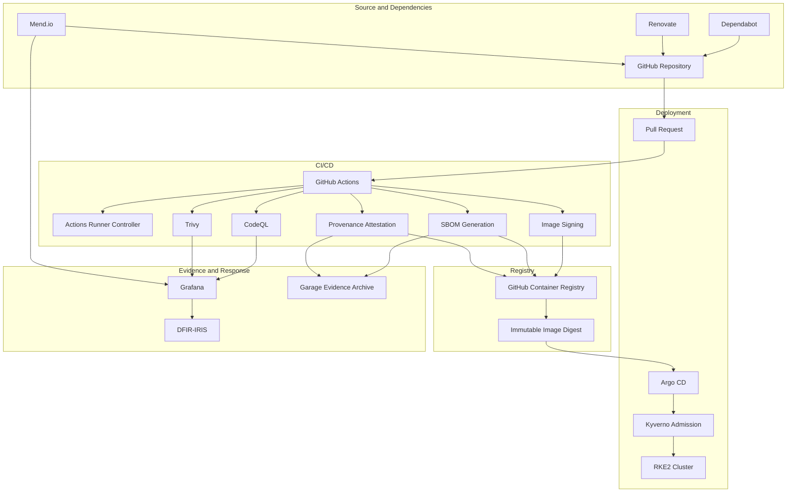
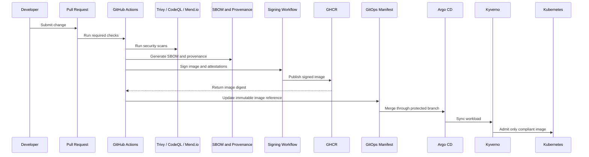
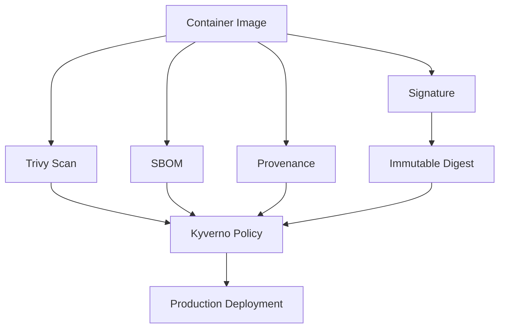
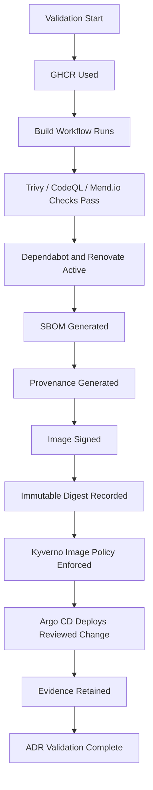

# ADR-0026 — Container Image Supply Chain, Signing, SBOM, and Provenance

**ADR:** ADR-0026  
**Title:** Container Image Supply Chain, Signing, SBOM, and Provenance Operating Model  
**Owner:** SinLess Games LLC (Timothy “Andy” Andrew Pierce / sinless777)  
**Status:** ACCEPTED  
**Date Accepted:** 2026-04-25  
**Last Updated:** 2026-04-25  
**Supersedes:** N/A  
**Superseded By:** N/A  

**Related:**

- [Docs/Architecture/DECISIONS.md](../DECISIONS.md)
- [ADR-0001 — Monorepo Source of Truth](./ADR-0001.md)
- [ADR-0007 — GitOps Controller: Argo CD](./ADR-0007.md)
- [ADR-0016 — Policy-as-Code Enforcement with Kyverno](./ADR-0016.md)
- [ADR-0017 — GitHub Source Control, CI/CD, and Registry Operating Model](./ADR-0017.md)
- [ADR-0020 — Security and Compliance Operating Model](./ADR-0020.md)
- [ADR-0025 — GitHub Actions Runner Controller and Agentic Workflow Operating Model](./ADR-0025.md)

---

## Context

The platform builds, scans, publishes, and deploys container images through the
GitHub-based CI/CD and GitOps workflow.

Container images are a critical software supply chain artifact.

A compromised image, mutable tag, unreviewed dependency, unsigned artifact, or
missing SBOM can directly affect production workloads.

The platform requires controls for:

- source repository integrity
- dependency updates
- dependency vulnerability detection
- container image vulnerability scanning
- image provenance
- SBOM generation
- immutable image references
- image registry access control
- GitOps deployment safety
- admission enforcement
- compliance evidence
- rollback and incident response

The accepted platform tooling includes:

- GitHub
- GitHub Actions
- GitHub Container Registry
- Actions Runner Controller
- Trivy
- CodeQL
- Dependabot
- Renovate
- Mend.io
- Kyverno
- Argo CD
- Vault
- DFIR-IRIS

---

## Decision

Adopt a controlled container image supply chain model using **GitHub Actions**,
**GHCR**, **Trivy**, **CodeQL**, **Dependabot**, **Renovate**, **Mend.io**,
**SBOM generation**, **immutable image references**, and **Kyverno admission
policy enforcement**.

The accepted supply chain model is:

| Area | Accepted Control |
| --- | --- |
| Source control | GitHub |
| CI/CD execution | GitHub Actions and ARC self-hosted runners |
| Container registry | GitHub Container Registry |
| Image scanning | Trivy |
| Static code scanning | CodeQL |
| Dependency security updates | Dependabot |
| Dependency version automation | Renovate |
| SCA and license governance | Mend.io |
| SBOM format | CycloneDX and/or SPDX |
| Image signing | Cosign-compatible signing workflow |
| Provenance | SLSA-style provenance attestations |
| Runtime admission control | Kyverno |
| GitOps deployment | Argo CD |
| Secret custody | Vault |
| Incident response | DFIR-IRIS |

Production workloads must use immutable image references.

Mutable image tags are not accepted for production deployment.

Production image promotion requires successful scan results or an approved
exception.

---

## Supply Chain Architecture



---

## Scope

This ADR governs:

- container image build requirements
- image registry requirements
- image tag and digest requirements
- vulnerability scanning requirements
- static code scanning requirements
- dependency automation requirements
- SBOM requirements
- signing requirements
- provenance requirements
- admission enforcement requirements
- evidence requirements
- rollback requirements
- operational requirements

This ADR does not define:

- every Dockerfile
- every image build workflow
- every Trivy command
- every SBOM generation command
- every Cosign command
- every CodeQL query pack
- every Mend.io policy
- every Renovate package rule
- every Dependabot configuration entry
- every Kyverno image policy manifest

Those items are implementation artifacts managed in GitHub workflows, policy
manifests, build scripts, and security configuration.

---

## Non-Goals

The accepted image supply chain model does not include:

- unscanned production images
- production deployment from mutable tags
- production deployment from unknown registries
- production deployment from unsigned images when signing is enforced
- production deployment without SBOM evidence
- manual image publishing as normal operations
- shared registry credentials across unrelated workflows
- long-lived broad registry tokens
- plaintext registry credentials in Git
- Docker socket mounting as the default build model
- bypassing CI/CD for production image promotion

---

## Responsibility Split

| Area | Responsibility |
| --- | --- |
| Source repository | GitHub |
| CI/CD workflow | GitHub Actions |
| Runner execution | ARC runner scale sets |
| Container registry | GHCR |
| Image vulnerability scanning | Trivy |
| Code scanning | CodeQL |
| Dependency security updates | Dependabot |
| Dependency version updates | Renovate |
| SCA and license governance | Mend.io |
| SBOM generation | CI workflow |
| Image signing | Cosign-compatible CI workflow |
| Provenance generation | CI workflow |
| Runtime admission enforcement | Kyverno |
| Deployment reconciliation | Argo CD |
| Secret custody | Vault |
| Alerting and dashboards | Grafana stack |
| Incident response | DFIR-IRIS |
| Long-term evidence exports | Garage |

---

## Accepted Tooling

| Area | Tool |
| --- | --- |
| Source control | GitHub |
| CI/CD | GitHub Actions |
| Self-hosted runners | Actions Runner Controller |
| Container registry | GitHub Container Registry |
| Image scanning | Trivy |
| IaC and manifest scanning | Trivy |
| Static application security testing | CodeQL |
| Security dependency updates | Dependabot |
| Dependency automation | Renovate |
| SCA and license governance | Mend.io |
| Image signing | Cosign-compatible signing workflow |
| Provenance | SLSA-style provenance attestations |
| SBOM | CycloneDX and/or SPDX |
| Admission policy | Kyverno |
| GitOps | Argo CD |
| Secret management | Vault |
| Evidence archive | Garage |

---

## Alternatives Considered

### A1) GHCR Without Signing or SBOMs

**Pros:**

- simple image publishing workflow
- fewer CI steps
- lower operational complexity

**Cons:**

- weaker artifact traceability
- weaker compliance evidence
- weaker incident investigation data
- harder to prove image contents and build origin
- insufficient for the desired supply chain posture

GHCR without signing or SBOMs is rejected as the production model.

---

### A2) Docker Hub as the Primary Registry

**Pros:**

- common public registry
- broad ecosystem compatibility
- simple pulls for public images

**Cons:**

- less aligned with GitHub repository permissions
- separates source control from package ownership
- adds another registry trust boundary
- conflicts with the accepted GitHub/GHCR operating model

Docker Hub is rejected as the platform-built production image registry.

---

### A3) Self-Hosted Registry

Examples:

- Harbor
- Docker Registry
- GitLab Registry

**Pros:**

- local control
- possible stronger local retention controls
- can support advanced registry policy in some implementations

**Cons:**

- additional stateful service to operate
- additional backup and upgrade burden
- duplicates GHCR functionality
- increases operational complexity

A self-hosted registry is rejected as the primary registry for platform-built
images.

---

### A4) Manual Image Builds

**Pros:**

- simple during local development
- useful for emergency debugging

**Cons:**

- weak auditability
- inconsistent build environment
- no reliable provenance
- no mandatory scans
- high risk of untracked artifacts

Manual image builds are rejected for production images.

---

### A5) CI-Only Enforcement Without Admission Policy

**Pros:**

- simple runtime model
- avoids admission policy complexity

**Cons:**

- image policy can be bypassed by manual cluster changes
- weak runtime enforcement
- no admission evidence
- drift can enter production

CI-only enforcement is rejected.

Kyverno admission enforcement is required.

---

## Rationale

The accepted model protects the container supply chain from source code through
runtime deployment.

### Immutable Deployment References

Production workloads use immutable image references.

This ensures that production deploys a specific image artifact and not a tag
that can later point to different content.

---

### Vulnerability and Misconfiguration Detection

Trivy scans images, filesystems, manifests, and IaC.

Trivy scan results provide CI evidence and block unsafe production promotion.

---

### Static Code Security

CodeQL scans supported source code.

CodeQL findings are handled before production-impacting changes merge.

---

### Dependency Governance

Dependabot handles GitHub-native vulnerable dependency alerts and security
updates.

Renovate handles scheduled dependency, lockfile, container image, Helm chart,
GitHub Actions, and infrastructure version updates.

Mend.io provides software composition analysis, license risk governance, and
dependency risk visibility.

---

### Artifact Traceability

SBOMs, signatures, image digests, and provenance attestations provide evidence
for what was built, where it came from, how it was built, and what it contains.

---

### Runtime Enforcement

Kyverno enforces image policy at admission time.

This prevents unsafe or unauthorized image references from entering production.

---

## Image Build Flow



---

## Registry Requirements

GHCR is the accepted registry for platform-built images.

Production images are published under the GitHub owner namespace.

Required registry controls:

- least-privilege package permissions
- workflow-scoped publish credentials
- no shared broad registry tokens
- no plaintext registry credentials in Git
- image scan before production promotion
- image digest recorded in CI output
- SBOM attached or archived
- provenance attached or archived
- signature attached or verifiable
- production image references immutable

---

## Image Reference Requirements

Production manifests must use immutable image references.

Accepted production image references:

```text
ghcr.io/<owner>/<image>@sha256:<digest>
```

Accepted production tag forms before digest resolution:

```text
vX.Y.Z
YYYY.MM.DD-<shortsha>
sha-<commit>
```

Rejected production tag forms:

```text
latest
main
master
dev
snapshot
nightly
unstable
test
```

Production manifests must not use mutable tags.

Kyverno enforces this requirement.

---

## SBOM Requirements

Every production container image requires an SBOM.

Accepted SBOM formats:

```text
CycloneDX
SPDX
```

SBOMs must include:

- image name
- image digest
- source repository
- commit SHA
- build workflow
- package dependencies
- package versions
- license data where available
- generation timestamp
- generator name and version

SBOMs are stored as CI artifacts, registry artifacts, or Garage evidence
exports.

SBOMs are retained according to the security evidence retention policy.

---

## Provenance Requirements

Every production image requires provenance evidence.

Provenance must record:

- source repository
- commit SHA
- workflow identity
- runner class
- build trigger
- build timestamp
- builder identity
- produced image digest
- build inputs
- build outputs

Provenance is retained as CI evidence, registry-attached attestation, or Garage
evidence export.

Production provenance must be linked to the pull request or release that
produced the image.

---

## Signing Requirements

Production images are signed through a Cosign-compatible signing workflow.

The signing workflow must:

- run in GitHub Actions
- use protected workflow permissions
- use a protected runner class when signing production images
- sign the immutable image digest
- attach or publish the signature
- produce verifiable evidence
- avoid storing private signing keys in Git

Keyless signing is accepted when configured through trusted OIDC identity.

Key-based signing is accepted only when private keys are stored in Vault and
access is restricted.

---

## Verification Requirements

Production image verification is enforced through CI and admission policy.

Verification checks include:

- registry allowlist
- immutable digest reference
- prohibited mutable tags
- vulnerability scan status
- SBOM presence
- provenance presence
- signature presence when signing enforcement is active
- approved exception status

Kyverno enforces image reference and registry policy.

Signature and attestation verification are enforced in CI and admission policy
when the verification controller is deployed.

---

## Vulnerability Management Requirements

Trivy scan results are classified by severity.

| Severity | Production Action |
| --- | --- |
| Critical | Block production promotion unless approved exception exists |
| High | Block production promotion unless approved exception exists |
| Medium | Track and remediate through normal workflow |
| Low | Track through normal workflow |
| Unknown | Review and classify before production promotion when present in critical components |

Critical and high findings require remediation or approved exception before
production deployment.

Exceptions must include:

- finding ID
- image digest
- affected package
- severity
- risk owner
- justification
- compensating control
- expiration date
- approval reference

Expired exceptions are invalid.

---

## Dependency Update Requirements

Dependabot, Renovate, and Mend.io all contribute to dependency governance.

| Tool | Required Function |
| --- | --- |
| Dependabot | Security alerts and security update pull requests |
| Renovate | Scheduled version updates, lockfile updates, image tag updates, Helm updates, GitHub Actions updates |
| Mend.io | SCA, license risk, policy governance, dependency risk reporting |

Dependency update pull requests must pass:

- unit tests where applicable
- build validation
- Trivy scanning
- CodeQL where applicable
- Mend.io policy checks where configured
- manifest validation where deployment paths change

Production-impacting dependency updates require review.

---

## CodeQL Requirements

CodeQL scans supported source code.

CodeQL runs on:

- pull requests affecting supported source code
- protected branch pushes
- scheduled security scans

CodeQL findings classified as high or critical must block production-impacting
changes unless an approved exception exists.

CodeQL alerts are retained as security evidence.

---

## Build Runner Requirements

Container build workflows run on approved runner classes.

Default build runner class:

```text
arc-build
```

Production signing and provenance workflows run on:

```text
arc-prod
```

Runner requirements:

- ephemeral runner pods
- no long-lived workspace
- least-privilege credentials
- no untrusted pull request access to production secrets
- network access restricted by runner class
- runner logs shipped to Loki
- workflow evidence retained

---

## Secret Handling Requirements

Secrets must not be committed to Git.

Sensitive values include:

- registry tokens
- GitHub tokens
- signing keys
- OIDC credentials
- Vault tokens
- webhook URLs
- Trivy credentials where used
- Mend.io tokens
- private package registry credentials
- deployment credentials

Accepted secret storage:

- Vault for infrastructure and signing material
- GitHub Actions secrets for workflow-scoped CI secrets
- GitHub Environment secrets for protected environment secrets
- External Secrets for runtime Kubernetes delivery

---

## Admission Policy Requirements

Kyverno enforces image policy.

Required controls:

- production images must use approved registries
- production images must not use mutable tags
- production workloads must use immutable references or approved version tags resolved before deployment
- production workloads must include owner labels
- production workloads must include image source labels
- unknown registries are blocked
- plaintext image pull secrets in Git are blocked
- production exceptions require approval and expiration

Required approved registry:

```text
ghcr.io
```

Approved image owner namespace:

```text
ghcr.io/sinless777
```

---

## Evidence Requirements

Supply chain evidence must be retained.

Required evidence:

- pull request history
- required review history
- GitHub Actions logs
- GitHub Actions artifacts
- image digest
- Trivy scan report
- CodeQL scan result
- Mend.io policy result
- Dependabot alert or PR history
- Renovate PR history
- SBOM
- provenance attestation
- signature verification result
- GHCR package history
- Argo CD sync history
- Kyverno admission result
- exception records

Evidence is stored in:

- GitHub
- GHCR
- Garage evidence archive
- Grafana/Loki where applicable
- DFIR-IRIS for incident-grade events

---

## Policy Flow



---

## Implementation Requirements

### Repository Paths

Supply chain implementation artifacts are stored under:

```text
.github/workflows/
.github/dependabot.yml
renovate.json5
Policy/
Kubernetes/apps/
Dockerfile
Docs/Architecture/ADRs/
```

---

### Required Workflow Stages

Production image build workflows contain these stages:

| Stage | Requirement |
| --- | --- |
| checkout | Fetch reviewed source |
| build | Build container image |
| scan | Run Trivy image scan |
| code scan | Run CodeQL where applicable |
| dependency policy | Run Mend.io where applicable |
| SBOM | Generate SBOM |
| provenance | Generate provenance evidence |
| sign | Sign immutable image digest |
| publish | Publish image to GHCR |
| attest | Publish or archive attestation |
| output | Record image digest |
| evidence | Upload CI artifacts |

---

### Required Image Labels

Production images must include OCI labels.

Required labels:

```text
org.opencontainers.image.source
org.opencontainers.image.revision
org.opencontainers.image.created
org.opencontainers.image.version
org.opencontainers.image.title
org.opencontainers.image.description
org.opencontainers.image.vendor
```

Platform-specific labels:

```text
security.sinlessgames.io/scanned=true
security.sinlessgames.io/sbom=true
security.sinlessgames.io/provenance=true
```

---

### Required Kubernetes Labels

Workloads using production images must include:

```text
app.kubernetes.io/name=<app-name>
app.kubernetes.io/part-of=<system-name>
app.kubernetes.io/component=<component-name>
app.kubernetes.io/managed-by=argocd
security.sinlessgames.io/image-policy=enforced
environment=prod
```

---

## Validation Requirements

This ADR is valid when the following requirements are met:

- GHCR is used for platform-built images
- production image workflows run in GitHub Actions
- build workflows use approved runner classes
- Trivy scans production images
- CodeQL scans supported source code
- Mend.io evaluates dependency and license policy where configured
- Dependabot security alerts are enabled
- Dependabot security update pull requests are enabled
- Renovate update pull requests are enabled
- production images produce SBOMs
- production images produce provenance evidence
- production images are signed when signing enforcement is active
- production manifests do not use mutable image tags
- production manifests use approved registries
- Kyverno blocks unapproved registries
- Kyverno blocks mutable production tags
- image digests are recorded in CI output
- scan artifacts are retained
- SBOM artifacts are retained
- provenance artifacts are retained
- signature verification evidence is retained
- critical and high findings block production promotion unless approved exceptions exist
- Argo CD deploys only reviewed image changes
- DFIR-IRIS receives incident-grade supply chain events



---

## Rollback Plan

If image build fails:

1. inspect GitHub Actions logs
2. inspect runner pod logs
3. inspect build context
4. restore the last known-good workflow configuration
5. rerun the build workflow
6. keep the last known-good production image deployed

If image scanning fails:

1. inspect the Trivy report
2. identify affected packages
3. remediate the image or dependency
4. create an approved exception only when required
5. rerun the scan
6. block production promotion until scan policy passes

If signing fails:

1. keep the image unpublished from production promotion
2. inspect signing workflow permissions
3. inspect OIDC or Vault signing configuration
4. restore the last known-good signing workflow
5. rerun signing against the immutable image digest
6. verify signature evidence

If SBOM or provenance generation fails:

1. block production promotion
2. inspect generation logs
3. restore the last known-good generation workflow
4. regenerate SBOM or provenance
5. upload evidence artifacts
6. continue promotion only after evidence exists

If GHCR publishing fails:

1. keep the last known-good production image deployed
2. inspect package permissions
3. inspect workflow permissions
4. inspect registry authentication
5. rerun publish workflow
6. verify image digest and scan evidence

If Kyverno blocks a valid production image:

1. inspect the admission denial
2. verify image registry, tag, digest, signature, and labels
3. correct the manifest or policy
4. create an approved exception only when required
5. reconcile through Argo CD
6. verify unauthorized images remain blocked

If a production image is found compromised:

1. stop promotion of the affected image
2. identify all deployments using the affected digest
3. roll back to a known-good image digest
4. rotate exposed credentials if required
5. preserve CI, registry, and runtime evidence
6. create a DFIR-IRIS case
7. rebuild from clean source and dependencies
8. validate scan, SBOM, signature, and provenance before redeployment

A permanent migration away from this supply chain model requires:

- a superseding ADR
- migration plan
- rollback plan
- registry migration procedure
- signing migration procedure
- SBOM migration procedure
- provenance migration procedure
- validation evidence
- updated implementation documentation
- updated runbooks

---

## Operational Requirements

Container image supply chain operation requires:

- GitHub Actions build workflows
- approved ARC runner classes
- GHCR image publishing
- immutable production image references
- Trivy scanning
- CodeQL scanning
- Dependabot alerts and security updates
- Renovate dependency update automation
- Mend.io policy evaluation where configured
- SBOM generation
- provenance generation
- image signing
- registry access control
- Vault-managed secrets
- least-privilege workflow permissions
- Kyverno image admission policy
- production promotion blocking for unresolved critical and high findings
- evidence retention
- exception tracking
- rollback procedures
- DFIR-IRIS case creation for incident-grade supply chain events
