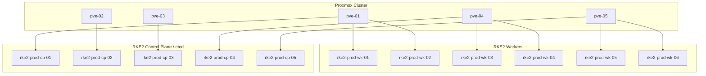
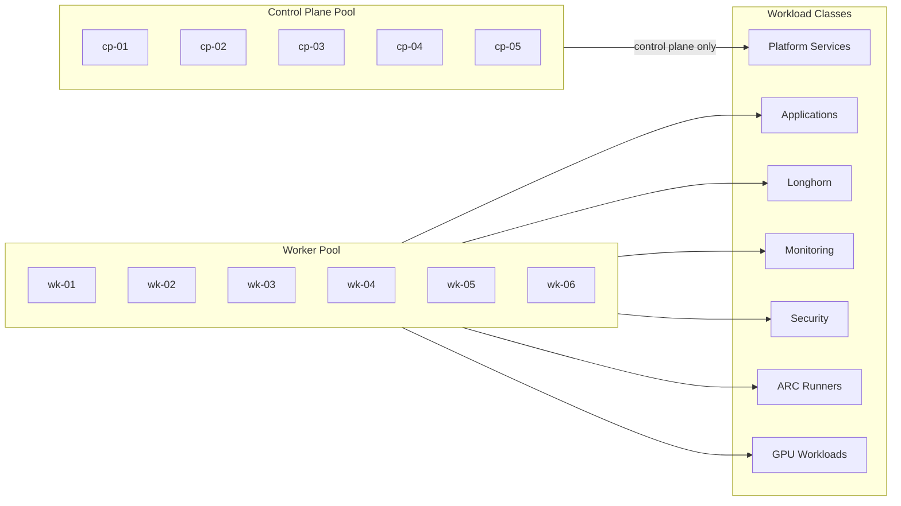
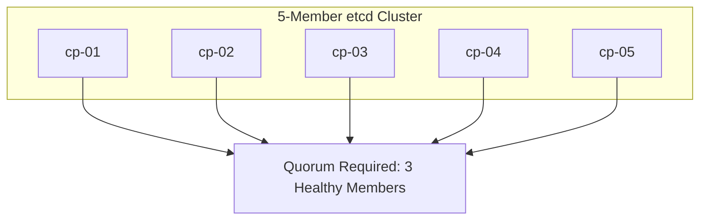
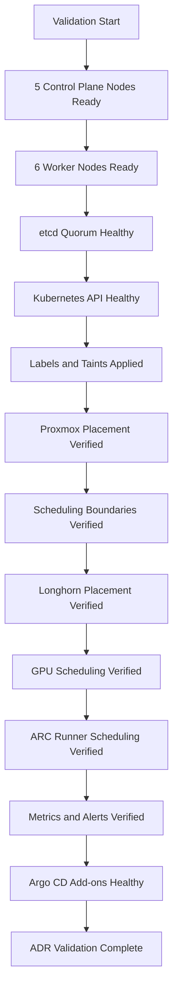

# ADR-0027 — RKE2 Cluster Node Topology and Scheduling Model

**ADR:** ADR-0027  
**Title:** RKE2 Cluster Node Topology and Scheduling Model with 5 Control Plane Nodes and 6 Worker Nodes  
**Owner:** SinLess Games LLC (Timothy “Andy” Andrew Pierce / sinless777)  
**Status:** ACCEPTED  
**Date Accepted:** 2026-04-25  
**Last Updated:** 2026-04-25  
**Supersedes:** N/A  
**Superseded By:** N/A  

**Related:**

- [Docs/Architecture/DECISIONS.md](../DECISIONS.md)
- [ADR-0001 — Monorepo Source of Truth](./ADR-0001.md)
- [ADR-0002 — Proxmox Cluster Topology](./ADR-0002.md)
- [ADR-0003 — Network Segmentation and Planes](./ADR-0003.md)
- [ADR-0006 — Kubernetes Distribution Choice: RKE2](./ADR-0006.md)
- [ADR-0007 — GitOps Controller: Argo CD](./ADR-0007.md)
- [ADR-0013 — Backups and Disaster Recovery with PBS, Velero, and Garage](./ADR-0013.md)
- [ADR-0014 — Observability and Incident Response Platform](./ADR-0014.md)
- [ADR-0016 — Policy-as-Code Enforcement with Kyverno](./ADR-0016.md)
- [ADR-0019 — Management Overlay with WireGuard](./ADR-0019.md)
- [ADR-0021 — Kubernetes Persistent Storage with Longhorn](./ADR-0021.md)
- [ADR-0022 — Database and Stateful Platform Service Placement](./ADR-0022.md)
- [ADR-0023 — Istio Service Mesh Operating Model](./ADR-0023.md)
- [ADR-0025 — GitHub Actions Runner Controller and Agentic Workflow Operating Model](./ADR-0025.md)

---

## Context

The production Kubernetes platform runs on RKE2.

The platform requires a node topology that supports:

- high-availability Kubernetes control plane
- etcd quorum resilience
- clear worker scheduling boundaries
- workload separation
- storage-aware scheduling
- GPU-aware scheduling
- GitOps-managed node labels and taints
- predictable maintenance behavior
- topology-aware workload placement
- Longhorn replica placement across failure domains
- observability and security daemon coverage
- safe production operations

The production RKE2 cluster uses:

```text
5 control plane nodes
6 worker nodes
```

The control plane nodes run RKE2 server components and embedded etcd.

The worker nodes run application workloads, platform workloads, monitoring
workloads, storage workloads, CI runner workloads, and GPU workloads according
to labels, taints, and scheduling policy.

The Proxmox cluster provides the virtualization layer.

RKE2 nodes are provisioned as virtual machines on Proxmox.

---

## Decision

Adopt an RKE2 production cluster topology with **5 control plane nodes** and
**6 worker nodes**.

The accepted production node set is:

| Node | Role | Criticality |
| --- | --- | --- |
| `rke2-prod-cp-01` | control plane, etcd | Tier-0 |
| `rke2-prod-cp-02` | control plane, etcd | Tier-0 |
| `rke2-prod-cp-03` | control plane, etcd | Tier-0 |
| `rke2-prod-cp-04` | control plane, etcd | Tier-0 |
| `rke2-prod-cp-05` | control plane, etcd | Tier-0 |
| `rke2-prod-wk-01` | worker | Tier-1 |
| `rke2-prod-wk-02` | worker | Tier-1 |
| `rke2-prod-wk-03` | worker | Tier-1 |
| `rke2-prod-wk-04` | worker | Tier-1 |
| `rke2-prod-wk-05` | worker | Tier-1 |
| `rke2-prod-wk-06` | worker | Tier-1 |

Control plane nodes are spread across Proxmox hosts.

Worker nodes are spread across Proxmox hosts with additional placement on the
higher-capacity hosts.

The control plane is dedicated to Kubernetes control plane and etcd functions.

General application workloads are scheduled on worker nodes.

GPU workloads are scheduled only on GPU-capable worker nodes.

Storage workloads are scheduled only on storage-approved worker nodes.

CI runner workloads are scheduled only on runner-approved worker nodes.

---

## Cluster Topology



---

## Scope

This ADR governs:

- RKE2 production node count
- control plane topology
- worker node topology
- etcd placement
- Proxmox placement model
- node role boundaries
- labels and taints
- scheduling model
- topology spread requirements
- Longhorn scheduling requirements
- GPU scheduling boundaries
- CI runner scheduling boundaries
- maintenance requirements
- validation requirements
- rollback requirements
- operational requirements

This ADR does not define:

- every VM CPU count
- every VM memory allocation
- every VM disk size
- every IP address
- every Terraform VM resource
- every Ansible host variable
- every workload-specific affinity rule
- every application-specific scheduling policy

Those items are implementation artifacts managed in Terraform, Ansible,
Kubernetes manifests, inventory files, and operations documentation.

---

## Non-Goals

The accepted RKE2 topology does not include:

- single-node Kubernetes
- two-node control plane
- even-numbered etcd membership
- worker workloads on control plane nodes by default
- control plane nodes used as general-purpose workers
- GPU workloads scheduled on non-GPU nodes
- storage workloads scheduled on unapproved nodes
- CI runners scheduled on unrestricted nodes
- manual node labels as normal operations
- manual node taints as normal operations
- untracked VM placement

---

## Responsibility Split

| Area | Responsibility |
| --- | --- |
| VM provisioning | Terraform |
| OS and RKE2 configuration | Ansible |
| Kubernetes distribution | RKE2 |
| Control plane and etcd | RKE2 server nodes |
| Workload execution | RKE2 worker nodes |
| GitOps reconciliation | Argo CD |
| Persistent storage | Longhorn |
| Backup and DR | PBS, Velero, Longhorn, Garage |
| Scheduling policy | Node labels, taints, affinity, topology spread |
| Admission policy | Kyverno |
| Observability | Grafana stack |
| Runtime security | Falco and Wazuh |
| CI runner scheduling | Actions Runner Controller |

---

## Accepted Tooling

| Area | Tool |
| --- | --- |
| Hypervisor | Proxmox |
| Kubernetes distribution | RKE2 |
| Infrastructure provisioning | Terraform |
| Configuration management | Ansible |
| GitOps controller | Argo CD |
| CNI | Cilium |
| Service mesh | Istio |
| Persistent storage | Longhorn |
| Object storage | Garage |
| Backup | PBS, Velero, Longhorn backups |
| Policy enforcement | Kyverno |
| Observability | Grafana, Prometheus, Mimir, Loki |
| Runtime security | Falco, Wazuh |
| CI runners | Actions Runner Controller |

---

## Alternatives Considered

### A1) 3 Control Plane Nodes and 3 Worker Nodes

**Pros:**

- smaller resource footprint
- simpler operations
- fewer VMs
- easier initial bootstrap

**Cons:**

- less control plane resilience
- fewer worker scheduling targets
- less room for workload separation
- less capacity for storage, monitoring, runners, and platform services
- weaker maintenance flexibility

A 3 control plane and 3 worker topology is rejected for the production target.

---

### A2) 3 Control Plane Nodes and 6 Worker Nodes

**Pros:**

- adequate etcd quorum
- larger worker pool
- lower control plane footprint than 5 control plane nodes

**Cons:**

- lower etcd failure tolerance
- fewer control plane failure domains
- less aligned with the accepted production control plane resilience target

A 3 control plane and 6 worker topology is rejected for production.

---

### A3) 5 Control Plane Nodes and 3 Worker Nodes

**Pros:**

- strong control plane resilience
- smaller worker footprint

**Cons:**

- insufficient worker capacity for platform services, applications, storage,
  monitoring, CI runners, and GPU workloads
- weaker scheduling flexibility
- more pressure on each worker during maintenance

A 5 control plane and 3 worker topology is rejected.

---

### A4) Control Plane Nodes Also Run General Workloads

**Pros:**

- better raw resource utilization
- fewer required worker nodes
- easier small-cluster deployment

**Cons:**

- weakens control plane isolation
- risks etcd and API server stability
- increases blast radius from application workloads
- complicates maintenance and scheduling

Running general workloads on control plane nodes is rejected as the production
standard.

---

### A5) Bare-Metal Kubernetes Nodes

**Pros:**

- direct hardware access
- reduced virtualization overhead
- simpler disk passthrough for selected storage cases

**Cons:**

- less flexible lifecycle management
- harder rollback and VM-level backup workflows
- less aligned with Terraform-managed Proxmox provisioning
- weaker isolation from host changes

Bare-metal RKE2 nodes are rejected for the current production model.

---

## Rationale

The 5 control plane and 6 worker topology is selected because it provides strong
control plane resilience while leaving enough worker capacity for production
workloads and platform services.

### etcd Quorum Resilience

A 5-member etcd control plane can tolerate loss of two etcd members while
maintaining quorum.

This improves resilience during:

- Proxmox host maintenance
- control plane node reboots
- RKE2 upgrades
- VM failures
- node patching
- hardware maintenance

---

### Control Plane Isolation

Control plane nodes are dedicated to Kubernetes control plane functions.

This protects:

- Kubernetes API server
- scheduler
- controller-manager
- etcd
- RKE2 server components

Application workloads do not run on control plane nodes by default.

---

### Worker Capacity

Six worker nodes provide enough scheduling surface for:

- application workloads
- monitoring workloads
- security workloads
- Longhorn storage workloads
- Istio ingress and sidecars
- Actions Runner Controller runners
- GPU workloads
- maintenance disruption tolerance

---

### Failure Domain Awareness

Control plane and worker nodes are distributed across Proxmox hosts.

Topology labels allow workloads and Longhorn replicas to avoid concentrating on
one host or failure domain.

---

### Maintenance Flexibility

The topology supports node draining and maintenance while keeping enough
capacity available for critical workloads.

Worker node maintenance does not require using control plane nodes as general
workload capacity.

---

## Node Placement Requirements

The production placement model is:

| Proxmox Host | Control Plane | Workers |
| --- | --- | --- |
| `pve-01` | `rke2-prod-cp-01` | `rke2-prod-wk-01`, `rke2-prod-wk-02` |
| `pve-02` | `rke2-prod-cp-02` | N/A |
| `pve-03` | `rke2-prod-cp-03` | N/A |
| `pve-04` | `rke2-prod-cp-04` | `rke2-prod-wk-03`, `rke2-prod-wk-04` |
| `pve-05` | `rke2-prod-cp-05` | `rke2-prod-wk-05`, `rke2-prod-wk-06` |

This placement uses all five Proxmox hosts for control plane quorum and places
worker capacity on the higher-capacity worker hosts.

Placement is managed through Terraform and documented in inventory.

---

## Control Plane Requirements

Control plane nodes run RKE2 server components.

Required control plane node names:

```text
rke2-prod-cp-01
rke2-prod-cp-02
rke2-prod-cp-03
rke2-prod-cp-04
rke2-prod-cp-05
```

Control plane nodes must have:

- stable static IP addresses
- stable DNS records
- etcd member identity
- RKE2 server configuration
- monitoring agent
- Wazuh agent
- backup coverage where required
- management access through WireGuard or internal networks
- no general application workload scheduling by default

Control plane nodes must be tainted to prevent general workload scheduling.

Required taint:

```text
node-role.kubernetes.io/control-plane=true:NoSchedule
```

---

## Worker Requirements

Worker nodes run non-control-plane workloads.

Required worker node names:

```text
rke2-prod-wk-01
rke2-prod-wk-02
rke2-prod-wk-03
rke2-prod-wk-04
rke2-prod-wk-05
rke2-prod-wk-06
```

Worker nodes must have:

- stable static IP addresses
- stable DNS records
- RKE2 agent configuration
- monitoring agent
- Wazuh agent
- Longhorn scheduling labels where applicable
- GPU labels where applicable
- runner labels where applicable
- workload topology labels
- management access through WireGuard or internal networks

---

## Node Role Model



Control plane nodes do not run general application workloads.

System-critical control plane workloads remain on control plane nodes as
required by RKE2.

---

## Required Node Labels

All nodes must have platform labels.

Required labels:

```text
environment=prod
cluster=rke2-prod
infrastructure.sinlessgames.io/hypervisor=proxmox
topology.kubernetes.io/region=homelab
```

Each node must include a Proxmox host label:

```text
topology.kubernetes.io/zone=<pve-host>
```

Accepted zone values:

```text
pve-01
pve-02
pve-03
pve-04
pve-05
```

Control plane nodes require:

```text
node-role.kubernetes.io/control-plane=true
node-role.kubernetes.io/etcd=true
rke2.sinlessgames.io/node-pool=control-plane
```

Worker nodes require:

```text
node-role.kubernetes.io/worker=true
rke2.sinlessgames.io/node-pool=worker
```

---

## Specialized Node Labels

Storage-capable nodes use:

```text
storage.sinlessgames.io/longhorn=true
```

Fast-storage-capable nodes use:

```text
storage.sinlessgames.io/fast=true
```

GPU-capable nodes use:

```text
hardware.sinlessgames.io/gpu=true
```

NVIDIA GPU nodes use:

```text
nvidia.com/gpu.present=true
```

ARC runner-approved nodes use:

```text
ci.sinlessgames.io/runners=true
```

Ingress-capable nodes use:

```text
networking.sinlessgames.io/ingress=true
```

Security workload nodes use:

```text
security.sinlessgames.io/runtime=true
```

---

## Required Taints

Control plane nodes are tainted:

```text
node-role.kubernetes.io/control-plane=true:NoSchedule
```

GPU-only nodes are tainted when dedicated GPU isolation is required:

```text
hardware.sinlessgames.io/gpu=true:NoSchedule
```

ARC production runner nodes are tainted when dedicated runner isolation is
required:

```text
ci.sinlessgames.io/prod-runners=true:NoSchedule
```

Storage-only nodes are tainted when storage isolation is required:

```text
storage.sinlessgames.io/longhorn-only=true:NoSchedule
```

Taints must be declared through automation and documented in inventory.

---

## Scheduling Model

Workloads are scheduled by class.

| Workload Class | Scheduling Target |
| --- | --- |
| Kubernetes control plane | control plane nodes |
| etcd | control plane nodes |
| General applications | worker nodes |
| Istio ingress gateway | ingress-capable worker nodes |
| Monitoring backends | worker nodes with storage capacity |
| Loki, Mimir, Tempo, Pyroscope | worker nodes with storage capacity |
| Longhorn | storage-approved worker nodes |
| Garage | storage-approved worker nodes |
| ARC runners | runner-approved worker nodes |
| GPU workloads | GPU-capable worker nodes |
| Security DaemonSets | all applicable nodes |
| Wazuh agents | all applicable nodes and VMs |
| Falco | Kubernetes worker nodes and approved nodes |

---

## Topology Spread Requirements

Production workloads must use topology-aware placement.

Required topology keys:

```text
topology.kubernetes.io/zone
kubernetes.io/hostname
```

Highly available workloads must not place all replicas on the same Kubernetes
node or Proxmox host.

Critical workloads require topology spread constraints or anti-affinity.

Critical workload classes include:

- Grafana
- Mimir
- Loki
- Tempo
- Pyroscope
- Argo CD
- Istio ingress gateway
- DFIR-IRIS
- Garage
- Longhorn-managed stateful workloads
- application services with more than one replica

---

## Longhorn Scheduling Requirements

Longhorn runs only on storage-approved worker nodes.

Longhorn replica placement must not place all replicas on one Kubernetes node or
one Proxmox host.

Longhorn storage nodes require:

```text
storage.sinlessgames.io/longhorn=true
```

Critical Longhorn volumes require at least two replicas.

Critical platform data uses three replicas when capacity allows.

Longhorn must not schedule application data on control plane nodes.

---

## GPU Scheduling Requirements

GPU workloads run only on GPU-capable workers.

GPU workloads require:

```text
nvidia.com/gpu
```

GPU workers require labels:

```text
hardware.sinlessgames.io/gpu=true
nvidia.com/gpu.present=true
```

GPU workloads must use tolerations when the GPU worker is tainted.

GPU scheduling details are governed by ADR-0028.

---

## ARC Runner Scheduling Requirements

GitHub Actions runner pods run only on runner-approved workers.

Runner-approved workers require:

```text
ci.sinlessgames.io/runners=true
```

Production runner workloads use dedicated labels and taints where required.

ARC runner scheduling details are governed by ADR-0025.

---

## Ingress Scheduling Requirements

Istio ingress gateway workloads run on ingress-capable workers.

Ingress-capable workers require:

```text
networking.sinlessgames.io/ingress=true
```

Ingress gateway workloads require topology spread across Proxmox hosts where
replicas are greater than one.

Ingress gateway workloads must not run on control plane nodes.

---

## Security Workload Requirements

Security workloads must cover the required node set.

Falco runs on applicable Kubernetes nodes.

Wazuh monitors Proxmox hosts, platform VMs, and Kubernetes nodes where
implemented.

Trivy, CodeQL, Dependabot, Renovate, and Mend.io operate through the CI and
source control path.

Security workload scheduling must not bypass node role boundaries.

---

## Upgrade and Maintenance Requirements

Control plane maintenance must preserve etcd quorum.

A 5-node etcd control plane requires at least 3 healthy etcd members for quorum.

Maintenance requirements:

- drain one control plane node at a time
- verify etcd health before and after maintenance
- verify Kubernetes API health before and after maintenance
- drain one worker failure domain at a time
- verify Longhorn replica health before draining storage nodes
- verify workload disruption budgets before draining nodes
- verify Argo CD health after maintenance
- verify observability coverage after maintenance

---

## Control Plane Quorum



The control plane can tolerate the loss of two etcd members while maintaining
quorum.

The cluster must not intentionally take more than two etcd members offline at
the same time.

---

## Backup and Recovery Requirements

RKE2 node VMs are covered by infrastructure backup policy where required.

Control plane recovery must include:

- etcd snapshot strategy
- RKE2 server configuration backup
- Proxmox VM backup where required
- Ansible inventory
- Terraform state
- static IP and DNS record preservation
- certificate and token custody

Worker recovery must include:

- RKE2 agent configuration
- node labels
- node taints
- Longhorn disk mount configuration where applicable
- GPU configuration where applicable
- runner scheduling configuration where applicable
- Proxmox VM backup where required

Persistent application recovery is governed by ADR-0021.

---

## Network Requirements

RKE2 nodes must use approved VLAN and network placement.

Required node network properties:

- static IP address
- stable DNS record
- internal management access
- Kubernetes API access
- CNI traffic support
- service mesh traffic support
- storage traffic support where applicable
- monitoring traffic support
- no direct public management exposure

Node management access uses WireGuard or internal management networks.

---

## Security Requirements

RKE2 nodes must follow the platform security baseline.

Required controls:

- SSH restricted to approved management paths
- Wazuh monitoring where implemented
- no direct public node access
- patched operating system
- controlled sudo access
- no unmanaged local users
- least-privilege service configuration
- CIS-aligned hardening where implemented
- Kubernetes admission enforcement through Kyverno
- runtime monitoring through Falco where applicable
- audit logs collected where configured

---

## Observability Requirements

RKE2 node health must be visible in Grafana.

Required dashboards:

- node readiness
- node CPU usage
- node memory usage
- node disk usage
- node network throughput
- pod density
- workload distribution
- control plane health
- etcd health
- API server health
- scheduler health
- controller-manager health
- kubelet health
- Cilium health
- Longhorn node storage health
- GPU node health where applicable
- ARC runner node health where applicable

Required alerts:

- node not ready
- control plane node down
- worker node down
- etcd member unhealthy
- etcd quorum risk
- API server unavailable
- kubelet unavailable
- high memory pressure
- high disk pressure
- high CPU saturation
- pod scheduling failures
- Longhorn replica scheduling failure
- GPU node unhealthy
- runner node unhealthy

---

## Implementation Requirements

### Provisioning

RKE2 node VMs are provisioned through Terraform.

Terraform must define:

- VM name
- VM ID
- Proxmox host
- CPU
- memory
- disk
- network interface
- IP address
- DNS name
- boot image/template
- placement metadata
- backup inclusion

---

### Configuration

RKE2 nodes are configured through Ansible.

Ansible must define:

- OS baseline
- users
- SSH policy
- packages
- kernel settings
- RKE2 server configuration
- RKE2 agent configuration
- CNI configuration
- node labels
- node taints
- monitoring agents
- Wazuh agent
- storage mounts
- GPU prerequisites where applicable

---

### GitOps

Cluster add-ons and workloads are reconciled by Argo CD after node bootstrap.

Argo CD manages:

- Cilium
- Istio
- cert-manager
- ExternalDNS
- Longhorn
- monitoring
- security workloads
- applications
- ARC runners
- policy resources

---

### Required Inventory

The infrastructure inventory must include:

- Proxmox host
- RKE2 node name
- RKE2 role
- IP address
- DNS name
- CPU
- memory
- disk
- labels
- taints
- storage role
- GPU role
- runner role
- maintenance priority

---

## Validation Requirements

This ADR is valid when the following requirements are met:

- 5 RKE2 control plane nodes exist
- 6 RKE2 worker nodes exist
- all control plane nodes are Ready
- all worker nodes are Ready
- all control plane nodes are etcd members
- etcd quorum is healthy
- Kubernetes API is healthy
- control plane nodes are tainted against general workloads
- general workloads schedule on worker nodes
- node labels are applied correctly
- node taints are applied correctly
- Proxmox placement matches the accepted topology
- Longhorn schedules only on approved storage nodes
- GPU workloads schedule only on GPU-capable nodes
- ARC runners schedule only on runner-approved nodes
- Istio ingress gateway schedules only on ingress-approved nodes
- topology spread constraints distribute critical workloads
- node metrics are visible in Grafana
- etcd metrics are visible in Grafana
- node alerts route to configured receivers
- RKE2 node access is restricted to approved management paths
- Argo CD reports cluster add-ons as healthy



---

## Rollback Plan

If a control plane node fails:

1. verify etcd quorum
2. verify Kubernetes API availability
3. isolate the failed node
4. inspect VM health in Proxmox
5. restore the VM from PBS if required
6. rejoin the node as an RKE2 server if required
7. verify etcd member health
8. verify API server health
9. verify node labels and taints
10. verify Grafana alerts clear

If etcd quorum is at risk:

1. stop control plane maintenance immediately
2. identify unhealthy etcd members
3. preserve existing etcd data
4. restore failed members one at a time
5. use RKE2 etcd snapshot recovery only when required
6. verify quorum before resuming normal operations

If a worker node fails:

1. verify workload rescheduling
2. verify Longhorn volume health
3. isolate the failed worker
4. inspect VM health in Proxmox
5. restore the VM from PBS if required
6. rejoin the node as an RKE2 agent if required
7. reapply labels and taints through automation
8. verify workloads return to healthy state

If scheduling boundaries fail:

1. identify the workload scheduled incorrectly
2. cordon the affected node if required
3. correct labels, taints, tolerations, affinity, or topology spread rules
4. reconcile configuration through GitOps or Ansible
5. evict or restart the workload as required
6. verify policy enforcement

If Longhorn scheduling fails:

1. inspect Longhorn node and disk status
2. inspect storage labels
3. inspect replica scheduling errors
4. restore correct node labels
5. verify replica placement across failure domains
6. verify backup freshness

If a permanent topology change is required:

- create a superseding ADR
- define the new node count
- define the new Proxmox placement
- define migration steps
- define rollback steps
- update Terraform inventory
- update Ansible inventory
- update Kubernetes labels and taints
- update validation evidence

---

## Operational Requirements

The RKE2 production cluster requires:

- 5 control plane nodes
- 6 worker nodes
- odd-numbered etcd membership
- control plane node isolation
- worker-only general workload scheduling
- Proxmox placement documentation
- Terraform-managed VM provisioning
- Ansible-managed node configuration
- GitOps-managed add-ons
- stable IP addresses
- stable DNS records
- required node labels
- required node taints
- topology spread constraints for critical workloads
- Longhorn storage labels
- GPU node labels where applicable
- ARC runner node labels where applicable
- ingress node labels where applicable
- Wazuh monitoring
- Grafana dashboards
- alert rules
- etcd snapshot procedure
- control plane maintenance procedure
- worker maintenance procedure
- node replacement procedure
- validated recovery procedure