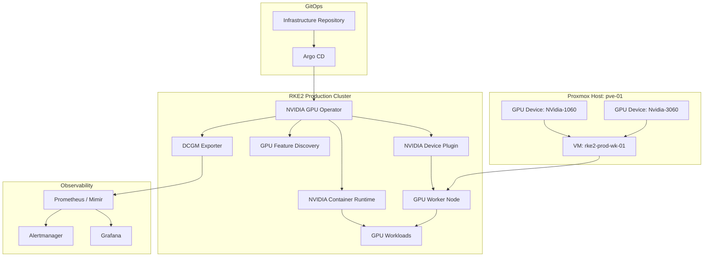
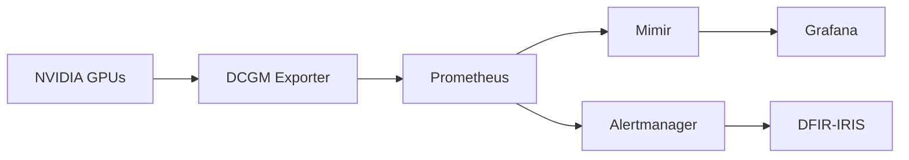
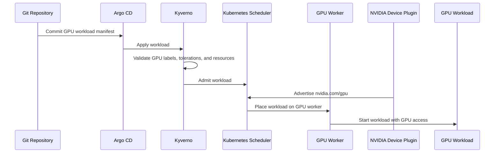
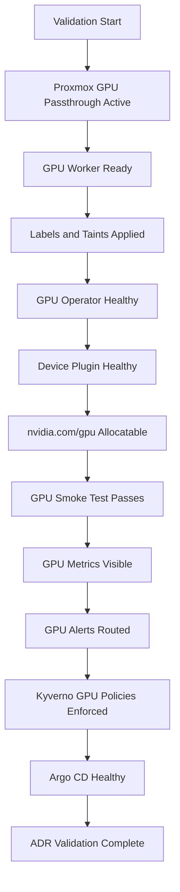

# ADR-0028 — NVIDIA GPU Worker and Runtime Model

**ADR:** ADR-0028  
**Title:** NVIDIA GPU Worker and Runtime Model for RKE2 Workloads  
**Owner:** SinLess Games LLC (Timothy “Andy” Andrew Pierce / sinless777)  
**Status:** ACCEPTED  
**Date Accepted:** 2026-04-25  
**Last Updated:** 2026-04-25  
**Supersedes:** N/A  
**Superseded By:** N/A  

**Related:**

- [Docs/Architecture/DECISIONS.md](../DECISIONS.md)
- [ADR-0001 — Monorepo Source of Truth](./ADR-0001.md)
- [ADR-0002 — Proxmox Cluster Topology](./ADR-0002.md)
- [ADR-0006 — Kubernetes Distribution Choice: RKE2](./ADR-0006.md)
- [ADR-0007 — GitOps Controller: Argo CD](./ADR-0007.md)
- [ADR-0014 — Observability and Incident Response Platform](./ADR-0014.md)
- [ADR-0016 — Policy-as-Code Enforcement with Kyverno](./ADR-0016.md)
- [ADR-0020 — Security and Compliance Operating Model](./ADR-0020.md)
- [ADR-0021 — Kubernetes Persistent Storage with Longhorn](./ADR-0021.md)
- [ADR-0025 — GitHub Actions Runner Controller and Agentic Workflow Operating Model](./ADR-0025.md)
- [ADR-0027 — RKE2 Cluster Node Topology and Scheduling Model](./ADR-0027.md)

---

## Context

The production RKE2 platform requires GPU compute capacity for workloads that
need hardware acceleration.

GPU workloads include:

- AI inference workloads
- model-serving workloads
- batch processing workloads
- media processing workloads
- game/backend simulation workloads where GPU acceleration is required
- experimentation workloads that require CUDA-capable devices

The Proxmox host `pve-01` contains NVIDIA GPUs that are allocated to the RKE2
cluster through PCI passthrough.

The required Proxmox GPU device names are:

```text
NVidia-1060
Nvidia-3060
```

The RKE2 production cluster topology uses:

```text
5 control plane nodes
6 worker nodes
```

GPU workloads must not be scheduled onto general-purpose worker nodes.

GPU workloads must only run on GPU-capable worker nodes with explicit labels,
taints, tolerations, runtime support, and resource requests.

The GPU platform must be managed through GitOps and validated through
Kubernetes-native scheduling and observability.

---

## Decision

Adopt a dedicated NVIDIA GPU worker model for RKE2.

The accepted GPU model is:

| Area | Decision |
| --- | --- |
| GPU source host | `pve-01` |
| Proxmox GPU devices | `NVidia-1060`, `Nvidia-3060` |
| Kubernetes GPU node | `rke2-prod-wk-01` |
| GPU scheduling model | explicit labels, taints, tolerations, and `nvidia.com/gpu` requests |
| GPU runtime management | NVIDIA GPU Operator |
| Kubernetes GPU exposure | NVIDIA device plugin through the GPU Operator |
| GPU monitoring | DCGM metrics through the GPU Operator and Grafana stack |
| Deployment management | Argo CD |
| Policy enforcement | Kyverno |
| Host provisioning | Terraform and Ansible |
| Runtime security | Wazuh, Falco, Trivy, and Kyverno |

The dedicated GPU worker is:

```text
rke2-prod-wk-01
```

The GPU worker runs on:

```text
pve-01
```

The accepted GPU devices attached to the GPU worker are:

```text
NVidia-1060
Nvidia-3060
```

GPU workloads are isolated from normal workloads through taints and tolerations.

GPU workloads must explicitly request GPU resources.

General workloads must not tolerate GPU worker taints unless they are approved
GPU-support workloads.

---

## GPU Architecture



---

## Scope

This ADR governs:

- GPU passthrough from Proxmox to RKE2 worker VMs
- accepted GPU worker placement
- NVIDIA GPU Operator usage
- GPU node labels
- GPU node taints
- GPU workload tolerations
- GPU resource requests
- GPU runtime class requirements
- GPU monitoring requirements
- GPU security requirements
- GPU validation requirements
- GPU rollback requirements
- GPU operational requirements

This ADR does not define:

- every Proxmox host BIOS setting
- every PCI bus ID
- every CUDA image
- every ML workload
- every model-serving stack
- every GPU application deployment
- every GPU benchmark
- every GPU driver version
- every NVIDIA Helm value

Those items are implementation artifacts managed in Terraform, Ansible,
Kubernetes manifests, inventory, and operational runbooks.

---

## Non-Goals

The accepted GPU model does not include:

- GPU scheduling on control plane nodes
- GPU scheduling on non-GPU worker nodes
- untainted GPU worker nodes
- implicit GPU access without `nvidia.com/gpu` requests
- Docker socket mounting for GPU workloads
- privileged GPU workloads by default
- public exposure of GPU workload administrative endpoints
- unmanaged manual NVIDIA driver installation as normal operations
- general workloads running on dedicated GPU nodes without approval
- sharing production GPU credentials across workloads
- using GPU nodes as default CI runners unless explicitly approved

---

## Responsibility Split

| Area | Responsibility |
| --- | --- |
| Physical GPU host | Proxmox `pve-01` |
| GPU passthrough | Proxmox VM hardware configuration |
| GPU worker VM | `rke2-prod-wk-01` |
| VM provisioning | Terraform |
| OS and RKE2 configuration | Ansible |
| GPU runtime management | NVIDIA GPU Operator |
| GPU resource advertisement | NVIDIA device plugin |
| GPU feature labels | GPU Feature Discovery |
| GPU metrics | DCGM exporter |
| GitOps reconciliation | Argo CD |
| Workload scheduling | Kubernetes scheduler |
| Policy enforcement | Kyverno |
| Monitoring | Grafana, Prometheus, Mimir |
| Runtime detection | Falco and Wazuh |
| Image scanning | Trivy |
| Incident response | DFIR-IRIS |

---

## Accepted Tooling

| Area | Tool |
| --- | --- |
| Hypervisor | Proxmox |
| Kubernetes distribution | RKE2 |
| GPU runtime | NVIDIA GPU Operator |
| GPU device exposure | NVIDIA Kubernetes device plugin |
| GPU feature labeling | GPU Feature Discovery |
| GPU monitoring | DCGM exporter |
| GitOps | Argo CD |
| Configuration management | Ansible |
| VM provisioning | Terraform |
| Admission policy | Kyverno |
| Metrics | Prometheus and Mimir |
| Dashboards | Grafana |
| Logs | Loki |
| Runtime security | Falco and Wazuh |
| Image scanning | Trivy |

---

## Alternatives Considered

### A1) No GPU Support in Kubernetes

**Pros:**

- simpler cluster operations
- no GPU driver lifecycle
- no PCI passthrough complexity
- lower worker isolation requirements

**Cons:**

- no hardware acceleration for AI, media, or simulation workloads
- limits future platform capabilities
- prevents GPU-backed experimentation inside Kubernetes

No Kubernetes GPU support is rejected.

---

### A2) Bare-Metal GPU Kubernetes Node

**Pros:**

- direct hardware access
- no VM passthrough layer
- simpler GPU detection in some cases

**Cons:**

- less aligned with the Proxmox-managed infrastructure model
- weaker VM rollback workflow
- less consistent with Terraform-managed RKE2 node provisioning
- harder to isolate from host lifecycle operations

Bare-metal GPU worker placement is rejected for the current platform model.

---

### A3) Manual NVIDIA Device Plugin Only

**Pros:**

- smaller Kubernetes footprint
- simpler than the full GPU Operator
- direct control over device plugin deployment

**Cons:**

- leaves more driver, runtime, toolkit, feature discovery, and monitoring work
  to manual configuration
- weaker lifecycle automation
- more operational drift risk
- less complete GitOps-managed GPU stack

Manual device-plugin-only deployment is rejected as the standard model.

---

### A4) GPU Operator on All Workers

**Pros:**

- uniform deployment across worker nodes
- easier initial Helm configuration

**Cons:**

- unnecessary GPU management on CPU-only workers
- avoidable daemon overhead
- weaker scheduling clarity
- higher operational noise

GPU Operator behavior must be scoped to GPU-capable nodes through node labels,
node selectors, and operator configuration.

---

### A5) Shared GPU Worker for General Workloads

**Pros:**

- better raw node utilization
- less idle capacity

**Cons:**

- general workloads can consume GPU node CPU, memory, and I/O
- GPU workload scheduling becomes less predictable
- debugging is harder
- resource contention increases

General workload scheduling on GPU workers is rejected by default.

---

## Rationale

The dedicated GPU worker model provides GPU capacity while preserving clear
scheduling boundaries and operational control.

### Explicit GPU Scheduling

GPU workloads must request GPU resources explicitly.

This prevents accidental scheduling onto GPU nodes and prevents GPU workloads
from running without the required hardware.

---

### Proxmox Integration

The GPU devices physically live on `pve-01`.

PCI passthrough into the dedicated RKE2 worker VM allows the platform to keep the
VM-based RKE2 operating model while still exposing hardware acceleration to
Kubernetes.

---

### GitOps-Managed GPU Runtime

The NVIDIA GPU Operator is deployed through Argo CD.

This keeps the GPU software stack declared in Git and reconciled like other
platform components.

---

### Workload Isolation

GPU worker taints prevent general workloads from consuming GPU node capacity.

GPU workload tolerations are required and reviewed through Git.

---

### Observability

DCGM metrics expose GPU health and utilization to the observability stack.

Grafana dashboards and alerts provide operational visibility for GPU workloads.

---

## Proxmox GPU Passthrough Requirements

The Proxmox GPU devices assigned to the GPU worker are:

```text
NVidia-1060
Nvidia-3060
```

The GPU worker VM is:

```text
rke2-prod-wk-01
```

The Proxmox host is:

```text
pve-01
```

GPU passthrough configuration must be managed as infrastructure configuration.

Required passthrough controls:

- IOMMU enabled on the Proxmox host
- GPU devices isolated for passthrough
- GPU devices assigned to the GPU worker VM
- GPU worker VM configured for PCI passthrough
- host does not bind passthrough GPUs for host display workloads
- GPU assignment documented in inventory
- VM restart procedure documented
- Proxmox backup behavior documented for the GPU worker VM

---

## Kubernetes Node Requirements

The GPU worker node is:

```text
rke2-prod-wk-01
```

Required GPU node labels:

```text
node-role.kubernetes.io/worker=true
hardware.sinlessgames.io/gpu=true
hardware.sinlessgames.io/gpu-vendor=nvidia
hardware.sinlessgames.io/gpu-host=pve-01
nvidia.com/gpu.present=true
rke2.sinlessgames.io/node-pool=gpu-worker
```

Required topology labels:

```text
environment=prod
cluster=rke2-prod
topology.kubernetes.io/region=homelab
topology.kubernetes.io/zone=pve-01
```

Required GPU node taint:

```text
hardware.sinlessgames.io/gpu=true:NoSchedule
```

GPU node labels and taints are managed through Ansible or approved Kubernetes
automation.

Manual label and taint drift must be corrected by automation.

---

## GPU Scheduling Model

GPU workloads must use:

- node selector or node affinity for GPU nodes
- toleration for the GPU node taint
- `nvidia.com/gpu` resource request and limit
- explicit resource requests for CPU and memory
- explicit resource limits where appropriate
- owner labels
- runbook annotation
- observability labels

Required GPU workload toleration:

```yaml
tolerations:
  - key: hardware.sinlessgames.io/gpu
    operator: Equal
    value: "true"
    effect: NoSchedule
```

Required GPU resource request pattern:

```yaml
resources:
  limits:
    nvidia.com/gpu: 1
```

GPU resources are requested as limits because Kubernetes extended resources are
scheduled through resource limits.

---

## GPU Workload Example

```yaml
apiVersion: batch/v1
kind: Job
metadata:
  name: gpu-smoke-test
  namespace: gpu-workloads
  labels:
    app.kubernetes.io/name: gpu-smoke-test
    app.kubernetes.io/part-of: gpu-validation
    app.kubernetes.io/component: validation
    environment: prod
spec:
  template:
    metadata:
      labels:
        app.kubernetes.io/name: gpu-smoke-test
        app.kubernetes.io/part-of: gpu-validation
        app.kubernetes.io/component: validation
        environment: prod
    spec:
      restartPolicy: Never
      nodeSelector:
        hardware.sinlessgames.io/gpu: "true"
        hardware.sinlessgames.io/gpu-vendor: nvidia
      tolerations:
        - key: hardware.sinlessgames.io/gpu
          operator: Equal
          value: "true"
          effect: NoSchedule
      containers:
        - name: nvidia-smi
          image: nvidia/cuda:12.4.1-base-ubuntu22.04
          command:
            - nvidia-smi
          resources:
            requests:
              cpu: 100m
              memory: 128Mi
            limits:
              cpu: 500m
              memory: 512Mi
              nvidia.com/gpu: 1
          securityContext:
            allowPrivilegeEscalation: false
            capabilities:
              drop:
                - ALL
```

---

## RuntimeClass Requirements

The GPU runtime must be configured by the NVIDIA GPU Operator.

GPU workloads use the standard Kubernetes runtime unless the implementation
defines a specific NVIDIA RuntimeClass.

If a GPU RuntimeClass is deployed, the accepted name is:

```text
nvidia
```

GPU workloads that require the RuntimeClass must declare:

```yaml
runtimeClassName: nvidia
```

RuntimeClass usage must be consistent across GPU workloads.

---

## NVIDIA GPU Operator Requirements

The NVIDIA GPU Operator is deployed through Argo CD.

Required namespace:

```text
gpu-operator
```

Required GitOps path:

```text
Kubernetes/apps/prod/gpu/nvidia-gpu-operator
```

The GPU Operator must manage or integrate the following components:

- NVIDIA driver handling
- NVIDIA Container Toolkit
- NVIDIA Kubernetes device plugin
- GPU Feature Discovery
- DCGM exporter
- GPU monitoring resources

The GPU Operator must target only GPU-capable nodes.

GPU Operator resources must not run broadly on all non-GPU workers unless the
component explicitly requires cluster-wide behavior.

---

## Device Plugin Requirements

The NVIDIA device plugin advertises GPU resources to the Kubernetes scheduler.

The expected allocatable resource is:

```text
nvidia.com/gpu
```

GPU workloads must not schedule unless `nvidia.com/gpu` is allocatable on the
target node.

GPU workloads must not rely only on node labels.

They must request GPU resources.

---

## GPU Feature Discovery Requirements

GPU Feature Discovery labels GPU node capabilities.

GPU feature labels must be visible on GPU nodes.

GPU feature labels are used for:

- scheduling
- inventory
- dashboards
- workload targeting
- validation
- hardware visibility

GPU feature labels must not be manually faked on non-GPU nodes.

---

## GPU Monitoring Requirements

GPU metrics are collected through DCGM exporter and the Grafana observability
stack.

Required GPU metrics include:

- GPU availability
- GPU utilization
- GPU memory used
- GPU memory total
- GPU temperature
- GPU power draw where available
- GPU errors where available
- GPU process utilization where available
- GPU allocation count
- GPU workload pod mapping
- DCGM exporter health

Required Grafana dashboards:

- GPU node overview
- GPU device utilization
- GPU memory utilization
- GPU workload mapping
- GPU temperature
- GPU power
- GPU allocation
- GPU error status
- GPU Operator health

Required alerts:

- GPU node not ready
- GPU resource unavailable
- NVIDIA device plugin unavailable
- GPU Operator degraded
- DCGM exporter unavailable
- GPU high temperature
- GPU memory exhaustion
- GPU workload crash loop
- GPU allocatable count changed unexpectedly
- GPU node disk pressure
- GPU node memory pressure

---

## GPU Telemetry Flow



---

## Security Requirements

### Workload Security

GPU workloads must follow platform workload security requirements.

Required controls:

- no privileged containers by default
- no host networking by default
- no host PID by default
- no host IPC by default
- no Docker socket mounts
- no broad hostPath mounts
- non-root execution where supported
- read-only root filesystem where supported
- resource requests
- resource limits
- NetworkPolicies
- owner labels
- image scanning
- immutable image references for production workloads

---

### Node Security

The GPU worker must follow node security requirements.

Required controls:

- SSH restricted to approved management paths
- Wazuh monitoring
- no direct public access
- controlled sudo access
- OS patching
- driver lifecycle control
- GPU runtime lifecycle control
- logs collected
- metrics collected
- node labels and taints enforced
- node not used for broad general workload scheduling

---

### Image Security

GPU workload images must follow the platform image supply chain requirements.

Required controls:

- images scanned with Trivy
- images sourced from approved registries
- production images use immutable references
- no mutable production tags
- SBOM generated for platform-built images
- provenance generated for platform-built images
- signed images where signing enforcement is active

---

### Secret Handling

GPU workloads must not receive broad secrets.

Sensitive values include:

- model registry credentials
- object storage credentials
- API keys
- SSH keys
- dataset credentials
- private package registry credentials
- training or inference service tokens

Secrets are stored in Vault and delivered through External Secrets.

---

## Policy Requirements

Kyverno enforces GPU workload safety.

Required policy controls:

- GPU workloads must request `nvidia.com/gpu`
- GPU workloads must target GPU-approved nodes
- GPU workloads must tolerate the GPU taint explicitly
- non-GPU workloads must not tolerate GPU taints unless approved
- GPU workloads must include owner labels
- GPU workloads must include resource requests
- GPU workloads must include image policy labels
- production GPU workloads must use approved registries
- production GPU workloads must not use mutable image tags
- privileged GPU workloads are blocked unless approved
- GPU workloads must not mount Docker socket
- GPU workloads must not use host networking unless approved

---

## Scheduling Flow



---

## Network Requirements

GPU workloads use standard Kubernetes networking controls.

Required controls:

- NetworkPolicies for GPU workload namespaces
- no public exposure by default
- ingress only through approved routing model
- egress restricted for sensitive workloads
- object storage access scoped to required buckets
- database access scoped to approved services
- model registry access scoped where applicable

GPU workloads with public APIs must use the approved Cloudflare, Istio, DNS, and
TLS routing model.

---

## Backup and Data Requirements

GPU workloads must not store critical state only on local ephemeral storage.

GPU workload data classes:

| Data Type | Required Storage |
| --- | --- |
| Temporary scratch data | ephemeral volume or approved PVC |
| Model cache | approved PVC or object storage |
| Model artifacts | Garage bucket or approved registry |
| Training output | Garage bucket or approved persistent storage |
| Production state | approved persistent storage with backup |
| Logs and metrics | Loki, Mimir, Tempo, Pyroscope where applicable |

GPU workload outputs that must be retained are written to approved storage.

---

## Implementation Requirements

### GitOps Deployment

NVIDIA GPU Operator is deployed through Argo CD.

Required deployment order:

| Wave | Resource |
| --- | --- |
| `-10` | `gpu-operator` namespace |
| `-5` | ExternalSecret references where required |
| `0` | NVIDIA GPU Operator |
| `1` | GPU Operator configuration |
| `2` | GPU feature labels |
| `3` | DCGM exporter ServiceMonitor |
| `4` | GPU dashboards and alert rules |
| `5` | GPU workload namespaces |
| `6` | GPU validation workloads |

---

### Repository Paths

GPU platform resources are stored under:

```text
Kubernetes/apps/prod/gpu/
```

GPU operator resources are stored under:

```text
Kubernetes/apps/prod/gpu/nvidia-gpu-operator/
```

GPU workload examples and validation manifests are stored under:

```text
Kubernetes/apps/prod/gpu/validation/
```

---

### Required Labels

GPU platform resources must include:

```text
app.kubernetes.io/part-of=gpu-platform
app.kubernetes.io/managed-by=argocd
hardware.sinlessgames.io/gpu-vendor=nvidia
environment=prod
```

GPU workloads must include:

```text
app.kubernetes.io/name=<app-name>
app.kubernetes.io/part-of=<system-name>
app.kubernetes.io/component=<component-name>
hardware.sinlessgames.io/gpu-workload=true
environment=prod
```

---

### Node Inventory Requirements

GPU node inventory must include:

- Proxmox host
- VM name
- Kubernetes node name
- GPU device names
- GPU PCI identifiers
- GPU model
- driver mode
- passthrough status
- node labels
- node taints
- backup status
- monitoring status
- validation status

Required inventory values:

```text
Proxmox host: pve-01
Kubernetes node: rke2-prod-wk-01
GPU devices:
  - NVidia-1060
  - Nvidia-3060
```

---

## Validation Requirements

This ADR is valid when the following requirements are met:

- `NVidia-1060` is attached to `rke2-prod-wk-01`
- `Nvidia-3060` is attached to `rke2-prod-wk-01`
- `rke2-prod-wk-01` runs on `pve-01`
- IOMMU is enabled on `pve-01`
- GPU passthrough is active for the GPU worker VM
- GPU worker node is Ready
- required GPU node labels are present
- required GPU node taint is present
- NVIDIA GPU Operator is deployed by Argo CD
- NVIDIA GPU Operator components are healthy
- NVIDIA device plugin is healthy
- `nvidia.com/gpu` appears as allocatable on the GPU node
- GPU Feature Discovery labels are present
- DCGM exporter metrics are scraped
- GPU metrics are visible in Grafana
- GPU alerts route to configured receivers
- a GPU smoke test job runs successfully
- `nvidia-smi` succeeds inside a GPU workload
- non-GPU workloads do not schedule on the GPU node by default
- GPU workloads without `nvidia.com/gpu` requests are blocked or fail validation
- GPU workloads without required tolerations do not schedule
- production GPU workload images are scanned
- Argo CD reports GPU platform resources as healthy
- Kyverno enforces GPU workload policies



---

## Rollback Plan

If GPU passthrough fails:

1. stop GPU workload scheduling
2. cordon the GPU worker node
3. verify Proxmox sees `NVidia-1060` and `Nvidia-3060`
4. verify PCI passthrough configuration
5. verify IOMMU configuration
6. verify the GPU worker VM hardware configuration
7. restore the last known-good VM configuration
8. reboot the GPU worker VM if required
9. verify GPUs are visible inside the VM
10. uncordon the node only after validation passes

If NVIDIA GPU Operator deployment fails:

1. stop onboarding GPU workloads
2. inspect the `gpu-operator` namespace
3. inspect operator pod logs
4. inspect device plugin logs
5. inspect GPU worker node labels
6. restore the last known-good GPU Operator configuration through GitOps
7. verify `nvidia.com/gpu` allocatable resources
8. run the GPU smoke test

If GPU workloads fail to schedule:

1. inspect node labels
2. inspect node taints
3. inspect workload tolerations
4. inspect `nvidia.com/gpu` resource requests
5. inspect device plugin health
6. inspect GPU allocatable count
7. correct the workload or platform configuration through Git
8. reconcile through Argo CD
9. verify scheduling succeeds

If GPU workloads crash:

1. inspect pod logs
2. inspect node GPU metrics
3. inspect `nvidia-smi`
4. inspect driver and runtime health
5. inspect image compatibility
6. inspect resource requests and limits
7. roll back the workload image if required
8. create a DFIR-IRIS or operations case when production impact occurs

If GPU node becomes unstable:

1. cordon the GPU worker node
2. drain non-GPU workloads if present
3. stop new GPU workloads
4. inspect node health
5. inspect GPU temperature and errors
6. inspect kernel logs
7. inspect Wazuh and Falco events
8. restore the last known-good node configuration
9. validate GPU smoke test before returning to service

A permanent migration away from this GPU model requires:

- a superseding ADR
- migration plan
- rollback plan
- GPU workload migration procedure
- passthrough migration procedure
- scheduling policy migration procedure
- validation evidence
- updated implementation documentation
- updated runbooks

---

## Operational Requirements

GPU production operation requires:

- GPU passthrough from `pve-01`
- `NVidia-1060` assigned to the GPU worker
- `Nvidia-3060` assigned to the GPU worker
- dedicated GPU worker node
- GPU node labels
- GPU node taint
- GPU workload tolerations
- explicit `nvidia.com/gpu` resource requests
- NVIDIA GPU Operator
- NVIDIA device plugin
- GPU Feature Discovery
- DCGM exporter
- Grafana dashboards
- alert rules
- Wazuh monitoring
- Falco runtime monitoring where applicable
- Trivy image scanning
- Kyverno GPU workload policies
- Argo CD health reporting
- GPU smoke test procedure
- GPU node maintenance procedure
- GPU driver/runtime rollback procedure
- GPU workload rollback procedure
- documented GPU inventory