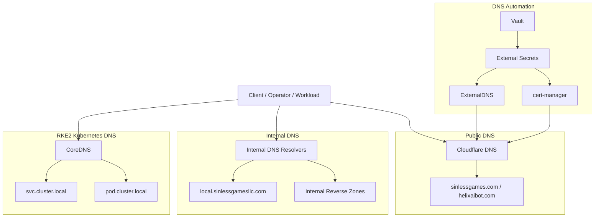
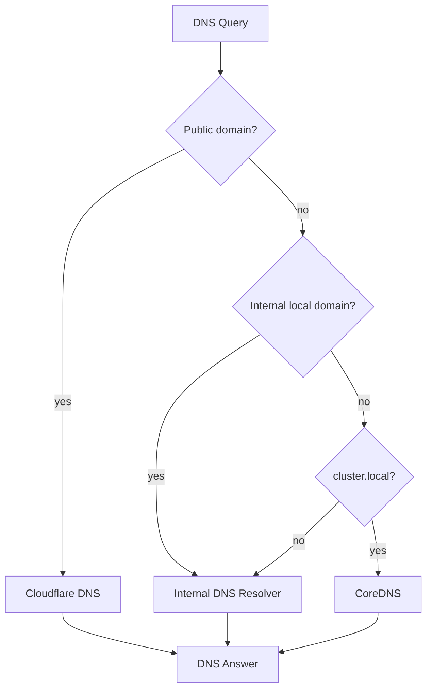
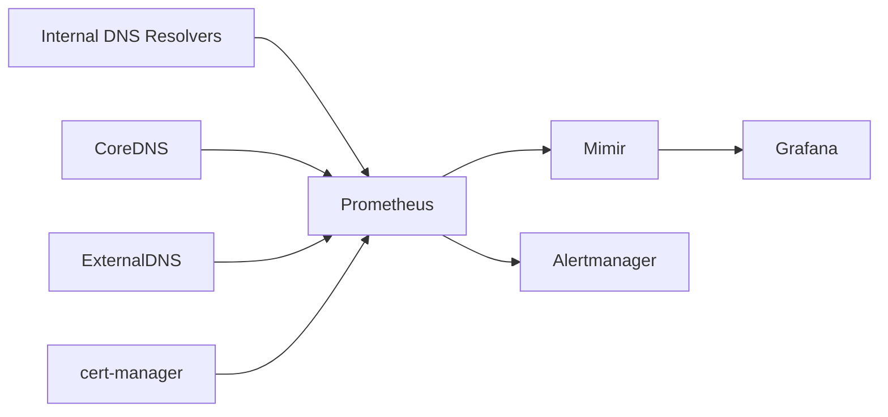
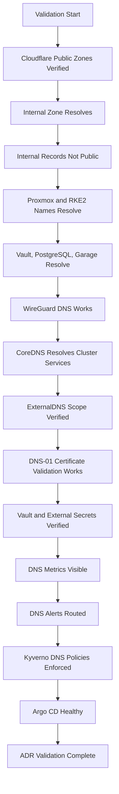

# ADR-0029 — Internal DNS and Name Resolution Model

**ADR:** ADR-0029  
**Title:** Internal DNS and Name Resolution Model for Infrastructure, Kubernetes, Cloudflare, and Local Services  
**Owner:** SinLess Games LLC (Timothy “Andy” Andrew Pierce / sinless777)  
**Status:** ACCEPTED  
**Date Accepted:** 2026-04-25  
**Last Updated:** 2026-04-25  
**Supersedes:** N/A  
**Superseded By:** N/A  

**Related:**

- [Docs/Architecture/DECISIONS.md](../DECISIONS.md)
- [ADR-0001 — Monorepo Source of Truth](./ADR-0001.md)
- [ADR-0002 — Proxmox Cluster Topology](./ADR-0002.md)
- [ADR-0003 — Network Segmentation and Planes](./ADR-0003.md)
- [ADR-0006 — Kubernetes Distribution Choice: RKE2](./ADR-0006.md)
- [ADR-0007 — GitOps Controller: Argo CD](./ADR-0007.md)
- [ADR-0009 — Identity and SSO: Authentik as Central OIDC Provider](./ADR-0009.md)
- [ADR-0010 — Certificate Management with cert-manager and Cloudflare DNS-01](./ADR-0010.md)
- [ADR-0011 — Cloudflare Tunnel and Access](./ADR-0011.md)
- [ADR-0012 — Vault Secrets and PKI](./ADR-0012.md)
- [ADR-0014 — Observability and Incident Response Platform](./ADR-0014.md)
- [ADR-0016 — Policy-as-Code Enforcement with Kyverno](./ADR-0016.md)
- [ADR-0018 — Garage Object Storage Placement and Operating Model](./ADR-0018.md)
- [ADR-0019 — Management Overlay with WireGuard](./ADR-0019.md)
- [ADR-0022 — Database and Stateful Platform Service Placement](./ADR-0022.md)
- [ADR-0023 — Istio Service Mesh Operating Model](./ADR-0023.md)
- [ADR-0024 — Ingress, Gateway, DNS, and TLS Routing Model](./ADR-0024.md)
- [ADR-0027 — RKE2 Cluster Node Topology and Scheduling Model](./ADR-0027.md)

---

## Context

The platform requires a clear DNS and name resolution model for public
services, internal services, management endpoints, Kubernetes workloads,
automation workflows, and disaster recovery.

The platform uses:

- Cloudflare for public authoritative DNS
- Cloudflare Tunnel for external application access
- Cloudflare Access for selected identity-aware public applications
- cert-manager with Cloudflare DNS-01 for certificate issuance
- ExternalDNS for approved public DNS automation
- RKE2 Kubernetes with CoreDNS for cluster-local service discovery
- WireGuard for private management access
- Vault for DNS-related credential custody
- External Secrets for runtime credential delivery
- UniFi network infrastructure for LAN and DHCP functions
- internal DNS names under `local.sinlessgamesllc.com`

The platform must separate:

- public DNS
- internal DNS
- Kubernetes cluster DNS
- management DNS
- service discovery
- certificate validation records
- automation records

DNS must support stable names for:

- Proxmox nodes
- RKE2 nodes
- Vault
- PostgreSQL
- Garage
- Grafana
- Argo CD
- Authentik
- DFIR-IRIS
- monitoring services
- management endpoints
- public applications
- internal services

DNS must not expose internal-only management services through public records.

---

## Decision

Adopt a split DNS model with **Cloudflare for public authoritative DNS** and
**internal DNS for private infrastructure names**.

The accepted DNS model is:

| DNS Scope | Domain / Zone | Authority |
| --- | --- | --- |
| Public applications | `sinlessgames.com` | Cloudflare |
| Public applications | `helixaibot.com` | Cloudflare |
| Internal infrastructure | `local.sinlessgamesllc.com` | Internal DNS resolvers |
| Kubernetes services | `svc.cluster.local` | Kubernetes CoreDNS |
| Kubernetes pods | `pod.cluster.local` where enabled | Kubernetes CoreDNS |
| Reverse DNS | Internal reverse zones where implemented | Internal DNS resolvers |
| ACME DNS-01 records | Public Cloudflare zones | cert-manager through Cloudflare API |
| ExternalDNS-managed records | Approved public zones only | ExternalDNS through Cloudflare API |

Cloudflare remains the authoritative DNS provider for public domains.

Internal DNS resolvers are authoritative for the internal local zone:

```text
local.sinlessgamesllc.com
```

Kubernetes CoreDNS remains authoritative for Kubernetes service discovery inside
the cluster.

ExternalDNS manages only approved public DNS records.

ExternalDNS does not manage the internal local zone unless a separate
implementation explicitly approves internal DNS integration.

Management endpoints use internal DNS names and are reachable only through
internal networks or WireGuard.

---

## DNS Architecture



---

## Scope

This ADR governs:

- public DNS authority
- internal DNS authority
- Kubernetes DNS authority
- local domain naming
- management endpoint naming
- Kubernetes service discovery
- DNS automation boundaries
- certificate validation DNS behavior
- resolver distribution
- DNS security requirements
- DNS observability requirements
- validation requirements
- rollback requirements
- operational requirements

This ADR does not define:

- every DNS record
- every DHCP scope
- every reverse DNS record
- every individual host IP
- every CoreDNS plugin configuration
- every Cloudflare page rule or access policy
- every firewall rule
- every DNS resolver package implementation
- every future delegated subdomain

Those items are implementation artifacts managed in network documentation,
Ansible inventory, Kubernetes manifests, Cloudflare configuration, and
operations runbooks.

---

## Non-Goals

The accepted DNS model does not include:

- public DNS records for internal management endpoints
- public DNS records for Proxmox management services
- public DNS records for Kubernetes API servers
- public DNS records for PostgreSQL
- public DNS records for Vault administrative endpoints
- public DNS records for Garage administrative endpoints
- Kubernetes CoreDNS as the authority for LAN infrastructure records
- Cloudflare as the authority for `local.sinlessgamesllc.com`
- ExternalDNS managing unrelated zones
- unrestricted Cloudflare API tokens
- hardcoded DNS credentials in Git
- direct public DNS exposure of private service addresses
- wildcard DNS records without documented ownership

---

## Responsibility Split

| Area | Responsibility |
| --- | --- |
| Public authoritative DNS | Cloudflare |
| Public application DNS automation | ExternalDNS |
| ACME DNS-01 challenge records | cert-manager |
| DNS credential custody | Vault |
| Runtime credential delivery | External Secrets |
| Internal DNS authority | Internal DNS resolvers |
| DHCP resolver distribution | UniFi network infrastructure |
| Kubernetes service discovery | CoreDNS |
| GitOps reconciliation | Argo CD |
| Management access | WireGuard and internal networks |
| DNS monitoring | Grafana, Prometheus, Mimir, Loki |
| DNS policy enforcement | Kyverno and CI checks |

---

## Accepted Tooling

| Area | Tool |
| --- | --- |
| Public DNS | Cloudflare |
| DNS automation | ExternalDNS |
| Certificate validation | cert-manager with Cloudflare DNS-01 |
| Internal DNS | Internal DNS resolver service |
| Kubernetes DNS | CoreDNS |
| Secret manager | Vault |
| Runtime secret delivery | External Secrets Operator |
| GitOps | Argo CD |
| Network DHCP | UniFi |
| Monitoring | Grafana stack |
| Policy enforcement | Kyverno |

---

## Alternatives Considered

### A1) Cloudflare for All DNS Including Internal Names

**Pros:**

- one DNS management surface
- public API automation
- easy integration with ExternalDNS and cert-manager

**Cons:**

- exposes internal naming structure to public DNS
- weakens private management boundary
- creates public dependency for internal name resolution
- conflicts with private management access model

Cloudflare-only DNS is rejected.

---

### A2) Kubernetes CoreDNS for All Internal Infrastructure DNS

**Pros:**

- Kubernetes-native
- GitOps-friendly
- simple for in-cluster service discovery

**Cons:**

- unavailable if the Kubernetes cluster is degraded
- unsuitable as the authority for Proxmox, Vault, PostgreSQL, and network devices
- creates circular dependency during cluster recovery
- weak fit for non-Kubernetes clients

CoreDNS is rejected as the authority for all internal infrastructure DNS.

CoreDNS remains the authority for Kubernetes cluster DNS.

---

### A3) Manual DNS Records Only

**Pros:**

- simple initial setup
- low automation complexity
- direct operator control

**Cons:**

- error-prone
- weak auditability
- slow changes
- high operational toil
- inconsistent with GitOps and automation model

Manual-only DNS is rejected as the standard operating model.

Manual changes are allowed only during break-glass recovery and must be
reconciled back to documented configuration.

---

### A4) Public Wildcard DNS for All Services

**Pros:**

- simple public hostname onboarding
- fewer individual DNS records
- convenient application routing

**Cons:**

- can hide accidental exposure
- weakens hostname ownership
- increases risk of routing unmanaged services
- conflicts with explicit GitOps route ownership

Unrestricted public wildcard DNS is rejected.

Wildcard certificates and wildcard DNS are allowed only when ownership,
routing, and exposure boundaries are documented.

---

### A5) mDNS / `.local` for Infrastructure Naming

**Pros:**

- zero-configuration behavior on some networks
- useful for consumer device discovery

**Cons:**

- unreliable for server infrastructure
- conflicts with enterprise DNS expectations
- weak automation model
- poor cross-subnet behavior
- not appropriate for Kubernetes and management services

mDNS and `.local` are rejected for infrastructure naming.

The accepted internal domain is:

```text
local.sinlessgamesllc.com
```

---

## Rationale

The split DNS model provides a clear boundary between public application access,
private management access, and Kubernetes service discovery.

### Public and Private Separation

Public records live in Cloudflare.

Private records live in the internal DNS zone.

This prevents internal infrastructure names from becoming public DNS records.

---

### Kubernetes Recovery Safety

CoreDNS is not used as the authority for infrastructure services outside the
cluster.

This prevents Kubernetes recovery from depending on in-cluster DNS for critical
external infrastructure such as Vault and PostgreSQL.

---

### Cloudflare Automation Boundary

ExternalDNS and cert-manager use Cloudflare only for approved public DNS
automation.

This supports public application routing and certificate issuance while
protecting internal name resolution.

---

### Stable Management Access

Management endpoints use internal DNS names.

Operators and automation reach those names through internal networks or
WireGuard.

This keeps management access independent from public ingress.

---

### GitOps Compatibility

DNS-related Kubernetes resources are stored in Git and reconciled by Argo CD.

This includes:

- ExternalDNS configuration
- cert-manager issuers
- Certificate resources
- Gateway and VirtualService resources
- ExternalSecret references
- monitoring resources

---

## Public DNS Model

Public DNS is hosted in Cloudflare.

Accepted public zones:

```text
sinlessgames.com
helixaibot.com
```

Public application records are created only for approved application routes.

Public DNS records point to Cloudflare-managed routing and tunnel endpoints, not
direct public management services.

ExternalDNS may manage approved public application records.

Cloudflare DNS records are used by cert-manager for DNS-01 ACME validation.

---

## Internal DNS Model

Internal DNS is authoritative for:

```text
local.sinlessgamesllc.com
```

Internal records include:

- Proxmox hosts
- RKE2 nodes
- Vault
- PostgreSQL
- Garage internal endpoints
- management VIPs
- internal load balancers
- DNS resolvers
- network services
- automation endpoints
- monitoring endpoints where internal-only

Internal DNS records must resolve from:

- trusted LAN networks
- management VLAN
- approved services VLANs
- WireGuard peers
- approved automation runners
- Kubernetes workloads where internal forwarding is configured

Internal records must not be publicly resolvable through Cloudflare.

---

## Kubernetes DNS Model

Kubernetes CoreDNS is authoritative for Kubernetes service discovery.

Accepted Kubernetes DNS zones:

```text
svc.cluster.local
cluster.local
```

Kubernetes workloads use service DNS for in-cluster services.

Example service name format:

```text
<service>.<namespace>.svc.cluster.local
```

CoreDNS may forward non-cluster queries to approved upstream internal resolvers.

CoreDNS must not be the only resolver for platform infrastructure recovery.

---

## DNS Resolution Flow



---

## Hostname Standards

### Public Hostnames

Public application hostnames must use approved public domains.

Accepted examples:

```text
docs.sinlessgames.com
grafana.sinlessgames.com
argocd.sinlessgames.com
```

Public hostnames require:

- owner label
- application ownership
- route ownership
- TLS certificate
- approved Gateway reference
- Cloudflare Access policy where required
- dashboard or alert coverage
- runbook annotation

---

### Internal Hostnames

Internal hostnames use:

```text
local.sinlessgamesllc.com
```

Accepted examples:

```text
pve-01.local.sinlessgamesllc.com
pve-02.local.sinlessgamesllc.com
pve-03.local.sinlessgamesllc.com
pve-04.local.sinlessgamesllc.com
pve-05.local.sinlessgamesllc.com
vault.local.sinlessgamesllc.com
postgres.local.sinlessgamesllc.com
garage.local.sinlessgamesllc.com
proxmox.local.sinlessgamesllc.com
```

Internal hostnames require:

- documented owner
- IP address
- service class
- exposure classification
- backup or recovery priority where applicable
- monitoring status where applicable

---

### Kubernetes Service Names

Kubernetes service names use the standard Kubernetes DNS format.

Accepted format:

```text
<service>.<namespace>.svc.cluster.local
```

Examples:

```text
grafana.monitoring.svc.cluster.local
kube-prometheus-stack-prometheus.monitoring.svc.cluster.local
garage.sinless-games.svc.cluster.local
```

Kubernetes service names must not be used as public DNS names.

---

## Hostname Classification

| Class | Zone | Example | Exposure |
| --- | --- | --- | --- |
| Public application | `sinlessgames.com` | `docs.sinlessgames.com` | Cloudflare Tunnel |
| Public application | `helixaibot.com` | `api.helixaibot.com` | Cloudflare Tunnel |
| Internal service | `local.sinlessgamesllc.com` | `postgres.local.sinlessgamesllc.com` | Internal / WireGuard |
| Management endpoint | `local.sinlessgamesllc.com` | `proxmox.local.sinlessgamesllc.com` | Internal / WireGuard |
| Kubernetes service | `svc.cluster.local` | `grafana.monitoring.svc.cluster.local` | Cluster internal |
| ACME challenge | public zone | `_acme-challenge.docs.sinlessgames.com` | Cloudflare DNS-01 |

---

## Resolver Distribution Requirements

UniFi network infrastructure distributes DNS resolver settings to approved LAN
and VLAN clients.

Required DHCP behavior:

- clients receive approved internal DNS resolver addresses
- clients receive the approved search domain where applicable
- management VLAN clients can resolve management names
- services VLAN clients can resolve approved service names
- guest or untrusted VLANs do not receive privileged internal DNS access

Required search domain:

```text
local.sinlessgamesllc.com
```

WireGuard peers receive DNS configuration that resolves internal names.

Automation runners receive DNS configuration appropriate to their runner class
and network access level.

---

## ExternalDNS Requirements

ExternalDNS manages approved public DNS records only.

ExternalDNS requirements:

- domain filters enabled
- Cloudflare zone filters enabled
- TXT registry enabled
- owner ID configured
- least-privilege Cloudflare API token
- credentials stored in Vault
- credentials delivered through External Secrets
- records declared through GitOps-owned Kubernetes resources
- no management endpoint records
- no internal local zone records

Accepted managed domains:

```text
sinlessgames.com
helixaibot.com
```

Rejected ExternalDNS targets:

```text
local.sinlessgamesllc.com
cluster.local
svc.cluster.local
```

---

## cert-manager DNS Requirements

cert-manager uses Cloudflare DNS-01 for public certificate issuance.

Certificate requirements:

- Cloudflare DNS API credential stored in Vault
- DNS credential delivered through External Secrets
- ClusterIssuer or Issuer managed by Argo CD
- Certificate resources managed by Git
- wildcard certificates allowed only for approved domains
- certificate status monitored
- renewal failures alerted

Accepted wildcard certificates:

```text
*.sinlessgames.com
*.helixaibot.com
```

ACME challenge records are temporary and managed by cert-manager.

---

## Management DNS Requirements

Management DNS records resolve only internally.

Management records include:

- Proxmox UI/API
- RKE2 API endpoints
- Vault administrative endpoint
- PostgreSQL endpoint
- Garage administrative endpoint
- network device management
- monitoring administration endpoints
- automation endpoints

Management DNS records must not exist in public DNS.

Management DNS names are reachable through:

- management VLAN
- approved internal networks
- WireGuard

Management DNS names are not exposed through standard public ingress.

---

## DNS Security Requirements

### Zone Separation

Public and internal zones are separated.

Required controls:

- public records only in public zones
- internal records only in internal zones
- no internal management records in Cloudflare public DNS
- no public application records in the internal local zone unless split-horizon behavior is explicitly documented
- no wildcard public records without ownership controls

---

### Credential Custody

DNS credentials must not be committed to Git.

Sensitive DNS credentials include:

- Cloudflare API tokens
- ExternalDNS credentials
- cert-manager DNS-01 credentials
- internal DNS update credentials
- TSIG keys where used
- webhook URLs

Credentials are stored in Vault.

Kubernetes workloads receive DNS credentials through External Secrets.

---

### Least Privilege

Cloudflare API tokens are scoped to required zones and actions.

ExternalDNS and cert-manager use separate credentials.

ExternalDNS credentials must not be reused by cert-manager.

cert-manager credentials must not be reused by ExternalDNS.

Application workloads must not receive Cloudflare DNS credentials.

---

### DNS Rebinding and Exposure Controls

Internal names must not resolve to public management endpoints.

Public application hostnames must not route to internal management services.

DNS records must not bypass the approved ingress model.

Kyverno and CI checks enforce routing and hostname safety where applicable.

---

## Observability Requirements

DNS must be observable.

Required metrics and alerts:

- internal resolver availability
- internal resolver query failures
- internal resolver latency
- CoreDNS availability
- CoreDNS query failures
- CoreDNS latency
- ExternalDNS sync failures
- Cloudflare API failures
- cert-manager DNS-01 challenge failures
- certificate renewal failures
- DNS record drift
- NXDOMAIN spikes for platform domains
- SERVFAIL spikes
- resolver saturation
- unauthorized DNS update attempts where available

Grafana dashboards must display:

- CoreDNS health
- CoreDNS query rate
- CoreDNS error rate
- internal DNS resolver health
- ExternalDNS sync status
- cert-manager certificate status
- Cloudflare DNS automation status
- DNS latency
- DNS failure trends

---

## DNS Observability Flow



---

## Policy Requirements

Kyverno and CI enforce DNS and route safety.

Required controls:

- public routes use approved public domains
- internal routes use approved internal domain
- management services are not publicly exposed
- ExternalDNS annotations are restricted to approved namespaces and domains
- cert-manager issuers use approved secret references
- Cloudflare credentials are not committed to Git
- public VirtualServices reference approved gateways
- public routes include owner labels
- production routes include runbook annotations
- Kubernetes workloads do not hardcode public management endpoints

---

## Implementation Requirements

### Repository Paths

DNS-related implementation artifacts are stored under:

```text
Kubernetes/apps/prod/external-dns/
Kubernetes/apps/prod/cert-manager/
Kubernetes/apps/prod/istio-system/
Ansible/
Docs/Network/
Docs/Architecture/ADRs/
```

Internal DNS resolver configuration is managed through infrastructure automation
and documented in network documentation.

---

### Required Internal Records

Required infrastructure records include:

```text
pve-01.local.sinlessgamesllc.com
pve-02.local.sinlessgamesllc.com
pve-03.local.sinlessgamesllc.com
pve-04.local.sinlessgamesllc.com
pve-05.local.sinlessgamesllc.com
vault.local.sinlessgamesllc.com
postgres.local.sinlessgamesllc.com
garage.local.sinlessgamesllc.com
proxmox.local.sinlessgamesllc.com
```

RKE2 node records follow this format:

```text
rke2-prod-cp-01.local.sinlessgamesllc.com
rke2-prod-cp-02.local.sinlessgamesllc.com
rke2-prod-cp-03.local.sinlessgamesllc.com
rke2-prod-cp-04.local.sinlessgamesllc.com
rke2-prod-cp-05.local.sinlessgamesllc.com
rke2-prod-wk-01.local.sinlessgamesllc.com
rke2-prod-wk-02.local.sinlessgamesllc.com
rke2-prod-wk-03.local.sinlessgamesllc.com
rke2-prod-wk-04.local.sinlessgamesllc.com
rke2-prod-wk-05.local.sinlessgamesllc.com
rke2-prod-wk-06.local.sinlessgamesllc.com
```

---

### Required Public Records

Public application records are created only for approved applications.

Accepted examples:

```text
docs.sinlessgames.com
grafana.sinlessgames.com
argocd.sinlessgames.com
```

Public records must map to the approved Cloudflare Tunnel and Istio routing
model.

---

### CoreDNS Requirements

CoreDNS must:

- resolve Kubernetes service names
- forward non-cluster queries to approved upstream resolvers
- expose metrics to Prometheus
- be monitored by Grafana
- have alerting for failure and latency
- remain GitOps-managed where configuration is customized

CoreDNS must not be customized manually as normal operations.

---

### DNS Credential Paths

DNS credentials are stored in Vault under dedicated paths.

Required secret classes:

```text
dns/cloudflare/external-dns
dns/cloudflare/cert-manager
dns/internal/update
```

ExternalDNS and cert-manager must use separate Cloudflare credentials.

---

## Validation Requirements

This ADR is valid when the following requirements are met:

- Cloudflare is authoritative for `sinlessgames.com`
- Cloudflare is authoritative for `helixaibot.com`
- internal DNS resolves `local.sinlessgamesllc.com`
- internal DNS records are not publicly resolvable
- Proxmox hostnames resolve internally
- RKE2 node hostnames resolve internally
- Vault hostname resolves internally
- PostgreSQL hostname resolves internally
- Garage hostname resolves internally
- WireGuard peers can resolve internal management names
- Kubernetes CoreDNS resolves `svc.cluster.local`
- Kubernetes workloads can resolve approved internal names
- CoreDNS forwards non-cluster queries to approved resolvers
- ExternalDNS manages only approved public domains
- ExternalDNS does not manage `local.sinlessgamesllc.com`
- cert-manager completes Cloudflare DNS-01 validation
- public application hostnames resolve correctly
- management hostnames are not exposed through public DNS
- Cloudflare DNS credentials are stored in Vault
- ExternalDNS receives credentials through External Secrets
- cert-manager receives credentials through External Secrets
- DNS metrics are visible in Grafana
- DNS alerts route to configured receivers
- Kyverno blocks unsafe public route definitions
- Argo CD reports DNS-related applications as healthy



---

## Rollback Plan

If public DNS automation creates an invalid record:

1. stop ExternalDNS reconciliation if required
2. inspect ExternalDNS logs
3. verify domain filters
4. verify TXT registry ownership
5. remove the invalid DNS record
6. correct the Git-managed source resource
7. restore ExternalDNS reconciliation
8. validate hostname resolution

If cert-manager DNS-01 validation fails:

1. inspect Certificate status
2. inspect CertificateRequest status
3. inspect Challenge status
4. verify Cloudflare API token delivery
5. verify Cloudflare zone permissions
6. verify DNS propagation
7. restore the last known-good issuer configuration
8. re-trigger certificate issuance
9. verify TLS certificate readiness

If internal DNS fails:

1. verify internal resolver service health
2. verify resolver host health
3. verify zone file or configured records
4. verify upstream resolver connectivity
5. restore the last known-good resolver configuration
6. verify management hostname resolution
7. verify WireGuard peer resolution
8. verify Kubernetes forwarding behavior

If CoreDNS fails:

1. inspect CoreDNS pods
2. inspect CoreDNS ConfigMap
3. inspect Kubernetes service endpoints
4. restore the last known-good CoreDNS configuration
5. verify `svc.cluster.local` resolution
6. verify non-cluster forwarding
7. verify workload DNS behavior

If an internal management record is published publicly:

1. remove the public DNS record immediately
2. verify the record no longer resolves publicly
3. inspect ExternalDNS and Cloudflare audit logs
4. inspect Git history
5. rotate exposed credentials if required
6. create a DFIR-IRIS case when security-impacting
7. add or correct policy enforcement to prevent recurrence

A permanent migration away from this DNS model requires:

- a superseding ADR
- migration plan
- rollback plan
- zone migration procedure
- resolver migration procedure
- certificate validation migration procedure
- ExternalDNS migration procedure
- validation evidence
- updated implementation documentation
- updated runbooks

---

## Operational Requirements

DNS production operation requires:

- Cloudflare public DNS authority
- internal DNS authority for `local.sinlessgamesllc.com`
- Kubernetes CoreDNS for cluster service discovery
- split public and internal DNS scopes
- no public management DNS records
- ExternalDNS scoped to approved public zones
- cert-manager Cloudflare DNS-01 validation
- Vault-managed DNS credentials
- separate ExternalDNS and cert-manager credentials
- External Secrets delivery
- UniFi DHCP resolver distribution
- WireGuard DNS resolution for management access
- DNS dashboards
- DNS alert rules
- CoreDNS monitoring
- internal resolver monitoring
- ExternalDNS monitoring
- cert-manager monitoring
- documented hostname ownership
- documented resolver configuration
- documented recovery procedure
- validated DNS restore procedure