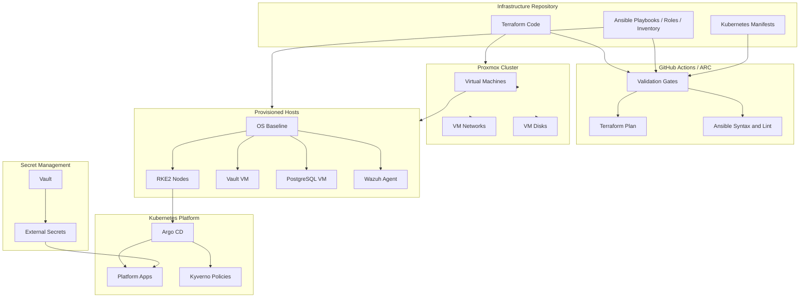
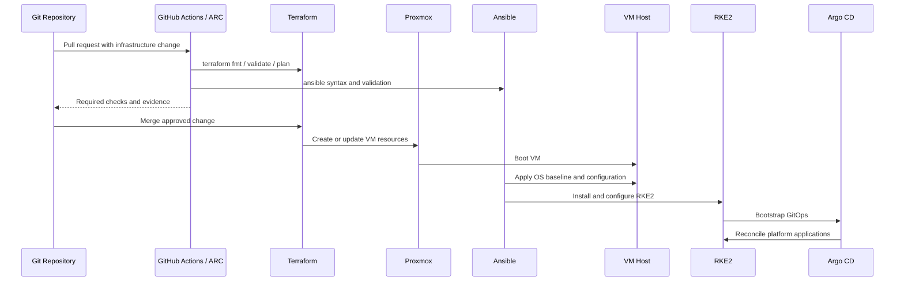
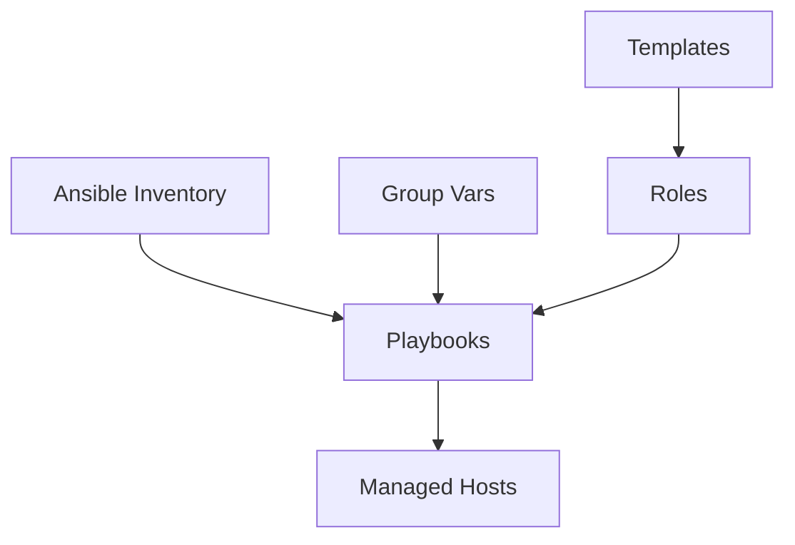
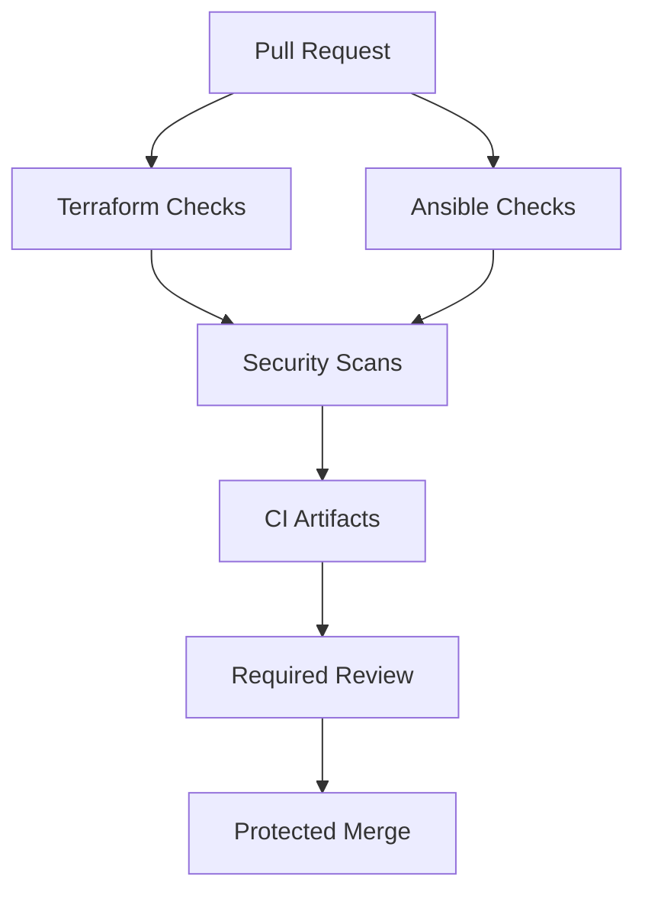
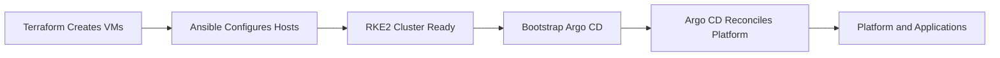
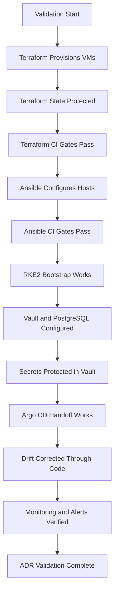

# ADR-0030 — Infrastructure Provisioning with Terraform and Ansible

**ADR:** ADR-0030  
**Title:** Infrastructure Provisioning with Terraform and Ansible  
**Owner:** SinLess Games LLC (Timothy “Andy” Andrew Pierce / sinless777)  
**Status:** ACCEPTED  
**Date Accepted:** 2026-04-25  
**Last Updated:** 2026-04-25  
**Supersedes:** N/A  
**Superseded By:** N/A  

**Related:**

- [Docs/Architecture/DECISIONS.md](../DECISIONS.md)
- [ADR-0001 — Monorepo Source of Truth](./ADR-0001.md)
- [ADR-0002 — Proxmox Cluster Topology](./ADR-0002.md)
- [ADR-0003 — Network Segmentation and Planes](./ADR-0003.md)
- [ADR-0006 — Kubernetes Distribution Choice: RKE2](./ADR-0006.md)
- [ADR-0007 — GitOps Controller: Argo CD](./ADR-0007.md)
- [ADR-0012 — Vault Secrets and PKI](./ADR-0012.md)
- [ADR-0013 — Backups and Disaster Recovery with PBS, Velero, and Garage](./ADR-0013.md)
- [ADR-0016 — Policy-as-Code Enforcement with Kyverno](./ADR-0016.md)
- [ADR-0017 — GitHub Source Control, CI/CD, and Registry Operating Model](./ADR-0017.md)
- [ADR-0019 — Management Overlay with WireGuard](./ADR-0019.md)
- [ADR-0020 — Security and Compliance Operating Model](./ADR-0020.md)
- [ADR-0021 — Kubernetes Persistent Storage with Longhorn](./ADR-0021.md)
- [ADR-0022 — Database and Stateful Platform Service Placement](./ADR-0022.md)
- [ADR-0025 — GitHub Actions Runner Controller and Agentic Workflow Operating Model](./ADR-0025.md)
- [ADR-0027 — RKE2 Cluster Node Topology and Scheduling Model](./ADR-0027.md)
- [ADR-0029 — Internal DNS and Name Resolution Model](./ADR-0029.md)

---

## Context

The platform requires repeatable infrastructure provisioning and configuration
management for Proxmox, virtual machines, RKE2 nodes, platform services, DNS,
users, SSH, packages, security baselines, and automation workflows.

The infrastructure must be reproducible from Git.

The platform uses:

- Proxmox as the virtualization layer
- Terraform for infrastructure provisioning
- Ansible for host configuration and bootstrap
- RKE2 for Kubernetes
- Argo CD for GitOps reconciliation after cluster bootstrap
- Vault for secret custody
- GitHub Actions and Actions Runner Controller for CI/CD automation
- Proxmox Backup Server for VM backup
- Wazuh for host monitoring
- Grafana stack for observability

The provisioning model must support:

- controlled VM creation
- stable hostnames
- stable static IP addresses
- predictable network placement
- repeatable OS baseline configuration
- repeatable RKE2 installation
- repeatable node labeling and tainting
- repeatable Vault and PostgreSQL VM configuration
- repeatable recovery after VM replacement
- CI validation before changes merge
- clear separation between infrastructure provisioning and application delivery

Terraform and Ansible have different responsibilities.

Terraform owns infrastructure resources.

Ansible owns operating system and service configuration.

Argo CD owns Kubernetes application and platform reconciliation after the
cluster is available.

---

## Decision

Adopt **Terraform** and **Ansible** as the standard infrastructure provisioning
and configuration management model.

The accepted responsibility split is:

| Layer | Owner |
| --- | --- |
| Proxmox VM resources | Terraform |
| VM CPU, memory, disks, NICs, placement, and metadata | Terraform |
| Static IP and DNS intent | Terraform and inventory |
| Operating system baseline | Ansible |
| Package installation | Ansible |
| Users, SSH, shell, and host hardening | Ansible |
| RKE2 server and agent installation | Ansible |
| RKE2 configuration files | Ansible |
| RKE2 node labels and taints | Ansible and Kubernetes automation |
| Vault VM configuration | Ansible |
| PostgreSQL VM configuration | Ansible |
| Wazuh agent installation | Ansible |
| Monitoring agent installation | Ansible |
| Kubernetes platform add-ons | Argo CD |
| Kubernetes applications | Argo CD |
| Kubernetes policy resources | Argo CD |
| Secrets | Vault |
| Runtime secret delivery | External Secrets |

Terraform is the provisioning authority.

Ansible is the host configuration authority.

Argo CD is the Kubernetes reconciliation authority.

Manual infrastructure changes are not accepted as normal operations.

Manual changes made during break-glass recovery must be reconciled back into
Terraform, Ansible, or GitOps-managed manifests.

---

## Provisioning Architecture



---

## Scope

This ADR governs:

- Terraform as the infrastructure provisioning tool
- Ansible as the host configuration and bootstrap tool
- Terraform and Ansible responsibility boundaries
- repository layout requirements
- state handling requirements
- inventory requirements
- secret handling requirements
- CI validation requirements
- VM provisioning requirements
- RKE2 bootstrap requirements
- host baseline requirements
- validation requirements
- rollback requirements
- operational requirements

This ADR does not define:

- every Terraform module
- every Terraform variable
- every Ansible role
- every Ansible task
- every host variable
- every VM size
- every IP address
- every package
- every bootstrap command
- every GitHub Actions workflow implementation

Those items are implementation artifacts managed in the repository.

---

## Non-Goals

The accepted provisioning model does not include:

- manual VM creation as normal operations
- manual RKE2 node configuration as normal operations
- unmanaged SSH user creation
- unmanaged host package installation
- committing Terraform state to Git
- committing plaintext secrets to Git
- using Argo CD to provision Proxmox VMs
- using Terraform to manage normal in-cluster application resources
- using Ansible as the primary Kubernetes application deployment system
- relying on VM backups as the only infrastructure definition
- relying on operator memory for rebuild steps

---

## Responsibility Split

| Area | Terraform | Ansible | Argo CD |
| --- | --- | --- | --- |
| Proxmox VM creation | Yes | No | No |
| VM CPU and memory | Yes | No | No |
| VM disks | Yes | No | No |
| VM NICs | Yes | No | No |
| VM placement | Yes | No | No |
| Static IP intent | Yes | Yes | No |
| OS users | No | Yes | No |
| SSH configuration | No | Yes | No |
| Package baseline | No | Yes | No |
| RKE2 install | No | Yes | No |
| RKE2 config | No | Yes | No |
| Vault service config | No | Yes | No |
| PostgreSQL service config | No | Yes | No |
| Kubernetes add-ons | No | Bootstrap only | Yes |
| Kubernetes apps | No | No | Yes |
| Kubernetes policies | No | No | Yes |
| Runtime secrets | No | No | External Secrets through Argo CD |

---

## Accepted Tooling

| Area | Tool |
| --- | --- |
| Infrastructure provisioning | Terraform |
| Host configuration | Ansible |
| Hypervisor | Proxmox |
| Kubernetes distribution | RKE2 |
| GitOps | Argo CD |
| CI/CD | GitHub Actions |
| Self-hosted runners | Actions Runner Controller |
| Secret custody | Vault |
| Runtime secret delivery | External Secrets |
| Backup | Proxmox Backup Server |
| Monitoring | Grafana stack |
| Endpoint security | Wazuh |
| Policy enforcement | Kyverno |
| IaC scanning | Checkov and Trivy |
| Terraform linting | TFLint |

---

## Alternatives Considered

### A1) Manual Proxmox and Host Configuration

**Pros:**

- fast for one-off changes
- easy to perform from the Proxmox UI
- useful during emergency recovery

**Cons:**

- weak repeatability
- high drift risk
- weak auditability
- hard to rebuild consistently
- does not satisfy Git-based infrastructure operations

Manual provisioning is rejected as the normal operating model.

Manual changes are allowed only during break-glass recovery and must be
reconciled back into code.

---

### A2) Terraform Only

**Pros:**

- strong infrastructure state model
- good fit for Proxmox VM resources
- clear plan and apply workflow

**Cons:**

- weak fit for detailed OS configuration
- weak fit for package installation and host hardening
- weak fit for RKE2 bootstrap tasks
- creates unnecessary complexity for host-level configuration

Terraform-only provisioning is rejected.

Terraform owns infrastructure resources, not full host configuration.

---

### A3) Ansible Only

**Pros:**

- strong host configuration model
- simple task orchestration
- good fit for bootstrap and service configuration

**Cons:**

- weaker infrastructure state model
- weaker VM lifecycle tracking
- harder to detect VM resource drift
- less suitable for declarative Proxmox VM provisioning

Ansible-only provisioning is rejected.

Ansible configures hosts after Terraform provisions infrastructure.

---

### A4) Kubernetes Operators for Infrastructure Provisioning

**Pros:**

- Kubernetes-native lifecycle management
- GitOps-friendly resource model
- useful in cloud-native infrastructure environments

**Cons:**

- creates dependency on Kubernetes for provisioning the infrastructure that hosts Kubernetes
- increases recovery complexity
- weaker fit for Proxmox VM provisioning in this platform
- risks circular dependency during cluster rebuild

Kubernetes-based infrastructure provisioning is rejected for Proxmox VM
creation.

---

### A5) Image-Only Golden Template Model

**Pros:**

- fast VM creation
- consistent base image
- reduced bootstrap time

**Cons:**

- can hide configuration drift
- image updates require separate lifecycle management
- does not replace configuration management
- can become stale without automation

Golden images are accepted only as base images.

Ansible remains responsible for final host configuration.

---

## Rationale

Terraform and Ansible provide a clear separation between infrastructure
resources and host configuration.

### Declarative Infrastructure Provisioning

Terraform provides a plan-based workflow for Proxmox VM resources.

This gives the platform:

- reviewable infrastructure changes
- predictable VM lifecycle
- tracked resource intent
- repeatable provisioning
- CI validation
- drift detection through plan output

---

### Repeatable Host Configuration

Ansible provides repeatable OS and service configuration.

This gives the platform:

- reusable roles
- idempotent host changes
- consistent user and SSH policy
- repeatable RKE2 installation
- repeatable Vault and PostgreSQL configuration
- controlled package installation
- host hardening

---

### Clear Bootstrap Boundary

Terraform creates the VM.

Ansible prepares the host and installs RKE2.

Argo CD reconciles Kubernetes platform components after the cluster is ready.

This avoids overlapping ownership.

---

### Disaster Recovery

The platform can rebuild infrastructure from:

- Git repository
- Terraform code
- Ansible inventory and roles
- Vault-managed secrets
- PBS backups where restore is faster than rebuild
- Argo CD Kubernetes manifests

This supports both rebuild and restore recovery paths.

---

## Provisioning Flow



---

## Repository Layout Requirements

Terraform code is stored under:

```text
Terraform/
```

Ansible code is stored under:

```text
Ansible/
```

Ansible playbooks are stored under:

```text
Ansible/playbooks/
```

Ansible roles are stored under:

```text
Ansible/roles/
```

Ansible templates are stored under:

```text
Ansible/templates/
```

Non-secret Kubernetes production variables are stored under:

```text
Ansible/group_vars/kubernetes/production/
```

Vault bootstrap and secret update material is stored only in approved encrypted
or Vault-backed paths.

Plaintext secrets are not committed to Git.

---

## Terraform Requirements

Terraform provisions Proxmox infrastructure resources.

Terraform-managed resources include:

- RKE2 control plane VMs
- RKE2 worker VMs
- Vault VMs
- PostgreSQL VMs
- supporting platform VMs
- VM CPU allocation
- VM memory allocation
- VM disk allocation
- VM network interfaces
- VM placement on Proxmox hosts
- VM tags and metadata
- cloud-init or bootstrap metadata where used

Terraform must not manage normal Kubernetes application resources.

Terraform state must not be committed to Git.

Terraform plans for production-impacting changes must be retained as CI
artifacts.

Terraform variables containing secrets must not be committed to Git.

---

## Terraform State Requirements

Terraform state is sensitive.

Terraform state may contain:

- infrastructure addresses
- resource identifiers
- generated values
- provider metadata
- sensitive values depending on provider behavior

Required controls:

- Terraform state is stored outside Git
- Terraform state access is restricted
- Terraform state is backed up
- Terraform state is encrypted at rest where supported
- Terraform state is not exposed to untrusted pull requests
- Terraform state access is limited to approved automation and operators
- state recovery procedure is documented
- state lock behavior is used where supported by the configured backend

---

## Ansible Requirements

Ansible configures operating systems and services after infrastructure exists.

Required Ansible responsibilities:

- hostname configuration
- package installation
- user management
- SSH hardening
- shell configuration
- DNS resolver configuration
- firewall baseline
- time synchronization
- system limits where required
- RKE2 server installation
- RKE2 agent installation
- RKE2 configuration files
- RKE2 node labels and taints
- Vault service configuration
- PostgreSQL service configuration
- Wazuh agent installation
- monitoring exporter installation
- GPU worker prerequisites where required
- Longhorn node disk preparation where required

Required baseline roles include:

```text
dns-resolver
packages
shell-config
ssh
users
```

Kubernetes production deployment is orchestrated through:

```text
Ansible/playbooks/deploy-kubernetes-prod.yaml
```

---

## Ansible Inventory Requirements

Ansible inventory must describe infrastructure targets.

Required inventory fields:

- hostname
- IP address
- role
- environment
- Proxmox host
- SSH user
- node class
- RKE2 role where applicable
- storage role where applicable
- GPU role where applicable
- runner role where applicable
- monitoring role
- Wazuh role
- backup class

Inventory must support grouping by:

- Proxmox hosts
- RKE2 control plane nodes
- RKE2 worker nodes
- Vault nodes
- PostgreSQL nodes
- storage nodes
- GPU nodes
- runner nodes
- monitoring targets
- production environment

---

## Configuration Flow



---

## Secret Handling Requirements

Secrets must not be committed to Git.

Sensitive values include:

- Proxmox API tokens
- SSH private keys
- Vault root tokens
- Vault unseal or recovery keys
- PostgreSQL passwords
- Kubernetes bootstrap tokens
- RKE2 server tokens
- kubeconfigs
- Cloudflare API tokens
- Garage access keys
- GitHub tokens
- WireGuard private keys
- TLS private keys
- webhook URLs

Accepted secret custody:

- Vault for infrastructure secrets
- GitHub Environment secrets for workflow-scoped CI secrets
- External Secrets for Kubernetes runtime delivery
- encrypted break-glass custody for recovery material

Ansible must retrieve sensitive values from approved secret stores or encrypted
inputs.

Plaintext secret files are rejected.

---

## Vault Integration Requirements

Vault is the source of truth for infrastructure secrets.

Vault stores:

- Proxmox credentials
- database credentials
- service tokens
- object storage credentials
- DNS provider credentials
- GitHub integration credentials
- WireGuard secrets
- Kubernetes integration credentials
- backup credentials

Automation that writes or updates Vault secrets must be controlled through
approved playbooks or tasks.

Vault secret update workflows must produce audit evidence.

---

## CI Validation Requirements

Pull requests affecting Terraform or Ansible require CI validation.

Required Terraform checks:

- formatting
- validation
- TFLint
- Checkov
- Trivy IaC scan
- plan generation for production-impacting changes

Required Ansible checks:

- YAML validation
- Ansible syntax check
- role structure validation
- inventory validation
- template rendering validation where applicable
- secret scanning
- shell script linting where applicable

Required shared checks:

- no plaintext secrets
- no unapproved public management exposure
- no unmanaged production IP drift
- no direct production changes without review
- documentation updates where architecture decisions change

---

## CI Gate Flow



---

## VM Provisioning Requirements

VMs provisioned by Terraform must include:

- VM name
- VM ID
- Proxmox host placement
- CPU count
- memory allocation
- disk configuration
- network interface configuration
- static IP intent
- DNS name
- environment metadata
- role metadata
- backup inclusion metadata
- owner metadata

VM names must be stable.

VM placement must match accepted topology ADRs.

VM placement drift must be corrected through Terraform.

---

## RKE2 Bootstrap Requirements

RKE2 bootstrap is performed by Ansible.

RKE2 bootstrap includes:

- OS baseline preparation
- kernel module configuration where required
- sysctl configuration where required
- RKE2 server installation
- RKE2 agent installation
- RKE2 configuration file rendering
- RKE2 token handling through approved secret custody
- kubeconfig retrieval through approved process
- control plane joining
- worker node joining
- node label application
- node taint application
- CNI readiness validation
- Argo CD bootstrap handoff

After Argo CD is available, Kubernetes platform components are reconciled by
GitOps.

---

## Bootstrap Handoff Model



---

## Drift Management Requirements

Infrastructure drift must be detected and corrected through code.

Terraform drift is detected by plan output.

Ansible drift is corrected by idempotent playbook execution.

Kubernetes drift is handled by Argo CD.

Manual changes require reconciliation.

Required drift controls:

- Terraform plan review
- Ansible idempotent execution
- Argo CD sync status
- CI validation
- audit records for manual break-glass changes
- rollback path for unsafe changes

---

## Security Requirements

### Access Control

Infrastructure automation access is restricted.

Required controls:

- Proxmox API credentials scoped to required operations
- SSH access restricted to approved operators and automation
- automation credentials stored in Vault or GitHub protected environments
- production automation requires protected workflow approvals
- self-hosted runners use least-privilege credentials
- no untrusted pull request access to production credentials

---

### Network Security

Provisioned hosts must follow network segmentation.

Required controls:

- approved VLAN placement
- no public management exposure
- SSH restricted to management paths
- WireGuard or internal network for management
- DNS resolver configuration
- firewall baseline
- no direct public database access
- no direct public Kubernetes API access

---

### Host Security

Ansible enforces host security baseline.

Required controls:

- approved users
- SSH hardening
- package baseline
- Wazuh agent where required
- log forwarding where required
- system updates according to patching policy
- sudo access restricted
- no unmanaged local administrator accounts
- time synchronization
- audit logging where configured

---

### Secret Security

Terraform and Ansible must not expose secrets in logs or CI artifacts.

Sensitive output must be marked sensitive where supported.

CI logs must not print secret values.

Plans and artifacts containing sensitive data must be protected.

---

## Observability Requirements

Provisioned infrastructure must be observable.

Required monitoring coverage:

- Proxmox VM status
- host availability
- CPU usage
- memory usage
- disk usage
- network usage
- SSH availability where applicable
- RKE2 node readiness
- Vault service health
- PostgreSQL service health
- Wazuh agent status
- backup status
- Ansible execution failures
- Terraform workflow failures

Required alerts:

- VM unavailable
- host unreachable
- RKE2 node not ready
- Vault unavailable
- PostgreSQL unavailable
- Wazuh agent disconnected
- backup missing or stale
- Terraform plan failure
- Ansible playbook failure
- unauthorized management exposure detected

---

## Backup and Recovery Requirements

Infrastructure provisioning must support rebuild and restore.

Required recovery sources:

- Git repository
- Terraform code
- Terraform state backup
- Ansible inventory
- Ansible roles
- Vault secrets
- PBS backups
- Argo CD manifests
- documented DNS records
- documented IP assignments

Recovery must support:

- rebuilding a VM from Terraform and Ansible
- restoring a VM from PBS
- rejoining RKE2 control plane nodes
- rejoining RKE2 worker nodes
- restoring Vault from VM backup and native snapshot
- restoring PostgreSQL from VM backup and database-native backup
- restoring Kubernetes applications through Argo CD

---

## Policy Requirements

CI and Kyverno enforce provisioning safety.

Required CI policies:

- Terraform format required
- Terraform validation required
- Terraform plan required for production-impacting changes
- TFLint required
- Checkov required
- Trivy IaC scan required
- Ansible syntax check required
- secret scanning required
- no plaintext secrets
- no unmanaged public ingress for management services

Required Kubernetes policies:

- GitOps-managed workloads require ownership labels
- infrastructure add-ons require resource requests
- sensitive namespaces require NetworkPolicies
- production resources require environment labels
- unsafe host access is blocked unless approved

---

## Implementation Requirements

### Terraform Implementation

Terraform implementation must define:

- providers
- Proxmox connection configuration
- VM modules or resources
- environment variables
- node placement
- network placement
- VM metadata
- outputs used by Ansible inventory
- state backend configuration
- state protection controls

Terraform changes must be reviewed through pull requests.

---

### Ansible Implementation

Ansible implementation must define:

- inventory
- group variables
- host variables
- roles
- templates
- playbooks
- handlers
- validation tasks
- bootstrap tasks
- service configuration tasks

Ansible playbooks must be idempotent.

Ansible changes must be reviewed through pull requests.

---

### Required Playbooks

Required production playbooks include:

```text
Ansible/playbooks/deploy-kubernetes-prod.yaml
```

Required operational playbook classes include:

- host baseline configuration
- RKE2 deployment
- Vault configuration
- PostgreSQL configuration
- Wazuh agent deployment
- monitoring agent deployment
- DNS resolver configuration
- storage node preparation
- GPU node preparation
- validation and health checks

---

### Required Labels and Metadata

VMs must include metadata for:

```text
environment
role
owner
backup
proxmox-host
rke2-role
storage-role
gpu-role
runner-role
```

Kubernetes nodes must include labels required by ADR-0027.

---

## Validation Requirements

This ADR is valid when the following requirements are met:

- Terraform provisions Proxmox VMs
- Terraform state is not committed to Git
- Terraform plan runs in CI for production-impacting changes
- Terraform validation runs in CI
- TFLint runs in CI
- Checkov runs in CI
- Trivy IaC scanning runs in CI
- Ansible configures provisioned hosts
- Ansible syntax checks run in CI
- Ansible playbooks are idempotent
- required baseline roles exist
- RKE2 control plane nodes are provisioned through Terraform
- RKE2 worker nodes are provisioned through Terraform
- RKE2 is installed and configured through Ansible
- Vault VM configuration is managed through Ansible
- PostgreSQL VM configuration is managed through Ansible
- Wazuh agent deployment is managed through Ansible
- secrets are not committed to Git
- Vault stores infrastructure secrets
- production automation credentials are protected
- Argo CD takes over Kubernetes application reconciliation after bootstrap
- manual infrastructure drift is corrected through code
- infrastructure monitoring is visible in Grafana
- infrastructure alerts route to configured receivers



---

## Rollback Plan

If Terraform provisioning fails:

1. stop applying infrastructure changes
2. inspect Terraform plan output
3. inspect provider authentication
4. inspect Proxmox API availability
5. inspect state lock and state backend status
6. revert the failing Terraform change through Git
7. restore the last known-good Terraform state if required
8. rerun Terraform plan
9. apply only after validation succeeds

If Terraform creates an incorrect VM resource:

1. stop dependent Ansible execution
2. inspect the Terraform plan and state
3. identify the incorrect resource
4. correct the Terraform definition
5. apply the corrected plan
6. destroy only incorrect resources when safe
7. preserve data disks where production data may exist
8. verify VM metadata and placement

If Ansible configuration fails:

1. stop dependent rollout steps
2. inspect Ansible logs
3. identify the failed role or task
4. correct the playbook, role, template, or variable
5. rerun in check mode where applicable
6. rerun the playbook
7. verify idempotency
8. verify service health

If RKE2 bootstrap fails:

1. inspect RKE2 service logs
2. inspect server or agent configuration
3. inspect network connectivity
4. inspect token and certificate access
5. correct Ansible-rendered configuration
6. rerun the RKE2 bootstrap playbook
7. verify node readiness
8. verify cluster health

If Vault or PostgreSQL VM configuration fails:

1. stop onboarding dependent services
2. inspect VM health
3. inspect service logs
4. inspect Ansible configuration
5. restore the last known-good service configuration
6. restore from PBS or native backup if required
7. verify service health
8. verify monitoring and alerts

If automation credentials are exposed:

1. revoke affected credentials
2. rotate affected secrets in Vault
3. inspect CI logs and artifacts
4. inspect repository history
5. create a DFIR-IRIS case when security-impacting
6. restore automation with new credentials
7. verify no secret values remain in logs or Git

A permanent migration away from Terraform or Ansible requires:

- a superseding ADR
- migration plan
- rollback plan
- state migration procedure
- inventory migration procedure
- credential migration procedure
- validation evidence
- updated implementation documentation
- updated runbooks

---

## Operational Requirements

Infrastructure provisioning operation requires:

- Terraform-managed Proxmox resources
- Ansible-managed host configuration
- protected Terraform state
- Terraform plan evidence
- Ansible validation evidence
- GitHub pull request review
- CI security scans
- Vault-managed secrets
- no plaintext secrets in Git
- Proxmox API credential control
- SSH access control
- idempotent playbooks
- stable inventory
- stable DNS records
- stable IP assignments
- PBS backup coverage
- Wazuh agent coverage
- Grafana dashboards
- alert rules
- documented rebuild procedure
- documented restore procedure
- drift correction through code
- Argo CD handoff after Kubernetes bootstrap