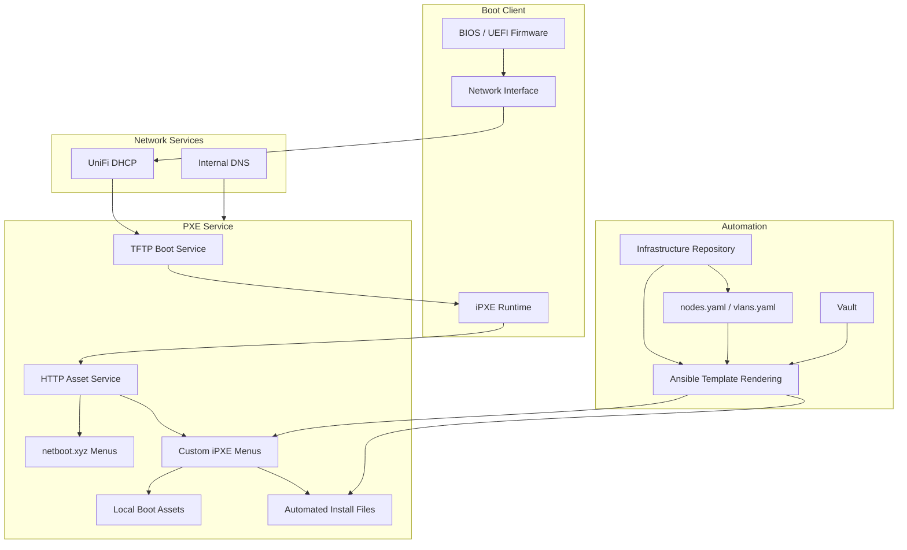
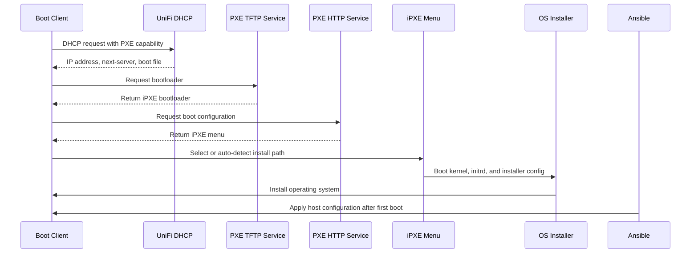
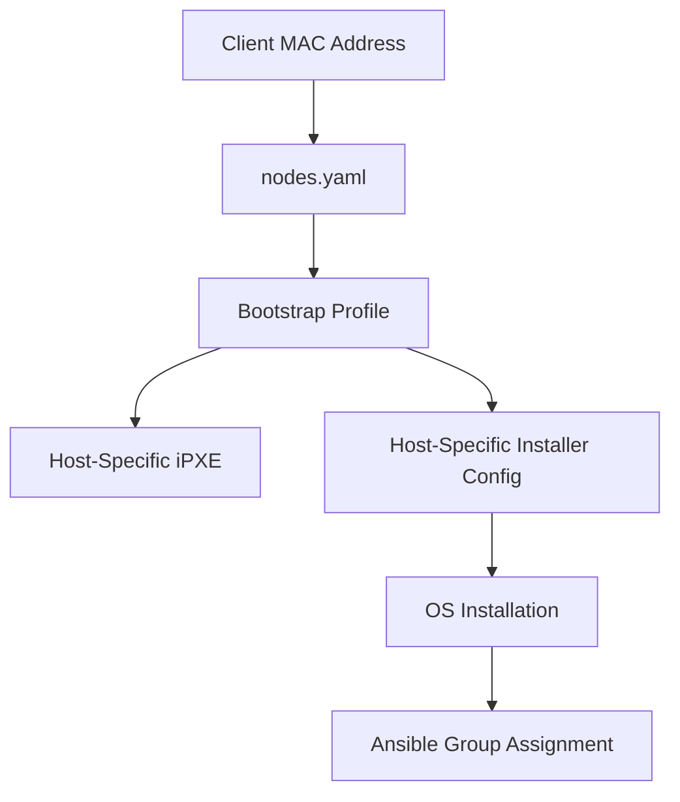
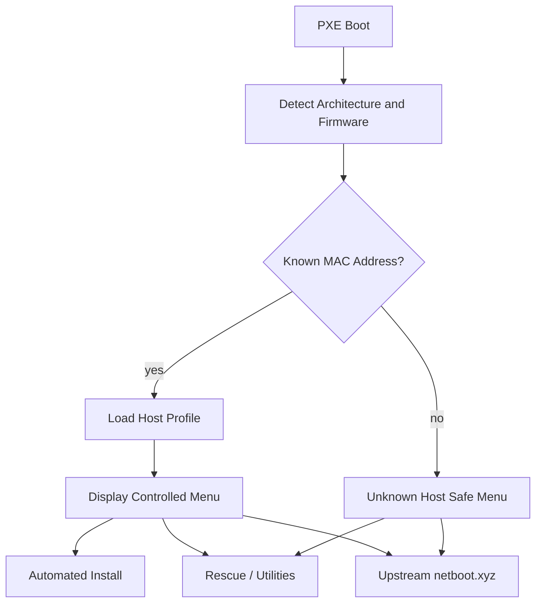
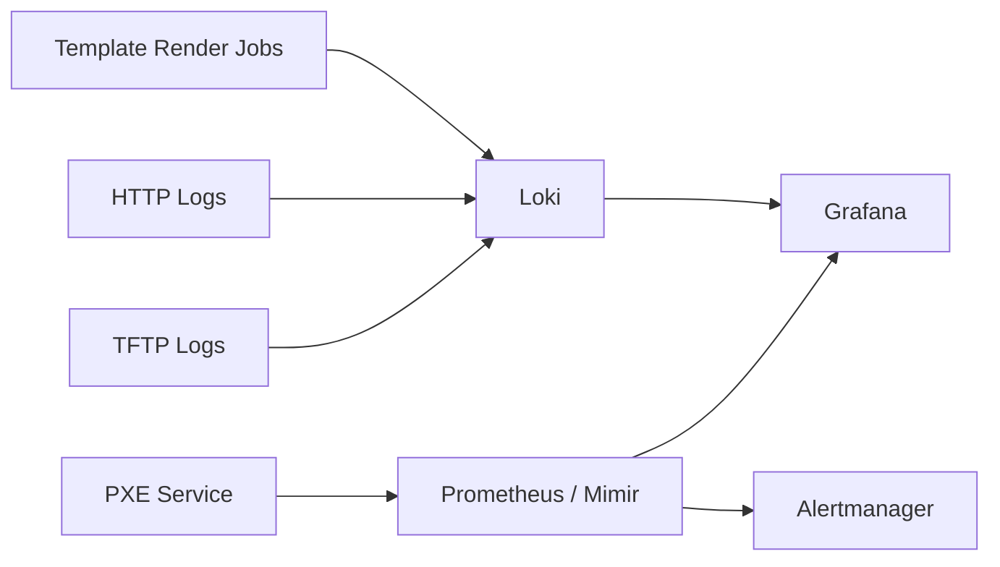
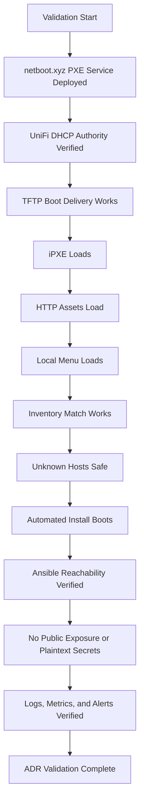

# ADR-0031 — PXE and Bootstrap Automation with netboot.xyz

**ADR:** ADR-0031  
**Title:** PXE and Bootstrap Automation with netboot.xyz, iPXE, UniFi DHCP, Ansible, and Inventory-Driven Host Builds  
**Owner:** SinLess Games LLC (Timothy “Andy” Andrew Pierce / sinless777)  
**Status:** ACCEPTED  
**Date Accepted:** 2026-04-25  
**Last Updated:** 2026-04-25  
**Supersedes:** N/A  
**Superseded By:** N/A  

**Related:**

- [Docs/Architecture/DECISIONS.md](../DECISIONS.md)
- [ADR-0001 — Monorepo Source of Truth](./ADR-0001.md)
- [ADR-0002 — Proxmox Cluster Topology](./ADR-0002.md)
- [ADR-0003 — Network Segmentation and Planes](./ADR-0003.md)
- [ADR-0006 — Kubernetes Distribution Choice: RKE2](./ADR-0006.md)
- [ADR-0012 — Vault Secrets and PKI](./ADR-0012.md)
- [ADR-0013 — Backups and Disaster Recovery with PBS, Velero, and Garage](./ADR-0013.md)
- [ADR-0016 — Policy-as-Code Enforcement with Kyverno](./ADR-0016.md)
- [ADR-0017 — GitHub Source Control, CI/CD, and Registry Operating Model](./ADR-0017.md)
- [ADR-0019 — Management Overlay with WireGuard](./ADR-0019.md)
- [ADR-0020 — Security and Compliance Operating Model](./ADR-0020.md)
- [ADR-0027 — RKE2 Cluster Node Topology and Scheduling Model](./ADR-0027.md)
- [ADR-0029 — Internal DNS and Name Resolution Model](./ADR-0029.md)
- [ADR-0030 — Infrastructure Provisioning with Terraform and Ansible](./ADR-0030.md)

---

## Context

The infrastructure requires repeatable network boot and bootstrap automation for
bare-metal systems, Proxmox hosts, virtual machines, rescue workflows, and
operating system installation workflows.

The platform must support:

- PXE booting
- iPXE menus
- local boot assets
- remote netboot.xyz menus
- custom boot menus
- host-specific automated installation
- inventory-driven network configuration
- architecture-aware boot decisions
- UEFI and legacy boot support
- rescue and recovery tooling
- repeatable Debian and Proxmox bootstrap workflows
- integration with Ansible configuration management
- clear separation between DHCP authority and PXE boot services
- Git-managed boot configuration

The platform uses:

- netboot.xyz
- iPXE
- UniFi DHCP
- local HTTP asset hosting
- TFTP boot delivery
- Ansible-generated templates
- YAML inventory for nodes and VLANs
- Debian automated installation
- Proxmox package installation on Debian where required
- Vault for sensitive bootstrap material
- GitHub as the source of truth

The platform does not use ad-hoc USB installers as the standard host
installation method.

USB and ISO boot media remain break-glass options.

---

## Decision

Adopt **netboot.xyz** as the standard PXE and iPXE boot platform.

Use **UniFi DHCP** as the DHCP authority.

Use the PXE service for:

- TFTP boot delivery
- HTTP boot asset hosting
- iPXE menu hosting
- local netboot.xyz overrides
- host-specific bootstrap menus
- automated install entry points
- rescue and utility workflows

Use Ansible and repository-managed templates to generate custom boot menus,
host-specific boot configuration, and automated installer configuration.

The accepted PXE model is:

| Area | Accepted Component |
| --- | --- |
| Network boot platform | netboot.xyz |
| Boot menu engine | iPXE |
| DHCP authority | UniFi |
| TFTP boot delivery | PXE service |
| HTTP asset hosting | Local PXE HTTP service |
| Local boot menus | Repository-managed iPXE templates |
| Host inventory | YAML inventory |
| Template rendering | Ansible |
| Automated OS install | Debian installer automation |
| Proxmox host bootstrap | Debian install plus Proxmox package workflow |
| Secret custody | Vault |
| Runtime configuration | Git-managed non-secret configuration |
| Break-glass boot media | USB or ISO netboot.xyz media |

The PXE platform is a bootstrap and recovery system.

It is not the source of truth for long-term host configuration.

After OS installation, Ansible becomes the host configuration authority.

After Kubernetes bootstrap, Argo CD becomes the Kubernetes reconciliation
authority.

---

## PXE Architecture



---

## Scope

This ADR governs:

- netboot.xyz as the PXE and iPXE boot platform
- UniFi DHCP as the DHCP authority
- local boot asset hosting
- custom iPXE menus
- host-specific automated installation
- PXE inventory requirements
- PXE security requirements
- PXE observability requirements
- PXE validation requirements
- PXE rollback requirements
- PXE operational requirements

This ADR does not define:

- every iPXE menu entry
- every operating system installer
- every preseed value
- every host MAC address
- every VLAN value
- every DHCP option value
- every installer mirror
- every rescue tool
- every PXE container value

Those items are implementation artifacts managed in the repository, inventory
files, templates, and operations documentation.

---

## Non-Goals

The accepted PXE model does not include:

- USB installers as the normal host installation method
- manual OS installation as the normal host installation method
- PXE service acting as the authoritative DHCP server
- plaintext secrets in boot menus
- public exposure of PXE boot assets
- public exposure of installer automation files
- unauthenticated administrative access to PXE configuration
- unmanaged one-off iPXE scripts
- host bootstrap procedures stored only in operator memory
- production host rebuilds without inventory records
- PXE as the long-term configuration management authority

---

## Responsibility Split

| Area | Responsibility |
| --- | --- |
| DHCP leases and PXE next-server options | UniFi |
| PXE boot menu platform | netboot.xyz |
| Boot menu runtime | iPXE |
| TFTP boot delivery | PXE service |
| HTTP boot asset hosting | PXE service |
| Custom menu templates | Repository and Ansible |
| Host identity mapping | YAML inventory |
| VLAN mapping | YAML inventory |
| OS installer automation | Preseed or installer-specific automation files |
| Proxmox host bootstrap | Debian installer plus Proxmox package workflow |
| Host configuration after install | Ansible |
| VM provisioning after platform bootstrap | Terraform |
| Kubernetes add-ons after RKE2 bootstrap | Argo CD |
| Secret custody | Vault |
| Monitoring | Grafana stack and service logs |
| Security monitoring | Wazuh where applicable |

---

## Accepted Tooling

| Area | Tool |
| --- | --- |
| PXE boot platform | netboot.xyz |
| Network boot runtime | iPXE |
| DHCP | UniFi |
| Boot asset HTTP server | PXE HTTP service |
| TFTP | PXE TFTP service |
| Template rendering | Ansible |
| Inventory | YAML |
| Source of truth | GitHub repository |
| Secret management | Vault |
| Host configuration | Ansible |
| Infrastructure provisioning | Terraform |
| Observability | Grafana stack |
| Endpoint monitoring | Wazuh |

---

## Alternatives Considered

### A1) Manual USB Installation

**Pros:**

- simple for one-off installs
- works without network boot services
- useful during emergency recovery

**Cons:**

- slow and inconsistent
- weak auditability
- easy to select the wrong image or disk
- does not scale across multiple hosts
- does not enforce inventory-driven configuration

Manual USB installation is rejected as the normal operating model.

USB remains accepted as a break-glass recovery method.

---

### A2) ISO-Only Installation

**Pros:**

- familiar server installation workflow
- works in Proxmox and physical environments
- does not require DHCP or PXE configuration

**Cons:**

- weaker automation
- manual ISO management
- inconsistent installer state
- less suitable for repeated rebuilds
- weaker inventory integration

ISO-only installation is rejected as the normal operating model.

ISO boot remains accepted as a break-glass recovery method.

---

### A3) PXE with Manually Maintained Menus

**Pros:**

- simple initial implementation
- direct operator control
- easy to test individual entries

**Cons:**

- high drift risk
- weak repeatability
- poor reviewability
- hard to reproduce after failure
- conflicts with source-of-truth requirements

Manually maintained PXE menus are rejected.

PXE menus must be generated or maintained from Git-managed files.

---

### A4) PXE Server as DHCP Authority

**Pros:**

- all PXE boot behavior in one service
- simpler lab-only configurations
- common quick-start pattern

**Cons:**

- conflicts with UniFi as the network DHCP authority
- increases risk of duplicate DHCP services
- can disrupt existing VLANs and leases
- weakens central network control

PXE-hosted DHCP is rejected.

UniFi remains the DHCP authority.

---

### A5) Cloud-Init Only Without PXE

**Pros:**

- strong VM bootstrap model
- useful for cloud images
- integrates well with Terraform and Proxmox templates

**Cons:**

- does not cover physical machine bootstrapping
- does not cover rescue workflows
- does not provide a network boot utility menu
- weaker fit for bare-metal or pre-OS recovery

Cloud-init remains accepted for VM-specific bootstrap where appropriate.

It does not replace PXE and netboot.xyz.

---

## Rationale

netboot.xyz is selected because it provides a flexible iPXE-based boot platform
with access to installers, utilities, rescue tools, and custom menus.

### Centralized Network Boot

PXE gives the platform a centralized boot path for installation and recovery.

This reduces dependence on USB media and manual ISO workflows.

---

### Custom iPXE Control

iPXE allows the platform to define custom logic for:

- architecture detection
- BIOS versus UEFI boot paths
- host-specific configuration
- local asset loading
- remote menu fallback
- automated installer routing
- rescue tooling

---

### Inventory-Driven Bootstrap

Host installation behavior is tied to inventory data.

This makes rebuild behavior repeatable and reviewable.

Inventory-driven bootstrap prevents one-off installation decisions from becoming
undocumented infrastructure state.

---

### UniFi DHCP Boundary

UniFi remains the DHCP authority.

This preserves the network control boundary and prevents duplicate DHCP behavior.

The PXE service provides boot artifacts and menus, not general DHCP authority.

---

### Ansible Handoff

PXE installs the operating system and prepares the machine for configuration.

Ansible applies the long-term host configuration.

This keeps PXE focused on bootstrapping and keeps host state managed by Ansible.

---

## Boot Flow



---

## DHCP Requirements

UniFi is the DHCP authority.

DHCP must provide PXE clients with the required boot information.

Required PXE DHCP behavior:

- provide client IP address
- provide gateway
- provide DNS resolvers
- provide next-server or equivalent PXE boot server address
- provide boot filename appropriate to client firmware where configured
- preserve VLAN-specific addressing
- avoid duplicate DHCP services

The PXE service must not run as an unauthorized DHCP server.

DHCP option behavior is managed through UniFi network configuration.

---

## TFTP and HTTP Requirements

The PXE platform provides TFTP and HTTP boot services.

TFTP is used for initial bootloader delivery.

HTTP is used for iPXE menus, installer assets, kernels, initrds, and automation
files.

Required service classes:

| Service | Purpose |
| --- | --- |
| TFTP | Initial PXE bootloader delivery |
| HTTP | iPXE menus, installer assets, preseed files, local mirrors |
| Web UI | Restricted PXE administration where enabled |

HTTP asset hosting is preferred after iPXE is loaded because it is more flexible
than TFTP for larger boot assets.

---

## Repository Layout Requirements

PXE implementation artifacts are stored under:

```text
PXE/
```

Required PXE path classes:

```text
PXE/assets/
PXE/assets/auto-install/
PXE/assets/auto-install/preseed/
PXE/templates/
PXE/inventory/
PXE/docker-compose.yaml
PXE/nginx/
PXE/scripts/
```

The accepted automated install menu path is:

```text
PXE/assets/auto-install/menu.ipxe
```

The accepted Debian and Proxmox install entry point is:

```text
PXE/assets/auto-install/debian-proxmox.ipxe
```

Host-specific preseed files are stored under:

```text
PXE/assets/auto-install/preseed/
```

---

## Inventory Requirements

PXE bootstrap uses YAML inventory.

Required inventory files:

```text
PXE/inventory/nodes.yaml
PXE/inventory/vlans.yaml
```

Node inventory must include:

- hostname
- MAC address
- target IP address
- VLAN
- gateway
- DNS resolvers
- role
- environment
- target operating system
- disk selection policy
- bootstrap profile
- post-install Ansible group
- Proxmox host role where applicable
- RKE2 role where applicable

VLAN inventory must include:

- VLAN ID
- VLAN name
- CIDR
- gateway
- DNS resolver list
- DHCP scope
- PXE allowed status
- security classification

---

## Host Identity Flow



---

## Boot Menu Requirements

The PXE menu must provide controlled boot paths.

Required menu classes:

- local automated install
- Debian install
- Debian plus Proxmox bootstrap
- RKE2 node bootstrap
- rescue tools
- diagnostics
- disk utilities
- upstream netboot.xyz menu
- local override menu
- host-specific boot entry

Boot menu behavior must support:

- architecture detection
- UEFI boot
- legacy BIOS boot
- local asset URLs
- remote menu fallback
- host-specific config
- safe default timeout behavior
- explicit destructive install confirmation where implemented

Destructive install paths must not be the unattended default for unknown hosts.

---

## Boot Menu Architecture



---

## Automated Install Requirements

Automated install workflows must be inventory-driven.

Required controls:

- host must be known in inventory
- MAC address must match inventory
- hostname must be declared
- target IP must be declared
- VLAN must be declared
- install profile must be declared
- disk policy must be declared
- post-install Ansible group must be declared

Unknown hosts must not run destructive automated installs by default.

Automated installer files must not contain plaintext secrets.

---

## Debian and Proxmox Bootstrap Requirements

The accepted Proxmox host bootstrap pattern is:

```text
Debian install → Proxmox package installation → Ansible configuration
```

Debian installer automation is used to create the base operating system.

Proxmox packages are installed after the Debian base is installed where the host
role requires Proxmox.

Proxmox bootstrap must include:

- stable hostname
- static IP configuration
- correct DNS resolvers
- correct timezone
- SSH access for Ansible
- package repository configuration
- Proxmox package installation where applicable
- post-install hardening
- Wazuh agent installation where applicable
- backup inclusion where applicable

---

## PXE Asset Requirements

PXE assets must be stored, mirrored, or referenced explicitly.

Required asset classes:

- iPXE bootloaders
- netboot.xyz menu files
- local iPXE override files
- installer kernels
- installer initrds
- preseed files
- rescue images where used
- checksum files where available
- documentation for asset sources

Downloaded installer assets must be validated with checksums where available.

Local mirrors must be refreshed through a documented process.

---

## Security Requirements

### Network Exposure

PXE services are internal-only.

Required controls:

- no public exposure of TFTP
- no public exposure of PXE HTTP assets
- no public exposure of installer automation files
- no public exposure of PXE web UI
- PXE allowed only on approved VLANs
- firewall rules restrict PXE service access
- management access restricted to WireGuard or internal management networks

---

### DHCP Safety

The PXE service must not run unauthorized DHCP.

Required controls:

- UniFi remains authoritative DHCP
- PXE container or service DHCP is disabled when separate from TFTP
- no duplicate DHCP responders
- VLAN DHCP scopes remain controlled by UniFi
- PXE boot options are documented

---

### Secret Handling

Secrets must not be embedded in iPXE menus, preseed files, boot URLs, or PXE
assets.

Sensitive values include:

- passwords
- SSH private keys
- Vault tokens
- GitHub tokens
- Proxmox credentials
- database credentials
- API keys
- webhook URLs
- RKE2 tokens
- kubeconfigs

Secrets are stored in Vault.

Bootstrap workflows retrieve sensitive material only through approved secure
paths after the operating system is installed and trusted automation is active.

---

### Installer Safety

Automated installation can destroy data.

Required controls:

- unknown hosts do not automatically install
- destructive install profiles require inventory membership
- disk selection policy is explicit
- production rebuilds require documented recovery path
- host rebuilds preserve required backup evidence
- installer profiles are reviewed through pull requests

---

### Access Control

PXE administration is restricted.

Required controls:

- PXE management UI restricted to internal management paths
- PXE host access restricted to approved operators
- repository changes reviewed through pull requests
- automation credentials scoped to required access
- logs retained for boot and install events where available

---

## Observability Requirements

PXE services must be observable.

Required monitoring:

- PXE service availability
- TFTP availability
- HTTP asset service availability
- PXE web UI availability where enabled
- boot asset HTTP status
- local asset freshness
- disk usage for PXE assets
- failed TFTP requests
- failed HTTP asset requests
- unexpected client boot attempts
- unknown MAC boot attempts
- template render failures
- asset sync failures

Required alerts:

- PXE service down
- TFTP unavailable
- HTTP assets unavailable
- PXE disk capacity low
- repeated unknown MAC boot attempts
- repeated failed installer asset requests
- asset checksum validation failure
- template rendering failure
- unauthorized access attempt

---

## PXE Observability Flow



---

## Implementation Requirements

### PXE Service Deployment

The PXE service is deployed as an internal infrastructure service.

Required service ports:

| Port | Protocol | Purpose |
| --- | --- | --- |
| `69` | UDP | TFTP boot delivery |
| `80` or approved HTTP port | TCP | Boot assets and iPXE menus |
| `3000` or approved web UI port | TCP | netboot.xyz web UI where enabled |

The PXE service must bind only to approved internal interfaces.

The PXE service must not expose DHCP unless explicitly approved.

---

### Required Hostnames

Required PXE hostname:

```text
pxe.local.sinlessgamesllc.com
```

Accepted PXE HTTP base URL pattern:

```text
http://pxe.local.sinlessgamesllc.com/assets
```

The PXE service IP must be documented in internal DNS and network inventory.

---

### Required Configuration Values

PXE configuration must define:

- PXE server IP
- PXE HTTP hostname
- PXE HTTP port
- TFTP port
- local assets path
- netboot.xyz menu version
- local domain
- inventory path
- template path
- generated output path

Non-secret values are stored in Git.

Secret values are stored in Vault.

---

### Template Rendering

Ansible renders PXE templates.

Required rendered files include:

- boot configuration
- local menu
- automated install menu
- host-specific preseed files
- host-specific iPXE entries
- asset index where used

Template rendering must be idempotent.

Rendered output must not contain plaintext secrets.

---

### CI Requirements

Pull requests that affect PXE files require validation.

Required CI checks:

- YAML validation
- shell script linting where applicable
- iPXE template syntax review where implemented
- Ansible syntax check
- template render validation
- inventory schema validation
- secret scanning
- link and asset reference validation where implemented
- documentation update validation

PXE changes that affect destructive installs require review.

---

## Validation Requirements

This ADR is valid when the following requirements are met:

- netboot.xyz PXE service is deployed
- UniFi remains the DHCP authority
- PXE service does not provide unauthorized DHCP
- PXE clients receive correct DHCP boot information
- TFTP bootloader delivery works
- iPXE loads successfully
- HTTP boot asset hosting works
- local iPXE menu loads successfully
- upstream netboot.xyz menu is reachable where allowed
- known hosts match inventory by MAC address
- unknown hosts do not run destructive automated installs by default
- host-specific preseed files render successfully
- Debian automated install boots successfully
- Debian plus Proxmox bootstrap path boots successfully
- installed hosts receive the expected hostname
- installed hosts receive the expected static IP configuration
- installed hosts are reachable by Ansible after first boot
- PXE assets are not publicly exposed
- PXE web UI is not publicly exposed
- PXE boot files contain no plaintext secrets
- PXE logs are available for troubleshooting
- PXE service metrics or health checks are visible in Grafana
- PXE alerts route to configured receivers
- PXE inventory is stored in Git
- PXE template rendering is reproducible



---

## Rollback Plan

If PXE booting fails:

1. verify UniFi DHCP scope and PXE boot options
2. verify PXE server IP address
3. verify TFTP service health
4. verify boot filename
5. verify firewall rules
6. verify client VLAN access
7. restore the last known-good PXE service configuration
8. test iPXE boot from a known test client

If iPXE menu loading fails:

1. verify HTTP asset service health
2. verify boot configuration URL
3. verify local menu file exists
4. verify template rendering output
5. restore the last known-good menu files
6. test local menu loading
7. test upstream netboot.xyz fallback where allowed

If automated install targets the wrong host:

1. stop PXE automated install workflows
2. verify MAC address inventory
3. verify DHCP lease information
4. verify host-specific menu logic
5. verify generated preseed path
6. restore the last known-good inventory and templates
7. validate with a non-destructive boot path before re-enabling install

If preseed or installer automation fails:

1. inspect installer logs
2. inspect rendered preseed file
3. inspect kernel and initrd URLs
4. inspect mirror availability
5. inspect network configuration
6. correct the template or inventory
7. rerender templates
8. reboot the test host through the install path

If PXE service is unavailable:

1. use USB or ISO break-glass boot media if installation or recovery is urgent
2. restore PXE service container or host
3. restore PXE assets from Git and backup
4. verify TFTP and HTTP service health
5. validate boot from a known test client

If PXE assets are exposed publicly:

1. block public access immediately
2. inspect firewall and routing rules
3. inspect Cloudflare and DNS records
4. rotate any exposed credentials if secrets were leaked
5. create a DFIR-IRIS case when security-impacting
6. correct network exposure controls
7. verify PXE assets are internal-only

A permanent migration away from netboot.xyz requires:

- a superseding ADR
- migration plan
- rollback plan
- boot asset migration procedure
- DHCP option migration procedure
- installer automation migration procedure
- validation evidence
- updated implementation documentation
- updated runbooks

---

## Operational Requirements

PXE and bootstrap automation require:

- netboot.xyz PXE service
- iPXE boot menus
- UniFi as DHCP authority
- no unauthorized DHCP from the PXE service
- TFTP boot delivery
- HTTP asset hosting
- internal-only PXE access
- internal-only PXE administration
- Git-managed PXE inventory
- Git-managed PXE templates
- Ansible-rendered boot configuration
- host-specific inventory matching
- safe behavior for unknown hosts
- Debian automated install path
- Debian plus Proxmox bootstrap path
- post-install Ansible handoff
- no plaintext secrets in boot files
- Vault-managed sensitive bootstrap material
- PXE service monitoring
- PXE service alerts
- boot asset validation
- documented rebuild procedure
- documented break-glass USB or ISO procedure
