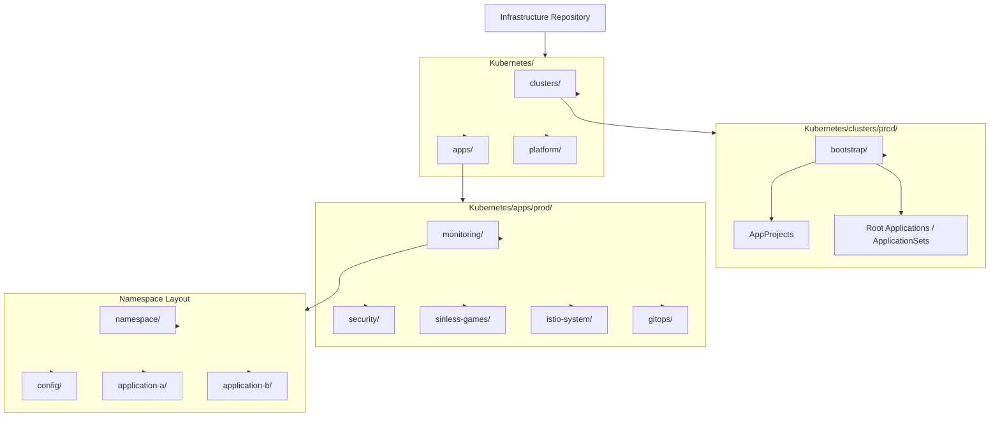
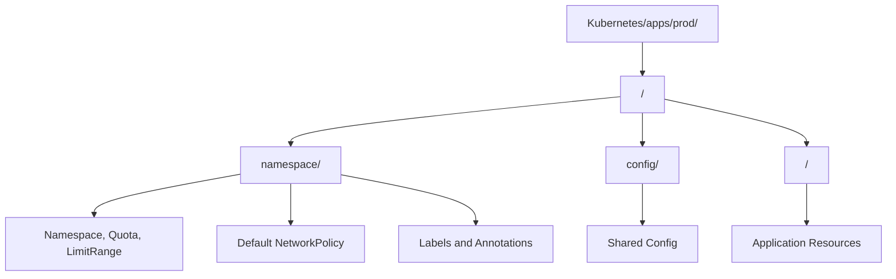
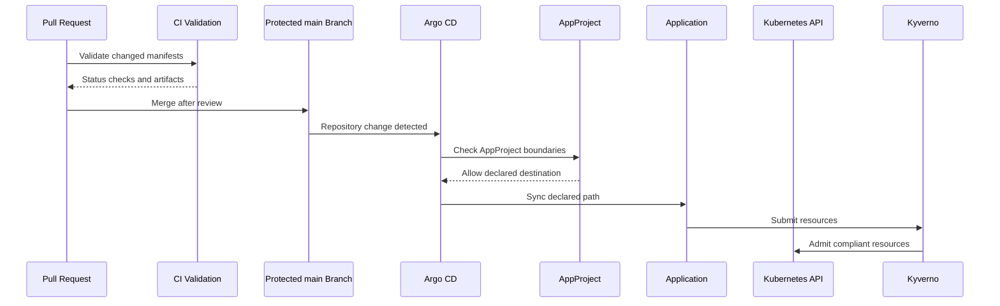
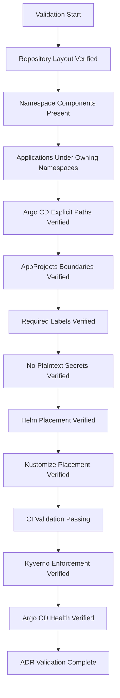

# ADR-0032 — Namespace, Application Layout, and GitOps Repository Structure

**ADR:** ADR-0032  
**Title:** Namespace, Application Layout, and GitOps Repository Structure  
**Owner:** SinLess Games LLC (Timothy “Andy” Andrew Pierce / sinless777)  
**Status:** ACCEPTED  
**Date Accepted:** 2026-04-25  
**Last Updated:** 2026-04-25  
**Supersedes:** N/A  
**Superseded By:** N/A  

**Related:**

- [Docs/Architecture/DECISIONS.md](../DECISIONS.md)
- [ADR-0001 — Monorepo Source of Truth](./ADR-0001.md)
- [ADR-0006 — Kubernetes Distribution Choice: RKE2](./ADR-0006.md)
- [ADR-0007 — GitOps Controller: Argo CD](./ADR-0007.md)
- [ADR-0008 — Progressive Delivery with Istio and Argo Rollouts](./ADR-0008.md)
- [ADR-0012 — Vault Secrets and PKI](./ADR-0012.md)
- [ADR-0014 — Observability and Incident Response Platform](./ADR-0014.md)
- [ADR-0016 — Policy-as-Code Enforcement with Kyverno](./ADR-0016.md)
- [ADR-0017 — GitHub Source Control, CI/CD, and Registry Operating Model](./ADR-0017.md)
- [ADR-0020 — Security and Compliance Operating Model](./ADR-0020.md)
- [ADR-0021 — Kubernetes Persistent Storage with Longhorn](./ADR-0021.md)
- [ADR-0023 — Istio Service Mesh Operating Model](./ADR-0023.md)
- [ADR-0024 — Ingress, Gateway, DNS, and TLS Routing Model](./ADR-0024.md)
- [ADR-0025 — GitHub Actions Runner Controller and Agentic Workflow Operating Model](./ADR-0025.md)
- [ADR-0027 — RKE2 Cluster Node Topology and Scheduling Model](./ADR-0027.md)
- [ADR-0030 — Infrastructure Provisioning with Terraform and Ansible](./ADR-0030.md)

---

## Context

The Kubernetes platform requires a predictable repository structure for
namespaces, applications, Helm values, Kustomize overlays, Argo CD resources,
security policy, observability configuration, and platform operations.

The repository must support:

- GitOps reconciliation through Argo CD
- environment separation
- namespace ownership
- application ownership
- platform component ownership
- clear file placement
- repeatable validation in CI
- policy enforcement through Kyverno
- secure secret delivery through Vault and External Secrets
- progressive delivery through Argo Rollouts
- Istio routing and service mesh resources
- observability and incident response resources
- operational review and auditability

The platform repository contains Kubernetes resources under:

```text
Kubernetes/
```

Production application resources are organized under:

```text
Kubernetes/apps/prod/
```

The required application layout is:

```text
Kubernetes/apps/prod/<namespace>/<application>/
```

Namespaces are represented as first-class GitOps components.

Each namespace has a dedicated namespace directory containing namespace
manifests, labels, annotations, quotas, network policies, and ownership metadata.

---

## Decision

Adopt an environment-first, namespace-first, application-second GitOps
repository structure.

The accepted production application layout is:

```text
Kubernetes/apps/prod/<namespace>/<application>/
```

The accepted namespace component layout is:

```text
Kubernetes/apps/prod/<namespace>/namespace/
```

Argo CD reconciles Kubernetes resources from the GitHub-hosted Infrastructure
repository.

Argo CD Application, ApplicationSet, and AppProject resources are declared under
cluster bootstrap paths.

Application manifests, Helm values, Kustomize overlays, and supporting resources
are stored with the application that owns them.

Namespace-wide resources are stored under the namespace’s `namespace/`
component.

Shared namespace configuration is stored under the namespace’s `config/`
component when required.

Secrets are not committed to Git.

ExternalSecret resources are committed to Git.

Secret values are stored in Vault.

---

## Repository Architecture



---

## Scope

This ADR governs:

- Kubernetes repository layout
- environment directory structure
- namespace directory structure
- application directory structure
- namespace ownership requirements
- application ownership requirements
- Argo CD bootstrap structure
- AppProject boundaries
- sync wave conventions
- label and annotation requirements
- secret placement rules
- Helm and Kustomize placement
- validation requirements
- rollback requirements
- operational requirements

This ADR does not define:

- every Kubernetes manifest
- every Argo CD Application
- every Helm chart value
- every Kustomize patch
- every namespace quota
- every NetworkPolicy
- every application deployment
- every secret path
- every CI workflow implementation

Those items are implementation artifacts managed in the repository.

---

## Non-Goals

The accepted GitOps structure does not include:

- application manifests spread randomly across the repository
- one flat directory for all Kubernetes resources
- namespace resources mixed into unrelated application directories
- plaintext Kubernetes Secret values in Git
- manual namespace creation as normal operations
- manual Argo CD application creation as normal operations
- production resources outside the production environment path
- unmanaged Helm releases
- unmanaged Kustomize overlays
- direct production changes outside pull requests
- application teams bypassing namespace ownership boundaries

---

## Responsibility Split

| Area | Responsibility |
| --- | --- |
| Repository source of truth | GitHub Infrastructure repository |
| GitOps reconciliation | Argo CD |
| Cluster bootstrap | `Kubernetes/clusters/<env>/bootstrap/` |
| Production app manifests | `Kubernetes/apps/prod/` |
| Namespace ownership | `<namespace>/namespace/` |
| Shared namespace config | `<namespace>/config/` |
| Application ownership | `<namespace>/<application>/` |
| Secrets source of truth | Vault |
| Runtime secret delivery | External Secrets |
| Kubernetes admission policy | Kyverno |
| Progressive delivery | Argo Rollouts |
| Service mesh routing | Istio |
| Observability | Grafana stack |
| CI validation | GitHub Actions and ARC |

---

## Accepted Tooling

| Area | Tool |
| --- | --- |
| Source control | GitHub |
| GitOps controller | Argo CD |
| Application grouping | Argo CD Applications and ApplicationSets |
| Project boundaries | Argo CD AppProjects |
| Kubernetes manifests | YAML |
| Helm deployments | Helm values stored with owning app |
| Kustomize overlays | Kustomize stored with owning app |
| Secret custody | Vault |
| Secret delivery | External Secrets Operator |
| Policy enforcement | Kyverno |
| CI validation | GitHub Actions |
| Self-hosted runners | Actions Runner Controller |
| Documentation | MkDocs Material |

---

## Alternatives Considered

### A1) Flat Kubernetes Directory

**Pros:**

- simple initial layout
- easy to browse for very small clusters
- low structure overhead

**Cons:**

- does not scale across namespaces
- weak ownership boundaries
- harder CI path filtering
- harder Argo CD application ownership
- higher risk of unrelated resource coupling

A flat Kubernetes directory is rejected.

---

### A2) Application-First Layout

Example:

```text
Kubernetes/apps/prod/<application>/<namespace>/
```

**Pros:**

- convenient for application-centered teams
- groups application resources together across environments

**Cons:**

- weaker namespace ownership model
- harder to apply namespace-wide policy
- harder to reason about environment and namespace boundaries
- weaker fit for platform-owned namespace structure

Application-first layout is rejected.

---

### A3) Environment-Only Layout Without Namespace Boundaries

Example:

```text
Kubernetes/prod/<all-resources>/
```

**Pros:**

- simple environment split
- easy initial Argo CD bootstrap

**Cons:**

- weak ownership boundaries
- weak policy targeting
- hard to review namespace-specific changes
- hard to enforce namespace-specific conventions

Environment-only layout is rejected.

---

### A4) Helm Releases Managed Manually

**Pros:**

- simple manual debugging
- no GitOps dependency
- fast for one-off testing

**Cons:**

- weak auditability
- drift risk
- no pull request review
- no reliable rollback through Git
- conflicts with Argo CD operating model

Manual Helm release management is rejected as normal operations.

---

### A5) Separate Repository per Application

**Pros:**

- strong application-level separation
- independent access control per repository
- common multi-team model

**Cons:**

- increases repository management overhead
- complicates platform-wide GitOps visibility
- makes cross-cutting infrastructure review harder
- conflicts with the accepted monorepo source-of-truth decision

Separate application repositories are rejected for platform-owned Kubernetes
manifests.

---

## Rationale

The accepted layout makes the repository readable, reviewable, and enforceable.

### Namespace-First Structure

Kubernetes security, networking, quotas, secrets, and ownership commonly align
to namespaces.

A namespace-first layout makes those boundaries explicit.

---

### Environment Separation

Production resources live under the production path.

This prevents production resources from being mixed with development or staging
resources.

---

### GitOps Clarity

Argo CD can reconcile predictable paths.

Application and namespace ownership maps directly to filesystem structure.

---

### CI Path Filtering

CI can validate only the resources affected by a pull request.

Path-based workflows can target:

- namespace changes
- application changes
- platform changes
- policy changes
- documentation changes

---

### Policy Enforcement

Kyverno and CI can enforce required labels, annotations, ownership metadata,
namespace boundaries, and secret handling conventions.

---

## Required Repository Structure

The Kubernetes repository structure is:

```text
Kubernetes/
  clusters/
    prod/
      bootstrap/
  apps/
    prod/
      <namespace>/
        namespace/
        config/
        <application>/
  platform/
```

Required production structure:

```text
Kubernetes/apps/prod/
  gitops/
  istio-system/
  monitoring/
  networking/
  security/
  sinless-games/
  longhorn-system/
  cert-manager/
  external-dns/
```

Namespace names must match Kubernetes namespace names.

Application directory names must match the primary application name unless a
well-defined chart or component name requires a different DNS-compatible name.

---

## Namespace Directory Requirements

Every namespace under `Kubernetes/apps/prod/` must include a `namespace/`
component.

Required namespace path:

```text
Kubernetes/apps/prod/<namespace>/namespace/
```

The namespace component owns:

- Namespace manifest
- required labels
- required annotations
- ResourceQuota where applicable
- LimitRange where applicable
- default NetworkPolicy where applicable
- namespace ownership metadata
- Istio injection decision
- security classification
- backup classification where applicable

Namespace manifests must be GitOps-managed.

Manual namespace creation is not accepted as normal operations.

---

## Namespace Manifest Requirements

Namespace manifests must include required labels.

Required labels:

```text
app.kubernetes.io/managed-by=argocd
environment=prod
platform.sinlessgames.io/namespace=<namespace>
platform.sinlessgames.io/owner=sinless-games-llc
```

Security labels:

```text
security.sinlessgames.io/classification=<public|internal|confidential|restricted|regulated>
security.sinlessgames.io/network-policy=<required|not-required>
```

Mesh labels where applicable:

```text
security.sinlessgames.io/mesh=istio
istio-injection=enabled
```

Namespaces not participating in Istio must not include `istio-injection=enabled`.

---

## Application Directory Requirements

Applications are stored under the namespace that owns them.

Required application path:

```text
Kubernetes/apps/prod/<namespace>/<application>/
```

Application directories contain all GitOps-owned resources for that application.

Application directories may include:

- `kustomization.yaml`
- Helm `values.yaml`
- Kubernetes manifests
- Argo Rollouts resources
- Services
- ServiceAccounts
- ConfigMaps
- ExternalSecrets
- NetworkPolicies
- ServiceMonitors
- PrometheusRules
- Istio VirtualServices
- Istio DestinationRules
- Istio AuthorizationPolicies
- PodDisruptionBudgets
- dashboards
- application-specific documentation

Application directories must not contain plaintext secret values.

---

## Application Layout Pattern

Accepted application directory pattern:

```text
Kubernetes/apps/prod/<namespace>/<application>/
  kustomization.yaml
  values.yaml
  deployment.yaml
  service.yaml
  serviceaccount.yaml
  configmap.yaml
  externalsecret.yaml
  networkpolicy.yaml
  servicemonitor.yaml
  prometheusrule.yaml
  pdb.yaml
```

For Helm-based applications:

```text
Kubernetes/apps/prod/<namespace>/<application>/
  kustomization.yaml
  chart.yaml
  values.yaml
  externalsecret.yaml
  networkpolicy.yaml
  servicemonitor.yaml
  prometheusrule.yaml
```

For Istio-routed applications:

```text
Kubernetes/apps/prod/<namespace>/<application>/
  gateway.yaml
  virtualservice.yaml
  destinationrule.yaml
  authorizationpolicy.yaml
```

For Argo Rollouts applications:

```text
Kubernetes/apps/prod/<namespace>/<application>/
  rollout.yaml
  analysis-template.yaml
  service-stable.yaml
  service-canary.yaml
  virtualservice.yaml
```

---

## Directory Ownership Model



---

## Config Component Requirements

A namespace may include a `config/` component for shared namespace-level
configuration.

Accepted config path:

```text
Kubernetes/apps/prod/<namespace>/config/
```

The config component may own:

- shared ConfigMaps
- shared dashboards
- shared alert rules
- shared datasource references
- common namespace policies
- common ExternalSecret references
- common application configuration
- namespace-wide observability configuration

The `config/` component must not own application-specific Deployments unless the
resource is intentionally shared by the namespace.

---

## Cluster Bootstrap Requirements

Cluster bootstrap resources live under:

```text
Kubernetes/clusters/prod/bootstrap/
```

Bootstrap resources include:

- Argo CD AppProjects
- root Applications
- ApplicationSets
- repository credentials references
- cluster-level GitOps wiring
- sync wave definitions where applicable
- bootstrap namespace references

The bootstrap path is responsible for starting reconciliation.

Application resources are not stored directly in bootstrap paths unless they are
required to bootstrap Argo CD or project boundaries.

---

## Argo CD Application Model

Argo CD Applications are organized by environment and namespace.

Accepted application naming pattern:

```text
<environment>-<namespace>-<application>
```

Examples:

```text
prod-monitoring-grafana
prod-monitoring-loki
prod-security-falco
prod-sinless-games-docs
prod-istio-system-shared-edge
```

Argo CD Application resources must reference explicit repository paths.

Applications must not reference broad root paths that include unrelated
resources.

---

## AppProject Requirements

Argo CD AppProjects enforce namespace and repository boundaries.

Required AppProject classes:

| AppProject | Scope |
| --- | --- |
| `platform` | platform infrastructure services |
| `monitoring` | observability and incident response |
| `security` | security tooling |
| `networking` | DNS, ingress, gateways, certificates |
| `storage` | Longhorn and Garage-related storage resources |
| `applications` | product and application workloads |

AppProjects must restrict:

- source repositories
- destination namespaces
- cluster-scoped resources
- namespace-scoped resources where required
- allowed Helm repositories
- allowed Git paths where supported by implementation

---

## GitOps Reconciliation Flow



---

## Environment Requirements

The accepted environments are:

```text
dev
staging
prod
```

Production resources live under:

```text
Kubernetes/apps/prod/
Kubernetes/clusters/prod/
```

Development and staging resources use equivalent environment paths when
implemented.

Production resources must not depend on development or staging manifests.

Environment-specific values must be separated by environment path.

---

## Naming Requirements

Kubernetes resource names must be lowercase DNS-compatible names.

Directory names should be lowercase DNS-compatible names.

The exception is existing human-readable documentation or legacy component
paths that are explicitly accepted.

Kubernetes resource names must not use uppercase letters.

For example, the filesystem path may contain:

```text
Kubernetes/apps/prod/monitoring/DFIR-IRIS/
```

But Kubernetes resource names must use:

```text
dfir-iris
```

---

## Required Labels

All GitOps-managed Kubernetes resources must include:

```text
app.kubernetes.io/name=<resource-or-application-name>
app.kubernetes.io/part-of=<system-name>
app.kubernetes.io/component=<component-name>
app.kubernetes.io/managed-by=argocd
environment=prod
```

Platform ownership labels:

```text
platform.sinlessgames.io/owner=sinless-games-llc
platform.sinlessgames.io/source-repo=Infrastructure
```

Security classification labels where applicable:

```text
security.sinlessgames.io/classification=<public|internal|confidential|restricted|regulated>
```

Backup labels where applicable:

```text
backup.sinlessgames.io/enabled=<true|false>
backup.sinlessgames.io/system=<velero|longhorn|pbs|native>
```

---

## Required Annotations

Production workloads must include operational annotations.

Required annotations where applicable:

```text
runbook.sinlessgames.io/url=<runbook-url>
docs.sinlessgames.io/adr=<adr-reference>
```

Public routes must include:

```text
networking.sinlessgames.io/public-hostname=<hostname>
```

ExternalSecret resources must include:

```text
secrets.sinlessgames.io/source=vault
```

---

## Sync Wave Requirements

Argo CD sync waves control dependency order.

Required sync wave classes:

| Wave | Resource Class |
| --- | --- |
| `-10` | Namespaces |
| `-5` | ExternalSecret references and prerequisite configuration |
| `0` | CRDs and operators |
| `1` | core platform services |
| `2` | storage, observability, and security dependencies |
| `3` | application configuration |
| `4` | application workloads |
| `5` | ingress, routes, and public exposure |
| `6` | ServiceMonitors, PrometheusRules, dashboards, and validation hooks |

Resources that depend on CRDs must not sync before the CRD owner is healthy.

---

## Sync Wave Flow

```mermaid
flowchart LR
  ns["-10 Namespaces"]
  secrets["-5 ExternalSecrets"]
  crds["0 CRDs / Operators"]
  core["1 Core Platform"]
  deps["2 Dependencies"]
  config["3 App Config"]
  workloads["4 Workloads"]
  routes["5 Routes"]
  obs["6 Observability"]

  ns --> secrets
  secrets --> crds
  crds --> core
  core --> deps
  deps --> config
  config --> workloads
  workloads --> routes
  routes --> obs
```



---

## Secret Handling Requirements

Plaintext secrets must not be committed to Git.

Forbidden resources in application paths:

- plaintext Kubernetes Secret values
- private keys
- passwords
- API tokens
- webhook URLs
- database credentials
- object storage credentials
- Cloudflare API tokens
- GitHub tokens
- Vault tokens
- kubeconfigs

Accepted secret resources in Git:

- ExternalSecret
- SecretStore
- ClusterSecretStore where approved
- Sealed or encrypted secret manifests only when explicitly approved by another ADR

Vault is the source of truth for secret values.

External Secrets delivers runtime secrets into Kubernetes.

---

## Helm Requirements

Helm-based applications store values with the application.

Required Helm file placement:

```text
Kubernetes/apps/prod/<namespace>/<application>/values.yaml
```

Helm values must not contain plaintext secrets.

Helm releases must be reconciled by Argo CD.

Manual `helm install`, `helm upgrade`, and `helm rollback` are not accepted as
normal operations.

Break-glass Helm operations must be reconciled back to Git.

---

## Kustomize Requirements

Kustomize-based applications store overlays with the application.

Required Kustomize file:

```text
Kubernetes/apps/prod/<namespace>/<application>/kustomization.yaml
```

Kustomize must not generate resources with unstable names unless the workload
requires it and the behavior is documented.

Kustomize patches must be scoped to the application directory.

---

## Namespace Security Requirements

Every production namespace requires an exposure classification.

Accepted exposure classifications:

```text
public
internal
management
cluster-internal
```

Every production namespace requires a data classification.

Accepted data classifications:

```text
public
internal
confidential
restricted
regulated
```

Sensitive namespaces require NetworkPolicies.

Regulated namespaces require explicit ownership, logging, backup, and incident
response metadata.

---

## NetworkPolicy Requirements

Production namespaces require NetworkPolicy decisions.

Namespace components must define either:

- baseline default-deny NetworkPolicy
- explicit documented reason why default-deny is not applied

Sensitive namespaces require default-deny ingress.

Application directories own application-specific NetworkPolicies.

Namespace directories own namespace-wide baseline NetworkPolicies.

---

## Istio Resource Placement Requirements

Mesh-wide Istio resources live under:

```text
Kubernetes/apps/prod/istio-system/
```

Mesh policy resources live under:

```text
Kubernetes/apps/prod/istio-system/mesh-policies/
```

Application-specific Istio resources live with the application.

Application-specific Istio resources include:

- VirtualService
- DestinationRule
- AuthorizationPolicy
- PeerAuthentication when scoped to the application
- Gateway only when application-owned and approved

Shared Gateway resources live in `istio-system`.

---

## Observability Resource Placement Requirements

Shared monitoring resources live under:

```text
Kubernetes/apps/prod/monitoring/
```

Application-specific monitoring resources live with the application.

Application-specific monitoring resources include:

- ServiceMonitor
- PodMonitor
- PrometheusRule
- dashboard ConfigMaps
- log parsing configuration where application-owned

Shared dashboards and datasources live under:

```text
Kubernetes/apps/prod/monitoring/config/
```

---

## Security Resource Placement Requirements

Shared security platform resources live under:

```text
Kubernetes/apps/prod/security/
```

Application-specific security resources live with the application.

Security resources include:

- NetworkPolicy
- AuthorizationPolicy
- ExternalSecret
- PodSecurity-related labels
- Falco rule ConfigMaps where application-owned
- Wazuh agent configuration where applicable
- Trivy scan configuration where applicable

Kyverno policy resources live under the accepted policy path defined by
ADR-0016.

---

## CI Validation Requirements

Pull requests affecting Kubernetes paths require validation.

Required checks:

- YAML validation
- Kubernetes schema validation
- Kustomize build validation
- Helm lint validation
- Helm template rendering
- Argo CD application validation where applicable
- Kyverno policy validation
- kubeconform or equivalent schema validation
- secret scanning
- image tag policy validation
- public route safety validation
- namespace label validation
- required ownership label validation

CI must fail when production manifests contain plaintext secrets.

CI must fail when production workloads use mutable image tags.

CI must fail when required namespace labels are missing.

---

## Security Requirements

### Repository Security

Production Kubernetes paths require pull requests and review.

Production-impacting paths include:

```text
Kubernetes/apps/prod/
Kubernetes/clusters/prod/
Kubernetes/platform/
Policy/
```

Changes to production GitOps resources must pass required CI checks.

---

### Access Control

Argo CD access is restricted.

Required controls:

- AppProjects restrict destination namespaces
- AppProjects restrict source repositories
- Argo CD admin access restricted
- application sync permissions scoped by role
- production sync access restricted
- break-glass access audited

---

### Secret Security

Secret values are stored in Vault.

ExternalSecret manifests may be stored in Git.

Applications receive only the secrets they require.

Production applications must not mount broad shared secret sets.

---

### Drift Control

Argo CD detects and corrects Kubernetes drift.

Manual changes to GitOps-managed resources are not accepted as normal
operations.

Break-glass changes must be reconciled back to Git.

---

## Observability Requirements

GitOps and repository structure must be observable.

Required metrics and alerts:

- Argo CD application health
- Argo CD sync status
- Argo CD reconciliation failures
- AppProject policy violations
- Kubernetes manifest validation failures
- ExternalSecret sync failures
- Helm render failures
- Kustomize build failures
- CI validation failures
- production namespace missing required labels
- production app missing ownership labels
- public route policy violations

Grafana dashboards must display:

- Argo CD application status by namespace
- sync failures by application
- unhealthy applications
- suspended or degraded applications
- ExternalSecret health
- namespace ownership status
- production route status
- policy violation counts

---

## Implementation Requirements

### Production App Layout

Production applications are stored under:

```text
Kubernetes/apps/prod/<namespace>/<application>/
```

Every production namespace has:

```text
Kubernetes/apps/prod/<namespace>/namespace/
```

Namespace shared config uses:

```text
Kubernetes/apps/prod/<namespace>/config/
```

---

### Required Namespace Components

Required namespace components include:

```text
namespace.yaml
kustomization.yaml
networkpolicy.yaml
resourcequota.yaml
limitrange.yaml
```

ResourceQuota and LimitRange are required when the namespace runs application
or platform workloads.

---

### Required Application Components

Application components must include:

```text
kustomization.yaml
```

Applications that expose a service must include:

```text
service.yaml
networkpolicy.yaml
```

Applications that run workloads must include one of:

```text
deployment.yaml
statefulset.yaml
daemonset.yaml
rollout.yaml
job.yaml
cronjob.yaml
```

Applications that require secrets must include:

```text
externalsecret.yaml
```

Applications with metrics must include:

```text
servicemonitor.yaml
```

Applications with alerts must include:

```text
prometheusrule.yaml
```

---

### Required App Metadata

Each application directory must have a clear owner.

Required metadata may be expressed through labels, annotations, or an
application metadata file.

Required metadata fields:

```text
application
namespace
environment
owner
criticality
exposure
data-classification
backup-required
runbook
related-adrs
```

---

## Validation Requirements

This ADR is valid when the following requirements are met:

- production Kubernetes resources are under `Kubernetes/apps/prod/`
- namespaces are represented by `namespace/` components
- applications are stored under their owning namespace
- Argo CD Applications reference explicit paths
- Argo CD AppProjects restrict namespace destinations
- namespace manifests include required labels
- production resources include required labels
- production workloads include owner labels
- production workloads include environment labels
- ExternalSecret resources are used instead of plaintext secrets
- production manifests do not contain plaintext secret values
- Helm values are stored with owning applications
- Kustomize files are stored with owning applications
- shared namespace config is stored in `config/`
- Istio mesh-wide resources are stored under `istio-system`
- application-specific Istio resources are stored with applications
- monitoring shared config is stored under `monitoring/config`
- CI validates changed Kubernetes resources
- Kyverno enforces required production policies
- Argo CD reports applications as healthy
- drift is corrected through GitOps



---

## Rollback Plan

If a repository layout change breaks Argo CD reconciliation:

1. stop merging additional GitOps layout changes
2. identify the affected Argo CD Application
3. inspect the referenced path
4. restore the last known-good path or Application definition
5. allow Argo CD to resync
6. verify application health
7. correct the layout through pull request

If a namespace component is missing or invalid:

1. block application onboarding for that namespace
2. add or restore the `namespace/` component
3. apply required labels and annotations
4. apply required NetworkPolicy, ResourceQuota, and LimitRange where applicable
5. validate namespace resources in CI
6. reconcile through Argo CD

If plaintext secrets are committed:

1. block merge or revert the commit
2. rotate exposed secret values
3. move secret values into Vault
4. replace the secret manifest with ExternalSecret
5. inspect logs and artifacts for exposure
6. create a DFIR-IRIS case when security-impacting

If Argo CD AppProject boundaries block a valid application:

1. inspect the AppProject destination rules
2. inspect the Application source path
3. verify namespace ownership
4. update the AppProject through Git if the access is valid
5. resync the affected Application
6. verify unrelated namespaces remain blocked

If manual cluster drift is detected:

1. identify the drifted resource
2. determine whether Git or live state is correct
3. revert unauthorized live changes through Argo CD
4. update Git only when the manual change is approved
5. preserve audit evidence for production-impacting drift

A permanent migration away from this repository structure requires:

- a superseding ADR
- migration plan
- rollback plan
- Argo CD migration procedure
- AppProject migration procedure
- namespace migration procedure
- application path migration procedure
- validation evidence
- updated implementation documentation
- updated runbooks

---

## Operational Requirements

GitOps repository operation requires:

- environment-first structure
- namespace-first application layout
- namespace components for every production namespace
- application resources stored with owning applications
- shared namespace config stored in `config/`
- Argo CD Applications with explicit paths
- AppProject destination restrictions
- required labels
- required annotations
- no plaintext secrets in Git
- ExternalSecret-based secret delivery
- Helm values stored with applications
- Kustomize files stored with applications
- CI validation
- Kyverno policy enforcement
- Argo CD health monitoring
- ExternalSecret health monitoring
- namespace ownership metadata
- application ownership metadata
- route ownership metadata
- runbook annotations
- rollback procedures
- drift correction through GitOps