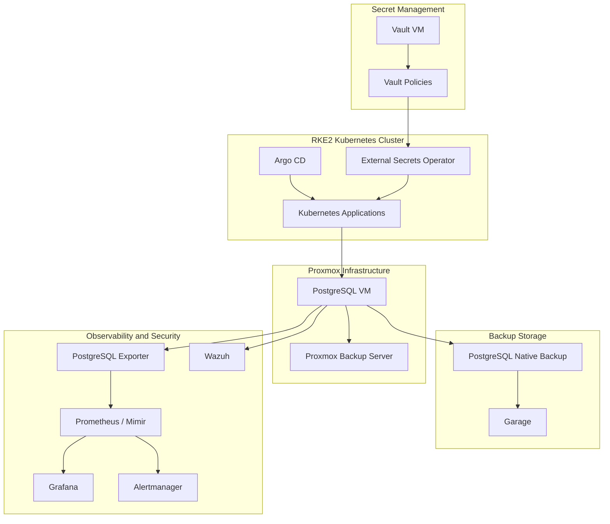
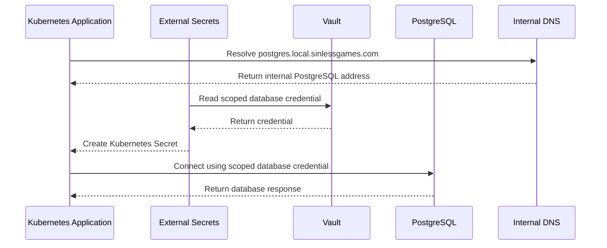
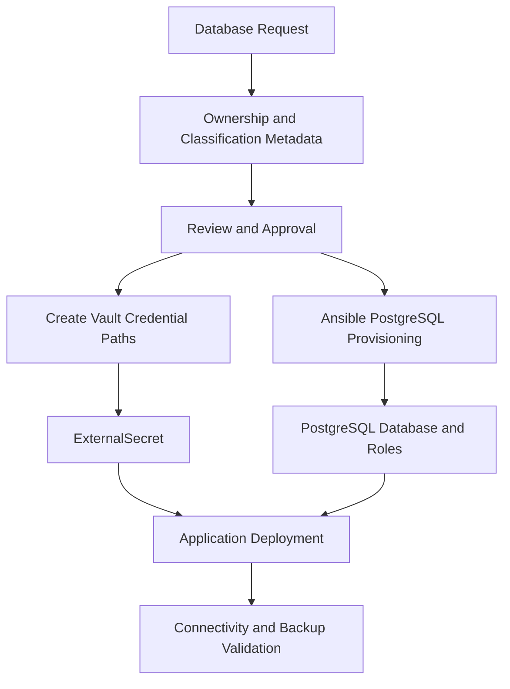
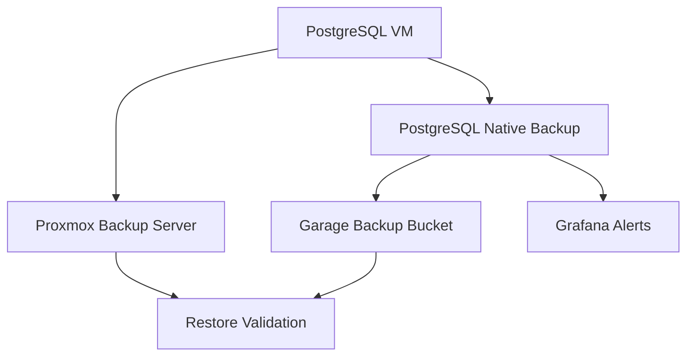
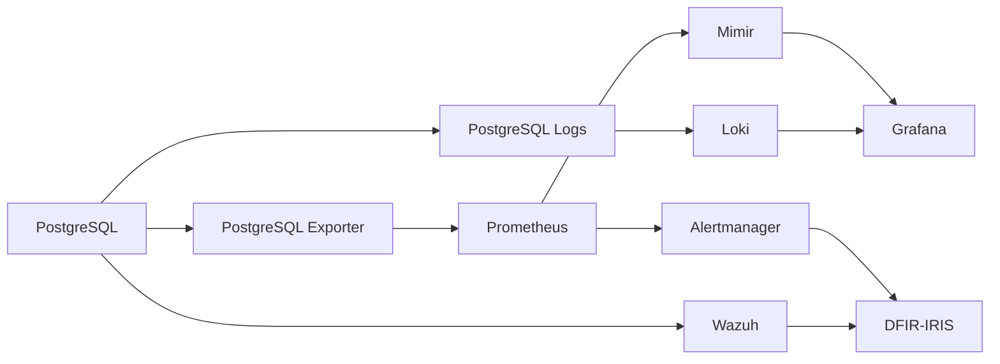
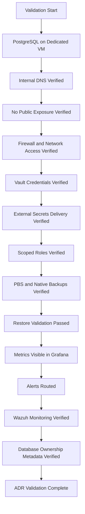

# ADR-0033 — PostgreSQL Operating Model

**ADR:** ADR-0033  
**Title:** PostgreSQL Operating Model for VM-Hosted Platform Databases  
**Owner:** SinLess Games LLC (Timothy “Andy” Andrew Pierce / sinless777)  
**Status:** ACCEPTED  
**Date Accepted:** 2026-04-25  
**Last Updated:** 2026-04-25  
**Supersedes:** N/A  
**Superseded By:** N/A  

**Related:**

- [Docs/Architecture/DECISIONS.md](../DECISIONS.md)
- [ADR-0001 — Monorepo Source of Truth](./ADR-0001.md)
- [ADR-0002 — Proxmox Cluster Topology](./ADR-0002.md)
- [ADR-0003 — Network Segmentation and Planes](./ADR-0003.md)
- [ADR-0006 — Kubernetes Distribution Choice: RKE2](./ADR-0006.md)
- [ADR-0007 — GitOps Controller: Argo CD](./ADR-0007.md)
- [ADR-0012 — Vault Secrets and PKI](./ADR-0012.md)
- [ADR-0013 — Backups and Disaster Recovery with PBS, Velero, and Garage](./ADR-0013.md)
- [ADR-0014 — Observability and Incident Response Platform](./ADR-0014.md)
- [ADR-0016 — Policy-as-Code Enforcement with Kyverno](./ADR-0016.md)
- [ADR-0018 — Garage Object Storage Placement and Operating Model](./ADR-0018.md)
- [ADR-0019 — Management Overlay with WireGuard](./ADR-0019.md)
- [ADR-0020 — Security and Compliance Operating Model](./ADR-0020.md)
- [ADR-0021 — Kubernetes Persistent Storage with Longhorn](./ADR-0021.md)
- [ADR-0022 — Database and Stateful Platform Service Placement](./ADR-0022.md)
- [ADR-0024 — Ingress, Gateway, DNS, and TLS Routing Model](./ADR-0024.md)
- [ADR-0029 — Internal DNS and Name Resolution Model](./ADR-0029.md)
- [ADR-0030 — Infrastructure Provisioning with Terraform and Ansible](./ADR-0030.md)

---

## Context

The platform requires a reliable relational database service for platform
services, applications, observability components, identity systems, incident
response tooling, automation workflows, and future internal services.

PostgreSQL is a critical stateful service.

The platform already defines that PostgreSQL runs on virtual machines instead
of inside Kubernetes.

The platform uses:

- Proxmox for virtual machine hosting
- Terraform for VM provisioning
- Ansible for PostgreSQL configuration
- Vault for database credential custody
- External Secrets for Kubernetes secret delivery
- RKE2 for Kubernetes workloads
- Argo CD for GitOps reconciliation
- Proxmox Backup Server for VM-level backup
- Garage for object storage and backup artifacts
- Grafana stack for monitoring and alerting
- Wazuh for VM security monitoring
- WireGuard for private management access

The local infrastructure domain is:

```text
local.sinlessgames.com
```

The accepted PostgreSQL internal hostname is:

```text
postgres.local.sinlessgames.com
```

PostgreSQL must remain an internal-only service.

PostgreSQL must not be publicly exposed.

---

## Decision

Adopt **VM-hosted PostgreSQL** as the platform relational database operating
model.

PostgreSQL runs on dedicated Proxmox virtual machines.

PostgreSQL is not deployed inside Kubernetes as the platform database layer.

Kubernetes applications connect to PostgreSQL over internal service networking.

Kubernetes applications receive PostgreSQL credentials from Vault through
External Secrets.

PostgreSQL is managed through Terraform and Ansible.

PostgreSQL backups use both infrastructure-level and PostgreSQL-native backup
methods.

The accepted PostgreSQL model is:

| Area | Decision |
| --- | --- |
| Database engine | PostgreSQL |
| Runtime placement | Dedicated Proxmox VM |
| Kubernetes placement | Not in Kubernetes |
| Internal hostname | `postgres.local.sinlessgames.com` |
| Public exposure | Not allowed |
| Provisioning | Terraform |
| Configuration | Ansible |
| Credential source | Vault |
| Kubernetes credential delivery | External Secrets |
| VM backup | Proxmox Backup Server |
| Database-native backup | PostgreSQL-native backup workflow |
| Backup object storage | Garage where applicable |
| Monitoring | Grafana stack |
| Host security monitoring | Wazuh |
| Access path | Internal networks and WireGuard |
| GitOps relationship | Kubernetes consumers are reconciled by Argo CD |

---

## PostgreSQL Architecture



---

## Scope

This ADR governs:

- PostgreSQL as the platform relational database engine
- PostgreSQL placement on Proxmox virtual machines
- PostgreSQL internal DNS naming
- database access from Kubernetes workloads
- PostgreSQL credential custody
- PostgreSQL database and role provisioning
- PostgreSQL backup requirements
- PostgreSQL restore requirements
- PostgreSQL monitoring and alerting
- PostgreSQL security requirements
- PostgreSQL operational requirements
- PostgreSQL validation requirements
- PostgreSQL rollback requirements

This ADR does not define:

- every database schema
- every migration script
- every application data model
- every PostgreSQL extension
- every PostgreSQL tuning value
- every database user
- every application-specific credential
- every backup command
- every restore command
- every dashboard panel

Those items are implementation artifacts managed through application
repositories, database migration tooling, Ansible, Vault, and operations
runbooks.

---

## Non-Goals

The accepted PostgreSQL operating model does not include:

- PostgreSQL running inside Kubernetes as the platform database layer
- PostgreSQL managed by a Kubernetes operator for platform databases
- public exposure of PostgreSQL
- application use of PostgreSQL superuser credentials
- shared database credentials across unrelated applications
- plaintext database credentials in Git
- unmanaged manual database creation as normal operations
- unbacked production databases
- unmonitored production databases
- production databases without ownership metadata
- production databases without restore procedures
- direct database access from untrusted networks

---

## Responsibility Split

| Area | Responsibility |
| --- | --- |
| PostgreSQL runtime | Dedicated Proxmox VM |
| VM provisioning | Terraform |
| PostgreSQL configuration | Ansible |
| Database credential custody | Vault |
| Kubernetes secret delivery | External Secrets |
| Kubernetes application deployment | Argo CD |
| VM-level backup | Proxmox Backup Server |
| Database-native backup | PostgreSQL backup workflow |
| Object backup storage | Garage |
| Host security monitoring | Wazuh |
| Metrics collection | PostgreSQL exporter |
| Dashboards and alerts | Grafana, Prometheus, Mimir, Alertmanager |
| Access control | PostgreSQL roles, firewall rules, Vault policies |
| Incident response | DFIR-IRIS |

---

## Accepted Tooling

| Area | Tool |
| --- | --- |
| Relational database | PostgreSQL |
| Hypervisor | Proxmox |
| VM provisioning | Terraform |
| Configuration management | Ansible |
| Secret management | Vault |
| Runtime secret delivery | External Secrets Operator |
| Kubernetes GitOps | Argo CD |
| VM backup | Proxmox Backup Server |
| Object storage | Garage |
| Monitoring | Grafana stack |
| Endpoint security | Wazuh |
| Policy enforcement | Kyverno and CI gates |
| Management access | WireGuard |

---

## Alternatives Considered

### A1) PostgreSQL Inside Kubernetes

**Pros:**

- Kubernetes-native deployment model
- GitOps-managed manifests
- easier service discovery for Kubernetes workloads
- possible operator-driven lifecycle

**Cons:**

- couples the platform database to Kubernetes availability
- complicates cluster disaster recovery
- increases dependency on Longhorn during database incidents
- makes cluster rebuilds depend on in-cluster database restore
- increases operational complexity for critical relational data

PostgreSQL inside Kubernetes is rejected for the platform database layer.

---

### A2) PostgreSQL Operator

**Pros:**

- automated database lifecycle management
- Kubernetes-native backup and failover patterns
- declarative database resources

**Cons:**

- requires PostgreSQL to run inside Kubernetes
- adds operator-specific lifecycle complexity
- couples critical database availability to Kubernetes and storage health
- conflicts with the accepted VM-hosted PostgreSQL decision

A PostgreSQL operator is rejected for the platform database layer.

---

### A3) Cloud-Hosted PostgreSQL

**Pros:**

- managed backups
- managed patching
- managed high availability
- reduced local operational burden

**Cons:**

- external dependency
- recurring cost
- WAN dependency
- data residency and privacy concerns
- conflicts with the local-first infrastructure model

Cloud-hosted PostgreSQL is rejected for the local production platform database.

---

### A4) SQLite for Platform Services

**Pros:**

- simple
- low overhead
- good for small single-node applications
- no network database dependency

**Cons:**

- weak fit for shared platform services
- limited concurrency
- weaker centralized backup model
- inconsistent operational patterns across applications

SQLite is rejected as the shared platform database standard.

---

### A5) One PostgreSQL Instance Per Application

**Pros:**

- strong isolation
- independent lifecycle per application
- clear ownership boundary

**Cons:**

- operational sprawl
- many backup workflows
- many credentials
- higher monitoring overhead
- harder capacity planning

One PostgreSQL instance per application is rejected as the default model.

Application-specific PostgreSQL instances require a separate implementation
decision.

---

## Rationale

PostgreSQL is selected because it is a mature relational database that fits the
platform’s need for transactional state, application data, identity-adjacent
data, and platform service data.

### VM Placement Reduces Circular Dependencies

PostgreSQL is required by platform services that may run inside Kubernetes.

Keeping PostgreSQL outside Kubernetes prevents Kubernetes recovery from
depending on an in-cluster database.

---

### Operational Stability

A dedicated VM provides:

- predictable storage placement
- clear backup boundaries
- direct system-level monitoring
- PostgreSQL-native backup control
- stable DNS naming
- isolated database operations
- controlled maintenance windows

---

### Clear Security Boundary

PostgreSQL is internal-only.

Database access is controlled by:

- firewall rules
- internal DNS
- PostgreSQL roles
- Vault-managed credentials
- Kubernetes NetworkPolicies for consuming workloads
- WireGuard or internal networks for administration

---

### Backup Flexibility

PostgreSQL uses layered backups:

- PBS for VM recovery
- PostgreSQL-native backup for logical or physical database recovery
- Garage for backup artifacts where applicable

This supports both full VM recovery and database-level recovery.

---

## Database Access Model

Kubernetes workloads access PostgreSQL using scoped credentials delivered from
Vault.



Applications must not use PostgreSQL superuser credentials.

Applications must not share credentials with unrelated services.

---

## Internal DNS Requirements

The accepted PostgreSQL DNS name is:

```text
postgres.local.sinlessgames.com
```

PostgreSQL DNS requirements:

- internal DNS only
- not publicly resolvable
- stable across VM replacement
- reachable from approved Kubernetes workloads
- reachable from approved management clients over WireGuard
- documented in infrastructure inventory
- monitored for resolution failures

Application-specific database aliases may be created when required.

Application-specific aliases must remain internal-only.

---

## Network Requirements

PostgreSQL is an internal-only service.

Required network controls:

- no public PostgreSQL exposure
- no Cloudflare Tunnel exposure
- no public LoadBalancer exposure
- no public DNS record
- access allowed only from approved internal networks
- access allowed only from approved Kubernetes namespaces
- administration allowed only from WireGuard or internal management networks
- denied access logged where available
- firewall rules managed through automation
- database port restricted to approved clients

Default PostgreSQL port:

```text
5432/tcp
```

---

## Database Ownership Requirements

Every production database must have an owner.

Required database metadata:

- database name
- owning application
- owning namespace
- owning team or operator
- environment
- criticality
- data classification
- backup requirement
- retention requirement
- restore requirement
- credential name
- Vault path
- runbook URL
- related ADRs

Production databases must not be created without ownership metadata.

---

## Database Naming Requirements

Database names must be lowercase and descriptive.

Accepted database naming format:

```text
<application>_<environment>
```

Examples:

```text
grafana_prod
authentik_prod
dfir_iris_prod
sinless_docs_prod
```

Application schemas may use:

```text
<application>
```

Database names must not include secrets, tokens, user names, or environment
values that expose sensitive information beyond the accepted environment name.

---

## Role and Credential Requirements

PostgreSQL credentials are scoped by application.

Required role classes:

| Role Class | Purpose |
| --- | --- |
| `admin` | Restricted database administration |
| `owner` | Application schema or database ownership |
| `writer` | Application read/write access |
| `reader` | Read-only reporting or integration access |
| `migration` | Schema migration access |
| `backup` | Backup workflow access |
| `monitoring` | Metrics collection access |

Application runtime users must not be superusers.

Migration credentials must be separate from runtime credentials.

Backup credentials must be separate from application credentials.

Monitoring credentials must be read-only and limited to required metadata.

---

## Vault Secret Path Requirements

PostgreSQL secrets are stored in Vault.

Required Vault path pattern:

```text
postgres/<environment>/<application>/<credential-class>
```

Examples:

```text
postgres/prod/grafana/writer
postgres/prod/grafana/migration
postgres/prod/dfir-iris/writer
postgres/prod/postgres-exporter/monitoring
postgres/prod/backup/backup
```

Secret values must include only the fields required by consumers.

Accepted secret fields:

```text
host
port
database
username
password
sslmode
uri
```

Secrets must not be committed to Git.

---

## Kubernetes Secret Delivery Requirements

Kubernetes workloads receive database credentials through External Secrets.

Required resource:

```text
ExternalSecret
```

ExternalSecret manifests are stored with the owning application.

Required application path:

```text
Kubernetes/apps/prod/<namespace>/<application>/externalsecret.yaml
```

ExternalSecret resources must include:

```text
secrets.sinlessgames.io/source=vault
app.kubernetes.io/part-of=<application-or-system>
environment=prod
```

Generated Kubernetes Secrets must be namespace-scoped.

Applications must not mount broad shared database secret sets.

---

## Database Provisioning Flow



---

## Backup Requirements

PostgreSQL requires layered backups.

Required backup layers:

| Backup Layer | Purpose |
| --- | --- |
| PBS VM backup | Full VM recovery |
| PostgreSQL-native backup | Database-level recovery |
| Garage backup artifact | Object storage for database backup artifacts where applicable |

PostgreSQL-native backups must include:

- timestamp
- database name
- backup type
- backup status
- retention class
- checksum or validation status where available
- restore test reference where applicable

PostgreSQL backups must be monitored.

Backup failures must alert.

Stale backups must alert.

---

## Backup Flow



---

## Restore Requirements

PostgreSQL restore procedures must be documented and tested.

Restore classes:

| Restore Class | Purpose |
| --- | --- |
| VM restore | Restore full PostgreSQL VM from PBS |
| Database restore | Restore one database from native backup |
| Point-in-time restore | Restore to a specific recovery point where configured |
| Credential restore | Restore or rotate database credentials from Vault |
| Application reconnect | Validate application database connectivity after restore |

Restore validation must include:

- database service health
- role and credential validation
- application connectivity
- backup integrity
- monitoring recovery
- alert recovery

---

## High Availability Requirements

The accepted baseline PostgreSQL model is VM-hosted PostgreSQL with backup and
restore validation.

PostgreSQL high availability must not be assumed unless replication and failover
are explicitly implemented.

If PostgreSQL replication is implemented, it must include:

- primary and replica roles
- replication credentials in Vault
- replication monitoring
- replication lag alerts
- failover procedure
- failback procedure
- backup behavior during failover
- application connection behavior
- DNS or virtual IP behavior
- restore validation

Until replication is implemented, PostgreSQL availability depends on:

- VM health
- Proxmox host health
- PBS restore capability
- PostgreSQL-native backup restore capability
- documented recovery procedure

---

## Maintenance Requirements

PostgreSQL maintenance must be controlled.

Maintenance operations include:

- minor version updates
- major version upgrades
- extension updates
- configuration changes
- vacuum and analyze tuning
- database migration windows
- backup job updates
- credential rotation
- certificate rotation where TLS is enabled

Production-impacting maintenance requires:

- maintenance window
- backup freshness verification
- rollback plan
- affected application list
- validation commands
- monitoring during and after maintenance

---

## Security Requirements

### Access Control

PostgreSQL access follows least privilege.

Required controls:

- no public access
- no shared superuser credentials
- no application superuser credentials
- one credential set per application role
- migration credentials separate from runtime credentials
- backup credentials separate from runtime credentials
- monitoring credentials read-only
- admin access restricted to approved operators
- management access through WireGuard or internal management networks

---

### Authentication

PostgreSQL authentication must use strong credentials.

Required controls:

- generated passwords
- password storage in Vault
- credential rotation procedure
- disabled unused accounts
- least-privilege grants
- no default passwords
- no credentials in Git
- no credentials in CI logs

---

### TLS

PostgreSQL TLS is required where configured by implementation.

When TLS is enabled:

- server certificates are managed through approved certificate workflow
- client validation is documented where used
- private keys are not committed to Git
- certificate expiration is monitored
- clients use the required `sslmode`

---

### Network Security

Required controls:

- firewall restricts `5432/tcp`
- Kubernetes NetworkPolicies restrict database-consuming workloads
- no broad pod CIDR access unless explicitly approved
- no public DNS record
- no public route
- no Cloudflare Tunnel route
- denied access logged where available

---

### Audit and Logging

PostgreSQL logs must support operational and security review.

Required log coverage:

- service start and stop events
- authentication failures
- connection errors
- backup job failures
- replication errors where applicable
- slow queries where configured
- administrative changes where configured

Logs are forwarded to the observability stack where implemented.

Security-relevant logs are available to Wazuh where implemented.

---

## Observability Requirements

PostgreSQL must be monitored through the platform observability stack.

Required metrics:

- instance availability
- connection count
- active connections
- idle connections
- connection saturation
- database size
- table size where available
- disk usage
- disk free space
- transaction rate
- lock count
- deadlock count
- query latency
- cache hit ratio
- checkpoint activity
- replication status where applicable
- replication lag where applicable
- backup status
- backup age
- restart count
- authentication failures

Required dashboards:

- PostgreSQL service health
- database size
- connection usage
- query performance
- disk usage
- backup status
- replication status where applicable
- error trends
- authentication failure trends

Required alerts:

- PostgreSQL unavailable
- high connection usage
- disk pressure
- stale backup
- backup failure
- high query latency
- deadlock spike
- replication lag where applicable
- authentication failure spike
- transaction wraparound risk
- exporter unavailable
- VM unavailable

---

## PostgreSQL Observability Flow



---

## Policy Requirements

CI and Kyverno enforce PostgreSQL consumer safety.

Required CI controls:

- no plaintext database credentials
- no hardcoded PostgreSQL URI
- no hardcoded PostgreSQL password
- ExternalSecret manifests validate
- Vault path references use approved pattern
- production workloads include owner labels
- production workloads include runbook annotations
- production database-consuming workloads include NetworkPolicy

Required Kyverno controls:

- applications must not define plaintext database Secrets
- applications must use ExternalSecret for database credentials
- production database-consuming workloads must include owner labels
- production database-consuming workloads must include environment labels
- production database-consuming workloads must include runbook annotation
- production database-consuming namespaces must include NetworkPolicies

---

## Application Consumer Requirements

Applications that consume PostgreSQL must define:

- database name
- credential Vault path
- ExternalSecret
- Kubernetes Secret reference
- NetworkPolicy
- owner labels
- data classification
- backup requirement
- runbook URL
- migration process
- restore dependency

Application deployment must not proceed to production without a database
connection validation path.

---

## Implementation Requirements

### VM Provisioning

PostgreSQL VM is provisioned through Terraform.

Terraform must define:

- VM name
- VM ID
- Proxmox host
- CPU
- memory
- disk layout
- network interface
- static IP
- DNS name
- backup inclusion
- environment metadata
- owner metadata

---

### VM Configuration

PostgreSQL VM is configured through Ansible.

Ansible must configure:

- PostgreSQL packages
- PostgreSQL service
- PostgreSQL configuration files
- `pg_hba.conf`
- firewall rules
- backup jobs
- monitoring exporter
- Wazuh agent
- log forwarding where implemented
- users and roles where managed through Ansible
- databases where managed through Ansible
- maintenance tasks
- validation commands

---

### Required Hostname

The PostgreSQL VM must resolve internally as:

```text
postgres.local.sinlessgames.com
```

Application-specific aliases may resolve internally to the same PostgreSQL
service when required.

---

### Required Vault Paths

Required Vault path classes:

```text
postgres/prod/admin
postgres/prod/backup
postgres/prod/monitoring
postgres/prod/<application>/writer
postgres/prod/<application>/reader
postgres/prod/<application>/migration
```

---

### Required Labels

Kubernetes applications that consume PostgreSQL must include:

```text
app.kubernetes.io/name=<application>
app.kubernetes.io/part-of=<system>
app.kubernetes.io/component=<component>
app.kubernetes.io/managed-by=argocd
environment=prod
database.sinlessgames.io/backend=postgresql
database.sinlessgames.io/host=postgres.local.sinlessgames.com
```

---

### Required Annotations

Production PostgreSQL consumers must include:

```text
runbook.sinlessgames.io/url=<runbook-url>
docs.sinlessgames.io/adr=ADR-0033
```

ExternalSecret resources for PostgreSQL must include:

```text
secrets.sinlessgames.io/source=vault
database.sinlessgames.io/credential-scope=<reader|writer|migration|backup|monitoring>
```

---

## Validation Requirements

This ADR is valid when the following requirements are met:

- PostgreSQL runs on a dedicated Proxmox VM
- PostgreSQL does not run as the platform database layer in Kubernetes
- `postgres.local.sinlessgames.com` resolves internally
- `postgres.local.sinlessgames.com` is not publicly resolvable
- PostgreSQL is not exposed through Cloudflare Tunnel
- PostgreSQL is not exposed through a public LoadBalancer
- PostgreSQL listens only on approved internal interfaces
- firewall rules restrict PostgreSQL access
- approved Kubernetes workloads can connect to PostgreSQL
- unauthorized Kubernetes workloads cannot connect to PostgreSQL
- PostgreSQL credentials are stored in Vault
- External Secrets delivers PostgreSQL credentials to approved namespaces
- applications do not use PostgreSQL superuser credentials
- application credentials are scoped by application and role
- plaintext PostgreSQL credentials are not committed to Git
- PostgreSQL VM is backed up by PBS
- PostgreSQL-native backup completes successfully
- PostgreSQL-native backup artifacts are retained
- PostgreSQL restore validation completes successfully
- PostgreSQL metrics are visible in Grafana
- PostgreSQL logs are available where configured
- PostgreSQL alerts route to configured receivers
- Wazuh monitors the PostgreSQL VM
- database ownership metadata exists for production databases
- production database consumers include required labels and annotations



---

## Rollback Plan

If PostgreSQL service fails:

1. stop onboarding new database consumers
2. inspect PostgreSQL service status
3. inspect VM health
4. inspect disk capacity
5. inspect PostgreSQL logs
6. restore the last known-good PostgreSQL configuration through Ansible
7. restore the VM from PBS if required
8. restore database-native backup if logical recovery is required
9. verify application connectivity
10. verify monitoring and alerts

If PostgreSQL DNS fails:

1. verify internal DNS resolver health
2. verify `postgres.local.sinlessgames.com`
3. verify reverse DNS where implemented
4. restore the last known-good DNS record
5. verify Kubernetes workloads can resolve the hostname
6. verify WireGuard peers can resolve the hostname

If database credentials are exposed:

1. revoke affected credentials
2. rotate the affected Vault secret
3. rotate PostgreSQL role password
4. inspect Git history and CI logs
5. inspect application logs for exposure
6. create a DFIR-IRIS case when security-impacting
7. verify application reconnection with rotated credentials

If a database migration fails:

1. stop the affected application rollout
2. preserve database state
3. inspect migration logs
4. apply the documented migration rollback when available
5. restore from backup when rollback is not safe
6. verify application health
7. preserve incident evidence when production-impacting

If PostgreSQL-native backup fails:

1. inspect backup job logs
2. inspect backup credential validity
3. inspect disk and object storage capacity
4. verify Garage access where used
5. rerun backup job
6. verify backup artifact
7. perform restore validation when the failure affects recovery confidence

If PostgreSQL VM becomes unrecoverable:

1. provision or restore a replacement VM
2. restore PostgreSQL configuration with Ansible
3. restore the latest valid PostgreSQL backup
4. restore DNS record to the active service endpoint
5. verify credentials from Vault
6. verify application connectivity
7. verify monitoring and alerts
8. preserve incident evidence

A permanent migration away from this PostgreSQL model requires:

- a superseding ADR
- migration plan
- rollback plan
- data migration procedure
- credential migration procedure
- DNS cutover procedure
- application cutover procedure
- backup validation evidence
- restore validation evidence
- updated implementation documentation
- updated runbooks

---

## Operational Requirements

PostgreSQL production operation requires:

- dedicated Proxmox VM
- internal DNS name `postgres.local.sinlessgames.com`
- no public exposure
- Terraform-managed VM provisioning
- Ansible-managed PostgreSQL configuration
- Vault-managed credentials
- ExternalSecret-based Kubernetes delivery
- scoped application roles
- separate migration credentials
- separate backup credentials
- separate monitoring credentials
- firewall restrictions
- WireGuard or internal management access
- PBS VM backup
- PostgreSQL-native backup
- restore validation
- Grafana dashboards
- alert rules
- Wazuh monitoring
- database ownership metadata
- data classification metadata
- credential rotation procedure
- database provisioning procedure
- migration procedure
- restore procedure
- capacity planning
- maintenance procedure
- incident response procedure