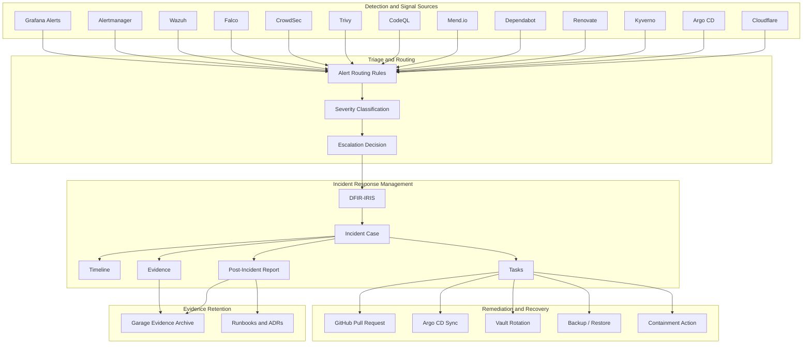
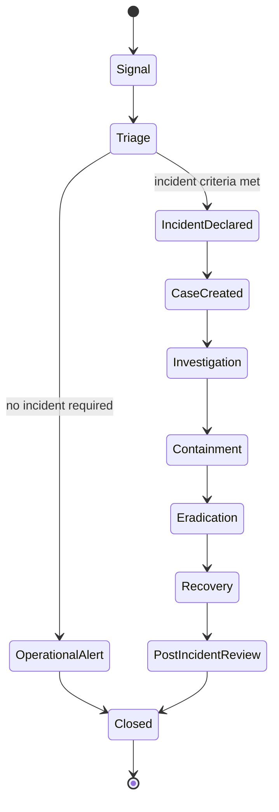
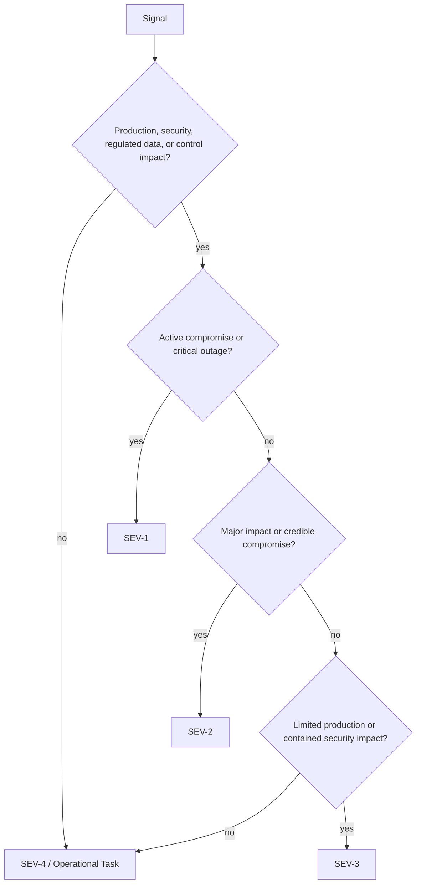
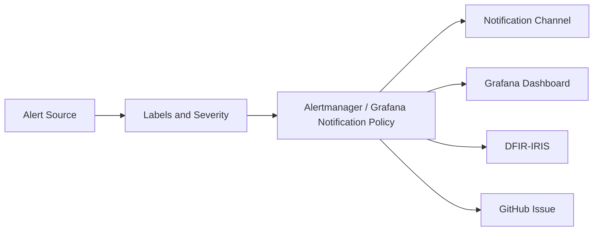
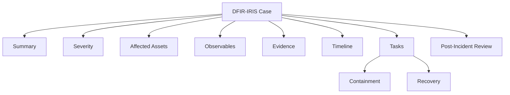
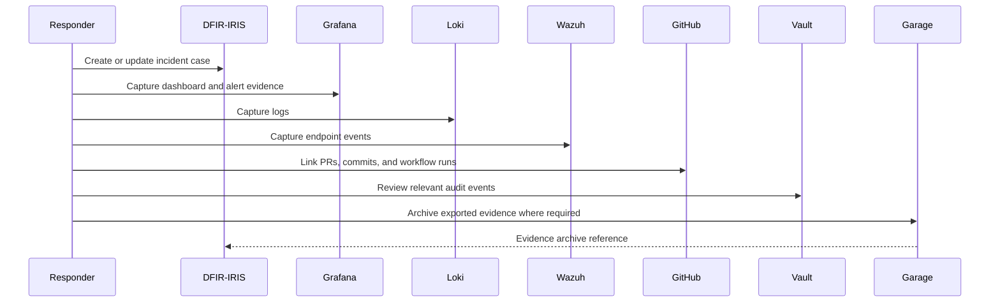
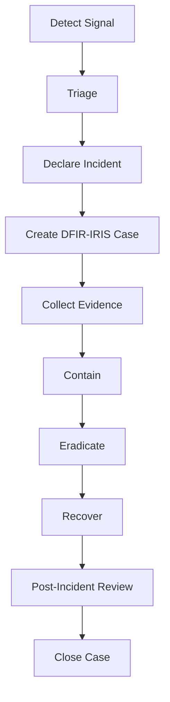
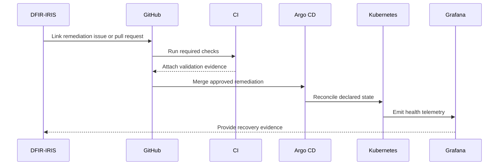
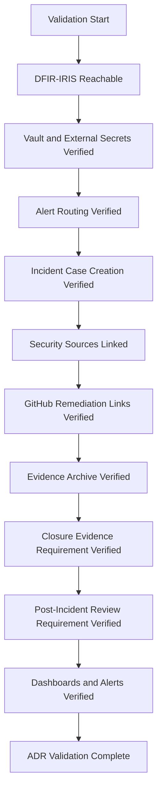

# ADR-0034 — Incident Response Workflow with DFIR-IRIS

**ADR:** ADR-0034  
**Title:** Incident Response Workflow with DFIR-IRIS, Grafana Alerting, Wazuh, Falco, CrowdSec, and GitOps Evidence  
**Owner:** SinLess Games LLC (Timothy “Andy” Andrew Pierce / sinless777)  
**Status:** ACCEPTED  
**Date Accepted:** 2026-04-25  
**Last Updated:** 2026-04-25  
**Supersedes:** N/A  
**Superseded By:** N/A  

**Related:**

- [Docs/Architecture/DECISIONS.md](../DECISIONS.md)
- [ADR-0001 — Monorepo Source of Truth](./ADR-0001.md)
- [ADR-0003 — Network Segmentation and Planes](./ADR-0003.md)
- [ADR-0007 — GitOps Controller: Argo CD](./ADR-0007.md)
- [ADR-0009 — Identity and SSO: Authentik as Central OIDC Provider](./ADR-0009.md)
- [ADR-0011 — Cloudflare Tunnel and Access](./ADR-0011.md)
- [ADR-0012 — Secrets Management and PKI: HashiCorp Vault](./ADR-0012.md)
- [ADR-0013 — Backups and Disaster Recovery with PBS, Velero, and Garage](./ADR-0013.md)
- [ADR-0014 — Observability and Incident Response Platform](./ADR-0014.md)
- [ADR-0016 — Policy-as-Code Enforcement with Kyverno](./ADR-0016.md)
- [ADR-0017 — GitHub Source Control, CI/CD, and Registry Operating Model](./ADR-0017.md)
- [ADR-0018 — Garage Object Storage Placement and Operating Model](./ADR-0018.md)
- [ADR-0019 — Management Overlay with WireGuard](./ADR-0019.md)
- [ADR-0020 — Security and Compliance Operating Model](./ADR-0020.md)
- [ADR-0024 — Ingress, Gateway, DNS, and TLS Routing Model](./ADR-0024.md)
- [ADR-0025 — GitHub Actions Runner Controller and Agentic Workflow Operating Model](./ADR-0025.md)
- [ADR-0026 — Container Image Supply Chain, Signing, SBOM, and Provenance](./ADR-0026.md)
- [ADR-0029 — Internal DNS and Name Resolution Model](./ADR-0029.md)
- [ADR-0032 — Namespace, Application Layout, and GitOps Repository Structure](./ADR-0032.md)
- [ADR-0033 — PostgreSQL Operating Model](./ADR-0033.md)

---

## Context

The platform requires a formal incident response workflow for security,
availability, data protection, infrastructure, application, compliance, and
supply chain events.

The platform uses:

- DFIR-IRIS for incident response management
- Grafana for dashboards and alert visibility
- Prometheus, Mimir, Loki, Tempo, and Pyroscope for telemetry
- Alertmanager and Grafana notification policies for alert routing
- Wazuh for endpoint security, SIEM/XDR telemetry, and compliance evidence
- Falco for Kubernetes and Linux runtime detection
- CrowdSec for edge, ingress, and abuse detection
- Trivy for vulnerability, image, IaC, and secret scanning
- CodeQL for static application security testing
- Dependabot for vulnerable dependency alerts and security updates
- Renovate for dependency and platform update automation
- Mend.io for software composition analysis and open source governance
- Kyverno for Kubernetes admission control and policy reports
- Vault for secret custody
- Garage for object storage, archives, and evidence exports where applicable
- GitHub for pull requests, workflow logs, security alerts, and change history
- Argo CD for GitOps reconciliation and deployment evidence

The incident response workflow must support:

- alert triage
- incident declaration
- case creation
- severity assignment
- evidence collection
- containment
- eradication
- recovery
- post-incident review
- compliance evidence retention
- GitOps-driven remediation
- auditability

Operational alerts and security incidents must be handled differently.

Not every alert becomes an incident.

Incident-grade events require case handling in DFIR-IRIS.

---

## Decision

Adopt **DFIR-IRIS** as the platform incident response management system.

DFIR-IRIS is the accepted system of record for incident cases, investigation
timelines, observables, evidence, containment actions, recovery actions, and
post-incident reviews.

The accepted incident response model is:

| Area | Accepted Component |
| --- | --- |
| Incident response management | DFIR-IRIS |
| Primary alert visibility | Grafana |
| Alert routing | Alertmanager and Grafana notification policies |
| Security endpoint telemetry | Wazuh |
| Runtime detection | Falco |
| Edge and abuse detection | CrowdSec |
| Vulnerability evidence | Trivy |
| Source code security evidence | CodeQL |
| Dependency evidence | Dependabot, Renovate, Mend.io |
| Admission policy evidence | Kyverno |
| GitOps evidence | Argo CD |
| Secret custody | Vault |
| Evidence archive | Garage where exported |
| Source control and remediation history | GitHub |
| Operational dashboards | Grafana stack |

Grafana OnCall is not the selected incident response management platform.

DFIR-IRIS is the incident response case-management platform.

Alert routing remains handled by Grafana Alerting, Alertmanager, notification
policies, contact points, webhooks, and approved integrations.

---

## Incident Response Architecture



---

## Scope

This ADR governs:

- DFIR-IRIS as the incident response management system
- incident declaration criteria
- alert triage workflow
- severity classification
- case lifecycle
- evidence collection requirements
- containment requirements
- eradication requirements
- recovery requirements
- post-incident review requirements
- alert routing requirements
- compliance evidence requirements
- GitOps remediation workflow
- validation requirements
- rollback requirements
- operational requirements

This ADR does not define:

- every DFIR-IRIS playbook
- every alert rule
- every Grafana contact point
- every Wazuh rule
- every Falco rule
- every CrowdSec scenario
- every legal notification requirement
- every compliance attestation process
- every tabletop exercise
- every organization-level policy document

Those items are implementation artifacts managed in monitoring manifests,
security configuration, DFIR-IRIS configuration, runbooks, compliance
documentation, and operations documentation.

---

## Non-Goals

The accepted incident response model does not include:

- Grafana OnCall as the incident response management platform
- Slack-only or Discord-only incident management
- unmanaged manual incident notes as the system of record
- closing incident-grade alerts without triage
- deleting evidence after containment
- remediating production incidents outside Git where GitOps is applicable
- storing incident evidence only in local workstations
- storing sensitive incident material in public repositories
- treating every operational alert as a security incident
- treating every security signal as a confirmed compromise
- bypassing compliance evidence retention for regulated systems

---

## Responsibility Split

| Area | Responsibility |
| --- | --- |
| Incident case management | DFIR-IRIS |
| Alert visualization | Grafana |
| Alert routing | Alertmanager and Grafana notification policies |
| Endpoint security signals | Wazuh |
| Runtime security signals | Falco |
| Edge abuse signals | CrowdSec |
| Vulnerability signals | Trivy, Mend.io, Dependabot |
| Code security signals | CodeQL |
| Dependency update signals | Renovate |
| Admission policy signals | Kyverno |
| GitOps deployment evidence | Argo CD |
| Remediation history | GitHub pull requests |
| Secret rotation | Vault |
| Backup and restore evidence | PBS, Velero, Longhorn, Garage |
| Evidence archive | DFIR-IRIS and Garage |
| Compliance mapping | Security and compliance documentation |

---

## Accepted Tooling

| Area | Tool |
| --- | --- |
| Incident response management | DFIR-IRIS |
| Dashboards | Grafana |
| Alert routing | Alertmanager and Grafana Alerting |
| Metrics | Prometheus and Mimir |
| Logs | Loki |
| Traces | Tempo |
| Profiles | Pyroscope |
| Endpoint security | Wazuh |
| Runtime detection | Falco |
| Edge abuse detection | CrowdSec |
| Vulnerability scanning | Trivy |
| Static code scanning | CodeQL |
| Dependency alerts | Dependabot |
| Dependency automation | Renovate |
| SCA and license governance | Mend.io |
| Admission policy | Kyverno |
| GitOps | Argo CD |
| Source control | GitHub |
| Secret management | Vault |
| Evidence storage | DFIR-IRIS and Garage |

---

## Alternatives Considered

### A1) Grafana OnCall

**Pros:**

- integrates with Grafana alerting
- useful for paging and alert escalation
- operationally familiar for alert response

**Cons:**

- not the selected platform incident response management system
- does not provide the accepted investigation and evidence workflow
- does not replace DFIR-IRIS case handling
- does not align with the selected IRM direction

Grafana OnCall is rejected as the incident response management platform.

---

### A2) GitHub Issues as Incident Management

**Pros:**

- simple
- already integrated with source control
- useful for remediation tasks and follow-up work

**Cons:**

- weak evidence handling
- weak incident timeline model
- weak investigation workflow
- poor fit for sensitive incident data
- does not provide IRM case structure

GitHub Issues are rejected as the system of record for incident response.

GitHub remains accepted for remediation pull requests and follow-up tasks.

---

### A3) Documentation-Only Incident Logs

**Pros:**

- simple
- easy to edit
- useful for post-incident summaries

**Cons:**

- weak structured evidence handling
- poor alert linkage
- poor task tracking
- weak access control for sensitive investigations
- weak auditability

Documentation-only incident logs are rejected.

Documentation remains accepted for runbooks, post-incident summaries, and
lessons learned after sensitive data is handled appropriately.

---

### A4) SIEM-Only Incident Handling

**Pros:**

- strong event visibility
- useful for detection and correlation
- good security telemetry source

**Cons:**

- does not replace incident case management
- weak remediation task tracking
- weak post-incident review workflow
- not the accepted IRM system of record

Wazuh remains accepted as SIEM/XDR telemetry.

DFIR-IRIS remains the incident response management system.

---

### A5) Manual Chat-Based Incident Handling

**Pros:**

- fast
- useful during active coordination
- flexible for real-time collaboration

**Cons:**

- weak evidence retention
- weak auditability
- easy to lose decisions and timestamps
- poor compliance record
- not sufficient as a system of record

Chat-based coordination is accepted only as a communication channel.

DFIR-IRIS remains the system of record.

---

## Rationale

DFIR-IRIS is selected because the platform requires structured incident case
management, evidence tracking, investigation timelines, observable artifacts,
and post-incident records.

### Case Management

DFIR-IRIS provides a dedicated place to track:

- case summary
- affected assets
- observables
- indicators
- evidence
- tasks
- timeline
- containment
- recovery
- lessons learned

---

### Evidence Retention

Incidents require evidence from multiple systems.

DFIR-IRIS provides a case-centered workflow for evidence.

Garage provides archive storage for exported evidence where required.

---

### Security and Compliance Alignment

The platform has compliance alignment targets including:

- HIPAA
- GDPR
- SOC 2
- SOC 3
- PCI DSS
- NIST SP 800-53
- AICPA Trust Services Criteria
- 50 U.S. Code § 3341

Incident response records support compliance evidence.

This ADR does not claim certification, attestation, or legal sufficiency.

---

### GitOps Remediation

Production remediation should happen through Git where practical.

DFIR-IRIS tracks the incident.

GitHub tracks remediation changes.

Argo CD applies declared state.

This creates a complete chain from detection to remediation.

---

## Incident Lifecycle

The accepted incident lifecycle is:



Incident lifecycle stages:

| Stage | Purpose |
| --- | --- |
| Signal | Alert, detection, report, or anomaly enters triage |
| Triage | Determine severity, scope, and whether incident criteria are met |
| Incident Declared | Confirm incident handling is required |
| Case Created | Create or update DFIR-IRIS case |
| Investigation | Collect evidence and determine impact |
| Containment | Limit blast radius and stop active harm |
| Eradication | Remove root cause or threat source |
| Recovery | Restore normal service safely |
| Post-Incident Review | Document cause, impact, actions, and control improvements |
| Closed | Evidence retained and required follow-up linked |

---

## Incident Declaration Criteria

An incident is declared when an event has confirmed or credible impact to:

- confidentiality
- integrity
- availability
- identity
- production operations
- regulated data
- customer-facing service reliability
- platform control plane
- secrets or credentials
- source control or CI/CD integrity
- backup or restore confidence
- compliance control effectiveness

Incident-grade events include:

- confirmed credential exposure
- suspected credential exposure in production paths
- confirmed malware or rootkit indicator
- suspicious privilege escalation
- unauthorized production access
- suspicious lateral movement
- critical Wazuh alert
- critical Falco alert
- critical CrowdSec event affecting production
- active exploitation attempt against exposed services
- production service compromise
- production data exposure
- regulated data exposure
- critical vulnerability in a production deployment
- compromised container image
- compromised dependency
- GitHub Actions runner compromise
- Vault compromise or suspected compromise
- PostgreSQL compromise or suspected compromise
- Kubernetes API compromise or suspected compromise
- loss of backup integrity
- failed restore during active recovery
- public exposure of internal management service
- prolonged production outage
- compliance-impacting control failure

---

## Operational Alert Criteria

An operational alert does not automatically become an incident.

Operational alerts remain normal alerts unless triage escalates them.

Operational alerts include:

- single pod restart
- expected deployment rollout pause
- short non-production outage
- temporary CPU spike
- temporary memory pressure
- expected maintenance event
- transient DNS error
- transient certificate challenge failure
- non-production CI failure
- failed development workload
- benign scanner finding with no production path
- Argo CD sync delay with no service impact

Operational alerts are escalated to incidents when they affect production,
security, regulated data, service availability, or control confidence.

---

## Severity Classification

Incident severity is assigned during triage.

| Severity | Definition | Response Requirement |
| --- | --- | --- |
| SEV-1 | Active compromise, regulated data exposure, critical production outage, or loss of critical control plane | Immediate case creation, containment, owner assignment, evidence capture, and recovery coordination |
| SEV-2 | Major production impact, credible compromise, high-risk vulnerability in production, or backup integrity risk | Case creation, investigation, containment plan, and tracked remediation |
| SEV-3 | Limited production impact, contained security event, important control failure, or non-critical data impact | Case or tracked security task depending on triage |
| SEV-4 | Low-risk finding, minor control issue, or non-production issue requiring tracking | Track as issue, task, or low-severity DFIR-IRIS case where evidence retention is required |

SEV-1 and SEV-2 incidents require DFIR-IRIS cases.

SEV-3 incidents require DFIR-IRIS cases when security, compliance, or production
impact exists.

SEV-4 events may remain GitHub issues unless evidence retention requires a
DFIR-IRIS case.

---

## Severity Flow



---

## Alert Routing Model

Alert routing sends signals to the correct triage path.



Alerts must include:

- alert name
- severity
- environment
- cluster
- namespace where applicable
- application where applicable
- affected host where applicable
- owner
- runbook URL
- summary
- impact statement
- dashboard URL where applicable
- source system
- routing metadata

Incident-grade alerts create or update DFIR-IRIS cases.

Non-incident operational alerts route to normal notification channels and
dashboards.

---

## Case Creation Requirements

DFIR-IRIS cases are required for:

- SEV-1 incidents
- SEV-2 incidents
- SEV-3 incidents with security or compliance impact
- confirmed credential exposure
- confirmed data exposure
- confirmed compromise
- significant production outage
- backup or restore integrity failure
- public exposure of management endpoints
- incident response exercises requiring formal evidence

A DFIR-IRIS case must include:

- case title
- severity
- owner
- affected systems
- affected environment
- affected data classification
- incident start time
- detection source
- summary
- initial impact statement
- evidence list
- timeline
- tasks
- containment actions
- eradication actions
- recovery actions
- related alerts
- related dashboards
- related GitHub issues or pull requests
- related runbooks
- related ADRs

---

## Incident Case Data Model



---

## Evidence Requirements

Incident evidence must be preserved.

Required evidence classes:

| Evidence Class | Source |
| --- | --- |
| Alert history | Grafana and Alertmanager |
| Metrics | Prometheus and Mimir |
| Logs | Loki and Wazuh |
| Traces | Tempo |
| Profiles | Pyroscope |
| Endpoint events | Wazuh |
| Runtime events | Falco |
| Edge events | CrowdSec and Cloudflare |
| Admission decisions | Kyverno |
| Deployment state | Argo CD |
| Source control history | GitHub |
| Workflow logs | GitHub Actions |
| Runner logs | ARC and Loki |
| Vulnerability reports | Trivy, Mend.io, Dependabot |
| Code scanning reports | CodeQL |
| Dependency update history | Renovate |
| Secret access evidence | Vault audit logs |
| Backup evidence | PBS, Velero, Longhorn, Garage |
| Remediation evidence | GitHub pull requests and commits |
| Case record | DFIR-IRIS |

Evidence must be linked to the DFIR-IRIS case.

Sensitive evidence must not be stored in public repositories.

---

## Evidence Collection Flow



---

## Containment Requirements

Containment limits active harm and blast radius.

Accepted containment actions include:

- disable compromised credentials
- rotate secrets in Vault
- revoke GitHub tokens
- disable affected GitHub Actions runner scale set
- cordon or drain affected Kubernetes node
- scale down affected workload
- isolate namespace with NetworkPolicy
- block malicious IPs through CrowdSec or Cloudflare
- disable affected public route
- pause Argo CD sync for affected application
- abort Argo Rollout
- revoke database credentials
- restrict Vault policy
- disable affected service account
- block affected image digest through policy
- quarantine affected VM or node
- preserve affected storage volumes

Containment actions must be recorded in DFIR-IRIS.

Production containment must preserve evidence where possible.

---

## Eradication Requirements

Eradication removes the root cause or threat source.

Accepted eradication actions include:

- remove malicious workload
- rebuild affected container image
- patch vulnerable dependency
- merge remediation pull request
- update Kyverno policy
- update Wazuh rule
- update Falco rule
- update CrowdSec scenario or bouncer policy
- remove exposed secret
- rotate compromised credentials
- rebuild affected VM
- restore known-good configuration
- replace affected node
- block compromised image digest
- repair misconfigured route
- remove unauthorized access path

Eradication actions must be linked to GitHub pull requests where code or
configuration changes are involved.

---

## Recovery Requirements

Recovery restores normal service safely.

Recovery requires:

- validation of affected service health
- verification of restored access control
- verification of secret rotation
- verification of workload health
- verification of data integrity where applicable
- verification of backup integrity where applicable
- verification that alerting remains active
- verification that dashboards show normal state
- verification that no unauthorized access remains
- Argo CD health verification
- GitHub remediation links
- case timeline update

Recovery must not close the incident until validation evidence is recorded.

---

## Incident Response Flow



---

## GitOps Remediation Requirements

Production remediation must use GitOps where practical.

GitOps remediation workflow:



Emergency break-glass remediation is allowed only when normal GitOps flow would
increase incident impact.

Break-glass changes must be reconciled back to Git.

---

## Credential Incident Requirements

Credential incidents require immediate containment.

Credential incident actions:

1. revoke affected credential
2. rotate replacement secret in Vault
3. update consuming ExternalSecret or workflow secret where required
4. restart affected workloads where required
5. inspect Git history and CI logs
6. inspect Vault audit logs
7. inspect access logs for misuse
8. update DFIR-IRIS timeline
9. link remediation pull request where applicable

Credential incidents include:

- committed secret
- leaked GitHub token
- leaked Cloudflare token
- leaked Garage access key
- leaked PostgreSQL password
- leaked Vault token
- leaked kubeconfig
- leaked WireGuard private key
- leaked webhook URL
- leaked signing key

---

## Supply Chain Incident Requirements

Supply chain incidents require image, dependency, and build evidence.

Supply chain incident triggers include:

- compromised dependency
- critical vulnerable dependency in production
- compromised container image
- untrusted image deployed
- unsigned image deployed when signing is enforced
- SBOM mismatch
- provenance mismatch
- build workflow compromise
- runner compromise
- registry compromise
- CodeQL critical finding in production path
- Mend.io critical finding in production path
- Trivy critical finding in production image

Required actions:

- identify affected image digest or dependency
- identify affected workloads
- stop promotion of affected artifact
- roll back to known-good artifact
- rotate exposed credentials where required
- preserve CI and registry evidence
- rebuild from trusted source
- validate scan, SBOM, provenance, and signature evidence
- update Kyverno policy if required
- link GitHub remediation pull requests

---

## Runtime Security Incident Requirements

Runtime security incidents are driven by Wazuh, Falco, CrowdSec, Grafana,
Kubernetes, Cloudflare, and application telemetry.

Runtime incident triggers include:

- suspicious shell in container
- privilege escalation attempt
- unexpected hostPath access
- suspicious Kubernetes API activity
- malware indicator
- lateral movement indicator
- unauthorized network scanning
- brute force attempt against exposed service
- abnormal authentication failure spike
- suspicious outbound traffic
- unexpected process execution on a node
- suspicious file integrity change

Required actions:

- identify affected workload, node, or host
- preserve logs and runtime evidence
- contain affected workload or host
- isolate namespace or node where required
- revoke exposed credentials where required
- inspect related telemetry
- remove root cause
- recover service safely
- document timeline in DFIR-IRIS

---

## Data Exposure Incident Requirements

Data exposure incidents require formal case handling.

Data exposure incident triggers include:

- regulated data exposed
- sensitive logs exposed
- backup object exposed
- database exposed
- object storage bucket exposed
- public route exposes internal service
- unauthorized access to restricted data
- suspicious data exfiltration
- exposed credentials allowing data access

Required actions:

- identify affected data class
- identify affected systems
- identify access window
- preserve evidence
- contain access path
- rotate credentials
- determine scope
- document affected records where applicable
- notify according to applicable legal or compliance process
- record actions in DFIR-IRIS
- retain evidence according to compliance requirements

This ADR does not define legal notification obligations.

Legal and compliance notification procedures are handled by the applicable
compliance process when regulated data is in scope.

---

## Backup and Recovery Incident Requirements

Backup and recovery incidents require evidence because they affect recovery
confidence.

Backup incident triggers include:

- failed production backup
- stale backup
- failed restore validation
- corrupted backup
- lost backup credential
- exposed backup bucket
- missing Longhorn backup
- missing Velero backup
- PBS backup failure
- Garage unavailability affecting backups
- inability to restore during active incident

Required actions:

- identify affected backup class
- identify affected systems
- preserve failed job logs
- validate last known-good backup
- repair backup workflow
- run test backup
- run test restore where required
- document recovery confidence
- create DFIR-IRIS case when production recovery confidence is impacted

---

## Compliance Incident Requirements

Compliance-impacting incidents require case handling.

Compliance incident triggers include:

- control failure affecting regulated systems
- missing audit logs for regulated systems
- missing access review evidence
- missing backup evidence
- failed restore validation for regulated systems
- unauthorized access to regulated data
- expired exception still in use
- security finding not remediated within required window
- evidence retention failure
- public exposure of restricted service

Required case fields:

- applicable framework
- affected control
- affected system
- control owner
- evidence gap
- corrective action
- compensating control
- remediation due date
- validation evidence

---

## Communication Requirements

Incident communications must be recorded.

Accepted communication channels include:

- DFIR-IRIS case comments
- GitHub issues or pull requests for remediation
- approved chat channels for coordination
- email where required
- compliance-specific communication channels where required

DFIR-IRIS remains the system of record.

Chat messages are not the system of record unless copied or summarized into the
case.

Sensitive incident details must not be posted in public channels.

---

## Access Control Requirements

Incident response access must be restricted.

Required controls:

- DFIR-IRIS access restricted to approved responders
- sensitive cases restricted by need-to-know
- incident evidence access restricted
- Vault audit review restricted to approved operators
- production credentials restricted
- GitHub production workflows protected
- Garage evidence buckets restricted
- public sharing of incident evidence prohibited unless explicitly approved

---

## Secret Handling Requirements

Incident records must not expose secrets.

Sensitive values must not be pasted into:

- DFIR-IRIS case text
- GitHub issues
- GitHub pull requests
- chat messages
- documentation
- logs
- screenshots
- evidence exports

When evidence includes secrets:

- preserve the original securely only when required
- redact copies used for analysis
- rotate the exposed credential
- record the rotation action
- restrict access to the evidence

---

## Evidence Retention Requirements

Evidence retention depends on incident severity and compliance scope.

| Incident Type | Minimum Evidence |
| --- | --- |
| SEV-1 | DFIR-IRIS case, timeline, alerts, logs, remediation PRs, recovery validation, post-incident review |
| SEV-2 | DFIR-IRIS case, alerts, logs, remediation evidence, recovery validation |
| SEV-3 | Case or tracked task, alert evidence, remediation evidence |
| SEV-4 | GitHub issue or operational task unless case retention is required |
| Regulated data incident | DFIR-IRIS case, compliance mapping, evidence archive, access review, notification records where applicable |
| Supply chain incident | CI logs, image digest, SBOM, provenance, scan reports, remediation PR |
| Credential incident | Vault audit evidence, rotation record, affected system list, remediation evidence |

Evidence may be retained in:

- DFIR-IRIS
- GitHub
- Grafana
- Loki
- Wazuh
- Argo CD
- Garage
- PBS, Velero, or Longhorn records where applicable

---

## Post-Incident Review Requirements

SEV-1 and SEV-2 incidents require post-incident review.

SEV-3 incidents require post-incident review when security, compliance, or
production impact exists.

A post-incident review must include:

- incident summary
- severity
- timeline
- root cause
- contributing factors
- detection source
- containment actions
- eradication actions
- recovery actions
- affected systems
- affected data classification
- customer or user impact where applicable
- compliance impact where applicable
- evidence links
- remediation pull requests
- preventive actions
- control improvements
- validation evidence
- closure approval

Post-incident review records are linked from DFIR-IRIS.

---

## Incident Closure Requirements

An incident may be closed only when:

- active impact has ended
- containment is complete
- eradication is complete or formally tracked
- recovery validation is complete
- affected services are healthy
- required secrets have been rotated
- remediation pull requests are linked
- evidence is attached or referenced
- post-incident review is complete where required
- follow-up tasks have owners
- compliance actions are recorded where applicable

Closing an incident without evidence is not accepted.

---

## Automation Requirements

Automation may create or update DFIR-IRIS cases for incident-grade events.

Automation may:

- create a case
- update a case
- attach alert metadata
- attach dashboard links
- attach runbook links
- add affected assets
- add observables
- add timeline entries
- add remediation task links

Automation must not:

- close SEV-1 or SEV-2 incidents without human review
- delete evidence
- rotate secrets without approved workflow
- execute destructive containment without approved policy
- expose secrets in case text
- bypass protected branch controls

---

## DFIR-IRIS Integration Requirements

DFIR-IRIS integrations must use least privilege.

Required controls:

- API tokens stored in Vault
- tokens delivered through External Secrets where used in Kubernetes
- integration tokens scoped to required API actions
- webhook URLs not committed to Git
- case creation payloads exclude secret values
- integration failures alert operators
- case creation failure does not suppress the original alert

---

## Repository Paths

Incident response implementation artifacts are stored under:

```text
Kubernetes/apps/prod/monitoring/DFIR-IRIS/
Kubernetes/apps/prod/monitoring/config/
Kubernetes/apps/prod/security/
Docs/Resources/Incident-Response.md
Docs/Architecture/ADRs/
.github/workflows/
```

Runbooks are stored under:

```text
Docs/Operations/
Docs/Resources/
```

Agentic incident or triage workflows are stored under:

```text
Docs/Resources/Agentic Workflows/
.github/workflows/
```

---

## Required Labels and Annotations

Incident-related alerts must include labels:

```text
severity=<sev1|sev2|sev3|sev4>
environment=prod
owner=<owner>
source=<grafana|wazuh|falco|crowdsec|trivy|codeql|mend|kyverno|argocd>
```

Incident-related Kubernetes resources must include:

```text
app.kubernetes.io/managed-by=argocd
environment=prod
security.sinlessgames.io/incident-response=true
```

Runbook annotations:

```text
runbook.sinlessgames.io/url=<runbook-url>
docs.sinlessgames.io/adr=ADR-0034
```

---

## Observability Requirements

Incident response itself must be observable.

Required metrics and alerts:

- DFIR-IRIS availability
- DFIR-IRIS database availability
- DFIR-IRIS API health
- DFIR-IRIS worker health where applicable
- alert routing failures
- case creation webhook failures
- Grafana alert evaluation failures
- Alertmanager notification failures
- Wazuh alert pipeline failures
- Falco alert pipeline failures
- CrowdSec decision pipeline failures
- evidence archive failures
- DFIR-IRIS storage pressure
- incident queue age where implemented
- open SEV-1 and SEV-2 case count
- stale high-severity cases
- failed post-incident review deadlines

Required dashboards:

- incident response platform health
- open cases by severity
- incident sources
- alert routing health
- evidence export health
- DFIR-IRIS service health
- security signal volume
- runtime detection trends
- endpoint security trends
- edge abuse trends

---

## Validation Requirements

This ADR is valid when the following requirements are met:

- DFIR-IRIS is deployed and reachable through approved access paths
- DFIR-IRIS is not exposed as an unauthenticated public service
- DFIR-IRIS credentials are stored in Vault
- External Secrets delivers DFIR-IRIS integration credentials where required
- Grafana alerts route to configured receivers
- Alertmanager routes alerts to configured receivers
- incident-grade alerts create or update DFIR-IRIS cases
- Wazuh events can be linked to DFIR-IRIS cases
- Falco events can be linked to DFIR-IRIS cases
- CrowdSec events can be linked to DFIR-IRIS cases
- Trivy findings can be linked to DFIR-IRIS cases
- CodeQL findings can be linked to DFIR-IRIS cases
- Mend.io findings can be linked to DFIR-IRIS cases
- Dependabot and Renovate security updates can be linked to cases or remediation PRs
- Argo CD deployment evidence can be linked to cases
- GitHub pull requests can be linked to incident remediation
- Vault credential rotation evidence can be linked to cases
- Garage evidence archive is writable where configured
- SEV-1 and SEV-2 incidents require DFIR-IRIS cases
- incident closure requires recovery evidence
- post-incident reviews are required for SEV-1 and SEV-2 incidents
- incident response dashboards are visible in Grafana
- incident response alerts route to configured receivers



---

## Rollback Plan

If DFIR-IRIS is unavailable:

1. keep alert routing active through Grafana and Alertmanager
2. preserve incident evidence in source systems
3. use temporary restricted incident notes in an approved internal location
4. restore DFIR-IRIS service health
5. restore DFIR-IRIS database if required
6. backfill case timeline and evidence after recovery
7. verify case creation integrations
8. verify incident response dashboards and alerts

If DFIR-IRIS integration fails:

1. preserve the original alert
2. inspect integration logs
3. verify API token delivery from Vault
4. verify webhook URL configuration
5. verify DFIR-IRIS API health
6. restore the last known-good integration configuration
7. replay or manually create the case when required
8. verify future case creation succeeds

If alert routing fails:

1. inspect Grafana alerting health
2. inspect Alertmanager health
3. inspect contact point configuration
4. inspect notification policy configuration
5. restore the last known-good alert routing configuration
6. send a test alert
7. verify DFIR-IRIS case flow for incident-grade alerts

If evidence archive fails:

1. preserve evidence in original systems
2. inspect Garage availability
3. inspect bucket credentials
4. inspect Vault and External Secrets delivery
5. restore evidence export workflow
6. export evidence again where required
7. link archive references to the DFIR-IRIS case

If a case is created incorrectly:

1. preserve the original case record
2. correct severity, owner, and affected systems
3. merge duplicate cases if required by DFIR-IRIS workflow
4. update timeline with correction note
5. update routing rules if the error came from automation
6. verify recurrence is prevented

If a security incident exposes DFIR-IRIS or incident evidence:

1. restrict access immediately
2. rotate affected credentials
3. preserve access logs
4. create a separate DFIR-IRIS case or restricted incident record
5. review exposed evidence scope
6. remove public exposure
7. validate access controls
8. update policy and route controls

A permanent migration away from DFIR-IRIS requires:

- a superseding ADR
- migration plan
- rollback plan
- case data migration procedure
- evidence migration procedure
- alert integration migration procedure
- access control migration procedure
- validation evidence
- updated implementation documentation
- updated runbooks

---

## Operational Requirements

Incident response production operation requires:

- DFIR-IRIS as the case-management system
- Grafana and Alertmanager alert routing
- Wazuh endpoint event integration
- Falco runtime event integration
- CrowdSec edge abuse event integration
- Trivy vulnerability evidence linkage
- CodeQL security evidence linkage
- Dependabot security update linkage
- Renovate remediation linkage
- Mend.io SCA evidence linkage
- Kyverno policy evidence linkage
- Argo CD deployment evidence linkage
- GitHub remediation pull request linkage
- Vault credential rotation evidence
- Garage evidence archive where configured
- restricted incident evidence access
- severity classification
- triage workflow
- containment workflow
- eradication workflow
- recovery workflow
- post-incident review workflow
- closure requirements
- dashboards
- alert rules
- runbooks
- tabletop validation
- quarterly review of incident response workflow
