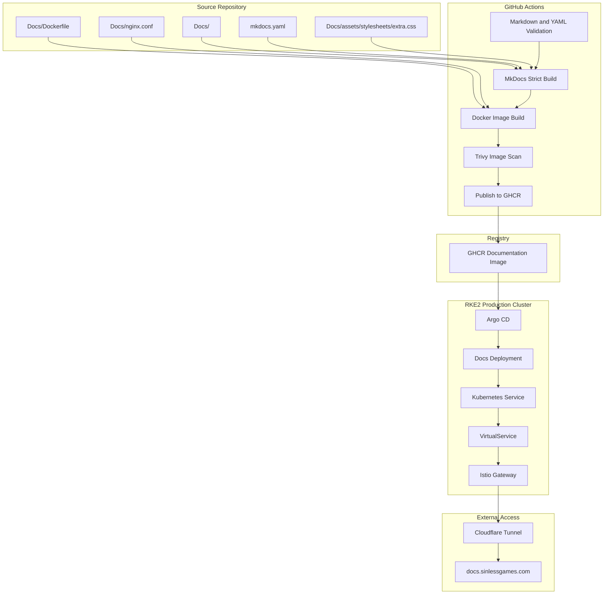
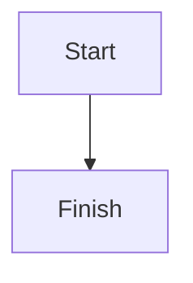
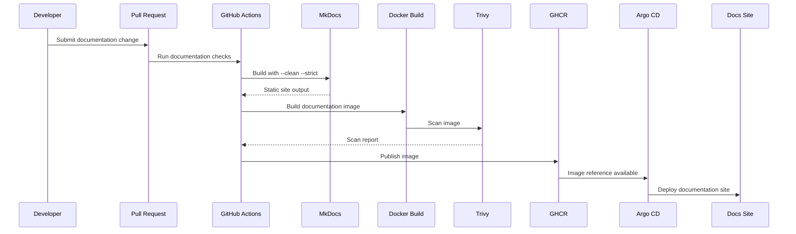
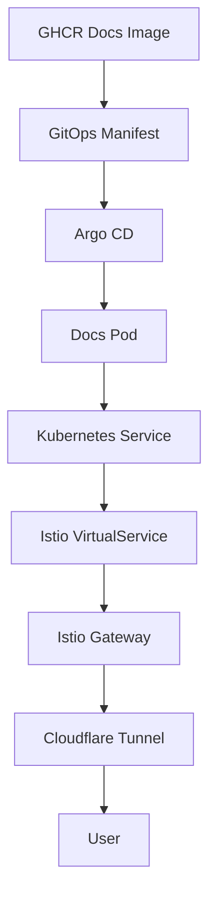
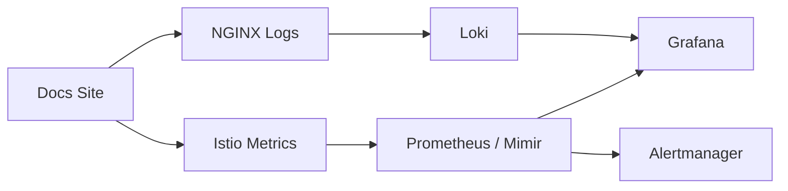
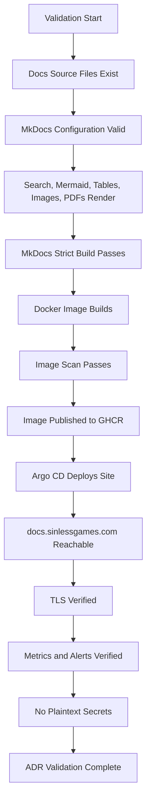

# ADR-0035 — Documentation Platform with MkDocs Material

**ADR:** ADR-0035  
**Title:** Documentation Platform with MkDocs Material, Mermaid, Search, Docker, NGINX, and GitHub Actions Publishing  
**Owner:** SinLess Games LLC (Timothy “Andy” Andrew Pierce / sinless777)  
**Status:** ACCEPTED  
**Date Accepted:** 2026-04-25  
**Last Updated:** 2026-04-25  
**Supersedes:** N/A  
**Superseded By:** N/A  

**Related:**

- [Docs/Architecture/DECISIONS.md](../DECISIONS.md)
- [ADR-0001 — Monorepo Source of Truth](./ADR-0001.md)
- [ADR-0007 — GitOps Controller: Argo CD](./ADR-0007.md)
- [ADR-0017 — GitHub Source Control, CI/CD, and Registry Operating Model](./ADR-0017.md)
- [ADR-0020 — Security and Compliance Operating Model](./ADR-0020.md)
- [ADR-0024 — Ingress, Gateway, DNS, and TLS Routing Model](./ADR-0024.md)
- [ADR-0025 — GitHub Actions Runner Controller and Agentic Workflow Operating Model](./ADR-0025.md)
- [ADR-0026 — Container Image Supply Chain, Signing, SBOM, and Provenance](./ADR-0026.md)
- [ADR-0032 — Namespace, Application Layout, and GitOps Repository Structure](./ADR-0032.md)

---

## Context

The Infrastructure repository requires a documentation platform for architecture
records, operational runbooks, network diagrams, platform procedures, security
documentation, agentic workflows, and onboarding material.

Documentation must support:

- Architecture Decision Records
- architecture overviews
- operational runbooks
- network documentation
- Kubernetes documentation
- Terraform documentation
- Proxmox documentation
- security and compliance documentation
- incident response documentation
- agentic workflow documentation
- diagrams
- Mermaid charts
- tables
- admonitions
- code blocks
- embedded images
- SVG diagrams
- PDF assets
- Markdown source files
- searchable navigation
- local development preview
- containerized production serving
- CI validation
- GitOps deployment
- strict build behavior

The platform uses GitHub as the source of truth.

The documentation source lives under:

```text
Docs/
```

The MkDocs configuration lives at the repository root.

The documentation site is published as a static site.

The production container serves the generated site with NGINX.

The accepted public documentation hostname is:

```text
docs.sinlessgames.com
```

The local infrastructure domain is:

```text
local.sinlessgames.com
```

---

## Decision

Adopt **MkDocs Material** as the documentation platform for the Infrastructure
repository.

The accepted documentation model is:

| Area | Decision |
| --- | --- |
| Documentation generator | MkDocs |
| Theme | MkDocs Material |
| Markdown extensions | Python Markdown and pymdown-extensions |
| Diagrams | Mermaid code fences |
| Search | MkDocs Material search plugin |
| Navigation | Explicit `nav` in MkDocs configuration |
| Styling | `Docs/assets/stylesheets/extra.css` |
| Static serving | NGINX unprivileged container |
| Container build | Multi-stage Dockerfile |
| Production site root | `/usr/share/nginx/html` |
| Runtime port | `8080` |
| CI validation | `mkdocs build --clean --strict` |
| Publishing | GitHub Actions and GHCR |
| Deployment | Argo CD |
| Public routing | Cloudflare Tunnel and Istio Gateway |
| TLS | cert-manager and Cloudflare DNS-01 |
| Source of truth | GitHub Infrastructure repository |

Documentation is treated as platform infrastructure.

Documentation changes are reviewed through pull requests.

Production documentation images are built and published through GitHub Actions.

The documentation site is deployed through GitOps.

---

## Documentation Architecture



---

## Scope

This ADR governs:

- MkDocs as the documentation generator
- MkDocs Material as the documentation theme
- documentation repository structure
- Markdown feature requirements
- Mermaid diagram support
- table support
- image and asset support
- Docker image build requirements
- NGINX serving requirements
- CI validation requirements
- publication requirements
- GitOps deployment requirements
- documentation security requirements
- validation requirements
- rollback requirements
- operational requirements

This ADR does not define:

- every documentation page
- every ADR
- every runbook
- every diagram
- every navigation entry
- every CSS rule
- every CI workflow implementation detail
- every public hostname route
- every future documentation plugin

Those items are implementation artifacts managed in the repository.

---

## Non-Goals

The accepted documentation platform does not include:

- a dynamic CMS
- a database-backed documentation site
- WordPress
- GitBook as the source of truth
- Confluence as the source of truth
- manually published static files as normal operations
- hand-edited production HTML
- undocumented navigation changes
- plaintext secrets in documentation
- public exposure of private runbooks that contain sensitive details
- production deployment without strict MkDocs validation
- production deployment without container image scanning

---

## Responsibility Split

| Area | Responsibility |
| --- | --- |
| Documentation source | `Docs/` |
| Documentation configuration | `mkdocs.yaml` |
| Static site generation | MkDocs |
| Theme and UI | MkDocs Material |
| Markdown features | Markdown extensions and pymdown-extensions |
| Diagrams | Mermaid code fences |
| Styling | `Docs/assets/stylesheets/extra.css` |
| Container build | `Docs/Dockerfile` |
| Static serving | `Docs/nginx.conf` and NGINX |
| CI validation | GitHub Actions |
| Image registry | GHCR |
| Deployment reconciliation | Argo CD |
| Public access | Cloudflare Tunnel and Istio |
| TLS | cert-manager |
| Security scanning | Trivy, CodeQL where applicable |
| Documentation drift | Agentic documentation workflows |

---

## Accepted Tooling

| Area | Tool |
| --- | --- |
| Documentation generator | MkDocs |
| Documentation theme | MkDocs Material |
| Markdown extensions | pymdown-extensions |
| Diagrams | Mermaid |
| Static file server | NGINX unprivileged |
| Container registry | GHCR |
| CI/CD | GitHub Actions |
| Self-hosted runners | Actions Runner Controller |
| GitOps deployment | Argo CD |
| Ingress and routing | Cloudflare Tunnel and Istio |
| TLS automation | cert-manager |
| DNS | Cloudflare |
| Security scanning | Trivy |
| Source control | GitHub |

---

## Alternatives Considered

### A1) Plain Markdown in GitHub Only

**Pros:**

- simple
- no build step
- no hosting requirement
- easy to review in pull requests

**Cons:**

- weaker navigation
- weaker search
- weaker diagram rendering control
- weaker user experience
- no production documentation portal
- no custom routing or styling

Plain GitHub Markdown is rejected as the only documentation platform.

GitHub Markdown remains useful for pull request review.

---

### A2) Docusaurus

**Pros:**

- strong documentation platform
- React-based customization
- good versioning and plugin ecosystem

**Cons:**

- Node.js build stack is heavier than required
- more moving parts for the current documentation needs
- less aligned with the existing MkDocs Material workflow

Docusaurus is rejected for the Infrastructure documentation platform.

---

### A3) Sphinx

**Pros:**

- mature documentation generator
- strong Python ecosystem
- excellent for API and technical documentation

**Cons:**

- heavier authoring model for the current Markdown-first repository
- less aligned with the desired MkDocs Material user experience
- more configuration complexity for this use case

Sphinx is rejected.

---

### A4) Wiki or CMS

Examples:

- GitHub Wiki
- Confluence
- WordPress
- BookStack

**Pros:**

- easy browser editing
- familiar navigation
- useful for collaborative knowledge bases

**Cons:**

- weaker pull request review model
- weaker GitOps alignment
- weaker CI validation
- harder to keep documentation versioned with infrastructure changes
- creates another stateful system to back up and secure

A wiki or CMS is rejected as the documentation source of truth.

---

### A5) Handwritten Static HTML

**Pros:**

- maximum control
- no generator dependency
- simple runtime serving

**Cons:**

- high maintenance burden
- weak authoring experience
- poor consistency
- weak search and navigation behavior
- poor fit for ADR and runbook workflows

Handwritten static HTML is rejected.

---

## Rationale

MkDocs Material is selected because it provides a strong Markdown-first
documentation experience that fits the Infrastructure repository.

### Markdown-First Workflow

Documentation is written in Markdown and reviewed through GitHub pull requests.

This aligns documentation with the rest of the infrastructure-as-code workflow.

---

### Strong Navigation and Search

MkDocs Material provides navigation, search, table of contents, code copy, tabs,
and useful documentation UI features.

This supports fast operational lookup during maintenance and incidents.

---

### Diagram Support

Mermaid diagrams allow architecture and workflow diagrams to live directly in
Markdown files.

This keeps diagrams versioned with the documentation they explain.

---

### Static Site Deployment

MkDocs builds a static site.

Static output is easy to serve through NGINX, containerize, scan, cache, and
deploy through Kubernetes.

---

### GitOps Compatibility

The documentation container and Kubernetes manifests are managed like other
platform workloads.

The documentation site can be deployed through Argo CD and routed through the
standard ingress model.

---

## Documentation Source Layout

The documentation source directory is:

```text
Docs/
```

Required documentation structure:

```text
Docs/
  Architecture/
    ADRs/
  Kubernetes/
  Network/
  Operations/
  proxmox/
  Resources/
  Start-Here/
  Terraform/
  assets/
    stylesheets/
  index.md
  Dockerfile
  nginx.conf
  requirements.txt
```

ADR files live under:

```text
Docs/Architecture/ADRs/
```

The documentation home page is:

```text
Docs/index.md
```

Custom styles live under:

```text
Docs/assets/stylesheets/extra.css
```

---

## MkDocs Configuration Requirements

The MkDocs configuration file is:

```text
mkdocs.yaml
```

The configuration must define:

- site name
- site description
- site URL
- repository URL
- repository name
- docs directory
- site output directory
- theme
- navigation
- plugins
- Markdown extensions
- extra CSS
- social links
- edit link behavior where enabled

Required site URL:

```text
https://docs.sinlessgames.com
```

Required docs directory:

```text
Docs
```

Required site output directory:

```text
site
```

MkDocs builds must run in strict mode.

---

## Required Documentation Features

The documentation platform must support:

- full-text search
- search highlighting
- search suggestions
- shareable search results
- Mermaid diagrams
- Markdown tables
- admonitions
- collapsible details
- tabbed content
- code blocks
- syntax highlighting
- copy buttons for code blocks
- task lists
- footnotes
- definition lists
- embedded images
- SVG diagrams
- PDF links
- Markdown source links
- table of contents
- previous and next navigation
- top navigation
- section navigation

---

## Mermaid Requirements

Mermaid diagrams are written as fenced code blocks.

Accepted format:

````text

`````

Mermaid diagrams are used for:

* architecture diagrams
* sequence diagrams
* network flows
* GitOps flows
* deployment flows
* incident workflows
* backup workflows
* validation workflows
* rollback workflows

Mermaid diagrams must be readable in both light and dark themes.

---

## Markdown Standards

Documentation pages must use clear Markdown structure.

Required standards:

* one top-level `#` heading per page
* section headings use `##` and below
* tables use Markdown table syntax
* code blocks specify language where practical
* shell commands use `bash`
* YAML manifests use `yaml`
* JSON examples use `json`
* Mermaid diagrams use `mermaid`
* filenames and paths use code formatting
* ADRs use the accepted ADR template format

Markdown must pass markdown linting where configured.

---

## Asset Requirements

Supported static asset types include:

```text
.md
.md5
.svg
.png
.pdf
```

Asset requirements:

* images are stored under `Docs/` or `Docs/assets/`
* SVG diagrams may be embedded or linked
* PNG images may be embedded in Markdown
* PDFs may be linked from documentation pages
* checksum files may be linked for downloadable assets
* asset filenames should be lowercase where practical
* large assets should be avoided unless required
* sensitive diagrams must not be published publicly

---

## Image Embedding Requirements

Images are embedded with Markdown syntax.

Accepted format:

```text

```

SVG diagrams are embedded or linked with Markdown syntax.

Accepted format:

```text

```

Images must include meaningful alt text.

Images must not expose secrets, private keys, tokens, internal-only credentials,
or sensitive incident evidence.

---

## Table Requirements

Markdown tables are accepted and required for structured operational data.

Tables are used for:

* ADR summaries
* tool mappings
* responsibility splits
* control mappings
* port maps
* network tables
* validation matrices
* backup schedules
* runbook checklists
* incident severity tables

Tables must have clear column names.

Large tables may be split by topic for readability.

---

## Search Requirements

Search must be enabled through the MkDocs search plugin.

Required search behavior:

* searchable page titles
* searchable headings
* searchable body text
* search suggestions
* search highlighting
* shareable search results where supported

Search index files are generated during build.

Search assets are served as static files by NGINX.

---

## Navigation Requirements

Navigation is explicitly defined in `mkdocs.yaml`.

Navigation must include:

* Home
* Start Here
* Architecture
* Architecture Decision Records
* Network
* Kubernetes
* Operations
* Resources
* Terraform
* Proxmox

ADR navigation must include every accepted ADR file.

Navigation updates are required when new documentation pages are added.

Documentation pages should not be orphaned unless intentionally excluded.

---

## ADR Requirements

Architecture Decision Records use a consistent structure.

Required ADR fields:

* ADR number
* title
* owner
* status
* date accepted
* last updated
* supersedes
* superseded by
* related documents
* context
* decision
* rationale
* alternatives considered
* requirements
* validation requirements
* rollback plan
* operational requirements

ADR files must document finalized decisions and required implementation or
validation content.

ADR files must not contain suggestion sections or speculative follow-up ideas.

---

## Documentation Build Flow



---

## Docker Build Requirements

The documentation image uses a multi-stage Docker build.

Required stages:

| Stage   | Purpose                                                  |
| ------- | -------------------------------------------------------- |
| builder | Install Python dependencies and build MkDocs static site |
| runtime | Serve generated static site with NGINX unprivileged      |

The builder stage must:

* use Python
* install `Docs/requirements.txt`
* copy `mkdocs.yaml`
* copy `Docs/`
* run `mkdocs build --clean --strict`

The runtime stage must:

* use an unprivileged NGINX image
* copy `Docs/nginx.conf`
* copy generated static site output
* serve from `/usr/share/nginx/html`
* listen on port `8080`

---

## NGINX Runtime Requirements

The production documentation container serves static files with NGINX.

Required NGINX behavior:

* listen on `8080`
* listen on IPv4 and IPv6
* serve from `/usr/share/nginx/html`
* use `index.html`
* support static site routing
* cache static assets
* serve Markdown, checksum, SVG, PNG, and PDF assets correctly
* add safe HTTP response headers
* avoid exposing hidden files
* avoid exposing NGINX version details where practical

Required asset support:

```text
.md
.md5
.svg
.png
.pdf
```

Documentation runtime must not require Python.

The generated static site must be complete before the runtime image is built.

---

## CI Requirements

Pull requests that affect documentation require validation.

Documentation paths include:

```text
Docs/
mkdocs.yaml
Docs/Dockerfile
Docs/nginx.conf
.github/workflows/
```

Required checks:

* YAML validation
* Markdown linting where configured
* MkDocs strict build
* navigation validation
* link validation where configured
* Docker build validation
* Trivy image scan when image is built
* secret scanning
* no broken ADR links
* no missing navigation entries for required ADRs

Documentation CI must fail when `mkdocs build --clean --strict` fails.

---

## Publishing Requirements

The documentation container image is published to GHCR.

Accepted image name pattern:

```text
ghcr.io/sinless777/infrastructure-docs
```

Production documentation images must use immutable references.

Accepted production references:

* image digest
* semantic version tag
* commit SHA tag
* date and short SHA tag

Rejected production references:

```text
latest
main
dev
snapshot
nightly
```

---

## Deployment Requirements

The documentation site is deployed to Kubernetes through Argo CD.

Accepted application path:

```text
Kubernetes/apps/prod/sinless-games/docs/
```

The documentation workload must include:

* Deployment or Rollout
* Service
* NetworkPolicy
* VirtualService
* ServiceMonitor where applicable
* PrometheusRule where applicable
* resource requests
* resource limits
* readiness probe
* liveness probe
* ownership labels
* runbook annotation

The public hostname is:

```text
docs.sinlessgames.com
```

Public routing follows ADR-0024.

---

## Documentation Deployment Flow



---

## Security Requirements

### Documentation Content Security

Documentation must not contain secrets.

Forbidden content includes:

* passwords
* private keys
* API tokens
* Vault tokens
* kubeconfigs
* database credentials
* Garage access keys
* Cloudflare API tokens
* GitHub tokens
* WireGuard private keys
* webhook URLs
* unredacted incident evidence
* sensitive regulated data

Secret scanning is required for documentation changes.

---

### Public Documentation Boundary

Public documentation must not expose sensitive operational details that increase
risk beyond the accepted public documentation boundary.

Sensitive details include:

* live credentials
* private IPs when not intended for publication
* exploit-ready procedures
* unrestricted management access instructions
* incident evidence
* regulated data
* backup encryption material
* exact break-glass secrets

Internal-only documentation must be clearly separated when implemented.

---

### Container Security

The documentation runtime container must:

* run unprivileged
* expose only the required port
* avoid write access to served assets where practical
* use a minimal runtime image
* be scanned before production deployment
* use immutable image references in production
* include resource requests and limits

---

### Routing Security

The documentation site is exposed only through the approved ingress model.

Required controls:

* Cloudflare Tunnel
* Istio Gateway
* TLS
* approved public hostname
* NetworkPolicy
* no direct public LoadBalancer exposure
* no management endpoint exposure

---

## Observability Requirements

The documentation site must be observable.

Required metrics and checks:

* pod availability
* HTTP availability
* 2xx count
* 3xx count
* 4xx count
* 5xx count
* request count
* request latency
* container restarts
* image pull failures
* NGINX error logs
* certificate status
* public route health

Required alerts:

* documentation site unavailable
* documentation pod crash looping
* elevated 5xx count
* certificate renewal failure
* image pull failure
* Argo CD sync failure
* route failure
* failed documentation build
* failed documentation image scan

---

## Documentation Observability Flow



---

## Agentic Documentation Workflow Requirements

Agentic workflows may assist documentation maintenance.

Accepted agentic documentation workflows include:

* documentation drift detection
* ADR index updates
* broken link triage
* failed documentation build triage
* stale page detection
* missing navigation detection
* pull request risk review
* safe autofix for formatting and links

Agentic workflows must not publish directly to production without normal pull
request validation.

Agentic workflows that modify documentation must create pull requests.

Production documentation changes require review and CI validation.

---

## Documentation Drift Requirements

Documentation drift occurs when documentation no longer matches the
Infrastructure repository.

Drift examples include:

* ADR index missing an ADR
* navigation missing a documentation page
* documented paths no longer exist
* documented tooling no longer matches manifests
* documented hostnames no longer match accepted domains
* documented platform components no longer exist
* broken internal links
* broken image references
* stale architecture diagrams

Documentation drift is corrected through pull requests.

---

## Policy Requirements

CI and Kyverno enforce documentation platform safety.

Required CI controls:

* MkDocs strict build
* no plaintext secrets
* Docker build passes
* image scan passes
* Markdown structure validation where configured
* YAML validation
* navigation validation
* required ADR index validation where configured

Required Kubernetes controls:

* documentation workload uses approved registry
* documentation workload does not use mutable image tags
* documentation workload includes owner labels
* documentation workload includes resource requests
* documentation workload includes readiness probe
* documentation route uses approved hostname
* documentation service is not exposed through public LoadBalancer

---

## Implementation Requirements

### Required Files

Required documentation platform files:

```text
mkdocs.yaml
Docs/index.md
Docs/requirements.txt
Docs/Dockerfile
Docs/nginx.conf
Docs/assets/stylesheets/extra.css
```

Required ADR directory:

```text
Docs/Architecture/ADRs/
```

Required deployment path:

```text
Kubernetes/apps/prod/sinless-games/docs/
```

---

### Required Python Dependencies

Required baseline dependencies:

```text
mkdocs
mkdocs-material
pymdown-extensions
```

Additional MkDocs plugins may be added only when they support the accepted
documentation model and pass CI validation.

---

### Required Markdown Extensions

Required Markdown extension classes:

* admonitions
* attributes
* definition lists
* footnotes
* Markdown in HTML where approved
* tables
* table of contents permalinks
* collapsible details
* syntax highlighting
* inline highlighting
* keyboard keys
* automatic links
* snippets
* superfences
* tabbed blocks
* task lists
* emoji support where configured

YAML custom tags used by MkDocs Material must be allowed in editor settings when
needed.

---

### Required Labels

Documentation Kubernetes resources must include:

```text
app.kubernetes.io/name=docs
app.kubernetes.io/part-of=sinless-games
app.kubernetes.io/component=documentation
app.kubernetes.io/managed-by=argocd
environment=prod
```

Documentation route resources must include:

```text
networking.sinlessgames.io/public-hostname=docs.sinlessgames.com
networking.sinlessgames.io/gateway=shared-edge
security.sinlessgames.io/exposure=public
```

Image policy labels:

```text
security.sinlessgames.io/image-policy=enforced
```

---

### Required Annotations

Documentation workloads must include:

```text
docs.sinlessgames.io/adr=ADR-0035
runbook.sinlessgames.io/url=<runbook-url>
```

---

## Validation Requirements

This ADR is valid when the following requirements are met:

* `Docs/` contains documentation source
* `mkdocs.yaml` exists
* `Docs/index.md` exists
* `Docs/requirements.txt` exists
* `Docs/Dockerfile` exists
* `Docs/nginx.conf` exists
* `Docs/assets/stylesheets/extra.css` exists
* MkDocs Material is configured
* MkDocs search is enabled
* Mermaid diagrams render
* Markdown tables render
* embedded SVG images render
* embedded PNG images render
* PDF links work
* `.md` and `.md5` assets are served correctly where linked
* `mkdocs build --clean --strict` succeeds
* documentation CI fails on strict build errors
* documentation image builds successfully
* documentation image is scanned before production use
* documentation image is published to GHCR
* production deployment uses an immutable image reference
* Argo CD deploys the documentation site
* documentation site is reachable at `docs.sinlessgames.com`
* documentation route uses the approved Cloudflare and Istio routing model
* documentation site uses TLS
* documentation workload has resource requests and limits
* documentation workload has readiness and liveness probes
* documentation metrics are visible in Grafana
* documentation alerts route to configured receivers
* documentation source contains no plaintext secrets
* ADR index includes ADR-0035
* Argo CD reports documentation resources as healthy



---

## Rollback Plan

If MkDocs build fails:

1. inspect the MkDocs build output
2. identify the failing page, link, extension, or navigation entry
3. correct the Markdown, asset path, or configuration
4. rerun `mkdocs build --clean --strict`
5. merge only after CI passes

If documentation image build fails:

1. inspect the Docker build logs
2. verify `Docs/requirements.txt`
3. verify `mkdocs.yaml`
4. verify `Docs/` is copied into the builder stage
5. restore the last known-good Dockerfile if required
6. rebuild the image
7. scan the image before publishing

If the documentation site fails after deployment:

1. verify pod health
2. inspect NGINX logs
3. inspect service endpoints
4. inspect Istio VirtualService
5. inspect Cloudflare Tunnel route
6. roll back to the last known-good documentation image
7. verify `docs.sinlessgames.com`
8. preserve deployment evidence when production-impacting

If search or assets fail:

1. verify MkDocs generated the search index
2. verify NGINX serves static assets
3. verify asset paths are correct
4. verify cache headers
5. verify browser console errors where applicable
6. correct MkDocs or NGINX configuration
7. redeploy through GitOps

If sensitive content is published:

1. remove the sensitive content from documentation
2. rotate any exposed credentials
3. inspect Git history and CI artifacts
4. purge or invalidate caches where applicable
5. create a DFIR-IRIS case when security-impacting
6. restore documentation from a clean commit
7. add validation to prevent recurrence

If public routing fails:

1. verify Cloudflare DNS
2. verify Cloudflare Tunnel
3. verify Istio Gateway
4. verify VirtualService
5. verify TLS certificate
6. restore the last known-good route configuration
7. verify external access

A permanent migration away from MkDocs Material requires:

* a superseding ADR
* migration plan
* rollback plan
* documentation conversion procedure
* navigation migration procedure
* search migration procedure
* deployment migration procedure
* validation evidence
* updated implementation documentation
* updated runbooks

---

## Operational Requirements

Documentation platform operation requires:

* MkDocs Material
* Markdown-first documentation
* explicit navigation
* search enabled
* Mermaid diagram support
* Markdown table support
* embedded image support
* PDF link support
* strict MkDocs builds
* Dockerized static site build
* unprivileged NGINX runtime
* GHCR image publishing
* image scanning
* immutable production image references
* Argo CD deployment
* Cloudflare and Istio public routing
* TLS for public access
* no plaintext secrets in documentation
* documentation drift detection
* ADR index maintenance
* runbook maintenance
* Grafana dashboards
* alert rules
* rollback procedure
* public route validation
* periodic documentation review
