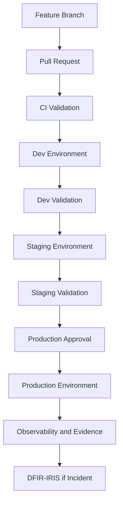
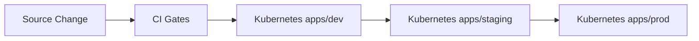
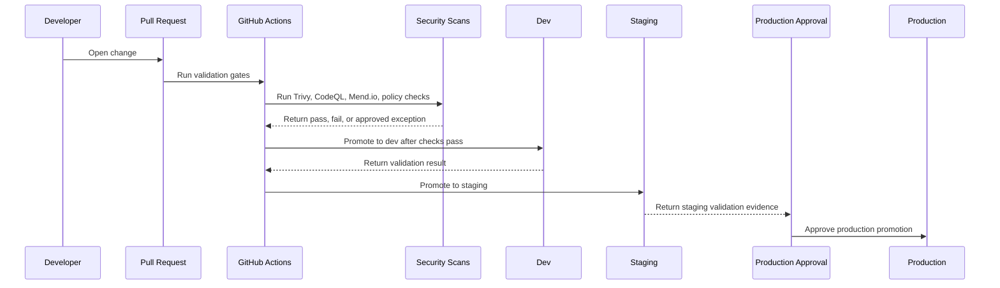
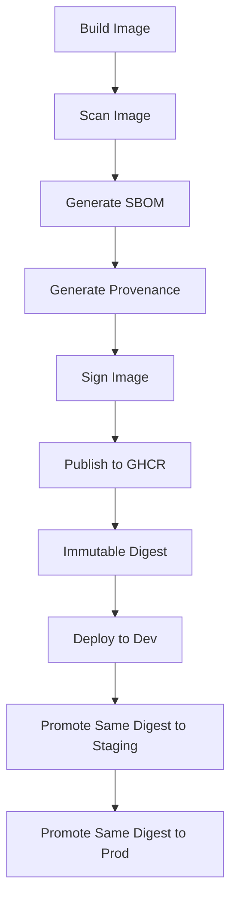
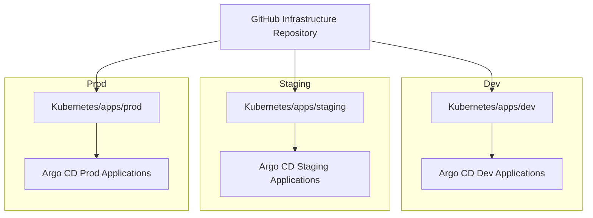
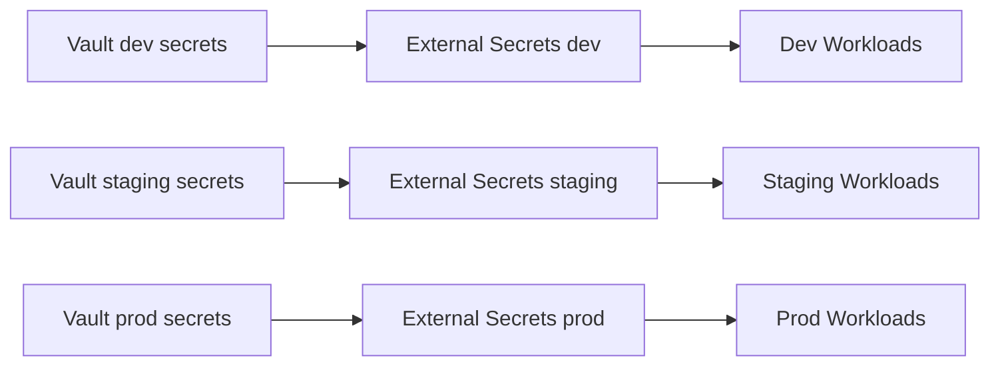
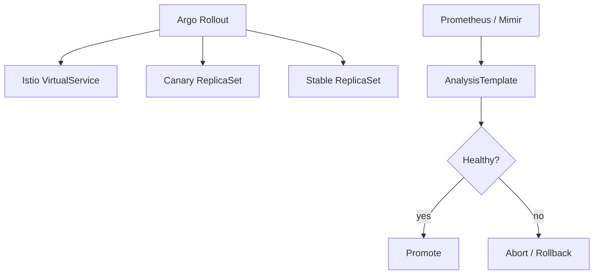
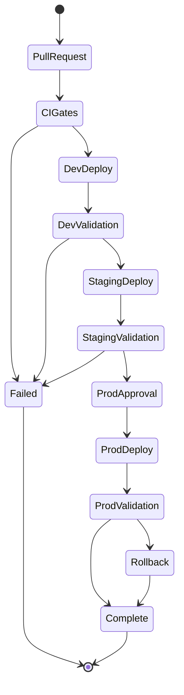
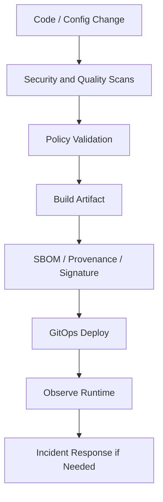
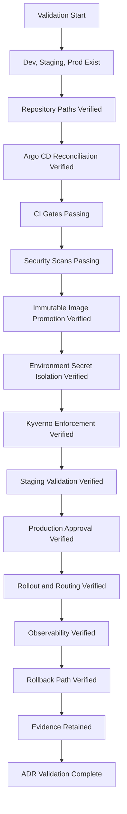

# ADR-0036 — Kubernetes Cluster Flow Progression and DevSecOps Operating Model

**ADR:** ADR-0036  
**Title:** Kubernetes Cluster Flow Progression and DevSecOps Operating Model for Dev, Staging, and Production  
**Owner:** SinLess Games LLC (Timothy “Andy” Andrew Pierce / sinless777)  
**Status:** ACCEPTED  
**Date Accepted:** 2026-04-25  
**Last Updated:** 2026-04-25  
**Supersedes:** N/A  
**Superseded By:** N/A  

**Related:**

- [Docs/Architecture/DECISIONS.md](../DECISIONS.md)
- [ADR-0001 — Monorepo Source of Truth](./ADR-0001.md)
- [ADR-0006 — Kubernetes Distribution Choice: RKE2](./ADR-0006.md)
- [ADR-0007 — GitOps Controller: Argo CD](./ADR-0007.md)
- [ADR-0008 — Progressive Delivery with Istio and Argo Rollouts](./ADR-0008.md)
- [ADR-0012 — Secrets Management and PKI: HashiCorp Vault](./ADR-0012.md)
- [ADR-0013 — Backups and Disaster Recovery with PBS, Velero, and Garage](./ADR-0013.md)
- [ADR-0014 — Observability and Incident Response Platform](./ADR-0014.md)
- [ADR-0016 — Policy-as-Code Enforcement with Kyverno](./ADR-0016.md)
- [ADR-0017 — GitHub Source Control, CI/CD, and Registry Operating Model](./ADR-0017.md)
- [ADR-0020 — Security and Compliance Operating Model](./ADR-0020.md)
- [ADR-0021 — Kubernetes Persistent Storage with Longhorn](./ADR-0021.md)
- [ADR-0023 — Istio Service Mesh Operating Model](./ADR-0023.md)
- [ADR-0024 — Ingress, Gateway, DNS, and TLS Routing Model](./ADR-0024.md)
- [ADR-0025 — GitHub Actions Runner Controller and Agentic Workflow Operating Model](./ADR-0025.md)
- [ADR-0026 — Container Image Supply Chain, Signing, SBOM, and Provenance](./ADR-0026.md)
- [ADR-0027 — RKE2 Cluster Node Topology and Scheduling Model](./ADR-0027.md)
- [ADR-0030 — Infrastructure Provisioning with Terraform and Ansible](./ADR-0030.md)
- [ADR-0032 — Namespace, Application Layout, and GitOps Repository Structure](./ADR-0032.md)
- [ADR-0034 — Incident Response Workflow with DFIR-IRIS](./ADR-0034.md)
- [ADR-0035 — Documentation Platform with MkDocs Material](./ADR-0035.md)

---

## Context

The platform requires a formal environment progression model for Kubernetes
workloads, infrastructure changes, security controls, policy validation, image
promotion, GitOps reconciliation, and operational evidence.

The platform has three Kubernetes environments:

```text
dev
staging
prod
```

The platform uses:

- GitHub as the source of truth
- GitHub Actions for CI/CD
- Actions Runner Controller for self-hosted runners
- GHCR for container images
- Argo CD for GitOps reconciliation
- Argo Rollouts for progressive delivery
- Istio for service mesh traffic control
- Kyverno for policy-as-code enforcement
- Vault for secret custody
- External Secrets for Kubernetes secret delivery
- Trivy for image, IaC, manifest, and secret scanning
- CodeQL for static code security scanning
- Dependabot, Renovate, and Mend.io for dependency governance
- Grafana stack for observability
- DFIR-IRIS for incident response
- Garage for object storage and evidence archives where configured

The platform must prevent unvalidated changes from reaching production.

The platform must define a clear flow from development to staging to production.

The platform must make security validation part of the normal delivery process
instead of a separate after-the-fact activity.

---

## Decision

Adopt a **three-environment Kubernetes progression model** with integrated
DevSecOps controls.

The accepted environment progression is:

```text
feature branch
  → pull request
  → CI validation
  → dev
  → staging
  → production approval
  → prod
```

The accepted Kubernetes environments are:

| Environment | Purpose | Promotion Gate |
| --- | --- | --- |
| `dev` | Fast validation, integration checks, early workload testing | CI success and GitOps sync |
| `staging` | Production-like validation, security review, rollout rehearsal, restore testing | dev validation, staging CI gates, review |
| `prod` | Live production workloads | staging validation, required review, protected environment approval |

Changes must progress through lower environments before production.

Production changes require:

- pull request review
- required CI checks
- security scan success or approved exception
- policy validation
- staging validation
- protected production environment approval
- GitOps reconciliation through Argo CD
- observable rollout health
- rollback path

Direct unreviewed production changes are not accepted as normal operations.

---

## Environment Progression Architecture



---

## Scope

This ADR governs:

- Kubernetes environment progression
- dev, staging, and production environment roles
- CI/CD security gates
- GitOps promotion flow
- image promotion flow
- secret promotion rules
- policy validation rules
- rollout validation rules
- production approval requirements
- rollback requirements
- evidence requirements
- operational requirements

This ADR does not define:

- every GitHub Actions workflow
- every Argo CD Application
- every namespace
- every Helm value
- every Kustomize overlay
- every deployment strategy
- every application-specific promotion policy
- every alert rule
- every dashboard
- every test case

Those items are implementation artifacts managed in the repository.

---

## Non-Goals

The accepted environment progression model does not include:

- direct production deployment from local workstations
- direct production deployment from unreviewed branches
- production changes without CI validation
- production changes without security scanning
- production changes without policy validation
- production changes without staging validation
- shared secrets across dev, staging, and prod
- mutable image tags in production
- manual Argo CD changes as normal operations
- manual Helm changes as normal operations
- bypassing GitOps for normal deployment
- treating dev as production-equivalent
- treating staging as disposable when it validates production behavior

---

## Responsibility Split

| Area | Responsibility |
| --- | --- |
| Source of truth | GitHub Infrastructure repository |
| Pull request validation | GitHub Actions |
| Self-hosted runner execution | Actions Runner Controller |
| Image registry | GHCR |
| Image scanning | Trivy |
| Code scanning | CodeQL |
| Dependency governance | Dependabot, Renovate, Mend.io |
| GitOps reconciliation | Argo CD |
| Progressive delivery | Argo Rollouts |
| Traffic management | Istio |
| Admission policy | Kyverno |
| Secret custody | Vault |
| Runtime secret delivery | External Secrets |
| Observability | Grafana stack |
| Incident response | DFIR-IRIS |
| Evidence archive | GitHub, Argo CD, Grafana, Garage where configured |

---

## Accepted Tooling

| Area | Tool |
| --- | --- |
| Source control | GitHub |
| CI/CD | GitHub Actions |
| Self-hosted runners | Actions Runner Controller |
| Container registry | GHCR |
| GitOps | Argo CD |
| Progressive delivery | Argo Rollouts |
| Service mesh | Istio |
| Policy-as-code | Kyverno |
| Secret management | Vault |
| Runtime secrets | External Secrets Operator |
| Image and IaC scanning | Trivy |
| Static code scanning | CodeQL |
| Dependency security | Dependabot |
| Dependency automation | Renovate |
| SCA and license governance | Mend.io |
| Observability | Grafana, Prometheus, Mimir, Loki, Tempo, Pyroscope |
| Incident response | DFIR-IRIS |
| Object storage and evidence archives | Garage |

---

## Environment Definitions

### Dev

The `dev` environment is used for fast validation.

Dev validates:

- application builds
- manifest rendering
- Kubernetes deployment behavior
- basic service connectivity
- early policy compatibility
- basic observability wiring
- early secret delivery behavior
- developer-facing integration tests

Dev may use smaller resource sizes than production.

Dev must still enforce baseline security policies.

Dev must not use production secrets.

---

### Staging

The `staging` environment is the production rehearsal environment.

Staging validates:

- production-like manifests
- Helm values and Kustomize overlays
- Argo CD sync behavior
- Istio routing
- Argo Rollouts canary behavior
- Kyverno policy enforcement
- External Secrets delivery
- backup behavior where applicable
- restore behavior where applicable
- observability dashboards
- alert routing
- security scans and policy gates
- operational runbooks

Staging must closely match production behavior.

Staging must not use production secrets.

---

### Prod

The `prod` environment runs live production workloads.

Production requires:

- protected branch merge
- required review
- required status checks
- protected GitHub environment approval
- successful staging validation
- immutable image references
- approved registry usage
- Kyverno admission compliance
- Argo CD health
- observable rollout
- rollback plan
- incident response coverage

Production secrets are isolated from dev and staging.

---

## Environment Repository Layout

The accepted Kubernetes environment layout is:

```text
Kubernetes/
  clusters/
    dev/
      bootstrap/
    staging/
      bootstrap/
    prod/
      bootstrap/
  apps/
    dev/
      <namespace>/<application>/
    staging/
      <namespace>/<application>/
    prod/
      <namespace>/<application>/
```

Environment-specific configuration must live under the matching environment
path.

Production resources must not depend on dev or staging paths.

Dev and staging resources must not reference production secrets.

---

## Environment Flow



---

## Branch and Pull Request Model

All production-impacting changes enter through pull requests.

Required pull request controls:

- review required
- status checks required
- stale reviews dismissed after changes
- CODEOWNERS applied to production paths
- secret scanning required
- CI validation required
- production environment approval required for production workflows
- no direct pushes to protected production branches

Pull requests must identify affected environments.

Production-impacting pull requests must include:

- impact summary
- validation evidence
- rollback plan
- affected namespaces
- affected applications
- affected secrets
- affected routes
- affected databases where applicable
- affected storage where applicable
- related ADRs

---

## CI Gate Requirements

CI gates run before GitOps promotion.

Required CI gates:

| Gate | Purpose |
| --- | --- |
| YAML validation | Ensure parseable manifests and config |
| Markdown validation | Ensure documentation and ADR quality |
| Dockerfile validation | Ensure image build definitions are valid |
| MkDocs strict build | Validate documentation site |
| Kubernetes schema validation | Validate manifest structure |
| Kustomize build | Validate rendered overlays |
| Helm lint | Validate Helm charts |
| Helm template | Validate rendered Helm output |
| Kyverno policy tests | Validate policy behavior |
| Trivy IaC scan | Detect manifest and infrastructure misconfigurations |
| Trivy image scan | Detect image vulnerabilities |
| Trivy secret scan | Detect committed secrets |
| CodeQL | Detect code vulnerabilities |
| Mend.io | Evaluate dependency and license policy |
| Terraform validation | Validate infrastructure changes |
| Ansible syntax check | Validate host configuration changes |
| Argo CD validation | Validate GitOps application definitions |

Critical and high findings block production unless an approved exception exists.

---

## CI and Promotion Flow



---

## Image Promotion Requirements

Container images progress through environments using immutable references.

Accepted image flow:

```text
build image
  → scan image
  → generate SBOM
  → generate provenance
  → sign image where enforced
  → publish to GHCR
  → deploy digest to dev
  → promote same digest to staging
  → promote same digest to prod
```

The same image digest that passes staging must be promoted to production.

Production must not rebuild a different image from the same source.

Production must not deploy mutable tags.

Accepted production image reference:

```text
ghcr.io/<owner>/<image>@sha256:<digest>
```

Rejected production tags:

```text
latest
main
dev
snapshot
nightly
```

---

## Image Promotion Flow



---

## GitOps Promotion Requirements

Argo CD reconciles each environment from the environment-specific Git path.

Required GitOps controls:

- Argo CD Application paths are explicit
- AppProjects restrict destination namespaces
- production sync is restricted
- production sync status is monitored
- manual sync is limited to approved operators
- automated sync is allowed only where approved
- Argo CD drift is corrected from Git
- break-glass changes are reconciled back into Git

Promotion is performed by changing Git-managed manifests or environment overlays.

Argo CD applies the declared state.

---

## Argo CD Environment Model



---

## Security Gate Requirements

Security gates are mandatory in the promotion path.

Required security controls:

- no plaintext secrets in Git
- image vulnerability scanning
- IaC and manifest scanning
- static code scanning
- dependency vulnerability scanning
- open source license governance where configured
- Kyverno policy validation
- admission enforcement
- approved registry policy
- immutable production image references
- External Secrets for runtime secrets
- no production secrets in dev or staging
- no untrusted pull request access to protected secrets

Security failures block promotion unless an approved exception exists.

---

## Policy Gate Requirements

Kyverno policies must be validated before deployment and enforced at admission.

Required policy areas:

- image registry allowlist
- mutable tag denial
- required labels
- required resource requests
- required probes
- required NetworkPolicies for sensitive namespaces
- no plaintext Kubernetes Secrets
- no privileged workloads unless approved
- no hostPath unless approved
- no public management exposure
- approved ingress hostnames
- approved storage classes
- approved GPU scheduling rules
- approved runner scheduling rules

Production policy failures block deployment.

---

## Secret Promotion Requirements

Secrets do not promote by copying secret values across environments.

Vault stores secrets separately by environment.

Required Vault path pattern:

```text
<system>/<environment>/<application>/<secret-name>
```

Examples:

```text
postgres/dev/grafana/writer
postgres/staging/grafana/writer
postgres/prod/grafana/writer
garage/dev/docs/writer
garage/staging/docs/writer
garage/prod/docs/writer
```

Dev, staging, and production secrets must be isolated.

Production secrets must not be readable by dev or staging workloads.

ExternalSecret manifests may be promoted between environments only when their
Vault paths and target namespaces are environment-correct.

---

## Secret Flow



---

## Progressive Delivery Requirements

Production rollouts use progressive delivery where applicable.

Accepted progressive delivery components:

- Argo Rollouts
- Istio VirtualService
- Prometheus or Mimir analysis metrics
- Grafana dashboards
- Alertmanager alerts

Progressive delivery may include:

- canary deployment
- weighted traffic shifting
- automated analysis
- manual pause
- promotion
- abort
- rollback

Production progressive delivery requires observable health metrics.

---

## Progressive Delivery Flow



---

## Environment Validation Requirements

### Dev Validation

Dev validation must prove:

- manifests render
- deployment starts
- pods become ready
- basic service connectivity works
- required secrets sync
- basic metrics appear
- required policies do not block valid workloads

Dev validation may use reduced replica counts.

---

### Staging Validation

Staging validation must prove:

- production-like manifests render
- image digest is deployable
- database migrations succeed where applicable
- ExternalSecret sync succeeds
- Istio routes work
- Argo Rollouts canary works where applicable
- dashboards show workload health
- alerts are configured
- NetworkPolicies allow required traffic
- Kyverno admits compliant resources and blocks unsafe resources
- backup and restore workflow is validated where applicable

---

### Prod Validation

Production validation must prove:

- Argo CD sync succeeds
- pods become ready
- rollout completes or safely pauses
- service health checks pass
- Istio route health is normal
- error counts remain within accepted thresholds
- latency remains within accepted thresholds
- alerts remain quiet or expected
- logs show no critical startup errors
- rollback remains available

---

## Database and Migration Requirements

Database changes must progress through environments.

Required database flow:

```text
dev migration
  → staging migration
  → production migration
```

Production database migrations require:

- backup freshness check
- migration plan
- rollback plan where possible
- staging validation
- application compatibility validation
- owner approval
- monitoring during rollout

Production destructive migrations require explicit approval.

---

## Backup and Restore Requirements

Backup behavior must be validated before production dependence.

Required backup validation by environment:

| Environment | Backup Requirement |
| --- | --- |
| `dev` | Backup behavior may be reduced unless testing backup logic |
| `staging` | Backup and restore workflow must be tested for production-impacting stateful changes |
| `prod` | Backups must be active, monitored, and restore-tested on schedule |

Production stateful changes require backup confidence.

---

## Observability Requirements

Each environment must be observable.

Required observability by environment:

| Signal | Dev | Staging | Prod |
| --- | --- | --- | --- |
| Metrics | Required | Required | Required |
| Logs | Required | Required | Required |
| Traces | Optional unless workload requires | Required where production tracing is used | Required where configured |
| Alerts | Basic | Production-like | Required |
| Dashboards | Basic | Production-like | Required |
| SLO/SLA panels | Optional | Required where defined | Required where defined |

Production deployment is not valid without observable health.

---

## Evidence Requirements

Promotion must produce evidence.

Required evidence:

- pull request
- review approval
- CI results
- security scan reports
- image digest
- SBOM
- provenance
- Kyverno validation result
- Argo CD sync history
- rollout history
- staging validation result
- production approval
- production rollout health
- rollback reference
- exception record where applicable

Evidence is retained in:

- GitHub
- GitHub Actions artifacts
- GHCR
- Argo CD
- Grafana
- Loki
- DFIR-IRIS where incident-related
- Garage where exported

---

## Exception Requirements

Exceptions are controlled and time-limited.

Exceptions are required for:

- critical vulnerability promotion
- high vulnerability promotion
- policy bypass
- unsigned image when signing is enforced
- missing SBOM
- missing provenance
- mutable tag use in non-production for temporary testing
- privileged workload
- hostPath usage
- direct public exposure exception
- production route exception

Every exception must include:

- owner
- affected environment
- affected workload
- affected control
- justification
- compensating control
- expiration date
- approval reference

Expired exceptions are invalid.

---

## Promotion Approval Requirements

Production promotion requires approval.

Required approval controls:

- GitHub protected environment: `prod`
- required reviewers
- required CI checks
- successful staging validation
- security gates passed
- no expired exceptions
- rollback path documented
- owner approval for affected system
- database owner approval where database changes exist
- security approval where security exceptions exist

Production approval must be recorded in GitHub.

---

## Deployment Freeze Requirements

Production deployment freeze may be used during high-risk periods.

Freeze triggers include:

- active SEV-1 or SEV-2 incident
- production control plane instability
- backup integrity risk
- GitHub Actions runner compromise
- registry compromise
- Vault instability
- PostgreSQL instability
- unresolved critical security event
- failed restore validation affecting critical workloads

During a freeze:

- emergency fixes may proceed through break-glass approval
- normal feature releases stop
- security fixes may continue with approval
- evidence must be recorded

---

## Rollback Requirements

Every production deployment must have a rollback path.

Accepted rollback methods:

- Argo Rollouts abort
- Argo Rollouts rollback
- image digest rollback
- Git revert
- Argo CD sync to previous commit
- Helm value rollback through Git
- Kustomize patch rollback through Git
- database rollback where safe
- restore from backup where required

Rollback must preserve incident and deployment evidence.

---

## Environment Promotion Flow



---

## Repository Path Requirements

Required environment paths:

```text
Kubernetes/apps/dev/
Kubernetes/apps/staging/
Kubernetes/apps/prod/
Kubernetes/clusters/dev/
Kubernetes/clusters/staging/
Kubernetes/clusters/prod/
```

Required workflow paths:

```text
.github/workflows/
```

Required policy paths:

```text
Policy/
Kubernetes/apps/<environment>/<namespace>/<application>/
```

Required documentation paths:

```text
Docs/
Docs/Architecture/ADRs/
Docs/Operations/
```

---

## Environment Label Requirements

All environment resources must include:

```text
environment=<dev|staging|prod>
```

Production resources must include:

```text
environment=prod
```

Application resources must include:

```text
app.kubernetes.io/name=<application>
app.kubernetes.io/part-of=<system>
app.kubernetes.io/component=<component>
app.kubernetes.io/managed-by=argocd
```

Promotion-tracked resources should include:

```text
devsecops.sinlessgames.io/promotion-stage=<dev|staging|prod>
devsecops.sinlessgames.io/source-revision=<git-sha>
```

---

## Security Requirements

### Source Control Security

Required controls:

- protected `main` branch
- required pull requests
- required checks
- CODEOWNERS for production paths
- no direct production commits
- no secret values committed to Git
- signed commits where enforced
- workflow changes reviewed before production use

---

### CI/CD Security

Required controls:

- least-privilege workflow permissions
- protected production environment
- no production secrets on untrusted pull requests
- runner class separation
- build logs retained
- security scan artifacts retained
- dependency update checks
- artifact provenance retained

---

### Runtime Security

Required controls:

- Kyverno admission policy
- Falco runtime detection
- Wazuh endpoint monitoring
- CrowdSec edge abuse detection
- NetworkPolicies
- Istio mTLS where mesh-enabled
- approved registries
- immutable production image references
- ExternalSecret-based secrets

---

## DevSecOps Control Flow



---

## Implementation Requirements

### GitHub Actions

GitHub Actions workflows must implement environment-aware validation.

Required workflow classes:

- pull request validation
- documentation validation
- image build and scan
- manifest validation
- policy validation
- dependency validation
- dev deployment validation
- staging deployment validation
- production promotion
- failed-run triage
- security finding triage
- documentation drift detection

---

### Actions Runner Controller

Runner class usage:

| Runner Class | Environment Use |
| --- | --- |
| `github-hosted` | Low-risk validation |
| `arc-general` | General CI |
| `arc-build` | Image build and scan |
| `arc-infra` | Internal infrastructure validation |
| `arc-agentic` | Agentic workflow execution |
| `arc-prod` | Production-impacting workflows |

Production workflows must use protected runners and protected environments.

---

### Argo CD

Argo CD must have environment-specific Applications or ApplicationSets.

Required controls:

- explicit repository paths
- environment-specific destinations
- AppProject restrictions
- sync status monitoring
- health monitoring
- rollback through Git
- drift detection

---

### Kyverno

Kyverno must enforce environment-aware policy.

Production policies are stricter than dev policies.

Dev may allow selected temporary exceptions.

Staging must closely match production.

Production must enforce required policy controls.

---

## Validation Requirements

This ADR is valid when the following requirements are met:

- `dev`, `staging`, and `prod` Kubernetes environments exist
- environment paths exist in the repository
- Argo CD reconciles each environment from explicit paths
- CI validates pull requests before environment promotion
- images are scanned before promotion
- SBOMs are generated for production images
- provenance is generated for production images
- production images use immutable references
- dev deployments do not use production secrets
- staging deployments do not use production secrets
- production secrets are isolated in Vault
- Kyverno policies are enforced in all environments
- staging policies match production where production behavior is being validated
- production promotion requires protected environment approval
- production promotion requires successful staging validation
- Argo Rollouts canary behavior works where configured
- Istio routing works in staging before production
- observability is active in all environments
- production deployment evidence is retained
- rollback path exists for production deployments
- incident-grade deployment failures create or link DFIR-IRIS cases



---

## Rollback Plan

If dev deployment fails:

1. stop promotion to staging
2. inspect CI logs
3. inspect Argo CD application health
4. inspect workload logs
5. correct the change through pull request
6. redeploy to dev
7. validate before promotion

If staging deployment fails:

1. stop production promotion
2. inspect Argo CD staging application health
3. inspect rollout status
4. inspect Istio route behavior
5. inspect Kyverno policy decisions
6. inspect logs, metrics, and traces
7. correct the change through pull request
8. rerun staging validation

If production deployment fails:

1. stop rollout or abort Argo Rollouts canary
2. restore stable traffic
3. roll back to the last known-good image digest or Git revision
4. inspect Argo CD health
5. inspect Grafana dashboards
6. inspect application logs
7. preserve deployment evidence
8. create or link a DFIR-IRIS case when production impact exists

If a security gate blocks promotion:

1. inspect the finding
2. determine whether the finding is valid
3. remediate the finding through pull request
4. create an approved exception only when required
5. rerun CI
6. promote only after gates pass or exception is valid

If production secrets are exposed to dev or staging:

1. revoke affected credentials
2. rotate production secrets in Vault
3. inspect ExternalSecret manifests
4. inspect Git history and CI logs
5. correct Vault path references
6. create a DFIR-IRIS case when security-impacting
7. validate environment isolation

If Argo CD drift occurs:

1. identify the drifted resource
2. determine whether Git or live state is correct
3. restore declared state through Argo CD
4. update Git only through approved pull request
5. preserve evidence for production-impacting drift

A permanent migration away from this progression model requires:

- a superseding ADR
- migration plan
- rollback plan
- environment migration procedure
- CI/CD migration procedure
- GitOps migration procedure
- secret isolation migration procedure
- validation evidence
- updated implementation documentation
- updated runbooks

---

## Operational Requirements

Kubernetes environment progression requires:

- three environments: `dev`, `staging`, and `prod`
- environment-specific repository paths
- Argo CD reconciliation for each environment
- CI validation before promotion
- security scanning before promotion
- policy validation before promotion
- isolated Vault secret paths per environment
- ExternalSecret-based secret delivery
- immutable production image references
- GHCR image publishing
- SBOM and provenance evidence
- Kyverno admission enforcement
- staging validation before production
- protected production environment approval
- Argo Rollouts for progressive delivery where applicable
- Istio traffic routing where applicable
- Grafana dashboards
- alert rules
- deployment evidence retention
- rollback procedures
- DFIR-IRIS case linkage for incident-grade failures
- quarterly review of promotion controls