# Layer 2 / Layer 3 Network Design

This document describes the **logical Layer 2 and Layer 3 network design** for the SinLess Games infrastructure environment as configured through the UniFi network stack.

It documents:

- VLAN IDs, names, and subnets
- Gateway addressing and routing model
- Layer 2 switch topology
- VLAN trunking model
- DHCP and DNS layout
- Proxmox bridge integration
- Network traffic paths
- Monitoring and troubleshooting workflows

---

## 1. Network Design Summary

The network uses a classic **router-on-a-stick** design.

The **USG Pro 4** provides Layer 3 routing between VLANs. UniFi switches provide Layer 2 switching, VLAN trunking, and access port assignment. Proxmox nodes use VLAN-aware bridges so virtual machines can be attached directly to the correct VLAN.

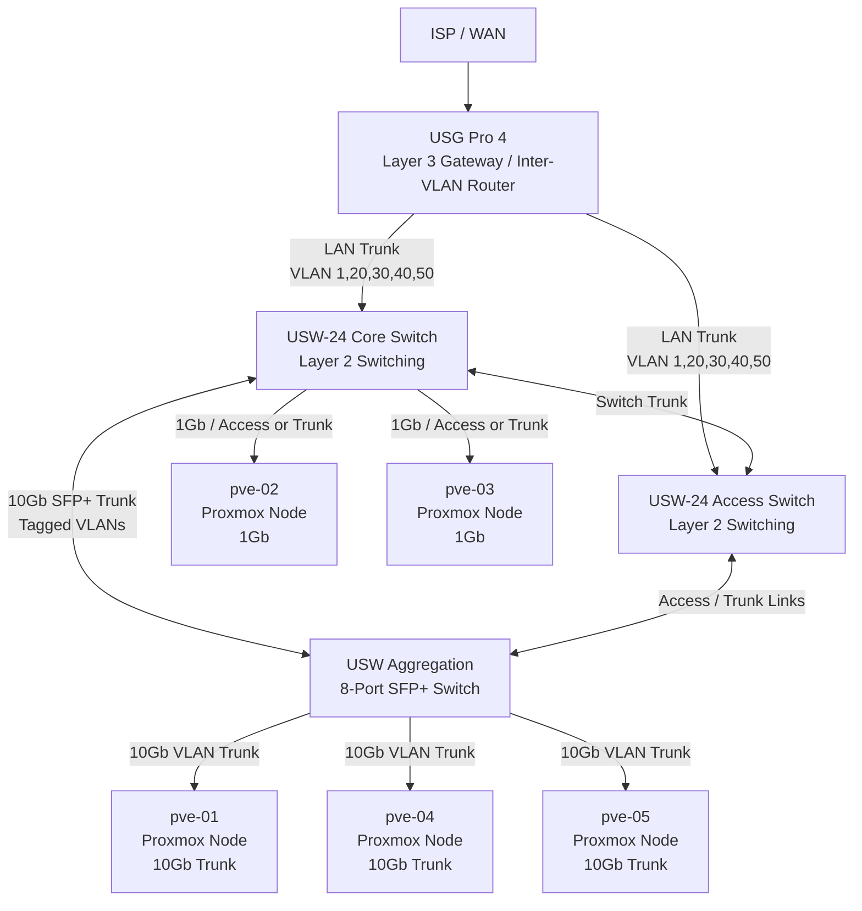

---

## 2. VLAN and Subnet Overview

All VLAN gateways are hosted on the **USG Pro 4**.

| VLAN ID | Name | Subnet | Gateway IP | DHCP Range | Purpose |
|--------:|------|--------|------------|------------|---------|
| 1 | Infrastructure | `10.10.10.0/24` | `10.10.10.1` | `10.10.10.100–10.10.10.199` | Proxmox management, core infrastructure, network management |
| 20 | Development | `10.10.20.0/24` | `10.10.20.1` | `10.10.20.100–10.10.20.199` | Development VMs and workloads |
| 30 | Testing | `10.10.30.0/24` | `10.10.30.1` | `10.10.30.100–10.10.30.199` | QA, staging, and testing workloads |
| 40 | Production | `10.10.40.0/24` | `10.10.40.1` | `10.10.40.100–10.10.40.199` | Production VMs and workloads |
| 50 | DMZ | `10.10.50.0/24` | `10.10.50.1` | `10.10.50.100–10.10.50.199` | Edge systems, reverse proxies, bastions, tunnels |

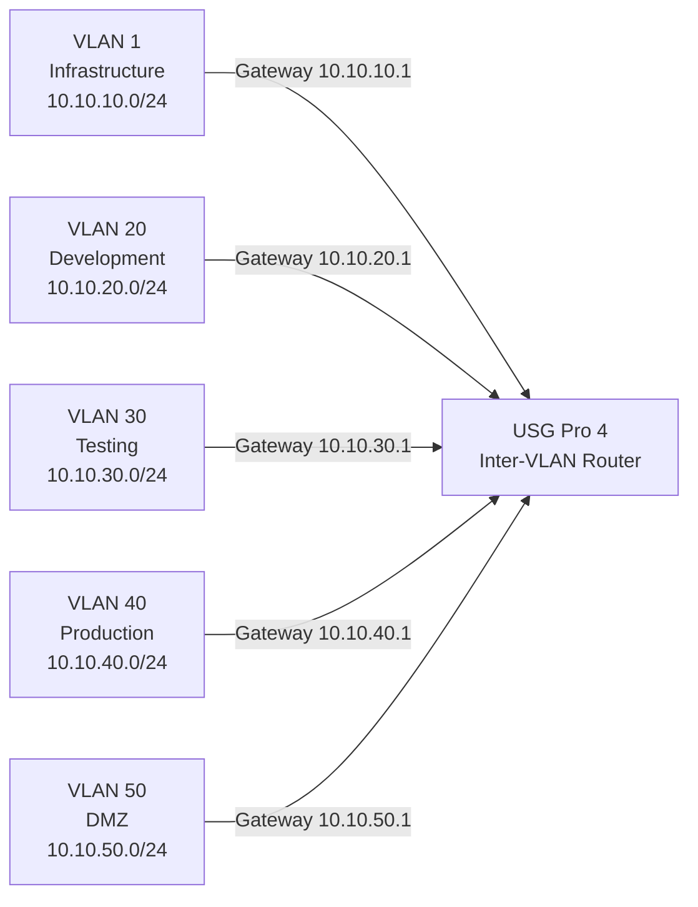

---

## 3. IP Allocation Plan

### 3.1 Standard Allocation Strategy

Each `/24` subnet follows the same allocation model:

| Range | Purpose |
|------|---------|
| `.1` | VLAN gateway on USG Pro 4 |
| `.2–.19` | Core infrastructure, Proxmox nodes, DNS, controllers, and network services |
| `.20–.99` | Static servers, VM reservations, Kubernetes nodes, and service endpoints |
| `.100–.199` | DHCP dynamic allocation |
| `.200–.254` | Reserved for future use |

Each DHCP range from `.100–.199` provides **100 dynamic addresses**.

---

## 4. Static IP Assignments

### 4.1 VLAN 1 — Infrastructure

Subnet: `10.10.10.0/24`  
Gateway: `10.10.10.1`

| IP Address | Assignment |
|-----------|------------|
| `10.10.10.1` | USG Pro 4 gateway |
| `10.10.10.15` | `pve-01` Proxmox management |
| `10.10.10.16` | `pve-02` Proxmox management |
| `10.10.10.17` | `pve-03` Proxmox management |
| `10.10.10.18` | `pve-04` Proxmox management |
| `10.10.10.19` | `pve-05` Proxmox management |
| `10.10.10.100–10.10.10.199` | DHCP range |

### 4.2 VLAN 20 — Development

Subnet: `10.10.20.0/24`  
Gateway: `10.10.20.1`

| IP Range | Assignment |
|---------|------------|
| `10.10.20.1` | USG Pro 4 gateway |
| `10.10.20.2–10.10.20.99` | Static development VM assignments |
| `10.10.20.100–10.10.20.199` | DHCP range |
| `10.10.20.200–10.10.20.254` | Reserved |

### 4.3 VLAN 30 — Testing

Subnet: `10.10.30.0/24`  
Gateway: `10.10.30.1`

| IP Range | Assignment |
|---------|------------|
| `10.10.30.1` | USG Pro 4 gateway |
| `10.10.30.2–10.10.30.99` | Static testing VM assignments |
| `10.10.30.100–10.10.30.199` | DHCP range |
| `10.10.30.200–10.10.30.254` | Reserved |

### 4.4 VLAN 40 — Production

Subnet: `10.10.40.0/24`  
Gateway: `10.10.40.1`

| IP Range | Assignment |
|---------|------------|
| `10.10.40.1` | USG Pro 4 gateway |
| `10.10.40.2–10.10.40.99` | Static production VM assignments |
| `10.10.40.100–10.10.40.199` | DHCP range |
| `10.10.40.200–10.10.40.254` | Reserved |

### 4.5 VLAN 50 — DMZ

Subnet: `10.10.50.0/24`  
Gateway: `10.10.50.1`

| IP Range | Assignment |
|---------|------------|
| `10.10.50.1` | USG Pro 4 gateway |
| `10.10.50.2–10.10.50.99` | Static DMZ systems |
| `10.10.50.100–10.10.50.199` | DHCP range |
| `10.10.50.200–10.10.50.254` | Reserved |

---

## 5. Layer 2 Switching Design

### 5.1 Switching Model

The Layer 2 network is built around UniFi switching.

The design uses:

- VLAN-aware trunk ports between network devices
- Tagged VLANs for workload networks
- Native / untagged VLAN 1 for infrastructure management where required
- 10Gb SFP+ aggregation for high-throughput Proxmox nodes
- Access ports for devices that should belong to only one VLAN

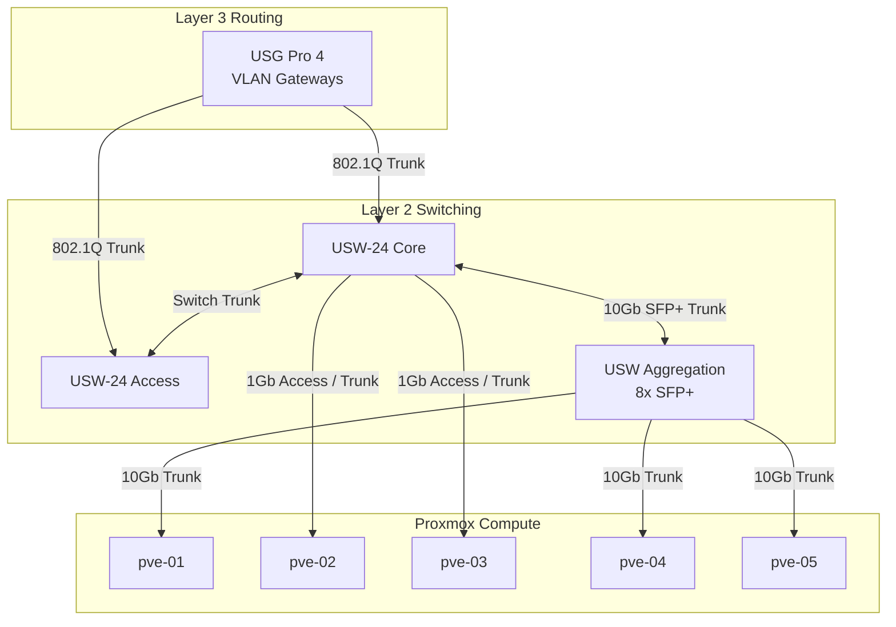

### 5.2 VLAN Trunk Configuration

All infrastructure trunks should carry the following VLANs:

| VLAN | Name | Trunk Behavior |
|-----:|------|----------------|
| 1 | Infrastructure | Native / untagged where required |
| 20 | Development | Tagged |
| 30 | Testing | Tagged |
| 40 | Production | Tagged |
| 50 | DMZ | Tagged |

### 5.3 Required Trunk Links

| Link | Type | VLANs |
|------|------|-------|
| USG Pro 4 → USW-24 Core | Full trunk | `1,20,30,40,50` |
| USG Pro 4 → USW-24 Access | Full trunk | `1,20,30,40,50` |
| USW-24 Core → USW Aggregation | 10Gb SFP+ trunk | `1,20,30,40,50` |
| USW Aggregation → `pve-01` | 10Gb trunk | `1,20,30,40,50` |
| USW Aggregation → `pve-04` | 10Gb trunk | `1,20,30,40,50` |
| USW Aggregation → `pve-05` | 10Gb trunk | `1,20,30,40,50` |
| USW-24 Core → `pve-02` | 1Gb access or trunk | As required |
| USW-24 Core → `pve-03` | 1Gb access or trunk | As required |

### 5.4 Access Port Model

Access ports should be assigned to a single VLAN unless the connected device requires trunking.

| Port Type | VLAN Behavior | Use Case |
|----------|---------------|----------|
| Infrastructure access | Untagged VLAN 1 | Admin workstations, management-only devices |
| Development access | Untagged VLAN 20 | Dev endpoints and temporary dev systems |
| Testing access | Untagged VLAN 30 | QA and test devices |
| Production access | Untagged VLAN 40 | Production-only systems |
| DMZ access | Untagged VLAN 50 | Edge appliances, bastion hosts |

---

## 6. Layer 3 Routing Design

### 6.1 Inter-VLAN Routing

All inter-VLAN routing is handled by the USG Pro 4.

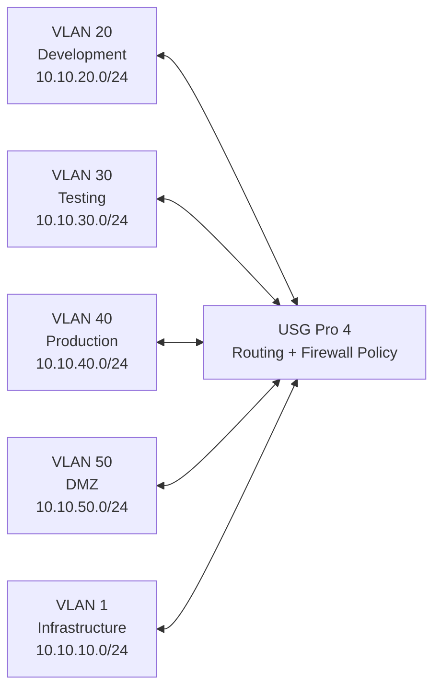

### 6.2 Routing Rules

Traffic between different VLANs must pass through the USG Pro 4.

Required routing behavior:

- Same-VLAN traffic remains Layer 2 switched.
- Cross-VLAN traffic is routed through the USG Pro 4.
- Firewall rules on the USG Pro 4 control allowed inter-VLAN communication.
- DMZ traffic must be tightly restricted.
- Infrastructure VLAN access should be limited to administrative systems and trusted services.
- Development and testing networks should not have unrestricted access to production systems.

---

## 7. Proxmox Network Integration

### 7.1 Proxmox Node Network Model

Each Proxmox node has:

1. A management interface on VLAN 1.
2. A VLAN-aware bridge for VM traffic.
3. Optional dedicated workload interfaces where hardware supports it.

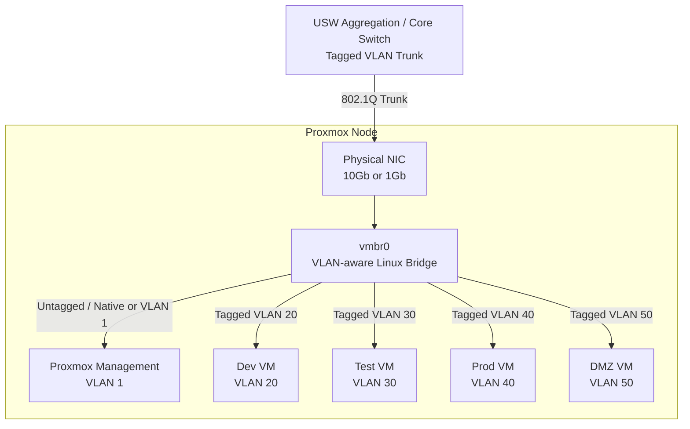

### 7.2 Primary Bridge: `vmbr0`

`vmbr0` is the primary bridge for VM networking.

Required behavior:

- VLAN-aware bridge enabled
- VLAN filtering enabled
- Carries VLANs `1,20,30,40,50`
- Supports tagged VM interfaces
- Supports untagged/native infrastructure traffic where required
- Connected to the appropriate physical NIC or bond

### 7.3 Optional Secondary Bridge: `vmbr1`

`vmbr1` is reserved for future expansion.

Possible uses:

- Isolated lab networks
- Dedicated workload traffic
- Future Proxmox cluster redesign
- Temporary migration networks
- Non-routed test networks

---

## 8. Network Communication Paths

### 8.1 Intra-VLAN Communication

Intra-VLAN traffic stays at Layer 2 and does not require routing through the USG Pro 4.

Example: two production VMs on VLAN 40.

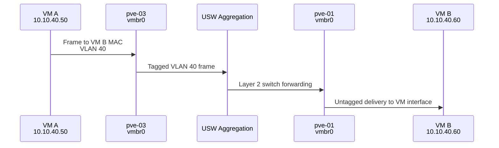

Traffic path:

1. VM A sends traffic to VM B.
2. The frame is tagged as VLAN 40 on the Proxmox trunk.
3. UniFi switches forward the frame at Layer 2.
4. VM B receives the traffic.
5. The USG Pro 4 is not involved.

### 8.2 Inter-VLAN Communication

Inter-VLAN traffic must route through the USG Pro 4.

Example: development VM on VLAN 20 communicating with production VM on VLAN 40.

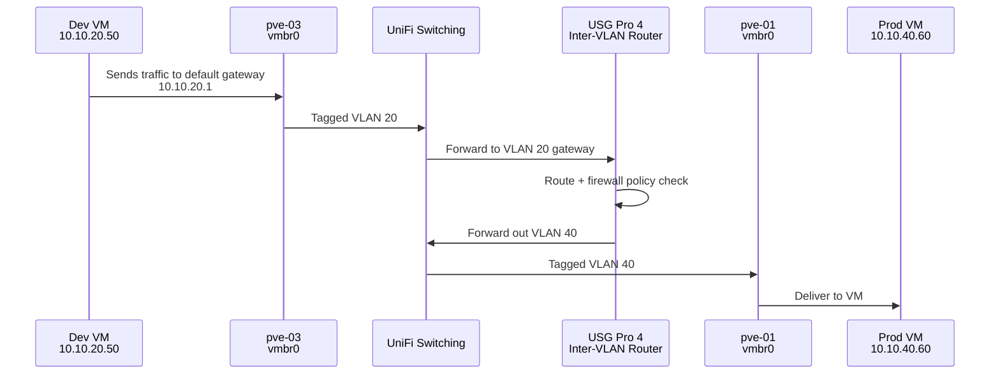

Traffic path:

1. VM sends traffic to its default gateway.
2. VLAN 20 traffic reaches the USG Pro 4.
3. USG Pro 4 evaluates firewall policy.
4. USG Pro 4 routes the packet to VLAN 40.
5. VLAN 40 traffic is switched to the destination Proxmox host.
6. Destination VM receives the traffic.

---

## 9. DHCP and DNS Design

### 9.1 DHCP

DHCP is provided by the USG Pro 4 for each VLAN.

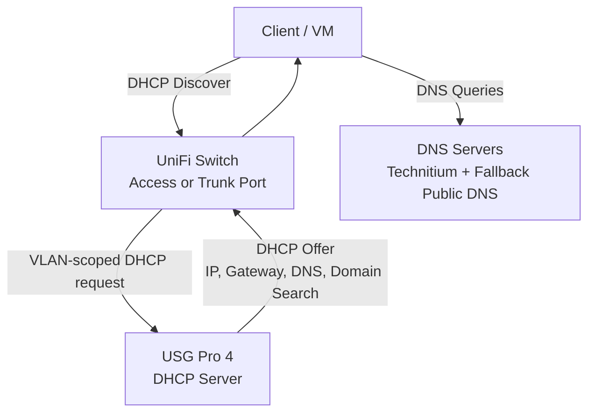

Per-VLAN DHCP options should provide:

- Gateway address
- DNS resolver
- NTP server where applicable
- Domain search suffix
- PXE options where required

### 9.2 DNS

Primary DNS should be provided by **Technitium DNS** once deployed.

Fallback DNS:

- `1.1.1.1`
- `8.8.8.8`

Recommended DNS model:

| Resolver Role | Purpose |
|---------------|---------|
| Technitium DNS | Internal authoritative and recursive DNS |
| USG Pro 4 DHCP options | Distribute resolver settings |
| Public fallback DNS | External fallback only |
| Local domain | Internal service discovery |

---

## 10. Proxmox Cluster Networking

### 10.1 Management Network

The Proxmox cluster management network uses VLAN 1.

| Component | VLAN | Subnet |
|----------|------|--------|
| Proxmox management UI | VLAN 1 | `10.10.10.0/24` |
| Proxmox API | VLAN 1 | `10.10.10.0/24` |
| Corosync | VLAN 1 | `10.10.10.0/24` |
| Cluster node management | VLAN 1 | `10.10.10.0/24` |

### 10.2 Cluster Communication Flow

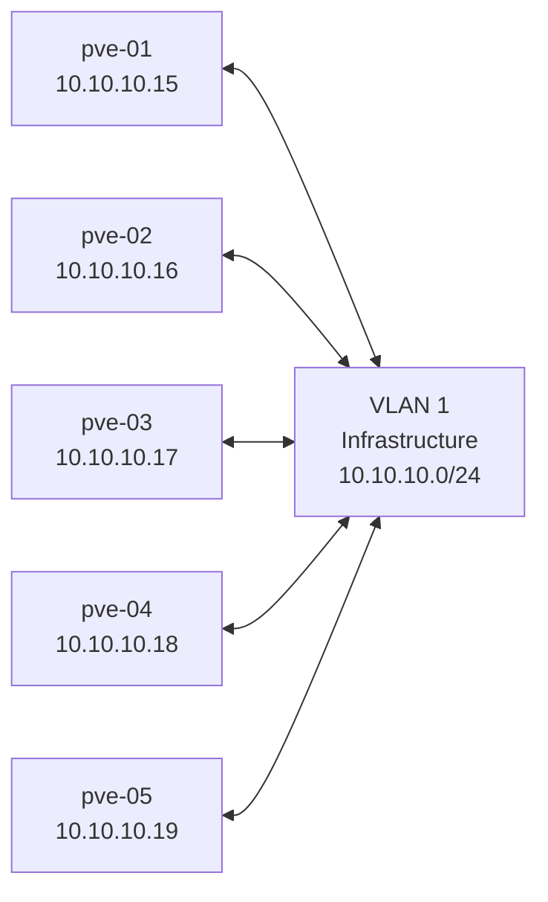

### 10.3 Workload Network Attachment

Virtual machines and Kubernetes nodes should attach to the VLAN that matches their environment or exposure model.

| Workload Type | VLAN |
|--------------|------|
| Infrastructure services | VLAN 1 |
| Development workloads | VLAN 20 |
| Testing workloads | VLAN 30 |
| Production workloads | VLAN 40 |
| Edge, tunnel, or bastion systems | VLAN 50 |

---

## 11. Security Segmentation

### 11.1 VLAN Trust Levels

| VLAN | Trust Level | Notes |
|-----:|-------------|------|
| 1 | High trust | Infrastructure and management systems |
| 20 | Medium trust | Development workloads |
| 30 | Medium trust | Testing and staging workloads |
| 40 | High impact | Production workloads |
| 50 | Low trust / exposed | DMZ and externally reachable systems |

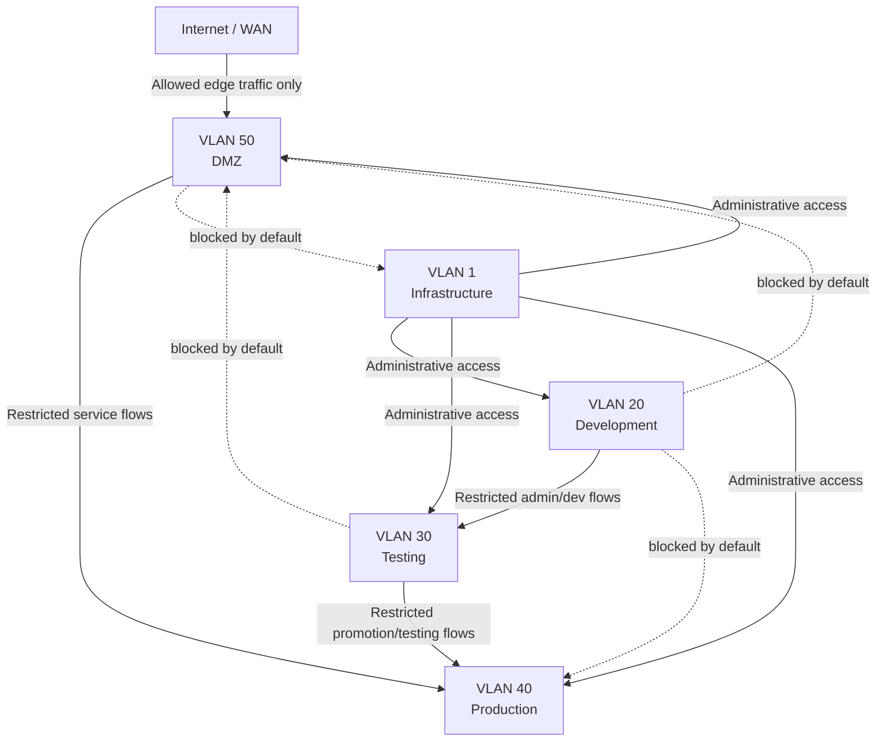

### 11.2 Firewall Policy Requirements

Firewall rules should enforce:

- Default deny between VLANs where practical.
- Explicit allow rules for required services.
- DMZ cannot initiate unrestricted access to internal VLANs.
- Development and testing cannot access production by default.
- Infrastructure VLAN administrative access is restricted to trusted management hosts.
- DNS, NTP, monitoring, backup, PXE, and GitOps flows are explicitly documented.
- Production ingress should enter through approved edge or ingress systems only.

---

## 12. Monitoring and Troubleshooting

### 12.1 Monitoring Sources

| System | Purpose |
|--------|---------|
| UniFi Controller | Switch status, port state, VLAN visibility, client inventory |
| Proxmox | Bridge status, VM network attachment, node NIC status |
| Grafana / Prometheus | Metrics, alerting, dashboarding |
| Technitium DNS | DNS query visibility and internal DNS health |
| USG Pro 4 | Routing, firewall, DHCP, and gateway health |

### 12.2 Troubleshooting Flow

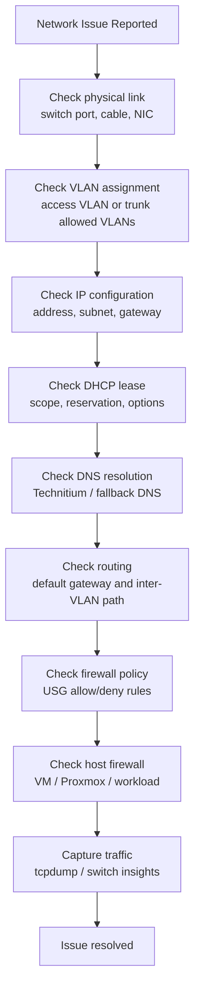

### 12.3 Useful Commands

#### Proxmox Bridge and VLAN Checks

```bash
ip link show
bridge link
bridge vlan show
ip addr show
ip route show
```

#### Interface Link State

```bash
ethtool <interface>
```

#### VLAN Packet Capture

```bash
tcpdump -eni <interface> vlan
tcpdump -eni vmbr0
tcpdump -eni vmbr0 vlan 40
```

#### Connectivity Testing

```bash
ping <gateway-ip>
ping <target-ip>
traceroute <target-ip>
mtr <target-ip>
```

#### DNS Testing

```bash
dig <hostname>
dig @10.10.20.1 <hostname>
nslookup <hostname>
```

---

## 13. Validation Checklist

### 13.1 Layer 1 / Physical

- [ ] USG Pro 4 uplinks are connected.
- [ ] USW-24 switches are online.
- [ ] USW Aggregation switch is online.
- [ ] Proxmox nodes show expected link speed.
- [ ] 10Gb links negotiate at 10Gb where supported.
- [ ] No switch ports show excessive errors or flapping.

### 13.2 Layer 2 / VLAN

- [ ] Trunk ports carry VLANs `1,20,30,40,50`.
- [ ] Access ports are assigned to the correct VLAN.
- [ ] Proxmox `vmbr0` is VLAN-aware.
- [ ] VM VLAN tags match their target networks.
- [ ] Same-VLAN VM-to-VM communication works.

### 13.3 Layer 3 / Routing

- [ ] Each VLAN gateway responds to ping from allowed networks.
- [ ] DHCP clients receive the correct subnet configuration.
- [ ] Inter-VLAN routing works only where firewall policy allows it.
- [ ] DMZ access to internal networks is restricted.
- [ ] Development access to production is restricted.
- [ ] Infrastructure management access is limited to trusted administrative systems.

### 13.4 DNS and DHCP

- [ ] DHCP scopes are active for each VLAN.
- [ ] DHCP leases provide correct gateway and DNS options.
- [ ] Internal DNS resolves local services.
- [ ] External DNS resolution works from allowed VLANs.
- [ ] PXE-specific DHCP options are configured where required.

---

## 14. Future Expansion

### 14.1 Reserved VLANs

| VLAN | Future Purpose |
|-----:|----------------|
| 70 | IoT or monitoring devices |
| 80 | Guest or temporary access |
| 90 | Out-of-band management |
| 100 | Lab or isolated testing |

### 14.2 Scaling Considerations

- Current `/24` VLANs support up to 254 addresses per subnet.
- DHCP ranges can be expanded if static reservations are documented.
- 10Gb aggregation should be used for storage-heavy or production-heavy nodes.
- Additional UniFi aggregation switches can be added if more SFP+ ports are required.
- Any new VLAN must be added to:
  - UniFi network configuration
  - USG Pro 4 gateway interfaces
  - Switch trunk allowed VLANs
  - Proxmox bridge VLAN permissions
  - Firewall policy
  - DNS/DHCP documentation
  - Ansible inventory and network automation

---

## 15. Related Documents

- `Docs/Network/Port-Map.md`
- `Docs/Network/Rack-Diagram.md`
- `Docs/Architecture/ACME-Architecture.md`
- `Docs/Architecture/DECISIONS.md`
- `Docs/Architecture/ADRs/`

---

## 16. Maintenance

This document must be updated when any of the following change:

- VLAN IDs
- Subnet assignments
- Gateway IPs
- DHCP ranges
- Switch topology
- Proxmox bridge configuration
- Trunk port configuration
- Firewall segmentation policy
- DNS or DHCP provider
- Physical port assignments

**Last Updated**: April 25, 2026  
**Source**: UniFi Controller network configuration  
**Maintained By**: Infrastructure repository documentation and Ansible network automation