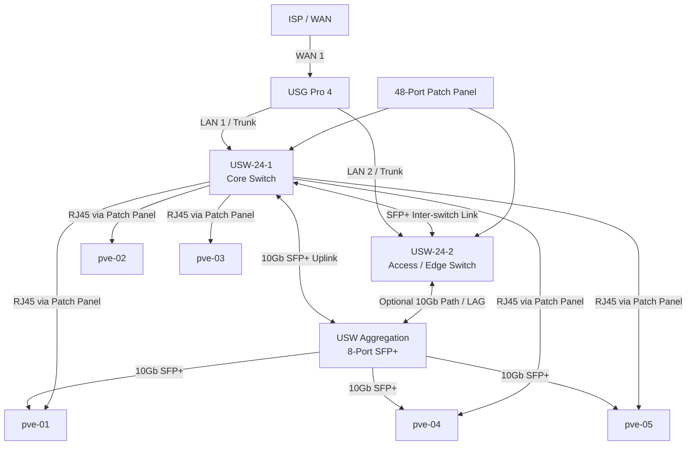

# Rack & Network Cabling Plan

This document defines the physical rack, patch panel, switch, and server cabling layout for the SinLess Games infrastructure network.

It is focused on physical connectivity. VLAN enforcement is handled through UniFi port profiles, trunk configuration, and Proxmox VLAN-aware bridges.

---

## VLANs & Colors Reference

| VLAN ID | Name | Subnet | Purpose | Color |
|--------:|------|--------|---------|-------|
| 1 | Infrastructure | `10.10.10.0/24` | Proxmox management, switch management, core infrastructure | Blue |
| 20 | Development | `10.10.20.0/24` | Development VMs, development workloads, engineering services | Green |
| 30 | Testing | `10.10.30.0/24` | QA, staging, testing workloads | Purple |
| 40 | Production | `10.10.40.0/24` | Production workloads and production VMs | Orange |
| 50 | DMZ | `10.10.50.0/24` | Edge systems, reverse proxies, bastions, tunnels | Red |

VLAN 60 has been removed from the active network design.

---

## Guide to Abbreviations

| Term | Meaning |
|------|---------|
| USG | Ubiquiti Security Gateway Pro 4 |
| USW | UniFi Switch |
| AP | Wireless Access Point |
| iDRAC | Integrated Dell Remote Access Controller |
| Trunk | Port carrying multiple VLANs, usually tagged |
| Access Port | Port assigned to a single untagged VLAN |
| LAG | Link Aggregation Group |
| SFP+ | 10Gb fiber or DAC-capable uplink port |
| RJ45 | Copper Ethernet port |

---

## Physical Network Summary

---

## Patch Panel 48-Port Map

All server RJ45 ports, including iDRAC where present, are wired to the patch panel. Remaining ports are reserved for desks, APs, infrastructure devices, and future expansion.

| Patch Panel Port | Device / Endpoint | Switch & Port |
|-----------------:|-------------------|---------------|
| 1 | pve-01 NIC 1 | USW-24-1 Port 2 |
| 2 | pve-01 NIC 2 | USW-24-1 Port 3 |
| 3 | pve-02 NIC 1 | USW-24-1 Port 4 |
| 4 | pve-03 NIC 1 | USW-24-1 Port 5 |
| 5 | pve-03 NIC 2 | USW-24-1 Port 6 |
| 6 | pve-04 NIC 1 | USW-24-1 Port 7 |
| 7 | pve-04 NIC 2 | USW-24-1 Port 8 |
| 8 | pve-04 NIC 3 | USW-24-1 Port 9 |
| 9 | pve-04 NIC 4 | USW-24-1 Port 10 |
| 10 | pve-04 NIC 5 | USW-24-1 Port 11 |
| 11 | pve-04 NIC 6 | USW-24-1 Port 12 |
| 12 | pve-04 NIC 7 | USW-24-1 Port 13 |
| 13 | pve-04 NIC 8 | USW-24-1 Port 14 |
| 14 | pve-04 iDRAC | USW-24-1 Port 15 |
| 15 | pve-05 NIC 1 | USW-24-1 Port 16 |
| 16 | pve-05 NIC 2 | USW-24-1 Port 17 |
| 17 | pve-05 NIC 3 | USW-24-1 Port 18 |
| 18 | pve-05 NIC 4 | USW-24-1 Port 19 |
| 19 | Desk Drop 1 | USW-24-2 Port 2 |
| 20 | Desk Drop 2 | USW-24-2 Port 3 |
| 21 | AP 1 | USW-24-2 Port 4 |
| 22 | AP 2 | USW-24-2 Port 5 |
| 23 | Future Infra Device 1 | USW-24-2 Port 6 |
| 24 | Future Infra Device 2 | USW-24-2 Port 7 |
| 25 | Future Dev / Desk 1 | USW-24-2 Port 8 |
| 26 | Future Dev / Desk 2 | USW-24-2 Port 9 |
| 27 | Future Dev / Desk 3 | USW-24-2 Port 10 |
| 28 | Future Dev / Desk 4 | USW-24-2 Port 11 |
| 29 | Future Dev / Desk 5 | USW-24-2 Port 12 |
| 30 | Future Dev / Desk 6 | USW-24-2 Port 13 |
| 31 | Future / Spare | USW-24-2 Port 14 |
| 32 | Future / Spare | USW-24-2 Port 15 |
| 33 | Future / Spare | USW-24-2 Port 16 |
| 34 | Future / Spare | USW-24-2 Port 17 |
| 35 | Future / Spare | USW-24-2 Port 18 |
| 36 | Future / Spare | USW-24-2 Port 19 |
| 37 | Future / Spare | USW-24-2 Port 20 |
| 38 | Future / Spare | USW-24-2 Port 21 |
| 39 | Future / Spare | USW-24-2 Port 22 |
| 40 | Future / Spare | USW-24-2 Port 23 |
| 41 | Future / Spare | USW-24-2 Port 24 |
| 42 | Spare | Not connected |
| 43 | Spare | Not connected |
| 44 | Spare | Not connected |
| 45 | Spare | Not connected |
| 46 | Spare | Not connected |
| 47 | Spare | Not connected |
| 48 | Spare | Not connected |

---

## Ubiquiti Security Gateway Pro 4 Port Mapping

| USG Port | Connected Device | Port on Device | Notes |
|----------|------------------|----------------|-------|
| WAN 1 | ISP Modem / ONT | Modem Port | Primary WAN |
| WAN 2 | Spare / Future WAN | — | Reserved for dual-WAN |
| LAN 1 | USW-24-1 Core Switch | Port 1 | Primary LAN / VLAN trunk |
| LAN 2 | USW-24-2 Access Switch | Port 1 | Secondary / backup LAN uplink |

---

## pve-01 Port Mapping

Node: **pve-01**  
Ports: **2 × RJ45, 2 × SFP+**

| pve-01 Port | Patch Panel Port | Connected Switch & Port | Notes |
|-------------|------------------|-------------------------|-------|
| RJ45 NIC 1 | 1 | USW-24-1 Port 2 | Copper link |
| RJ45 NIC 2 | 2 | USW-24-1 Port 3 | Copper link |
| SFP+ Port 1 | — | Aggregation Port 2 | 10Gb link |
| SFP+ Port 2 | — | Aggregation Port 3 | 10Gb link |

---

## pve-02 Port Mapping

Node: **pve-02**  
Ports: **1 × RJ45**

| pve-02 Port | Patch Panel Port | Connected Switch & Port | Notes |
|-------------|------------------|-------------------------|-------|
| RJ45 NIC 1 | 3 | USW-24-1 Port 4 | Copper link |

---

## pve-03 Port Mapping

Node: **pve-03**  
Hardware: **Dell PowerEdge T610**  
Ports: **2 × RJ45**

| pve-03 Port | Patch Panel Port | Connected Switch & Port | Notes |
|-------------|------------------|-------------------------|-------|
| RJ45 NIC 1 | 4 | USW-24-1 Port 5 | Copper link |
| RJ45 NIC 2 | 5 | USW-24-1 Port 6 | Copper link |

If this node has a dedicated iDRAC port, add it to the patch panel map before assigning the port in UniFi.

---

## pve-04 Port Mapping

Node: **pve-04**  
Hardware: **Dell PowerEdge R710**  
Ports: **8 × RJ45, 1 × iDRAC, 2 × SFP+**

| pve-04 Port | Patch Panel Port | Connected Switch & Port | Notes |
|-------------|------------------|-------------------------|-------|
| RJ45 NIC 1 | 6 | USW-24-1 Port 7 | Copper link |
| RJ45 NIC 2 | 7 | USW-24-1 Port 8 | Copper link |
| RJ45 NIC 3 | 8 | USW-24-1 Port 9 | Copper link |
| RJ45 NIC 4 | 9 | USW-24-1 Port 10 | Copper link |
| RJ45 NIC 5 | 10 | USW-24-1 Port 11 | Copper link |
| RJ45 NIC 6 | 11 | USW-24-1 Port 12 | Copper link |
| RJ45 NIC 7 | 12 | USW-24-1 Port 13 | Copper link |
| RJ45 NIC 8 | 13 | USW-24-1 Port 14 | Copper link |
| iDRAC | 14 | USW-24-1 Port 15 | Out-of-band management |
| SFP+ Port 1 | — | Aggregation Port 4 | 10Gb link |
| SFP+ Port 2 | — | Aggregation Port 5 | 10Gb link |

---

## pve-05 Port Mapping

Node: **pve-05**  
Ports: **4 × RJ45, 2 × SFP+**

| pve-05 Port | Patch Panel Port | Connected Switch & Port | Notes |
|-------------|------------------|-------------------------|-------|
| RJ45 NIC 1 | 15 | USW-24-1 Port 16 | Copper link |
| RJ45 NIC 2 | 16 | USW-24-1 Port 17 | Copper link |
| RJ45 NIC 3 | 17 | USW-24-1 Port 18 | Copper link |
| RJ45 NIC 4 | 18 | USW-24-1 Port 19 | Copper link |
| SFP+ Port 1 | — | Aggregation Port 6 | 10Gb link |
| SFP+ Port 2 | — | Aggregation Port 7 | 10Gb link |

---

## USW-24-1 Core Switch Port Map

Switch: **Ubiquiti 24-Port Switch 1**  
Role: **Core / server fan-out switch**

| Port | Connected Device | Notes |
|------|------------------|-------|
| Port 1 | USG Pro 4 LAN 1 | Core uplink / VLAN trunk |
| Port 2 | Patch Panel Port 1 | pve-01 NIC 1 |
| Port 3 | Patch Panel Port 2 | pve-01 NIC 2 |
| Port 4 | Patch Panel Port 3 | pve-02 NIC 1 |
| Port 5 | Patch Panel Port 4 | pve-03 NIC 1 |
| Port 6 | Patch Panel Port 5 | pve-03 NIC 2 |
| Port 7 | Patch Panel Port 6 | pve-04 NIC 1 |
| Port 8 | Patch Panel Port 7 | pve-04 NIC 2 |
| Port 9 | Patch Panel Port 8 | pve-04 NIC 3 |
| Port 10 | Patch Panel Port 9 | pve-04 NIC 4 |
| Port 11 | Patch Panel Port 10 | pve-04 NIC 5 |
| Port 12 | Patch Panel Port 11 | pve-04 NIC 6 |
| Port 13 | Patch Panel Port 12 | pve-04 NIC 7 |
| Port 14 | Patch Panel Port 13 | pve-04 NIC 8 |
| Port 15 | Patch Panel Port 14 | pve-04 iDRAC |
| Port 16 | Patch Panel Port 15 | pve-05 NIC 1 |
| Port 17 | Patch Panel Port 16 | pve-05 NIC 2 |
| Port 18 | Patch Panel Port 17 | pve-05 NIC 3 |
| Port 19 | Patch Panel Port 18 | pve-05 NIC 4 |
| Port 20 | Free / future patch | Reserved |
| Port 21 | Free / future patch | Reserved |
| Port 22 | Free / future patch | Reserved |
| Port 23 | Free / future patch | Reserved |
| Port 24 | Free / future patch | Reserved |
| Port 25 SFP+ | Aggregation Switch Port 1 | 10Gb uplink to aggregation |
| Port 26 SFP+ | USW-24-2 Port 25 | 10Gb inter-switch link |

---

## USW-24-2 Access / Edge Switch Port Map

Switch: **Ubiquiti 24-Port Switch 2**  
Role: **Access, edge, desks, APs, and future endpoints**

| Port | Connected Device | Notes |
|------|------------------|-------|
| Port 1 | USG Pro 4 LAN 2 | Secondary / backup uplink |
| Port 2 | Patch Panel Port 19 | Desk Drop 1 |
| Port 3 | Patch Panel Port 20 | Desk Drop 2 |
| Port 4 | Patch Panel Port 21 | AP 1 |
| Port 5 | Patch Panel Port 22 | AP 2 |
| Port 6 | Patch Panel Port 23 | Future Infra Device 1 |
| Port 7 | Patch Panel Port 24 | Future Infra Device 2 |
| Port 8 | Patch Panel Port 25 | Future Dev / Desk 1 |
| Port 9 | Patch Panel Port 26 | Future Dev / Desk 2 |
| Port 10 | Patch Panel Port 27 | Future Dev / Desk 3 |
| Port 11 | Patch Panel Port 28 | Future Dev / Desk 4 |
| Port 12 | Patch Panel Port 29 | Future Dev / Desk 5 |
| Port 13 | Patch Panel Port 30 | Future Dev / Desk 6 |
| Port 14 | Patch Panel Port 31 | Future / Spare |
| Port 15 | Patch Panel Port 32 | Future / Spare |
| Port 16 | Patch Panel Port 33 | Future / Spare |
| Port 17 | Patch Panel Port 34 | Future / Spare |
| Port 18 | Patch Panel Port 35 | Future / Spare |
| Port 19 | Patch Panel Port 36 | Future / Spare |
| Port 20 | Patch Panel Port 37 | Future / Spare |
| Port 21 | Patch Panel Port 38 | Future / Spare |
| Port 22 | Patch Panel Port 39 | Future / Spare |
| Port 23 | Patch Panel Port 40 | Future / Spare |
| Port 24 | Patch Panel Port 41 | Future / Spare |
| Port 25 SFP+ | USW-24-1 Port 26 | 10Gb inter-switch link |
| Port 26 SFP+ | Aggregation Port 8 | Optional uplink / LAG to aggregation |

---

## USW Aggregation 8-Port SFP+ Switch Map

Switch: **Ubiquiti 8-Port Aggregation Switch**  
Role: **10Gb aggregation for Proxmox nodes and switch uplinks**

| Aggregation Port | Connected Device | Port on Device | Notes |
|-----------------:|------------------|----------------|-------|
| Port 1 | USW-24-1 SFP+ | USW-24-1 Port 25 | 10Gb uplink to core |
| Port 2 | pve-01 SFP+ Port 1 | pve-01 SFP+ 1 | 10Gb server uplink |
| Port 3 | pve-01 SFP+ Port 2 | pve-01 SFP+ 2 | 10Gb server uplink |
| Port 4 | pve-04 SFP+ Port 1 | pve-04 SFP+ 1 | 10Gb server uplink |
| Port 5 | pve-04 SFP+ Port 2 | pve-04 SFP+ 2 | 10Gb server uplink |
| Port 6 | pve-05 SFP+ Port 1 | pve-05 SFP+ 1 | 10Gb server uplink |
| Port 7 | pve-05 SFP+ Port 2 | pve-05 SFP+ 2 | 10Gb server uplink |
| Port 8 | USW-24-2 SFP+ | USW-24-2 Port 26 | Optional 10Gb path / LAG |

---

## Recommended UniFi Port Profiles

### Trunk Profile: Proxmox / Infrastructure Trunk

Use for Proxmox uplinks and switch-to-switch trunks.

| Setting | Value |
|---------|-------|
| Native VLAN | VLAN 1 Infrastructure |
| Tagged VLANs | `20,30,40,50` |
| Purpose | Proxmox bridges, switch uplinks, routed workload networks |

### Access Profile: Infrastructure

| Setting | Value |
|---------|-------|
| Untagged VLAN | VLAN 1 |
| Purpose | Proxmox management, switch management, iDRAC, infrastructure-only devices |

### Access Profile: Development

| Setting | Value |
|---------|-------|
| Untagged VLAN | VLAN 20 |
| Purpose | Development endpoints and development VMs that do not trunk VLANs |

### Access Profile: Testing

| Setting | Value |
|---------|-------|
| Untagged VLAN | VLAN 30 |
| Purpose | Testing and staging endpoints |

### Access Profile: Production

| Setting | Value |
|---------|-------|
| Untagged VLAN | VLAN 40 |
| Purpose | Production endpoints that do not require trunking |

### Access Profile: DMZ

| Setting | Value |
|---------|-------|
| Untagged VLAN | VLAN 50 |
| Purpose | Bastions, edge appliances, reverse proxies, and tunnel systems |

---

## Cabling Design Notes

This mapping:

- Uses every RJ45 port on the Proxmox nodes currently documented.
- Includes the pve-04 iDRAC port for out-of-band management.
- Connects all documented SFP+ ports to the aggregation switch.
- Keeps USW-24-1 as the primary server and infrastructure fan-out switch.
- Keeps USW-24-2 focused on access, desk drops, APs, and future endpoints.
- Keeps VLAN assignment separate from physical patching.
- Removes VLAN 60 from the cabling and VLAN reference model.

---

## Validation Checklist

### Physical Cabling

- [ ] USG WAN 1 is connected to the ISP modem or ONT.
- [ ] USG LAN 1 is connected to USW-24-1 Port 1.
- [ ] USG LAN 2 is connected to USW-24-2 Port 1.
- [ ] USW-24-1 Port 25 is connected to Aggregation Port 1.
- [ ] USW-24-1 Port 26 is connected to USW-24-2 Port 25.
- [ ] USW-24-2 Port 26 is connected to Aggregation Port 8 if the optional path is used.
- [ ] pve-01 SFP+ ports are connected to Aggregation Ports 2 and 3.
- [ ] pve-04 SFP+ ports are connected to Aggregation Ports 4 and 5.
- [ ] pve-05 SFP+ ports are connected to Aggregation Ports 6 and 7.
- [ ] Patch panel ports 1–18 are connected to the documented Proxmox RJ45 ports.
- [ ] Patch panel ports 19–41 are connected to the documented access switch ports.

### UniFi Port Profiles

- [ ] USG uplink ports are configured as trunks.
- [ ] Switch-to-switch links are configured as trunks.
- [ ] Aggregation links are configured as trunks.
- [ ] Proxmox SFP+ uplinks are configured as trunks.
- [ ] Proxmox RJ45 management ports are assigned to the correct profile.
- [ ] iDRAC is assigned to the Infrastructure VLAN.
- [ ] AP ports use the correct AP profile.
- [ ] Desk drops use the correct access VLAN.
- [ ] VLAN 60 is not configured on active port profiles.

### Proxmox

- [ ] Proxmox management IPs are reachable on VLAN 1.
- [ ] `vmbr0` is VLAN-aware where trunking is required.
- [ ] VM VLAN tags use only active VLANs: `1,20,30,40,50`.
- [ ] No VM or bridge is configured to depend on VLAN 60.

---

## Related Documents

- `Docs/Network/Layer_2-3_diagram.md`
- `Docs/Network/Rack-Diagram.md`
- `Docs/Architecture/ACME-Architecture.md`
- `Docs/Architecture/DECISIONS.md`

---

## Maintenance

Update this document when any of the following change:

- Physical cabling
- Patch panel assignments
- Switch port assignments
- Proxmox NIC layout
- SFP+ uplinks
- UniFi port profiles
- VLAN IDs
- VLAN names
- Subnet assignments
- Rack layout
- AP or desk drop locations

**Last Updated**: April 25, 2026  
**Maintained By**: Infrastructure repository documentation and network automation
