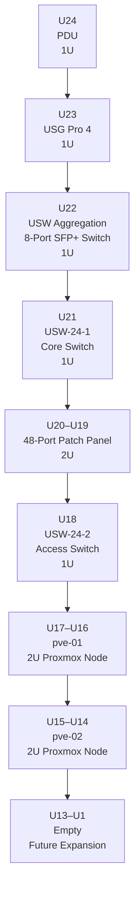
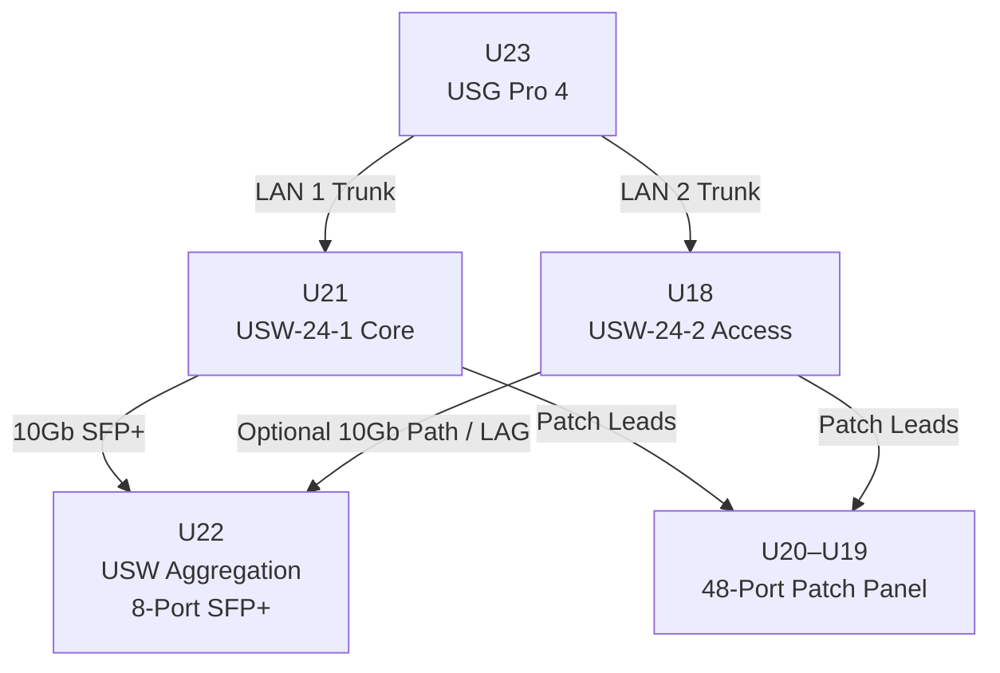
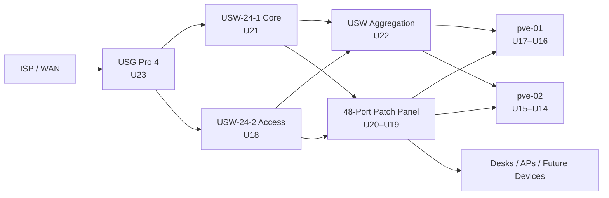

# 24U Rack Diagram

This document describes the front-facing rack layout for the SinLess Games infrastructure rack.

The rack is documented from **top to bottom**, with **U24 at the top** and **U1 at the bottom**.

---

## Rack Summary

| Item | Value |
|---|---|
| Rack Size | 24U |
| View | Front |
| Top Unit | U24 |
| Bottom Unit | U1 |
| Primary Network Gateway | USG Pro 4 |
| Core Switching | USW-24-1 |
| Access Switching | USW-24-2 |
| 10Gb Aggregation | USW Aggregation 8-Port SFP+ |
| Patch Panel | 48-Port Patch Panel |
| Rack-Mounted Compute | 2U Proxmox nodes |
| Reserved Capacity | U1–U13 |

---

## Front Rack Diagram

```text
24U Rack — Front View
U24 at top, U1 at bottom

┌──────────────────────────────────────────────┐
│ U24 │ PDU                                    │
├─────┼────────────────────────────────────────┤
│ U23 │ USG Pro 4                              │
├─────┼────────────────────────────────────────┤
│ U22 │ USW Aggregation 8-Port SFP+ Switch     │
├─────┼────────────────────────────────────────┤
│ U21 │ USW-24-1 Core Switch                   │
├─────┼────────────────────────────────────────┤
│ U20 │ 48-Port Patch Panel                    │
├─────┤                                        │
│ U19 │ 48-Port Patch Panel                    │
├─────┼────────────────────────────────────────┤
│ U18 │ USW-24-2 Access Switch                 │
├─────┼────────────────────────────────────────┤
│ U17 │ Proxmox Node                           │
├─────┤ pve-01 / 2U Server                     │
│ U16 │                                        │
├─────┼────────────────────────────────────────┤
│ U15 │ Proxmox Node                           │
├─────┤ pve-02 / 2U Server                     │
│ U14 │                                        │
├─────┼────────────────────────────────────────┤
│ U13 │ Empty / Future Expansion               │
├─────┼────────────────────────────────────────┤
│ U12 │ Empty / Future Expansion               │
├─────┼────────────────────────────────────────┤
│ U11 │ Empty / Future Expansion               │
├─────┼────────────────────────────────────────┤
│ U10 │ Empty / Future Expansion               │
├─────┼────────────────────────────────────────┤
│ U9  │ Empty / Future Expansion               │
├─────┼────────────────────────────────────────┤
│ U8  │ Empty / Future Expansion               │
├─────┼────────────────────────────────────────┤
│ U7  │ Empty / Future Expansion               │
├─────┼────────────────────────────────────────┤
│ U6  │ Empty / Future Expansion               │
├─────┼────────────────────────────────────────┤
│ U5  │ Empty / Future Expansion               │
├─────┼────────────────────────────────────────┤
│ U4  │ Empty / Future Expansion               │
├─────┼────────────────────────────────────────┤
│ U3  │ Empty / Future Expansion               │
├─────┼────────────────────────────────────────┤
│ U2  │ Empty / Future Expansion               │
├─────┼────────────────────────────────────────┤
│ U1  │ Empty / Future Expansion               │
└─────┴────────────────────────────────────────┘
```

---

## Mermaid Rack View



---

## Rack Unit Allocation

| Rack Unit | Installed Equipment | Height | Role |
|---:|---|---:|---|
| U24 | PDU | 1U | Rack power distribution |
| U23 | USG Pro 4 | 1U | WAN gateway, firewall, inter-VLAN routing |
| U22 | USW Aggregation 8-Port SFP+ Switch | 1U | 10Gb aggregation for Proxmox and switch uplinks |
| U21 | USW-24-1 Core Switch | 1U | Core server and infrastructure switching |
| U20 | 48-Port Patch Panel | 1U of 2U | Patch panel upper half |
| U19 | 48-Port Patch Panel | 1U of 2U | Patch panel lower half |
| U18 | USW-24-2 Access Switch | 1U | Access ports, desks, APs, future endpoints |
| U17 | pve-01 | 1U of 2U | Proxmox compute node |
| U16 | pve-01 | 1U of 2U | Proxmox compute node |
| U15 | pve-02 | 1U of 2U | Proxmox compute node |
| U14 | pve-02 | 1U of 2U | Proxmox compute node |
| U13 | Empty | 1U | Future expansion |
| U12 | Empty | 1U | Future expansion |
| U11 | Empty | 1U | Future expansion |
| U10 | Empty | 1U | Future expansion |
| U9 | Empty | 1U | Future expansion |
| U8 | Empty | 1U | Future expansion |
| U7 | Empty | 1U | Future expansion |
| U6 | Empty | 1U | Future expansion |
| U5 | Empty | 1U | Future expansion |
| U4 | Empty | 1U | Future expansion |
| U3 | Empty | 1U | Future expansion |
| U2 | Empty | 1U | Future expansion |
| U1 | Empty | 1U | Future expansion |

---

## Network Device Placement



---

## Cabling Layout Intent

The rack places network equipment near the top to keep patching short and easy to trace.

| Area | Purpose |
|---|---|
| U24 | Keeps power distribution at the top of the rack |
| U23–U21 | Groups gateway, aggregation, and core switching together |
| U20–U19 | Places the patch panel directly below core switching |
| U18 | Keeps access switching close to patch panel ports |
| U17–U14 | Places compute below switching and patching |
| U13–U1 | Reserved for additional servers, storage, UPS, or future expansion |

---

## Cabling Flow



---

## Rack Design Notes

- The PDU is placed at the top of the rack for clean power routing.
- The USG Pro 4 is placed directly below the PDU for short WAN and LAN cable runs.
- The 10Gb aggregation switch is placed above the core switch to keep SFP+ uplinks short.
- The core switch is placed directly above the patch panel for clean patching.
- The patch panel occupies U20 and U19.
- The access switch is placed directly below the patch panel for endpoint patching.
- Proxmox nodes are placed below the network equipment.
- Empty rack units are reserved for future servers, storage, UPS equipment, shelves, or cable management.

---

## Current Rack Capacity

| Category | Used Rack Units |
|---|---:|
| Power | 1U |
| Routing / Firewall | 1U |
| Switching | 3U |
| Patch Panel | 2U |
| Compute | 4U |
| Total Used | 11U |
| Total Available | 24U |
| Remaining Empty | 13U |

---

## Expansion Plan

Reserved rack space from **U13 through U1** may be used for:

- Additional Proxmox nodes
- Storage servers
- UPS equipment
- Cable management
- Shelf-mounted mini PCs
- Out-of-band management hardware
- Future backup appliances
- Additional patch panels
- Dedicated security or monitoring appliances

---

## Validation Checklist

- [ ] PDU is installed at U24.
- [ ] USG Pro 4 is installed at U23.
- [ ] USW Aggregation switch is installed at U22.
- [ ] USW-24-1 core switch is installed at U21.
- [ ] 48-port patch panel is installed across U20–U19.
- [ ] USW-24-2 access switch is installed at U18.
- [ ] pve-01 is installed across U17–U16.
- [ ] pve-02 is installed across U15–U14.
- [ ] Patch cables are labeled on both ends.
- [ ] Power cables are routed separately from network cables where practical.
- [ ] SFP+ DAC or fiber cables are routed without sharp bends.
- [ ] Front airflow is not obstructed.
- [ ] Empty rack units are covered with blanks where airflow management requires it.

---

## Related Documents

- `Docs/Network/Port-Map.md`
- `Docs/Network/Layer_2-3_diagram.md`
- `Docs/Architecture/ACME-Architecture.md`
- `Docs/Architecture/DECISIONS.md`

---

## Maintenance

Update this document when any of the following change:

- Rack unit placement
- Installed network equipment
- Installed Proxmox nodes
- Patch panel layout
- Switch placement
- Power distribution
- Cable routing
- Rack expansion plans

**Last Updated**: April 25, 2026  
**Maintained By**: Infrastructure repository documentation and network automation