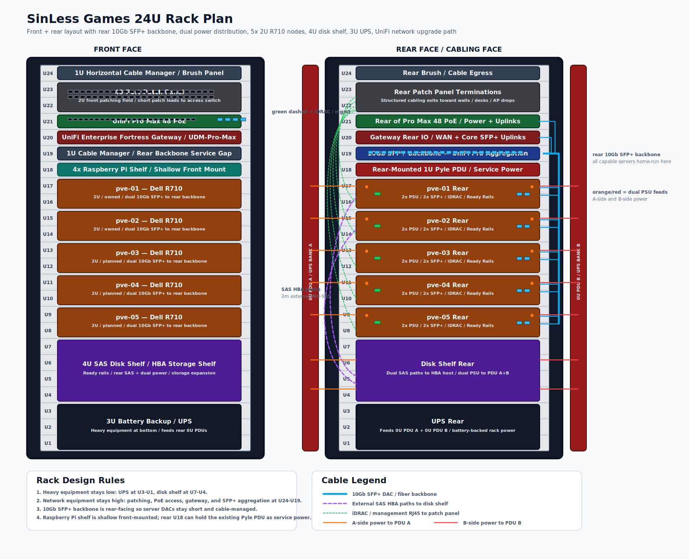
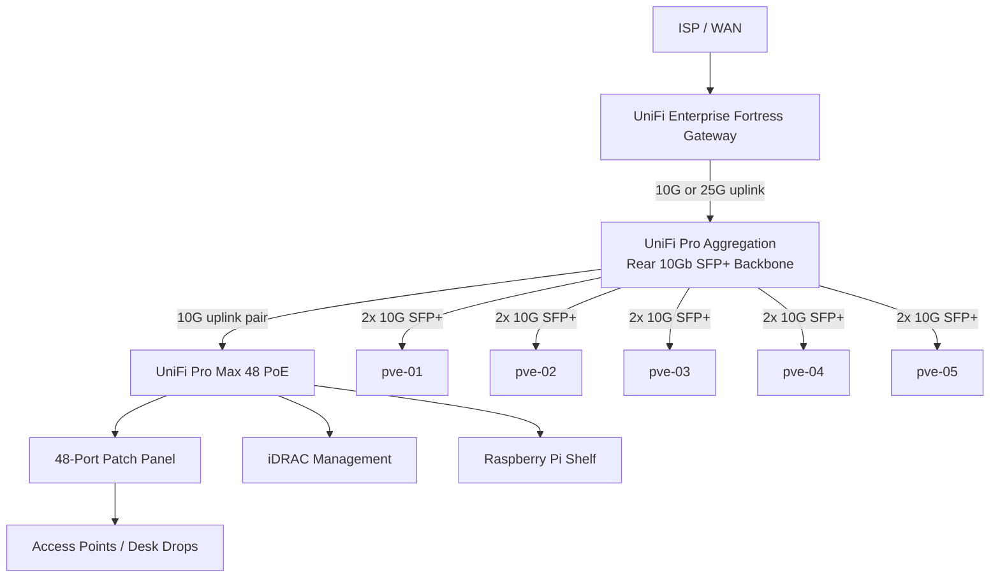
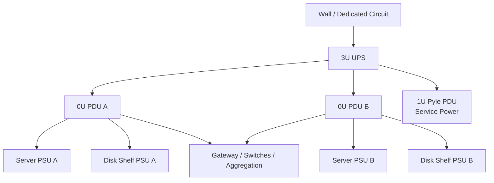

# Rack Plan

This document defines the professional rack plan, network backbone, power distribution, cabling model, server expansion plan, and shopping list for the SinLess Games infrastructure rack.

The rack is designed around a rear-facing **10Gb SFP+ backbone** so every server and storage-capable system that can connect to 10Gb will connect directly to the aggregation layer.

---

## Rack Plan Diagram



---

## Design Goals

1. Use the rack like a small data center rack, not a random equipment stack.
2. Keep heavy equipment low in the rack.
3. Keep patching and access switching high in the rack.
4. Put the **10Gb SFP+ backbone on the rear side** where the server NICs, HBAs, and power cabling live.
5. Replace the older gateway and switching layout with a cleaner UniFi design.
6. Support five Dell R710 Proxmox nodes.
7. Support a 4U disk shelf on rails.
8. Support a 3U UPS at the bottom of the rack.
9. Add proper rear power distribution.
10. Keep the existing 1U Pyle PDU as service power only unless replaced.
11. Reserve clean cable paths for:
    - SFP+ DAC / fiber
    - RJ45 management
    - SAS HBA cabling
    - A-side and B-side power

---

## Target Rack Inventory

| Item | Count | Rack Units | Notes |
|---|---:|---:|---|
| PDU / service power | 1 | 1U | Existing Pyle PDU, rear-mounted if possible |
| UPS / battery backup | 1 | 3U | Heavy unit mounted at bottom |
| Disk shelf / HBA shelf | 1 | 4U | Mounted above UPS |
| Dell R710 servers | 5 | 10U | 5 × 2U servers |
| Raspberry Pi shelf | 1 | 1U | Shallow shelf, front-mounted |
| Cable manager / brush panel | 2 | 2U | Front and rear cable control |
| 48-port patch panel | 1 | 2U | Front structured cabling |
| UniFi 48-port PoE switch | 1 | 1U | Replaces 2 × 24-port switches |
| UniFi gateway | 1 | 1U | Replaces USG Pro 4 |
| UniFi SFP+ aggregation switch | 1 | 1U | Rear 10Gb backbone |
| Existing UniFi 8-port SFP+ aggregation switch | 1 | 1U optional | Keep as lab/storage leaf/spare |
| Rear 0U PDUs | 2 | 0U | Preferred A/B rack power distribution |

---

## Current Equipment

| Equipment | Status | Plan |
|---|---|---|
| 2 × Dell R710 | Owned | Keep and upgrade |
| 3 × Dell R710 | Needed | Add to reach five total nodes |
| 2 × 24-port UniFi switches | Owned | Replace with one 48-port PoE switch; keep as spare/lab |
| 48-port patch panel | Owned/planned | Keep |
| UniFi 8-port SFP+ aggregation switch | Owned | Keep as secondary aggregation/spare |
| USG Pro 4 | Owned | Replace |
| 1U Pyle PDU | Owned | Keep as service/non-critical rear PDU if useful |
| 3U UPS | Needed | Add |
| 4U disk shelf / HBA shelf | Needed | Add |
| Raspberry Pi shelf | Needed/planned | Add shallow 1U shelf |

---

## Recommended Rack Unit Layout

The rack is planned from **U24 at the top** to **U1 at the bottom**.

| Rack Unit | Front Face | Rear Face | Purpose |
|---:|---|---|---|
| U24 | 1U cable manager / brush panel | Rear cable egress | Keeps patch and uplink cabling controlled |
| U23 | 48-port patch panel | Rear patch terminations | Structured copper cabling |
| U22 | 48-port patch panel | Rear patch terminations | Structured copper cabling |
| U21 | UniFi Pro Max 48 PoE | Rear power/uplink side | Main RJ45 access switch |
| U20 | UniFi Enterprise Fortress Gateway | Gateway rear I/O | USG Pro 4 replacement |
| U19 | 1U front cable manager | Rear-mounted UniFi Pro Aggregation | Rear 10Gb SFP+ backbone |
| U18 | 4 × Raspberry Pi shelf | Existing 1U Pyle PDU / service power | Shallow front shelf leaves rear usable |
| U17 | pve-01 Dell R710 | pve-01 rear I/O | Proxmox node |
| U16 | pve-01 Dell R710 | pve-01 rear I/O | Proxmox node |
| U15 | pve-02 Dell R710 | pve-02 rear I/O | Proxmox node |
| U14 | pve-02 Dell R710 | pve-02 rear I/O | Proxmox node |
| U13 | pve-03 Dell R710 | pve-03 rear I/O | Proxmox node |
| U12 | pve-03 Dell R710 | pve-03 rear I/O | Proxmox node |
| U11 | pve-04 Dell R710 | pve-04 rear I/O | Proxmox node |
| U10 | pve-04 Dell R710 | pve-04 rear I/O | Proxmox node |
| U9 | pve-05 Dell R710 | pve-05 rear I/O | Proxmox node |
| U8 | pve-05 Dell R710 | pve-05 rear I/O | Proxmox node |
| U7 | 4U disk shelf | Disk shelf rear I/O | Storage shelf |
| U6 | 4U disk shelf | Disk shelf rear I/O | Storage shelf |
| U5 | 4U disk shelf | Disk shelf rear I/O | Storage shelf |
| U4 | 4U disk shelf | Disk shelf rear I/O | Storage shelf |
| U3 | 3U UPS | UPS rear power | Battery backup |
| U2 | 3U UPS | UPS rear power | Battery backup |
| U1 | 3U UPS | UPS rear power | Battery backup |

---

## Rack Layout Rationale

### Top of Rack

The top of the rack is used for patching, routing, switching, and cable management.

This keeps copper patch leads short and makes network changes easier without reaching through server cabling.

### Middle of Rack

The middle of the rack is used for compute.

The five Dell R710 servers are stacked together so their rear SFP+, iDRAC, SAS, and power cabling can be routed cleanly to the rear aggregation and power columns.

### Bottom of Rack

The bottom of the rack is used for heavy equipment.

The UPS and disk shelf stay low because they are the heaviest components and should not be mounted high in the rack.

---

## Network Architecture

### Target Network Equipment

| Role | Recommended Device | Notes |
|---|---|---|
| Gateway | UniFi Enterprise Fortress Gateway | Replaces USG Pro 4 |
| Access switch | UniFi Pro Max 48 PoE | Replaces 2 × 24-port UniFi switches |
| 10Gb aggregation | UniFi Pro Aggregation | Main rear SFP+ backbone |
| Secondary aggregation | Existing UniFi 8-port SFP+ Aggregation | Keep as spare, lab leaf, or storage leaf |
| Patch field | 48-port patch panel | Structured copper patching |
| Power monitoring | UniFi PDU Pro or equivalent 0U PDUs | A/B power columns |

### Network Flow



---

## VLAN Model

VLAN 60 has been removed from the active design.

| VLAN ID | Name | Subnet | Purpose |
|---:|---|---|---|
| 1 | Infrastructure | `10.10.10.0/24` | Proxmox management, iDRAC, switches, gateway, rack infrastructure |
| 20 | Development | `10.10.20.0/24` | Development workloads |
| 30 | Testing | `10.10.30.0/24` | Testing and staging workloads |
| 40 | Production | `10.10.40.0/24` | Production workloads |
| 50 | DMZ | `10.10.50.0/24` | Edge, tunnel, bastion, and exposed services |

---

## Rear 10Gb SFP+ Backbone

The rear SFP+ aggregation switch is the backbone for the rack.

Every server receives:

- 2 × 10Gb SFP+ connections
- One primary 10Gb path
- One secondary 10Gb path
- Optional LACP bond or active-backup bond depending on Proxmox design

### Server 10Gb Port Plan

| Server | NIC Required | Port 1 | Port 2 | Switch |
|---|---|---|---|---|
| pve-01 | Dual-port 10Gb SFP+ PCIe NIC | `sfp1` | `sfp2` | UniFi Pro Aggregation |
| pve-02 | Dual-port 10Gb SFP+ PCIe NIC | `sfp1` | `sfp2` | UniFi Pro Aggregation |
| pve-03 | Dual-port 10Gb SFP+ PCIe NIC | `sfp1` | `sfp2` | UniFi Pro Aggregation |
| pve-04 | Dual-port 10Gb SFP+ PCIe NIC | `sfp1` | `sfp2` | UniFi Pro Aggregation |
| pve-05 | Dual-port 10Gb SFP+ PCIe NIC | `sfp1` | `sfp2` | UniFi Pro Aggregation |

### Recommended Bonding Model

Use one of the following:

| Bond Mode | Recommendation | Notes |
|---|---|---|
| LACP / 802.3ad | Preferred when switch config is stable | Higher aggregate bandwidth, requires switch-side LAG |
| active-backup | Safer during early buildout | Simpler failover, no switch LAG required |
| balance-xor | Acceptable for static LAG | Less flexible than LACP |
| balance-rr | Avoid unless lab-only | Can cause out-of-order packets |

Recommended starting point:

```text
Proxmox bond0:
  slaves: dual 10Gb SFP+ ports
  mode: active-backup during initial deployment
  final mode: 802.3ad after validation
```

---

## Dell R710 Server Upgrade Plan

### Per-Server Target

| Component | Target |
|---|---|
| Server model | Dell PowerEdge R710 |
| CPU sockets | 2 |
| CPU target | 2 × Intel Xeon X5680 |
| Cores per server | 12 physical cores |
| Threads per server | 24 threads |
| RAM target | 288GB |
| DIMM layout | 18 × 16GB DDR3 ECC RDIMM |
| Network | 1 × dual-port 10Gb SFP+ PCIe NIC |
| Management | 1 × Dell iDRAC6 Enterprise card |
| Storage HBA | Optional per role |
| Rails | Dell ReadyRails |
| Power | Dual PSU, A/B power feed where possible |

### Five-Server Max CPU and RAM Count

This count assumes all five R710 servers are upgraded to the same maximum target.

| Resource | Per Server | Five-Server Total |
|---|---:|---:|
| CPU sockets | 2 | 10 |
| Intel Xeon X5680 CPUs | 2 | 10 |
| Physical CPU cores | 12 | 60 |
| CPU threads with Hyper-Threading | 24 | 120 |
| RAM DIMM slots | 18 | 90 |
| 16GB DDR3 ECC RDIMMs | 18 | 90 |
| RAM capacity | 288GB | 1,440GB |
| RAM capacity in TiB | ~0.281TiB | ~1.406TiB |

### CPU Shopping Count

| Item | Count Needed for Five Fully Upgraded Servers |
|---|---:|
| Intel Xeon X5680 CPUs | 10 |
| CPU thermal paste applications | 10 |
| Compatible CPU heatsinks | 10 total if missing; otherwise reuse installed heatsinks |
| CPU socket dust covers / blanks | Optional spares |

Power-balanced alternative:

| CPU | Count | Notes |
|---|---:|---|
| Intel Xeon X5670 | 10 | Lower TDP than X5680, still 6-core |
| Intel Xeon L5640 | 10 | Lower power, less performance |

Use **X5680** for the max-performance build.

Use **X5670** if power and heat become more important than peak CPU clock.

### RAM Shopping Count

| Item | Count Needed for Five Fully Maxed Servers |
|---|---:|
| 16GB DDR3 ECC Registered DIMMs | 90 |
| Matched 18-DIMM kits per server | 5 |
| Spare 16GB DDR3 ECC RDIMMs | 4–8 recommended |

Memory rules:

- Use matched DIMMs per server.
- Prefer identical DIMM speed, rank, voltage, and vendor per node.
- Expect memory speed to drop depending on DIMM population and rank.
- Update BIOS and firmware before final memory validation.
- Run full memory tests before putting a node into production.

---

## Required Network Cards

None of the servers should depend on onboard 1Gb ports for primary workload traffic.

Each R710 should receive a dual-port 10Gb SFP+ PCIe card.

### Recommended 10Gb NIC Options

| Option | Ports | Slot Type | Notes |
|---|---:|---|---|
| Intel X520-DA2 | 2 × 10Gb SFP+ | PCIe x8 | Best default choice; broadly supported |
| Intel X540-T2 | 2 × 10Gb RJ45 | PCIe x8 | Avoid for this rack backbone because the design is SFP+ |
| Mellanox ConnectX-3 EN | 2 × 10Gb SFP+ | PCIe x8 | Good Linux support; common used-market option |
| Chelsio T520-CR | 2 × 10Gb SFP+ | PCIe x8 | Strong FreeBSD/TrueNAS support; also works well on Linux |

Recommended standard:

```text
5 × Intel X520-DA2 dual-port 10Gb SFP+ PCIe NICs
```

### 10Gb NIC Count

| Server | NIC |
|---|---|
| pve-01 | 1 × dual-port 10Gb SFP+ NIC |
| pve-02 | 1 × dual-port 10Gb SFP+ NIC |
| pve-03 | 1 × dual-port 10Gb SFP+ NIC |
| pve-04 | 1 × dual-port 10Gb SFP+ NIC |
| pve-05 | 1 × dual-port 10Gb SFP+ NIC |

| Item | Total Count |
|---|---:|
| Dual-port 10Gb SFP+ PCIe NICs | 5 |
| 10Gb SFP+ ports provided | 10 |
| 10Gb SFP+ DAC cables required | 10 |

---

## Required iDRAC Cards

The servers do not currently have iDRAC cards installed.

Each R710 should receive an **iDRAC6 Enterprise** card so the management network can use a dedicated physical management port.

### iDRAC Target

| Server | Required iDRAC Hardware |
|---|---|
| pve-01 | Dell iDRAC6 Enterprise card |
| pve-02 | Dell iDRAC6 Enterprise card |
| pve-03 | Dell iDRAC6 Enterprise card |
| pve-04 | Dell iDRAC6 Enterprise card |
| pve-05 | Dell iDRAC6 Enterprise card |

### iDRAC Shopping Count

| Item | Count |
|---|---:|
| Dell iDRAC6 Enterprise cards for R710 | 5 |
| iDRAC6 Enterprise dedicated NIC modules/ports if sold separately | 5 |
| iDRAC6 vFlash SD modules | Optional 5 |
| Cat6A iDRAC patch cables | 5 |
| Static IP reservations in VLAN 1 | 5 |

### iDRAC IP Plan

| Server | iDRAC Hostname | Suggested IP |
|---|---|---|
| pve-01 | `idrac-pve-01` | `10.10.10.31` |
| pve-02 | `idrac-pve-02` | `10.10.10.32` |
| pve-03 | `idrac-pve-03` | `10.10.10.33` |
| pve-04 | `idrac-pve-04` | `10.10.10.34` |
| pve-05 | `idrac-pve-05` | `10.10.10.35` |

iDRAC ports should be assigned to:

```text
VLAN 1 — Infrastructure
```

---

## Storage and HBA Plan

The disk shelf should be treated as a storage appliance path, not as normal Ethernet storage.

### Recommended Storage Attachment Model

Use one primary storage host first.

Recommended starting layout:

| Role | Server |
|---|---|
| Primary disk shelf HBA host | pve-01 |
| Optional secondary HBA host | pve-02 |
| Disk shelf | 4U shelf at U7–U4 |

Important rule:

```text
Do not connect one raw SAS disk shelf to multiple active hosts unless the shelf, HBA layout,
multipath design, and filesystem are explicitly designed for shared-disk access.
```

For a safe first deployment:

```text
Disk shelf -> external SAS HBA -> one storage host
```

Then expose storage upward using one of:

- NFS
- iSCSI
- SMB
- ZFS datasets
- Proxmox storage integration
- Backup target
- Object storage service if layered above local storage

### Recommended HBA Options

| HBA | Ports | Connector | Notes |
|---|---:|---|---|
| LSI 9207-8e | 2 external SAS ports | SFF-8088 | Good SAS2 option |
| LSI 9300-8e | 2 external SAS ports | SFF-8644 | Better SAS3 option |
| LSI 9305-16e | 4 external SAS ports | SFF-8644 | Higher-end SAS3 option |

Recommended standard:

```text
1 × LSI 9300-8e for primary disk shelf host
1 × spare or secondary LSI 9300-8e if multipath/failover is desired later
```

### HBA Shopping Count

| Item | Minimum | Recommended |
|---|---:|---:|
| External SAS HBA | 1 | 2 |
| External SAS cables | 2 | 4 |
| Spare external SAS cable | 1 | 2 |
| Disk shelf rails | 1 set | 1 set |
| Disk shelf power cords | 2 | 2 |

---

## Power Design

The existing 1U Pyle PDU is nearly full, so it should not be the main rack power plan.

### Recommended Power Layout

| Power Role | Device |
|---|---|
| Battery backup | 3U UPS |
| Primary distribution | Rear 0U PDU A |
| Secondary distribution | Rear 0U PDU B |
| Service / temporary power | Existing 1U Pyle PDU |
| Future redundancy | Second UPS if desired later |

### Power Feed Model



### Power Rules

- Use A/B power where a device has redundant PSUs.
- Keep network devices on UPS-backed power.
- Keep the existing Pyle PDU for service/non-critical power.
- Label both ends of every power cable.
- Do not bundle power and data tightly together.
- Route power vertically along rear rack sides.
- Route data through cable managers and rear lacing bars.

---

## Cabling Plan

### SFP+ Backbone Cabling

| Connection | Quantity | Recommended Length |
|---|---:|---:|
| pve-01 dual 10Gb to aggregation | 2 | 2m |
| pve-02 dual 10Gb to aggregation | 2 | 2m |
| pve-03 dual 10Gb to aggregation | 2 | 2m |
| pve-04 dual 10Gb to aggregation | 2 | 2m |
| pve-05 dual 10Gb to aggregation | 2 | 2m |
| Gateway to aggregation | 2 | 1m |
| 48-port PoE switch to aggregation | 2 | 1m |
| Existing 8-port SFP+ aggregation uplink | 1–2 | 1m |

### RJ45 Cabling

| Connection | Quantity | Recommended Length |
|---|---:|---:|
| Patch panel to 48-port switch | 48 | 6in–1ft |
| iDRAC to switch/patch panel | 5 | 3ft–6ft |
| Raspberry Pi shelf to switch | 4 | 1ft–3ft |
| Gateway LAN/WAN copper if needed | 2 | 3ft–6ft |
| AP / desk / future patching | As needed | 3ft–10ft |

### SAS Cabling

| Connection | Quantity | Recommended Length |
|---|---:|---:|
| HBA host to disk shelf controller A | 1 | 2m |
| HBA host to disk shelf controller B | 1 | 2m |
| Optional secondary HBA host to disk shelf | 2 | 2m |
| Spare SAS cables | 1–2 | 2m |

### Power Cabling

| Connection | Quantity | Recommended Length |
|---|---:|---:|
| R710 PSU A to PDU A | 5 | 6ft |
| R710 PSU B to PDU B | 5 | 6ft |
| Disk shelf PSU A to PDU A | 1 | 6ft |
| Disk shelf PSU B to PDU B | 1 | 6ft |
| Gateway to PDU | 1–2 | 3ft |
| 48-port switch to PDU | 1 | 3ft |
| Pro Aggregation to PDU | 1 | 3ft |
| 8-port aggregation to PDU | 1 | 3ft |
| Raspberry Pi shelf power | 1 | 3ft–6ft |
| UPS to PDU A | 1 | Match UPS/PDU |
| UPS to PDU B | 1 | Match UPS/PDU |

---

## Shopping List

### Servers and Rails

| Priority | Qty | Item | Notes |
|---|---:|---|---|
| Required | 3 | Dell PowerEdge R710 2U servers | You already have 2; this brings the rack to 5 total |
| Required | 5 sets | Dell R710 ReadyRails | Buy only the number you do not already have |
| Recommended | 5 | Cable-management arms for R710 | Useful because servers are on rails |
| Optional | 5 | Front bezels | Cosmetic and airflow/security benefit |
| Required | 5 | Dual PSU configuration | Verify each server has both PSUs |

### CPU and RAM

| Priority | Qty | Item | Notes |
|---|---:|---|---|
| Required for max CPU | 10 | Intel Xeon X5680 CPUs | 2 per server |
| Required for max RAM | 90 | 16GB DDR3 ECC Registered DIMMs | 18 per server |
| Recommended | 4–8 | Spare 16GB DDR3 ECC Registered DIMMs | Useful for failures |
| Required | 10 | Thermal paste applications | One per CPU install |
| Optional | 10 | Replacement heatsinks | Only needed if missing or damaged |

### Server Network Cards

| Priority | Qty | Item | Notes |
|---|---:|---|---|
| Required | 5 | Intel X520-DA2 dual-port 10Gb SFP+ PCIe NIC | Preferred standard |
| Alternative | 5 | Mellanox ConnectX-3 EN dual-port 10Gb SFP+ NIC | Good Linux option |
| Optional | 1 | Spare dual-port 10Gb SFP+ NIC | Recommended |

### iDRAC Cards

| Priority | Qty | Item | Notes |
|---|---:|---|---|
| Required | 5 | Dell iDRAC6 Enterprise cards for R710 | Required for dedicated iDRAC NIC |
| Required if separate | 5 | Dedicated iDRAC6 port/module hardware | Some listings separate the parts |
| Optional | 5 | iDRAC6 vFlash SD module/card | Optional remote media enhancement |
| Required | 5 | Cat6A patch cables for iDRAC | 3ft–6ft |

### Storage

| Priority | Qty | Item | Notes |
|---|---:|---|---|
| Required | 1 | 4U SAS disk shelf / JBOD | Match connector type before buying cables |
| Required | 1 set | Disk shelf rails | Ready rail / shelf rail kit |
| Required | 1 | LSI 9300-8e external SAS HBA | Primary storage host |
| Recommended | 1 | Spare or secondary LSI 9300-8e | For failover/spare/multipath planning |
| Required | 2 | External SAS cables | Match HBA and disk shelf |
| Recommended | 2 | Additional external SAS cables | For secondary path or spares |
| Required | 2 | Disk shelf power cables | One per PSU |

### UniFi Network Upgrade

| Priority | Qty | Item | Notes |
|---|---:|---|---|
| Required | 1 | UniFi Enterprise Fortress Gateway | USG Pro 4 replacement |
| Required | 1 | UniFi Pro Max 48 PoE | Replaces 2 × 24-port switches |
| Required | 1 | UniFi Pro Aggregation | Main rear 10Gb SFP+ backbone |
| Existing | 1 | UniFi 8-port SFP+ Aggregation | Keep as secondary/spare/lab leaf |
| Optional | 1 | UniFi RPS / DC backup where supported | For switch/gateway power resilience |
| Optional | 1 | UniFi Cloud Key / controller host | Only if not already running controller elsewhere |

### Power

| Priority | Qty | Item | Notes |
|---|---:|---|---|
| Required | 1 | 3U rackmount UPS | Size after measuring expected load |
| Required | 2 | Rear 0U PDUs | A/B power distribution |
| Existing | 1 | 1U Pyle PDU | Keep as service power or replace |
| Recommended | 1 | UPS network management card | Monitoring and graceful shutdown |
| Recommended | 1 | Environmental temperature probe | Rack monitoring |
| Required | 14+ | C13/C14 or compatible power cables | Match PSU/PDU connector type |
| Required | 1 set | Power labels | Mark A-side and B-side power |

### Network Cables

| Priority | Qty | Item | Length |
|---|---:|---|---:|
| Required | 10 | 10Gb SFP+ DAC cables for servers | 2m |
| Required | 2 | 10Gb or 25Gb DAC cables for gateway uplink | 1m |
| Required | 2 | 10Gb SFP+ DAC cables for 48-port switch uplinks | 1m |
| Optional | 2 | 10Gb SFP+ DAC cables for existing 8-port aggregation uplink | 1m |
| Required | 48 | Slim Cat6/Cat6A patch cables | 6in–1ft |
| Required | 5 | Cat6A iDRAC cables | 3ft–6ft |
| Required | 4 | Cat6A Raspberry Pi cables | 1ft–3ft |
| Recommended | 12 | Spare Cat6A patch cables | 3ft–10ft |

### Cable Management

| Priority | Qty | Item | Notes |
|---|---:|---|---|
| Required | 2 | 1U horizontal cable managers / brush panels | Front and rear cable control |
| Required | 2–4 | Rear lacing bars | SFP+, SAS, and power strain relief |
| Required | 1 roll | Velcro cable tie roll | Use instead of zip ties |
| Required | 1 | Label maker tape set | Label both ends |
| Recommended | 1 set | Color-coded cable labels | Blue mgmt, teal SFP+, purple SAS, orange/red power |
| Recommended | 1 set | Rack blank panels | Airflow control |

---

## Purchase Summary

### Minimum Required to Complete Target Rack

| Category | Count |
|---|---:|
| Additional R710 servers | 3 |
| R710 ReadyRails total target | 5 sets |
| Dell iDRAC6 Enterprise cards | 5 |
| Dual-port 10Gb SFP+ NICs | 5 |
| Intel Xeon X5680 CPUs | 10 |
| 16GB DDR3 ECC RDIMMs | 90 |
| 4U disk shelf | 1 |
| External SAS HBA | 1 |
| 3U UPS | 1 |
| Rear 0U PDUs | 2 |
| UniFi Enterprise Fortress Gateway | 1 |
| UniFi Pro Max 48 PoE | 1 |
| UniFi Pro Aggregation | 1 |
| 10Gb SFP+ DAC cables | 14–16 |
| Cat6/Cat6A patch cables | 60+ |
| C13/C14 power cables | 14+ |

---

## Implementation Phases

### Phase 1 — Physical Rack Prep

1. Install UPS at U3–U1.
2. Install disk shelf at U7–U4.
3. Install R710 servers at U17–U8.
4. Install front patch panel at U23–U22.
5. Install access switch at U21.
6. Install gateway at U20.
7. Install rear SFP+ aggregation at U19.
8. Install Raspberry Pi shelf at U18 front.
9. Install Pyle PDU or service PDU at U18 rear if depth allows.
10. Install rear 0U PDUs.

### Phase 2 — Server Hardware

1. Install CPUs.
2. Install RAM.
3. Install 10Gb SFP+ NICs.
4. Install iDRAC6 Enterprise cards.
5. Install HBA in the selected storage host.
6. Update BIOS, lifecycle firmware, iDRAC firmware, NIC firmware, and HBA firmware.
7. Run memory tests.
8. Validate CPU thermals.

### Phase 3 — Network

1. Configure UniFi Enterprise Fortress Gateway.
2. Configure UniFi Pro Max 48 PoE.
3. Configure UniFi Pro Aggregation.
4. Create VLANs:
   - VLAN 1 Infrastructure
   - VLAN 20 Development
   - VLAN 30 Testing
   - VLAN 40 Production
   - VLAN 50 DMZ
5. Configure Proxmox trunk profiles.
6. Configure iDRAC access ports.
7. Configure switch uplinks.
8. Validate 10Gb links.
9. Enable LACP only after basic connectivity is proven.

### Phase 4 — Storage

1. Install disk shelf.
2. Connect SAS cables to primary HBA host.
3. Validate shelf visibility.
4. Confirm disk inventory.
5. Configure storage layer.
6. Add monitoring.
7. Add backup/export services.

### Phase 5 — Power and Monitoring

1. Connect UPS.
2. Connect PDU A and PDU B.
3. Split redundant PSUs across PDU A/B.
4. Connect network devices to UPS-backed power.
5. Enable UPS monitoring.
6. Configure graceful shutdown.
7. Add rack temperature monitoring.
8. Label all power feeds.

---

## Validation Checklist

### Rack

- [ ] UPS installed at the bottom.
- [ ] Disk shelf installed above UPS.
- [ ] All servers installed on rails.
- [ ] Cable managers installed.
- [ ] Patch panel installed.
- [ ] Rear SFP+ backbone installed.
- [ ] Rear PDUs installed.
- [ ] Airflow is front-to-back.
- [ ] Heavy equipment is not mounted high.

### Server

- [ ] All five servers have two CPUs.
- [ ] All five servers have 288GB RAM if fully maxed.
- [ ] All five servers have dual-port 10Gb SFP+ NICs.
- [ ] All five servers have iDRAC6 Enterprise cards.
- [ ] iDRAC dedicated NIC mode is configured.
- [ ] BIOS and firmware are updated.
- [ ] Memory test passes.
- [ ] CPU stress test passes.
- [ ] Fans and thermals are acceptable.

### Network

- [ ] Gateway uplink is online.
- [ ] Access switch uplink is online.
- [ ] Pro Aggregation uplinks are online.
- [ ] Each server has two 10Gb links.
- [ ] iDRAC ports are reachable on VLAN 1.
- [ ] VLAN 60 is not configured.
- [ ] VLAN trunking works for Proxmox.
- [ ] Firewall rules are enforced between VLANs.

### Storage

- [ ] Disk shelf powers on cleanly.
- [ ] HBA detects shelf controllers.
- [ ] Host sees expected disks.
- [ ] No unexpected disk errors.
- [ ] Storage monitoring is active.
- [ ] Backup/export path is documented.

### Power

- [ ] PDU A and PDU B are labeled.
- [ ] Server PSU A feeds PDU A.
- [ ] Server PSU B feeds PDU B.
- [ ] Disk shelf PSUs are split across PDUs.
- [ ] UPS load is within safe range.
- [ ] UPS runtime is documented.
- [ ] Graceful shutdown is tested.
- [ ] Power cables are labeled at both ends.

---

## Final Target State

The final rack should provide:

- 5 × Dell R710 Proxmox servers
- 60 physical CPU cores
- 120 CPU threads
- 1.44TB total RAM
- 10 × 10Gb SFP+ server links
- Rear 10Gb SFP+ aggregation backbone
- Dedicated iDRAC management for every server
- 4U disk shelf with external SAS HBA connectivity
- UPS-backed rack power
- A/B rear power distribution
- Clean patch panel and PoE access switching
- UniFi gateway, switching, and aggregation stack
- Removed VLAN 60 dependency
- Professional front and rear cable separation

---

## Related Documents

- `Docs/Network/Rack-Plan-Diagram.svg`
- `Docs/Network/Rack-Diagram.md`
- `Docs/Network/Port-Map.md`
- `Docs/Network/Layer_2-3_diagram.md`
- `Docs/Architecture/ACME-Architecture.md`
- `Docs/Architecture/DECISIONS.md`

---

## Maintenance

Update this document when any of the following change:

- Rack unit layout
- Server count
- Server hardware
- Network backbone design
- UniFi gateway or switch model
- Disk shelf model
- HBA model
- UPS or PDU model
- Cable lengths
- VLAN design
- Power distribution design

**Last Updated**: April 25, 2026  
**Maintained By**: Infrastructure repository documentation and network automation