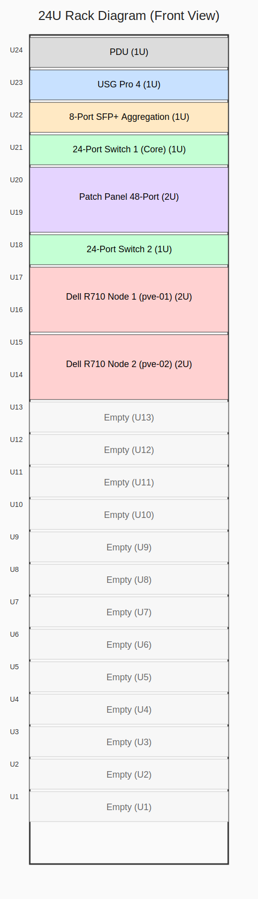

# SinLess Games Infrastructure Docs

Welcome to the **SinLess Games Infrastructure** documentation site.

This site documents the architecture, operational model, platform decisions, network layout, Kubernetes strategy, automation workflows, and supporting resources for the Infrastructure repository.

!!! tip "Start here"
    New to this repository or rebuilding the environment? Begin with the [Start Here](Start-Here/Readme.md) section.

---

## Documentation Map

```mermaid
flowchart LR
  A[Start Here] --> B[Architecture]
  B --> C[Architecture Decision Records]
  B --> D[Network]
  B --> E[Kubernetes Platform]
  E --> F[Operations]
  E --> G[Security Resources]
  G --> H[Incident Response]
  G --> I[Supply Chain Security]
  G --> J[Threat Modeling]
  A --> K[Agentic Workflows]
````

---

## Quick Navigation

<div class="grid cards" markdown>

* :material-rocket-launch: **Start Here**

  Get oriented, initialize the environment, and follow the infrastructure build path.

  [:octicons-arrow-right-24: Open Start Here](Start-Here/Readme.md)

* :material-office-building-cog: **Architecture**

  Review the high-level infrastructure architecture, ACME flow, and platform design decisions.

  [:octicons-arrow-right-24: Open Architecture](Architecture/ARCHITECTURE.md)

* :material-file-document-check: **Architecture Decisions**

  Read the documented ADRs that explain why key infrastructure choices were made.

  [:octicons-arrow-right-24: Open Decisions](Architecture/DECISIONS.md)

* :material-lan: **Network**

  Review network diagrams, rack layout, layer 2/3 design, and port mapping.

  [:octicons-arrow-right-24: Open Network Diagram](Network/Layer_2-3_diagram.md)

* :material-kubernetes: **Kubernetes Resources**

  Review Kubernetes concepts, platform references, and infrastructure notes.

  [:octicons-arrow-right-24: Open Kubernetes Resources](Resources/Kubernetes.md)

* :material-shield-lock: **Security Resources**

  Review DevSecOps, compliance, threat modeling, and supply chain security material.

  [:octicons-arrow-right-24: Open DevSecOps](Resources/dev-sec-ops.md)

* :material-alert-decagram: **Incident Response**

  Review incident response concepts, operational readiness, and response planning.

  [:octicons-arrow-right-24: Open Incident Response](Resources/Incident-Response.md)

* :material-robot: **Agentic Workflows**

  Review repository automation, triage, routing, security, docs drift, and safe autofix workflows.

  [:octicons-arrow-right-24: Open Agentic Workflows](Resources/Agentic%20Workflows/repo-ops-orchestrator.md)

</div>

---

## Core Sections

| Section                                                | Purpose                                                                                   |
| ------------------------------------------------------ | ----------------------------------------------------------------------------------------- |
| [Start Here](Start-Here/Readme.md)                     | Entry point for setup, initialization, and infrastructure build steps.                    |
| [Architecture](Architecture/ARCHITECTURE.md)           | High-level architecture and system design documentation.                                  |
| [ACME Architecture](Architecture/ACME-Architecture.md) | ACME, certificate, and related platform design details.                                   |
| [Decisions](Architecture/DECISIONS.md)                 | Architecture decision summary and ADR index.                                              |
| [Network](Network/Layer_2-3_diagram.md)                | Network layout, rack diagram, and port mapping.                                           |
| [Resources](Resources/Kubernetes.md)                   | Reference material for Kubernetes, cloud platforms, security, compliance, and operations. |

---

## Repository Build Flow

The documentation site is built with **MkDocs Material**, compiled into static HTML, and served by an unprivileged Nginx container.

```mermaid
flowchart TD
  A[Markdown files in Docs/] --> B[MkDocs build]
  B --> C[Static site in /site]
  C --> D[Nginx unprivileged container]
  D --> E[docs.sinlessgames.com]
```

---

## Recommended Reading Path

1. [Start Here Overview](Start-Here/Readme.md)
2. [Getting Started](Start-Here/00-Getting-Started.md)
3. [Initialization and Setup](Start-Here/01-Initialization-and-Setup.md)
4. [Building the Infrastructure](Start-Here/02-Building-the-Infrastructure.md)
5. [Architecture Overview](Architecture/ARCHITECTURE.md)
6. [Architecture Decisions](Architecture/DECISIONS.md)
7. [Network Layer 2/3 Diagram](Network/Layer_2-3_diagram.md)
8. [Incident Response](Resources/Incident-Response.md)

---

## Network Snapshot

The rack diagram below is embedded directly from the documentation assets.

{ .skip-lightbox }

[:material-image-search: Open the full rack diagram page](Network/Rack-Diagram.md)

---

## Operational Focus Areas

!!! note "Platform goals"
This infrastructure documentation is intended to support repeatable deployment, secure operations, GitOps-driven change management, observability, and long-term maintainability.

### Key priorities

* **Repeatability** through documented setup and build steps.
* **Security** through threat modeling, DevSecOps practices, and supply chain controls.
* **Reliability** through incident response planning and operational documentation.
* **Traceability** through architecture decision records.
* **Automation** through agentic workflows and repository orchestration.
* **Clarity** through diagrams, tables, and structured documentation.

---

## Useful Resource Pages

<div class="grid cards" markdown>

* :material-cloud: **Cloud Platforms**

  Platform comparison and cloud infrastructure reference material.

  [:octicons-arrow-right-24: Open Cloud Platforms](Resources/cloud-platforms.md)

* :material-test-tube: **Chaos Engineering**

  Reliability testing, failure injection, and resilience concepts.

  [:octicons-arrow-right-24: Open Chaos Engineering](Resources/chaos-engineering.md)

* :material-scale-balance: **Compliance**

  Compliance reference material and governance concepts.

  [:octicons-arrow-right-24: Open Compliance](Resources/compliance.md)

* :material-package-variant-closed-check: **Supply Chain Security**

  Software supply chain risks, controls, and secure delivery practices.

  [:octicons-arrow-right-24: Open Supply Chain Security](Resources/Supply-Chain-Security.md)

* :material-target-account: **Threat Modeling**

  Threat modeling methodology and infrastructure security planning.

  [:octicons-arrow-right-24: Open Threat Modeling](Resources/Threat-Modeling.md)

* :material-view-dashboard: **Developer Portals**

  Developer portal concepts and platform documentation strategy.

  [:octicons-arrow-right-24: Open Developer Portals](Resources/Developer-Portals.md)

</div>

---

## Editing This Site

This documentation is source-controlled in the Infrastructure repository.

```bash
# Build the documentation locally
mkdocs build --clean --strict

# Serve the documentation locally
mkdocs serve
```

!!! warning "Strict builds are intentional"
The docs build should fail on broken links, invalid navigation entries, missing pages, or malformed configuration. Fixing those issues early keeps the published site reliable.

---

## Repository

[:fontawesome-brands-github: Sinless777/Infrastructure](https://github.com/Sinless777/Infrastructure)
