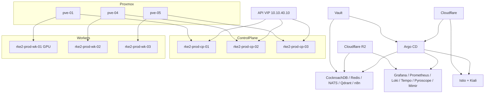

# RKE2 Production Platform

This production platform targets a three-node HA RKE2 control plane and three worker nodes distributed across `pve-01`, `pve-04`, and `pve-05`. Cilium provides the primary CNI and L3/L4 policy layer, Istio provides service identity and zero-trust traffic policy, Longhorn is the default block storage, and Argo CD is the GitOps control plane for all cluster applications.

## Architecture

## Namespace Mapping

- `kube-system`: Cilium, Longhorn, GPU runtime support, cluster-scoped runtime helpers.
- `istio-system`: Istio base, istiod, ingress gateway, mesh baseline policies.
- `networking`: cert-manager, ExternalDNS, cloudflared, edge issuers.
- `monitoring`: Prometheus stack, Grafana, Alloy, Beyla, Loki, Mimir, Tempo, Pyroscope, OpenTelemetry Operator, Kiali.
- `security`: External Secrets Operator, Kyverno, Falco, Velero, Wazuh scaffolding.
- `gitops`: Argo CD, Argo Rollouts, Actions Runner Controller.
- `helix-ai`: CockroachDB, Redis, NATS JetStream, Qdrant, n8n, Helix policies and mesh config.
- `sinless-games`: shared app edge services, Garage S3, quotas, policies, mesh defaults.

## Node Placement

- `rke2-prod-cp-01` on `pve-01`
- `rke2-prod-cp-02` on `pve-04`
- `rke2-prod-cp-03` on `pve-05`
- `rke2-prod-wk-01` on `pve-01`
  This node is the dedicated GPU worker and receives Proxmox passthrough for `NVidia-1060` and `Nvidia-3060`.
- `rke2-prod-wk-02` on `pve-04`
- `rke2-prod-wk-03` on `pve-05`

## Bootstrap Order

1. Use `Ansible/playbooks/deploy-kubernetes-prod.yaml` to create VMs, apply baseline node roles, and configure RKE2.
2. Bootstrap Argo CD once in the `gitops` namespace.
3. Apply `Kubernetes/clusters/prod` so the platform project and root app-of-apps exist.
4. Let Argo CD reconcile `Kubernetes/apps/prod/gitops/applications`.
5. Let those Argo CD `Application` resources reconcile every namespace-scoped app under `Kubernetes/apps/prod/`.
6. Run the validation scripts in `Kubernetes/validation/prod/scripts`.

## Directory Usage

- `Kubernetes/clusters/prod/`
  Use only for the small bootstrap layer that creates the Argo CD project and root application.
- `Kubernetes/apps/prod/gitops/applications/`
  Use for Argo CD `Application` definitions and ApplicationSets. This is the routing table for cluster GitOps.
- `Kubernetes/apps/prod/<namespace>/`
  Use for the actual workload, policy, mesh, and secret-consumer manifests that Argo CD manages.
- `Kubernetes/validation/prod/`
  Use for post-deploy checks, smoke tests, and operator debugging.

## Backup And DR

- Longhorn is the default storage class and uses Garage at `s3.sinlessgames.com` as its S3-compatible backup target.
- Velero uses Garage for cluster object and PVC backup coverage.
- Garage is the selected self-hosted S3 backend for this platform.
- CockroachDB, Redis, NATS, and Qdrant use Longhorn-backed persistent volumes and should also have workload-level backup policies enabled after cluster bring-up.
- Disaster recovery order:
  1. Rebuild control plane VMs and restore RKE2.
  2. Restore Argo CD bootstrap.
  3. Restore External Secrets and Vault connectivity.
  4. Restore Longhorn and Velero access to the configured S3 backend.
  5. Restore stateful workloads in dependency order.

## Upgrade Strategy

- Upgrade one node at a time, starting with workers, then non-bootstrap control plane nodes, then the bootstrap control plane.
- Keep three Longhorn replicas for stateful data and avoid simultaneous maintenance on nodes sharing replicas.
- Use Argo CD sync waves and per-application health checks to stage platform upgrades.
- Validate Cilium, Longhorn, Istio, and storage before upgrading stateful services.

## Security Model

- RKE2 is configured with Cilium and unnecessary packaged ingress disabled.
- Istio strict mTLS is the default posture for mesh-enrolled namespaces.
- AuthorizationPolicy resources provide namespace-level and workload-level allow rules.
- Cilium and Kubernetes NetworkPolicies provide defense-in-depth beneath the service mesh.
- External Secrets Operator pulls from Vault; secrets are not committed to git.
- Kyverno enforces baseline admission rules, Falco covers runtime signals, and Wazuh is scaffolded for node and workload monitoring.

## Observability Flow

- Prometheus scrapes kube components, node-exporter, Longhorn, Cilium, Istio, and service monitors.
- Alloy handles telemetry fanout to Mimir, Loki, Tempo, and Pyroscope.
- Beyla adds eBPF-based application telemetry where enabled.
- Kiali uses Prometheus and Tempo to visualize mesh topology and request paths.
- Grafana is the primary UI for dashboards, logs, traces, profiles, and operational drill-downs.

## Mesh Traffic Flow

- North-south traffic terminates at the Istio ingress gateway.
- cert-manager issues certificates through Cloudflare DNS challenges.
- ExternalDNS manages public records in Cloudflare for Istio-routed services.
- East-west service traffic uses Istio sidecars with strict mTLS and namespace/workload authorization policies.
- cloudflared provides safe tunnel-based exposure for internal UIs that should not rely on public load balancing.

## Assumptions

- The production cluster uses Debian 13 templates in Proxmox with cloud-init and QEMU guest agent enabled.
- Vault Kubernetes auth mount `kubernetes` and ESO role `eso-production` will be created outside this repo change or alongside Vault automation.
- Cloudflare tunnel IDs exist before phase 3 cutover.
- Garage is deployed in `sinless-games` and `kubernetes/production/integrations` contains the S3 endpoint and access credentials used by Longhorn, Velero, and observability backends.
- A PostgreSQL service already exists for Grafana and n8n integration targets where referenced.

## Validation

Use the scripts in `Kubernetes/validation/prod/scripts` and the matrix in `Kubernetes/validation/prod/matrices/validation-matrix.md`.
